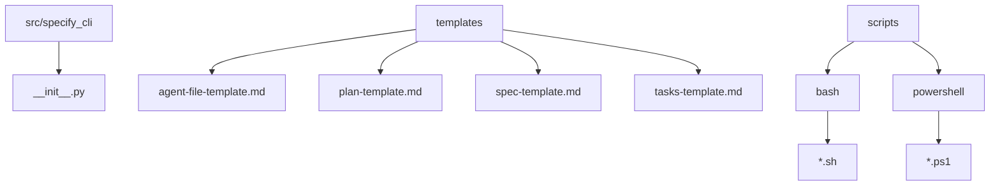
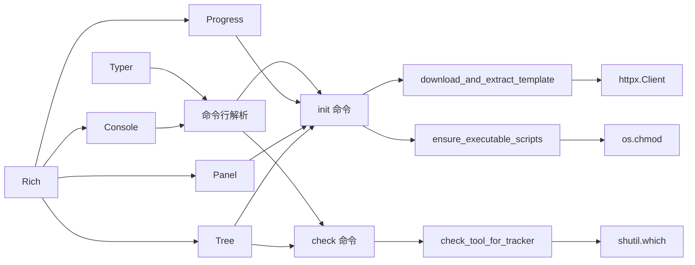
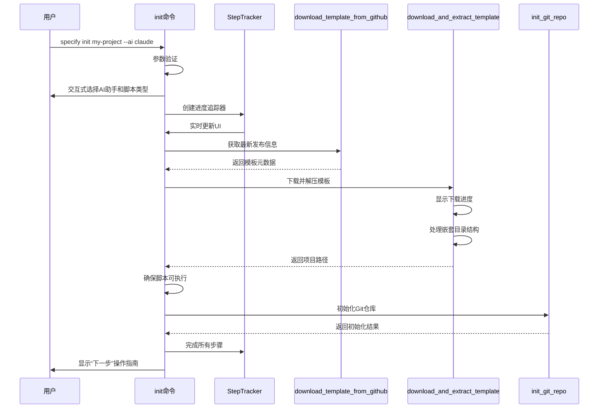
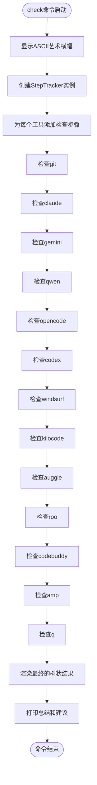

# CLI命令参考

<cite>
**本文档中引用的文件**  
- [__init__.py](file://src/specify_cli/__init__.py) - *更新了对新AI代理的支持*
- [AGENTS.md](file://AGENTS.md) - *新增了对Qwen Code和opencode等AI代理的说明*
- [README.md](file://README.md) - *更新了CLI参考文档*
</cite>

## 更新摘要
**已做更改**
- 根据最新代码变更，更新了`init`和`check`命令的参数与选项描述
- 新增了对`qwen`和`opencode` AI助手的支持说明
- 修正了脚本类型选择逻辑的文档描述
- 更新了使用示例以反映最新的命令行选项
- 增强了错误处理机制的文档说明

## 目录
1. [简介](#简介)
2. [项目结构](#项目结构)
3. [核心组件](#核心组件)
4. [架构概述](#架构概述)
5. [详细组件分析](#详细组件分析)
6. [依赖分析](#依赖分析)
7. [性能考虑](#性能考虑)
8. [故障排除指南](#故障排除指南)
9. [结论](#结论)

## 简介
`specify_cli` 模块是用于初始化和配置“规范驱动开发”项目的命令行工具。它通过 `specify init` 和 `specify check` 两个主要命令，帮助用户快速搭建项目环境，并验证系统依赖是否满足要求。该工具基于 Typer 构建命令行界面，使用 Rich 库美化终端输出，提供交互式选择、进度追踪和清晰的视觉反馈。文档将深入解析这两个命令的技术实现、参数选项、调用流程以及与内部组件的集成方式。

## 项目结构
项目结构清晰地划分了功能模块，`src/specify_cli/__init__.py` 是 CLI 的入口文件，负责定义命令和协调各组件。模板文件存放在 `templates/` 目录下，脚本文件存放在 `scripts/` 目录下，分别支持 Bash 和 PowerShell。



**Diagram sources**
- [__init__.py](file://src/specify_cli/__init__.py)

**Section sources**
- [__init__.py](file://src/specify_cli/__init__.py)

## 核心组件
`specify_cli` 的核心功能由 `init` 和 `check` 两个命令驱动，它们依赖于一系列内部函数和类来完成具体任务，如下载模板、检查工具、处理文件权限等。

**Section sources**
- [__init__.py](file://src/specify_cli/__init__.py#L746-L1000)

## 架构概述
该 CLI 工具采用模块化设计，`Typer` 负责命令行解析和路由，`Rich` 提供高级终端渲染能力，`httpx` 处理网络请求，`StepTracker` 类则实现了类似 Claude Code 的树状进度追踪系统。



**Diagram sources**
- [__init__.py](file://src/specify_cli/__init__.py)

## 详细组件分析

### init 命令分析
`specify init` 命令是项目初始化的核心，它引导用户完成从选择 AI 助手到创建项目目录的全过程。

#### 技术实现
`init` 命令的执行流程是一个精心编排的序列，通过 `StepTracker` 实时反馈进度。



**Diagram sources**
- [__init__.py](file://src/specify_cli/__init__.py#L746-L1000)

**Section sources**
- [__init__.py](file://src/specify_cli/__init__.py#L746-L1000)

#### 参数与选项
`init` 命令提供了丰富的参数和选项来定制初始化过程。

| 参数/选项 | 类型 | 描述 | 默认值 |
| :--- | :--- | :--- | :--- |
| `project_name` | 参数 | 新项目目录的名称 | 无 |
| `--ai` | 选项 | 指定使用的AI助手（claude, gemini, copilot, cursor-agent, qwen, opencode, codex, windsurf, kilocode, auggie, roo, codebuddy, amp, q） | 交互式选择 |
| `--script` | 选项 | 指定脚本类型（sh 或 ps） | 根据操作系统自动选择 |
| `--ignore-agent-tools` | 选项 | 跳过对AI代理工具的检查 | False |
| `--no-git` | 选项 | 跳过Git仓库初始化 | False |
| `--here` | 选项 | 在当前目录初始化项目 | False |
| `--skip-tls` | 选项 | 跳过SSL/TLS验证（不推荐） | False |
| `--debug` | 选项 | 显示详细的诊断输出 | False |
| `--github-token` | 选项 | 用于API请求的GitHub令牌 | 无 |

#### 使用示例
```bash
# 在名为"my-web-app"的目录中初始化项目，使用Claude
specify init my-web-app --ai claude

# 在当前目录初始化项目，跳过Git初始化
specify init --here --no-git

# 在名为"mobile-app"的目录中初始化项目，使用Gemini
specify init mobile-app --ai gemini --script sh

# 使用Qwen Code CLI初始化项目
specify init my-project --ai qwen

# 使用opencode CLI初始化项目
specify init my-project --ai opencode

# 使用Codex CLI初始化项目
specify init my-project --ai codex

# 使用Windsurf IDE初始化项目
specify init my-project --ai windsurf
```

### check 命令分析
`specify check` 命令用于诊断当前环境，确保所有必需的工具都已正确安装。

#### 技术实现
`check` 命令通过 `check_tool_for_tracker` 函数逐一检查系统中是否存在指定的可执行文件，并将结果实时反映在 `StepTracker` 中。



**Diagram sources**
- [__init__.py](file://src/specify_cli/__init__.py#L1003-L1039)

**Section sources**
- [__init__.py](file://src/specify_cli/__init__.py#L1003-L1039)

#### 返回值
`check` 命令本身没有返回值，但它会通过终端输出一个详细的树状报告，明确标示每个工具的状态（完成、错误、跳过）。如果所有检查都通过，它会输出绿色的“Specify CLI is ready to use!”提示。

### CLI框架与集成
CLI 的构建和美化依赖于 Typer 和 Rich 两大库。

#### Typer 框架集成
`specify_cli` 使用 Typer 作为其命令行界面框架。`app` 变量是一个 `Typer` 实例，通过 `@app.command()` 装饰器将 `init` 和 `check` 函数注册为子命令。`BannerGroup` 类继承自 `TyperGroup`，用于在显示帮助信息前展示自定义横幅。

```mermaid
classDiagram
class Typer
class BannerGroup
class app
BannerGroup --|> TyperGroup : 继承
app : +name : str
app : +help : str
app : +cls : Type[TyperGroup]
app ..> BannerGroup : 使用
app --> init : 注册
app --> check : 注册
```