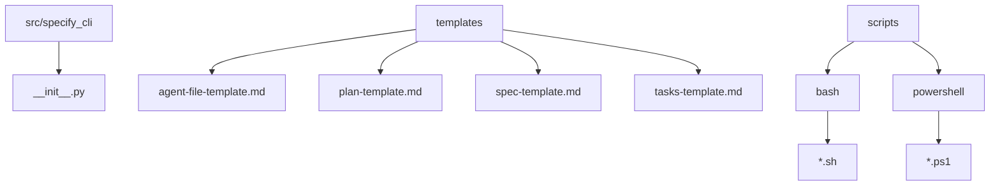
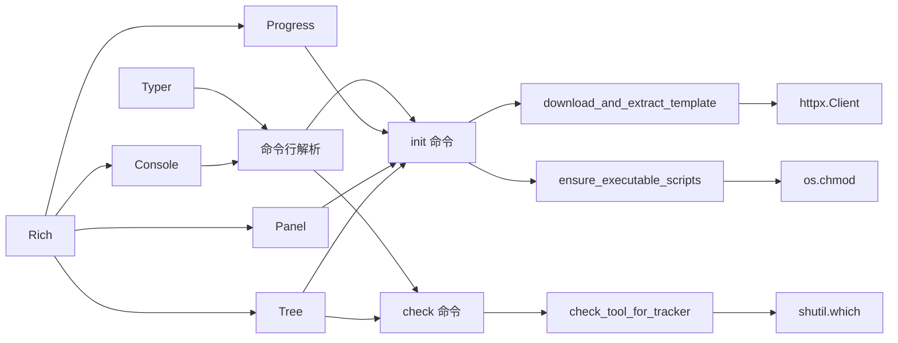
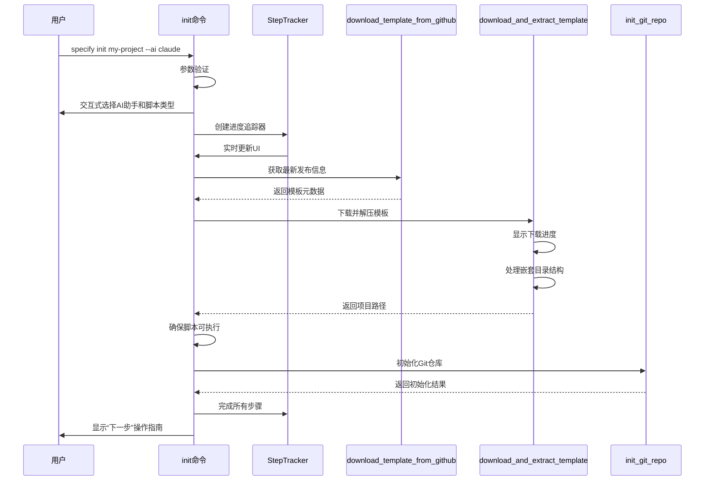
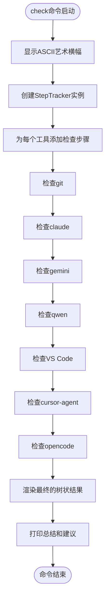
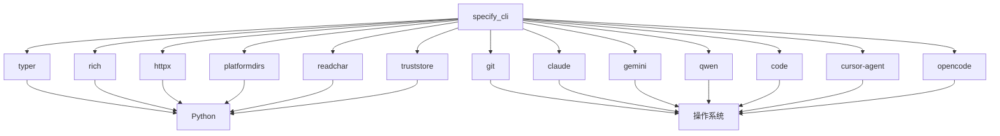

# CLI命令参考

<cite>
**本文档中引用的文件**  
- [__init__.py](file://src/specify_cli/__init__.py)
</cite>

## 目录
1. [简介](#简介)
2. [项目结构](#项目结构)
3. [核心组件](#核心组件)
4. [架构概述](#架构概述)
5. [详细组件分析](#详细组件分析)
6. [依赖分析](#依赖分析)
7. [性能考虑](#性能考虑)
8. [故障排除指南](#故障排除指南)
9. [结论](#结论)

## 简介
`specify_cli` 模块是用于初始化和配置“规范驱动开发”项目的命令行工具。它通过 `specify init` 和 `specify check` 两个主要命令，帮助用户快速搭建项目环境，并验证系统依赖是否满足要求。该工具基于 Typer 构建命令行界面，使用 Rich 库美化终端输出，提供交互式选择、进度追踪和清晰的视觉反馈。文档将深入解析这两个命令的技术实现、参数选项、调用流程以及与内部组件的集成方式。

## 项目结构
项目结构清晰地划分了功能模块，`src/specify_cli/__init__.py` 是 CLI 的入口文件，负责定义命令和协调各组件。模板文件存放在 `templates/` 目录下，脚本文件存放在 `scripts/` 目录下，分别支持 Bash 和 PowerShell。



**Diagram sources**
- [__init__.py](file://src/specify_cli/__init__.py)

**Section sources**
- [__init__.py](file://src/specify_cli/__init__.py)

## 核心组件
`specify_cli` 的核心功能由 `init` 和 `check` 两个命令驱动，它们依赖于一系列内部函数和类来完成具体任务，如下载模板、检查工具、处理文件权限等。

**Section sources**
- [__init__.py](file://src/specify_cli/__init__.py#L724-L1029)

## 架构概述
该 CLI 工具采用模块化设计，`Typer` 负责命令行解析和路由，`Rich` 提供高级终端渲染能力，`httpx` 处理网络请求，`StepTracker` 类则实现了类似 Claude Code 的树状进度追踪系统。



**Diagram sources**
- [__init__.py](file://src/specify_cli/__init__.py)

## 详细组件分析

### init 命令分析
`specify init` 命令是项目初始化的核心，它引导用户完成从选择 AI 助手到创建项目目录的全过程。

#### 技术实现
`init` 命令的执行流程是一个精心编排的序列，通过 `StepTracker` 实时反馈进度。



**Diagram sources**
- [__init__.py](file://src/specify_cli/__init__.py#L724-L986)

**Section sources**
- [__init__.py](file://src/specify_cli/__init__.py#L724-L986)

#### 参数与选项
`init` 命令提供了丰富的参数和选项来定制初始化过程。

| 参数/选项 | 类型 | 描述 | 默认值 |
| :--- | :--- | :--- | :--- |
| `project_name` | 参数 | 新项目目录的名称 | 无 |
| `--ai` | 选项 | 指定使用的AI助手（claude, gemini, copilot等） | 交互式选择 |
| `--script` | 选项 | 指定脚本类型（sh 或 ps） | 根据操作系统自动选择 |
| `--ignore-agent-tools` | 选项 | 跳过对AI代理工具的检查 | False |
| `--no-git` | 选项 | 跳过Git仓库初始化 | False |
| `--here` | 选项 | 在当前目录初始化项目 | False |
| `--skip-tls` | 选项 | 跳过SSL/TLS验证（不推荐） | False |
| `--debug` | 选项 | 显示详细的诊断输出 | False |

#### 使用示例
```bash
# 在名为"my-web-app"的目录中初始化项目，使用Claude
specify init my-web-app --ai claude

# 在当前目录初始化项目，跳过Git初始化
specify init --here --no-git

# 在名为"mobile-app"的目录中初始化项目，使用Gemini
specify init mobile-app --ai gemini --script sh
```

### check 命令分析
`specify check` 命令用于诊断当前环境，确保所有必需的工具都已正确安装。

#### 技术实现
`check` 命令通过 `check_tool_for_tracker` 函数逐一检查系统中是否存在指定的可执行文件，并将结果实时反映在 `StepTracker` 中。



**Diagram sources**
- [__init__.py](file://src/specify_cli/__init__.py#L990-L1029)

**Section sources**
- [__init__.py](file://src/specify_cli/__init__.py#L990-L1029)

#### 返回值
`check` 命令本身没有返回值，但它会通过终端输出一个详细的树状报告，明确标示每个工具的状态（完成、错误、跳过）。如果所有检查都通过，它会输出绿色的“Specify CLI is ready to use!”提示。

### CLI框架与集成
CLI 的构建和美化依赖于 Typer 和 Rich 两大库。

#### Typer 框架集成
`specify_cli` 使用 Typer 作为其命令行界面框架。`app` 变量是一个 `Typer` 实例，通过 `@app.command()` 装饰器将 `init` 和 `check` 函数注册为子命令。`BannerGroup` 类继承自 `TyperGroup`，用于在显示帮助信息前展示自定义横幅。

```mermaid
classDiagram
class Typer
class BannerGroup
class app
BannerGroup --|> TyperGroup : 继承
app : +name : str
app : +help : str
app : +cls : Type[TyperGroup]
app ..> BannerGroup : 使用
app --> init : 注册
app --> check : 注册
```

**Diagram sources**
- [__init__.py](file://src/specify_cli/__init__.py#L290-L296)

#### Rich 库美化输出
Rich 库被广泛用于提升用户体验。`Console` 用于打印彩色文本，`Panel` 用于创建带边框的文本框，`Progress` 用于显示下载进度条，`Tree` 用于渲染 `StepTracker` 的树状结构。

**Section sources**
- [__init__.py](file://src/specify_cli/__init__.py)

## 依赖分析
`specify_cli` 依赖于多个外部库和系统工具。



**Diagram sources**
- [pyproject.toml](file://pyproject.toml)
- [__init__.py](file://src/specify_cli/__init__.py)

**Section sources**
- [pyproject.toml](file://pyproject.toml)
- [__init__.py](file://src/specify_cli/__init__.py)

## 性能考虑
`init` 命令的性能主要受网络下载速度影响。工具通过 `httpx` 的流式下载和 `Progress` 组件提供了实时的下载进度，避免了长时间无响应的用户体验。对于大型模板，下载和解压过程是主要的耗时环节。

## 故障排除指南
当命令执行失败时，CLI 会提供清晰的错误信息和调试建议。

**Section sources**
- [__init__.py](file://src/specify_cli/__init__.py)

### 常见错误
- **网络请求失败**：检查网络连接，或使用 `--skip-tls` 选项（不推荐）。在 `init` 命令中启用 `--debug` 可以查看详细的 HTTP 错误。
- **工具未找到**：确保所需的工具（如 `git`, `claude`）已安装并添加到系统 `PATH` 环境变量中。`check` 命令可以帮助诊断此问题。
- **权限错误**：在类 Unix 系统上，`ensure_executable_scripts` 函数可能会因权限不足而失败。确保运行 CLI 的用户对项目目录有写权限。
- **目录已存在**：如果指定的项目目录已存在，`init` 命令会报错。可以使用 `--here` 选项在当前目录初始化，或手动删除现有目录。

## 结论
`specify_cli` 模块是一个功能完备、用户体验优秀的命令行工具。它通过 `init` 和 `check` 命令，为“规范驱动开发”项目提供了强大的初始化和诊断能力。其代码结构清晰，利用 Typer 和 Rich 等现代 Python 库，实现了高效、美观且健壮的 CLI。开发者可以轻松地理解其数据流和控制流，并根据需要进行扩展或定制。