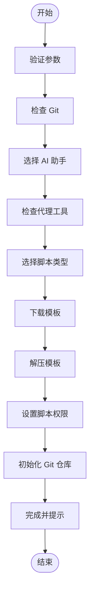
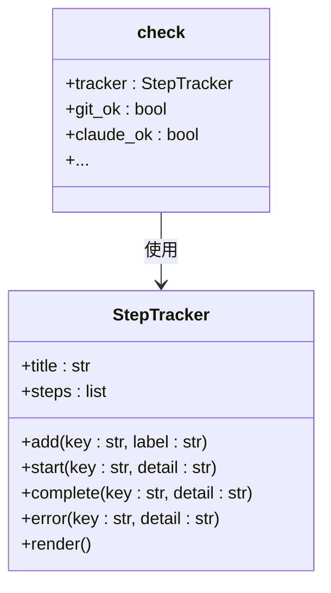

# CLI命令参考

<cite>
**本文档中引用的文件**  
- [__init__.py](file://src/specify_cli/__init__.py)
- [check-prerequisites.sh](file://scripts/bash/check-prerequisites.sh)
- [check-prerequisites.ps1](file://scripts/powershell/check-prerequisites.ps1)
- [common.sh](file://scripts/bash/common.sh)
- [common.ps1](file://scripts/powershell/common.ps1)
- [README.md](file://README.md)
</cite>

## 目录
1. [简介](#简介)
2. [specify init 命令详解](#specify-init-命令详解)
3. [specify check 命令详解](#specify-check-命令详解)
4. [命令行使用示例](#命令行使用示例)
5. [故障排除](#故障排除)

## 简介
`specify` 是一个用于启动和管理“规范驱动开发”（Spec-Driven Development）项目的命令行工具。它通过自动化项目初始化和环境检查，帮助开发者快速搭建开发环境。本参考文档将详细说明其两个核心子命令：`init` 和 `check`。

**Section sources**
- [README.md](file://README.md#L137-L146)

## specify init 命令详解
`specify init` 命令用于从最新的模板初始化一个新的 Specify 项目。它会下载模板、解压文件、设置脚本权限，并可选择性地初始化 Git 仓库。

### 参数与选项
该命令支持以下参数和选项：

| 参数/选项 | 类型 | 描述 |
|---------|------|------|
| `<project-name>` | 参数 | 新项目目录的名称（如果使用 `--here` 或使用 `.` 表示当前目录，则可选） |
| `--ai` | 选项 | 要使用的 AI 助手：`claude`, `gemini`, `copilot`, `cursor`, `qwen`, `opencode`, `codex`, `windsurf`, `kilocode`, `auggie`, 或 `roo` |
| `--script` | 选项 | 要使用的脚本类型：`sh` (POSIX Shell) 或 `ps` (PowerShell) |
| `--ignore-agent-tools` | 标志 | 跳过对 Claude Code 等 AI 代理工具的检查 |
| `--no-git` | 标志 | 跳过 Git 仓库的初始化 |
| `--here` | 标志 | 在当前目录而不是创建新目录中初始化项目 |
| `--force` | 标志 | 当在当前目录（非空）中初始化时强制合并/覆盖（跳过确认） |
| `--skip-tls` | 标志 | 跳过 SSL/TLS 验证（不推荐） |
| `--debug` | 标志 | 启用详细的调试输出以进行故障排除 |
| `--github-token` | 选项 | 用于 API 请求的 GitHub 令牌（或设置 GH_TOKEN/GITHUB_TOKEN 环境变量） |

**Section sources**
- [README.md](file://README.md#L148-L161)
- [__init__.py](file://src/specify_cli/__init__.py#L750-L1099)

### 内部执行流程
`specify init` 命令的内部执行流程如下：

1.  **参数验证**：检查 `--here` 和项目名称是否同时指定，确保参数组合有效。
2.  **工具检查**：检查 `git` 是否安装（除非指定了 `--no-git`）。
3.  **AI 助手选择**：如果未通过 `--ai` 指定，则通过交互式界面让用户选择 AI 助手。
4.  **代理工具检查**：除非指定了 `--ignore-agent-tools`，否则会检查所选 AI 助手（如 claude, gemini）的 CLI 工具是否已安装。
5.  **脚本类型选择**：确定使用 `sh` 还是 `ps` 脚本类型，优先使用 `--script` 选项，否则根据操作系统自动选择。
6.  **模板下载**：调用 `download_template_from_github` 函数，根据选定的 AI 助手和脚本类型，从 GitHub 仓库的最新发布版本中下载对应的模板 ZIP 文件。
7.  **模板解压**：
    *   如果使用 `--here` 或 `.`，则先将 ZIP 文件解压到临时目录，然后将内容合并到当前目录（处理可能存在的嵌套目录结构）。
    *   否则，直接将 ZIP 文件解压到新创建的项目目录中。
8.  **脚本权限设置**：调用 `ensure_executable_scripts` 函数，确保项目中所有 `.sh` 脚本都具有可执行权限（仅限非 Windows 系统）。
9.  **Git 初始化**：如果未指定 `--no-git` 且 `git` 工具可用，则调用 `init_git_repo` 函数在项目目录中初始化一个新的 Git 仓库，并进行初始提交。
10. **完成与提示**：显示项目准备就绪的消息，并提供下一步操作的建议。



**Diagram sources**
- [__init__.py](file://src/specify_cli/__init__.py#L750-L1099)
- [__init__.py](file://src/specify_cli/__init__.py#L435-L544)
- [__init__.py](file://src/specify_cli/__init__.py#L547-L702)
- [__init__.py](file://src/specify_cli/__init__.py#L411-L432)
- [__init__.py](file://src/specify_cli/__init__.py#L705-L747)

## specify check 命令详解
`specify check` 命令用于检查系统中是否安装了所有必需的工具。

### 检查的先决条件
该命令会检查以下工具是否存在：

-   `git`：版本控制系统
-   `claude`：Claude Code CLI
-   `gemini`：Gemini CLI
-   `qwen`：Qwen Code CLI
-   `code`：Visual Studio Code
-   `code-insiders`：Visual Studio Code Insiders
-   `cursor-agent`：Cursor IDE agent
-   `windsurf`：Windsurf IDE
-   `kilocode`：Kilo Code IDE
-   `opencode`：opencode
-   `codex`：Codex CLI
-   `auggie`：Auggie CLI

**Section sources**
- [README.md](file://README.md#L137-L146)
- [__init__.py](file://src/specify_cli/__init__.py#L1102-L1142)

### 错误提示与解决方法
当 `specify check` 命令执行后，它会以树状结构显示每个工具的检查结果。

*   **绿色圆点 (●)**：表示工具已找到并可用。
*   **红色圆点 (●)**：表示工具未找到。

如果某个工具检查失败（显示为红色），命令的输出会提供相应的提示信息。例如，如果缺少 `git`，它会提示：“Tip: Install git for repository management”。对于缺少 AI 助手的情况，它会提示：“Tip: Install an AI assistant for the best experience”。

**解决方法**：
1.  根据提示信息，访问相应的官方网站或文档链接安装缺失的工具。
2.  确保安装的工具已正确添加到系统的 `PATH` 环境变量中，以便命令行可以全局访问。
3.  对于 `claude` 的特殊情况，即使 `claude` 不在 `PATH` 中，如果 `~/.claude/local/claude` 文件存在，`check_tool` 函数也会认为其已安装。



**Diagram sources**
- [__init__.py](file://src/specify_cli/__init__.py#L1102-L1142)
- [__init__.py](file://src/specify_cli/__init__.py#L146-L181)
- [__init__.py](file://src/specify_cli/__init__.py#L110-L113)

## 命令行使用示例
以下是一些 `specify` 命令的典型和边缘场景使用示例。

### specify init 示例
```bash
# 基本项目初始化
specify init my-project

# 使用特定 AI 助手初始化
specify init my-project --ai claude

# 在当前目录初始化
specify init . --ai copilot
# 或使用 --here 标志
specify init --here --ai copilot

# 强制合并到当前（非空）目录而不确认
specify init . --force --ai copilot

# 跳过 Git 初始化
specify init my-project --ai gemini --no-git

# 启用调试输出以进行故障排除
specify init my-project --ai claude --debug

# 使用 GitHub 令牌进行 API 请求
specify init my-project --ai claude --github-token ghp_your_token_here
```

### specify check 示例
```bash
# 检查系统要求
specify check
```

**Section sources**
- [README.md](file://README.md#L163-L203)

## 故障排除
### 检查脚本 (`check-prerequisites.sh`)
除了 `specify check`，项目还包含一个更具体的检查脚本 `scripts/bash/check-prerequisites.sh`，它用于在开发流程的特定阶段验证前提条件。

*   **功能**：该脚本会检查当前分支是否符合 `001-feature-name` 的命名规范，并验证 `plan.md` 等关键文件是否存在。
*   **使用方法**：可以在执行 `/plan` 或 `/implement` 等命令前运行此脚本，以确保环境已正确设置。
*   **输出**：支持文本和 JSON 格式输出，便于集成到自动化流程中。

**Section sources**
- [check-prerequisites.sh](file://scripts/bash/check-prerequisites.sh#L0-L165)
- [common.sh](file://scripts/bash/common.sh#L59-L112)
- [check-prerequisites.ps1](file://scripts/powershell/check-prerequisites.ps1#L0-L85)
- [common.ps1](file://scripts/powershell/common.ps1#L115-L135)