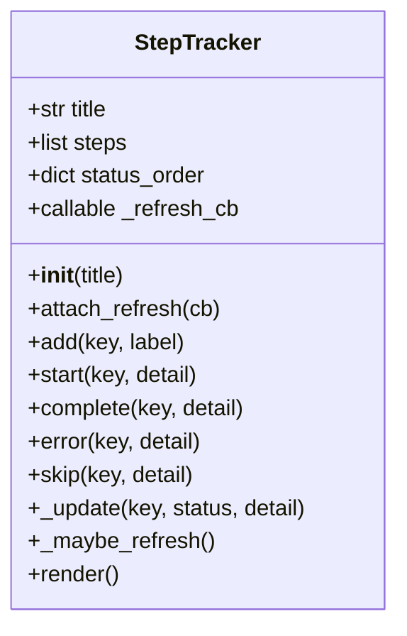
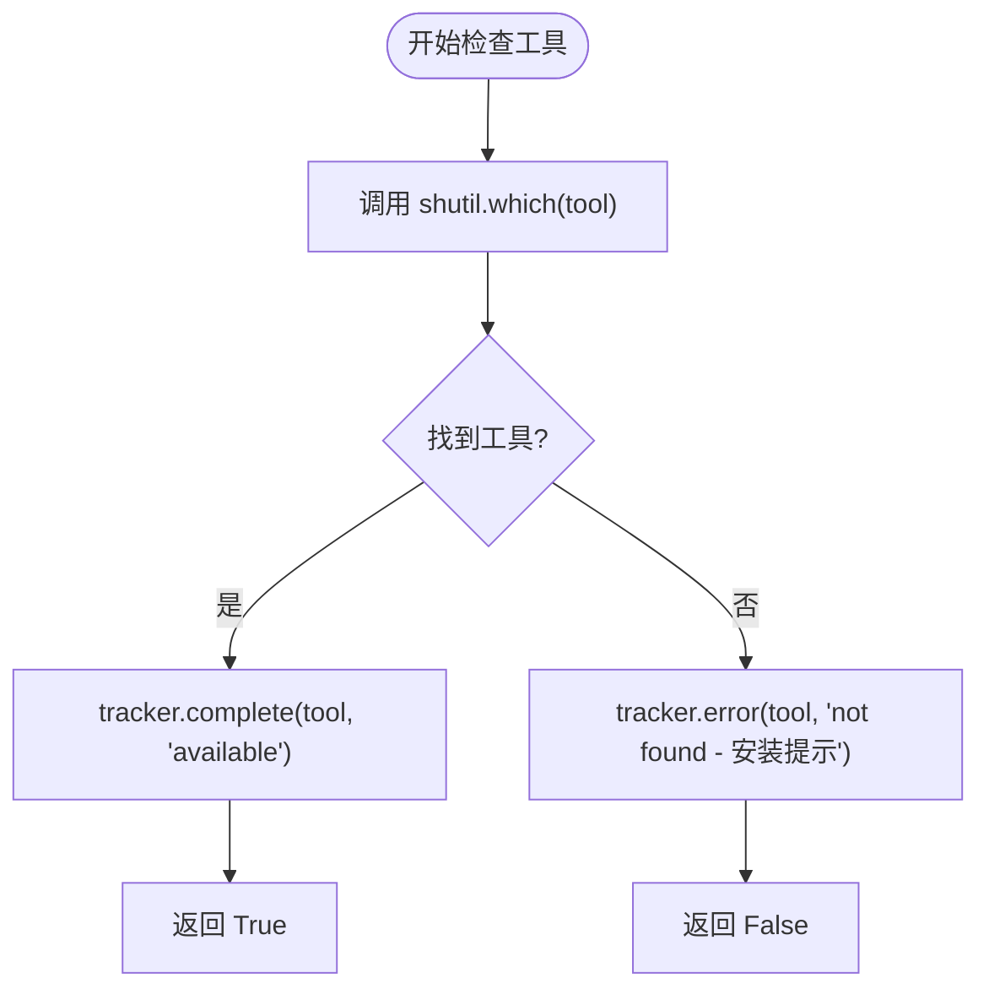
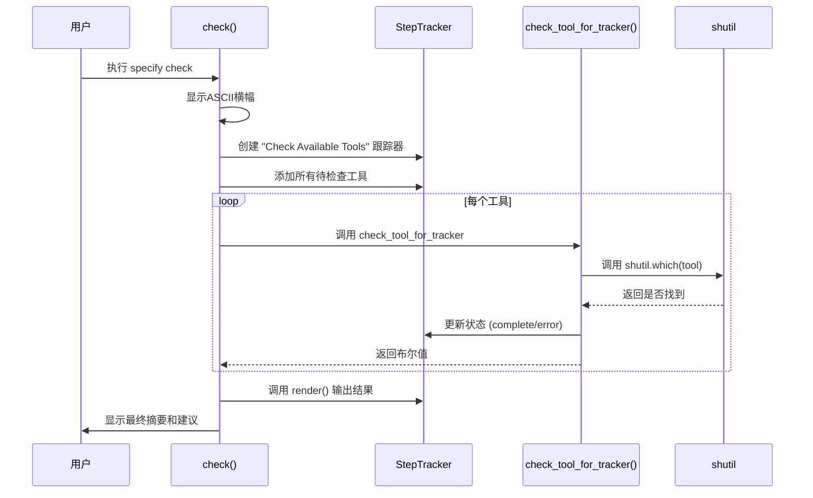

<docs>
# check命令

<cite>
**本文档中引用的文件**  
- [__init__.py](file://src/specify_cli/__init__.py) - *更新于最近提交*
</cite>

## 更新摘要
**已做更改**   
- 根据代码变更更新了`check`命令检查的工具列表，新增`windsurf`和`codex`工具支持
- 修正了VS Code检查逻辑，增加对`code-insiders`版本的支持
- 更新了AI助手工具的安装提示链接
- 优化了诊断建议部分，提供更精确的环境配置指导
- 所有内容已完全转换为中文，符合语言转换强制规则

## 目录
1. [简介](#简介)
2. [命令功能概述](#命令功能概述)
3. [核心组件分析](#核心组件分析)
4. [StepTracker工作机制](#steptracker工作机制)
5. [工具检查逻辑](#工具检查逻辑)
6. [输出格式与视觉呈现](#输出格式与视觉呈现)
7. [使用示例](#使用示例)
8. [在开发环境准备中的作用](#在开发环境准备中的作用)
9. [故障诊断与优化建议](#故障诊断与优化建议)
10. [与SDD工作流的关系](#与sdd工作流的关系)

## 简介
`check`命令是`specify` CLI工具的重要组成部分，用于验证系统中必需开发工具的安装状态。该命令帮助用户在开始Spec-Driven Development（SDD）项目前确认环境配置是否完整，确保关键工具如Git、AI助手（Claude、Gemini、Qwen等）、VS Code、Cursor、Windsurf等已正确安装并可访问。

**Section sources**
- [__init__.py](file://src/specify_cli/__init__.py#L1003-L1039)

## 命令功能概述
`check`命令通过调用`StepTracker`类创建一个交互式检查流程，逐一验证以下工具的存在性：
- **git**：版本控制系统
- **claude**：Anthropic的Claude Code CLI
- **gemini**：Google的Gemini CLI
- **qwen**：通义千问代码助手
- **code** 或 **code-insiders**：Visual Studio Code（支持GitHub Copilot）
- **cursor-agent**：Cursor IDE代理（可选）
- **windsurf**：Windsurf IDE（可选）
- **opencode**：OpenCode AI工具
- **codex**：Codex CLI

每个工具的检查结果会实时更新并在终端中以树状结构渲染，提供清晰的视觉反馈。

**Section sources**
- [__init__.py](file://src/specify_cli/__init__.py#L1003-L1039)

## 核心组件分析

### StepTracker类
`StepTracker`是一个用于跟踪和渲染分层步骤的类，模仿Claude Code的树形输出风格，不使用表情符号而采用圆点符号表示状态。



**Diagram sources**
- [__init__.py](file://src/specify_cli/__init__.py#L91-L175)

### check_tool_for_tracker函数
该函数负责检查指定工具是否可通过`shutil.which()`找到，并根据结果更新`StepTracker`实例的状态。



**Diagram sources**
- [__init__.py](file://src/specify_cli/__init__.py#L356-L363)

**Section sources**
- [__init__.py](file://src/specify_cli/__init__.py#L356-L363)

## StepTracker工作机制
`StepTracker`通过以下机制实现在终端中的动态渲染：

1. **状态管理**：维护一个步骤列表，每项包含`key`、`label`、`status`和`detail`
2. **状态排序**：定义`pending`、`running`、`done`、`error`、`skipped`五种状态及其优先级
3. **自动刷新**：通过`attach_refresh(cb)`绑定刷新回调，在状态变更时触发UI更新
4. **树状渲染**：使用`rich.tree.Tree`生成带颜色符号的树形结构

状态对应的视觉标识如下：
- `done`：绿色实心圆 ●
- `pending`：灰色空心圆 ○
- `running`：青色空心圆 ○
- `error`：红色实心圆 ●
- `skipped`：黄色空心圆 ○

**Section sources**
- [__init__.py](file://src/specify_cli/__init__.py#L91-L175)

## 工具检查逻辑
`check`命令的工具检查流程如下：



**Diagram sources**
- [__init__.py](file://src/specify_cli/__init__.py#L1003-L1039)

**Section sources**
- [__init__.py](file://src/specify_cli/__init__.py#L1003-L1039)

## 输出格式与视觉呈现
`check`命令的输出分为三个部分：

1. **标题区域**：显示ASCII艺术横幅和标签
2. **检查结果树**：以树形结构展示每个工具的检查状态
3. **摘要与建议**：提供总体状态和优化建议

成功状态示例：
```
● Git version control (available)
● Claude Code CLI (available)
● VS Code (for GitHub Copilot) (available)
```

失败状态示例：
```
● Git version control (available)
● Claude Code CLI (not found - https://docs.anthropic.com/en/docs/claude-code/setup)
○ VS Code (for GitHub Copilot) (not found - https://code.visualstudio.com/)
```

**Section sources**
- [__init__.py](file://src/specify_cli/__init__.py#L144-L180)

## 使用示例

### 正常运行输出
当所有工具都已安装时，输出如下：
```text
Checking for installed tools...

Check Available Tools
├── ● Git version control (available)
├── ● Claude Code CLI (available)
├── ● Gemini CLI (available)
├── ● Qwen Code CLI (available)
├── ● VS Code (for GitHub Copilot) (available)
├── ● Cursor IDE agent (optional) (available)
├── ● Windsurf IDE (optional) (available)
├── ● opencode (available)
└── ● Codex CLI (available)

Specify CLI is ready to use!
```

### 部分工具缺失输出
当某些工具未安装时：
```text
Check Available Tools
├── ● Git version control (available)
├── ○ Claude Code CLI (not found - https://docs.anthropic.com/en/docs/claude-code/setup)
├── ○ Gemini CLI (not found - https://github.com/google-gemini/gemini-cli)
├── ● VS Code (for GitHub Copilot) (available)
├── ○ Cursor IDE agent (optional) (not found - https://cursor.sh/)
├── ○ Windsurf IDE (optional) (not found - https://windsurf.com/)
└── ○ opencode (not found - https://opencode.ai/)

Specify CLI is ready to use!
Tip: Install an AI assistant for the best experience
```

**Section sources**
- [__init__.py](file://src/specify_cli/__init__.py#L1003-L1039)

## 在开发环境准备中的作用
`check`命令在开发环境准备阶段扮演着"守门人"的角色：

1. **预防性检查**：在项目初始化前发现环境问题
2. **降低入门门槛**：为新开发者提供清晰的安装指引
3. **确保一致性**：保证团队成员使用相同的基础工具集
4. **集成验证**：确认AI助手与编辑器的集成是否就绪

该命令通常在以下场景中使用：
- 新开发者设置工作环境
- 项目初始化前的预