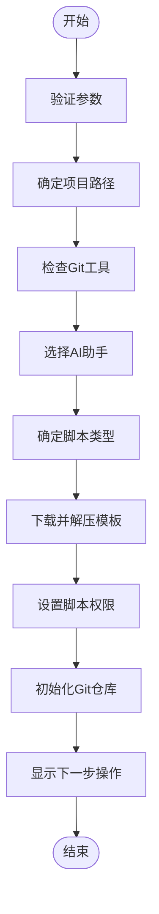
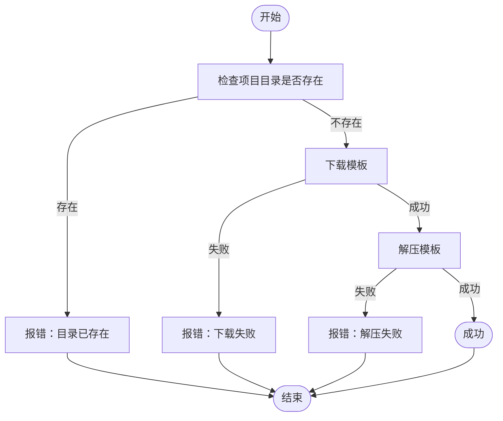

# init命令

<cite>
**本文档中引用的文件**  
- [__init__.py](file://src/specify_cli/__init__.py)
- [spec-template.md](file://templates/spec-template.md)
- [plan-template.md](file://templates/plan-template.md)
- [tasks-template.md](file://templates/tasks-template.md)
- [check-task-prerequisites.sh](file://scripts/bash/check-task-prerequisites.sh)
- [setup-plan.sh](file://scripts/bash/setup-plan.sh)
- [check-task-prerequisites.ps1](file://scripts/powershell/check-task-prerequisites.ps1)
- [setup-plan.ps1](file://scripts/powershell/setup-plan.ps1)
</cite>

## 目录
1. [命令概述](#命令概述)
2. [参数详解](#参数详解)
3. [执行流程](#执行流程)
4. [Git集成行为](#git集成行为)
5. [使用示例](#使用示例)
6. [错误处理机制](#错误处理机制)
7. [内部组件集成](#内部组件集成)
8. [总结](#总结)

## 命令概述

`specify init` 命令用于从最新模板初始化一个新的Specify项目。该命令通过交互式界面引导用户完成项目创建过程，支持多种AI助手和脚本类型。命令会自动下载模板、解压文件、设置权限并初始化Git仓库（可选）。该命令是项目启动的核心入口，为开发者提供了一致的项目结构和开发环境。

**Section sources**
- [__init__.py](file://src/specify_cli/__init__.py#L724-L986)

## 参数详解

### project_name
- **作用**：指定新项目的目录名称
- **默认值**：无（必须提供，除非使用 `--here`）
- **使用场景**：创建新项目时指定项目名称，例如 `specify init my-project`

### ai_assistant
- **作用**：选择要使用的AI助手
- **默认值**：交互式选择（默认为 `copilot`）
- **使用场景**：指定AI助手类型，支持 `copilot`、`claude`、`gemini`、`cursor`、`qwen` 和 `opencode`

### script_type
- **作用**：选择脚本类型
- **默认值**：根据操作系统自动选择（Windows为 `ps`，其他为 `sh`）
- **使用场景**：指定使用POSIX Shell（bash/zsh）或PowerShell脚本

### ignore_agent_tools
- **作用**：跳过对AI代理工具的检查
- **默认值**：`False`
- **使用场景**：当用户希望跳过AI工具（如Claude CLI、Gemini CLI）的安装检查时使用

### no_git
- **作用**：跳过Git仓库初始化
- **默认值**：`False`
- **使用场景**：在不需要版本控制的环境中初始化项目

### here
- **作用**：在当前目录初始化项目
- **默认值**：`False`
- **使用场景**：在现有目录中初始化项目，而不是创建新目录

### skip_tls
- **作用**：跳过SSL/TLS验证
- **默认值**：`False`
- **使用场景**：在受信任的内部网络中，当遇到SSL证书问题时使用（不推荐）

### debug
- **作用**：显示详细的诊断输出
- **默认值**：`False`
- **使用场景**：当遇到网络或解压失败时，用于调试问题

**Section sources**
- [__init__.py](file://src/specify_cli/__init__.py#L724-L986)

## 执行流程

`specify init` 命令的执行流程如下：

1. **参数验证**：检查 `--here` 和 `project_name` 是否同时指定，确保至少有一个项目标识
2. **目录确定**：根据 `--here` 参数决定是在当前目录还是新目录创建项目
3. **工具检查**：使用 `check_tool` 函数检查Git等必要工具是否安装
4. **AI助手选择**：通过 `select_with_arrows` 函数提供交互式选择界面
5. **脚本类型确定**：根据操作系统和用户输入确定脚本类型
6. **模板下载与解压**：调用 `download_and_extract_template` 函数下载并解压模板
7. **权限设置**：使用 `ensure_executable_scripts` 函数确保脚本具有可执行权限
8. **Git初始化**：根据 `--no-git` 参数决定是否初始化Git仓库

在整个执行过程中，`StepTracker` 类用于渲染进度，提供实时的可视化反馈。



**Diagram sources**
- [__init__.py](file://src/specify_cli/__init__.py#L724-L986)
- [__init__.py](file://src/specify_cli/__init__.py#L521-L675)

**Section sources**
- [__init__.py](file://src/specify_cli/__init__.py#L724-L986)
- [__init__.py](file://src/specify_cli/__init__.py#L521-L675)

## Git集成行为

`specify init` 命令与Git的集成行为如下：

- **新项目初始化**：当在新目录中创建项目且未指定 `--no-git` 时，命令会自动初始化Git仓库，添加所有文件，并创建初始提交
- **现有目录处理**：当在现有目录中初始化项目（使用 `--here`）时，命令会检查是否已经是Git仓库。如果是，则跳过初始化；如果不是且未指定 `--no-git`，则会初始化新的Git仓库
- **Git工具检查**：命令会检查系统中是否安装了Git工具。如果未安装且未跳过Git初始化，会提示用户安装

**Section sources**
- [__init__.py](file://src/specify_cli/__init__.py#L375-L393)
- [__init__.py](file://src/specify_cli/__init__.py#L724-L986)

## 使用示例

### 基本用法
```bash
specify init my-project
```

### 指定AI助手
```bash
specify init my-project --ai claude
specify init my-project --ai gemini
specify init my-project --ai copilot
```

### 在当前目录初始化
```bash
specify init --here --ai claude
```

### 跳过Git初始化
```bash
specify init my-project --ai copilot --no-git
```

### 忽略AI工具检查
```bash
specify init --ignore-agent-tools my-project
```

### 指定脚本类型
```bash
specify init my-project --script sh
specify init my-project --script ps
```

**Section sources**
- [__init__.py](file://src/specify_cli/__init__.py#L724-L986)

## 错误处理机制

`specify init` 命令具有完善的错误处理机制：

- **项目目录已存在**：如果指定的项目目录已存在，命令会立即终止并显示错误信息
- **网络请求失败**：在下载模板时如果网络请求失败，命令会捕获异常，清理临时文件，并显示详细的错误信息
- **解压失败**：如果解压模板失败，命令会清理已创建的项目目录（除非使用 `--here`）
- **调试模式**：当启用 `--debug` 参数时，命令会显示详细的环境信息，帮助诊断问题



**Diagram sources**
- [__init__.py](file://src/specify_cli/__init__.py#L724-L986)

**Section sources**
- [__init__.py](file://src/specify_cli/__init__.py#L724-L986)

## 内部组件集成

`specify init` 命令与内部组件的集成方式如下：

- **模板系统**：命令从GitHub Releases下载与指定AI助手和脚本类型匹配的模板ZIP文件。模板包含 `spec-template.md`、`plan-template.md` 和 `tasks-template.md` 等文件
- **脚本集成**：根据选择的脚本类型，命令会复制相应的脚本文件（bash或powershell）到项目中，并确保它们具有正确的执行权限
- **进度跟踪**：使用 `StepTracker` 类提供实时的进度可视化，通过 `Live` 组件实现动态更新
- **交互式选择**：使用 `select_with_arrows` 函数提供基于箭头键的交互式选择界面，提升用户体验

**Section sources**
- [__init__.py](file://src/specify_cli/__init__.py#L80-L164)
- [__init__.py](file://src/specify_cli/__init__.py#L200-L274)
- [__init__.py](file://src/specify_cli/__init__.py#L521-L675)
- [spec-template.md](file://templates/spec-template.md)
- [plan-template.md](file://templates/plan-template.md)
- [tasks-template.md](file://templates/tasks-template.md)
- [check-task-prerequisites.sh](file://scripts/bash/check-task-prerequisites.sh)
- [setup-plan.sh](file://scripts/bash/setup-plan.sh)
- [check-task-prerequisites.ps1](file://scripts/powershell/check-task-prerequisites.ps1)
- [setup-plan.ps1](file://scripts/powershell/setup-plan.ps1)

## 总结

`specify init` 命令是Specify项目生命周期的起点，它通过自动化的方式简化了项目初始化过程。该命令不仅提供了丰富的参数选项来满足不同场景的需求，还通过交互式界面和实时进度反馈提升了用户体验。通过与Git、模板系统和脚本的深度集成，`specify init` 确保了每个新项目都遵循一致的结构和最佳实践，为后续的开发工作奠定了坚实的基础。