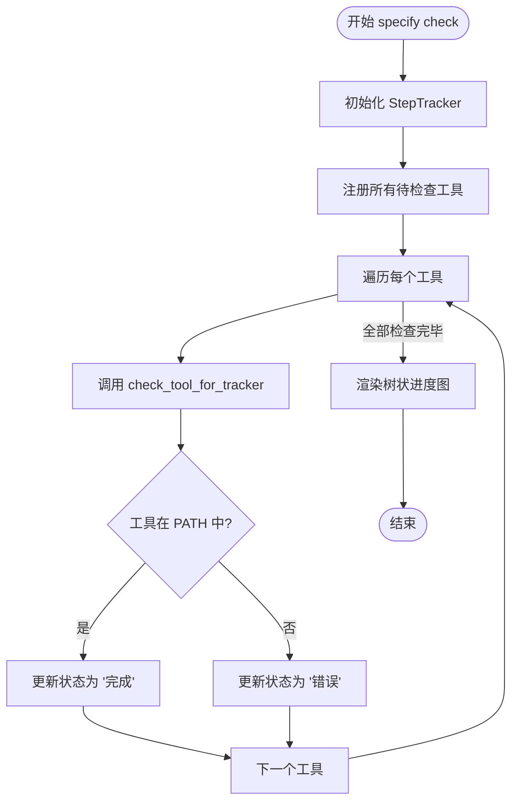
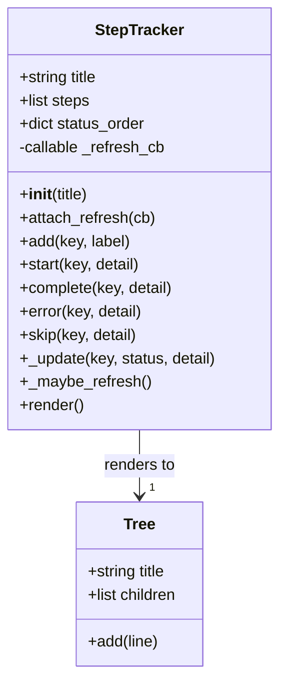

# specify check 命令参考

<cite>
**Referenced Files in This Document**   
- [src/specify_cli/__init__.py](file://src/specify_cli/__init__.py)
</cite>

## 目录
1. [简介](#简介)
2. [核心功能与工作原理](#核心功能与工作原理)
3. [检查的先决条件工具](#检查的先决条件工具)
4. [输出格式与进度追踪](#输出格式与进度追踪)
5. [错误处理与解决建议](#错误处理与解决建议)
6. [典型使用场景](#典型使用场景)

## 简介
`specify check` 命令是 `spec-kit` 开发工具包中的一个环境健康检查工具。其主要职责是验证用户的开发环境是否已正确配置，确保所有必要的先决条件工具都已安装并可被系统识别。该命令通过一个简洁而直观的界面，帮助开发者在开始新项目或执行关键任务前，快速确认其环境的完备性。

**Section sources**
- [src/specify_cli/__init__.py](file://src/specify_cli/__init__.py#L1102-L1142)

## 核心功能与工作原理

`specify check` 命令的核心功能是系统性地检查一系列预定义的开发工具。其工作原理基于对系统 `PATH` 环境变量的查询。

命令的实现逻辑如下：
1.  **初始化**：命令首先会显示一个 ASCII 艺术风格的横幅，然后创建一个 `StepTracker` 实例来管理检查流程。
2.  **注册检查项**：它会将所有需要检查的工具（如 `git`, `claude` 等）作为“步骤”添加到 `StepTracker` 中，初始状态为“待处理”。
3.  **逐一验证**：对于每一个工具，命令会调用 `check_tool_for_tracker` 函数。
4.  **结果反馈**：`check_tool_for_tracker` 函数使用 `shutil.which()` 函数来探测指定工具的可执行文件是否存在于系统的 `PATH` 中。如果找到，`StepTracker` 会将该工具的状态更新为“完成”；如果未找到，则状态更新为“错误”。
5.  **渲染输出**：所有检查完成后，`StepTracker` 会生成一个树状图，直观地展示每个工具的检查结果。

**Diagram sources**
- [src/specify_cli/__init__.py](file://src/specify_cli/__init__.py#L1102-L1142)
- [src/specify_cli/__init__.py](file://src/specify_cli/__init__.py#L362-L369)

**Section sources**
- [src/specify_cli/__init__.py](file://src/specify_cli/__init__.py#L1102-L1142)
- [src/specify_cli/__init__.py](file://src/specify_cli/__init__.py#L362-L369)

## 检查的先决条件工具

`specify check` 命令会检查以下类别的工具：

### 版本控制系统
-   **git**: 分布式版本控制系统，用于代码管理和协作。

### AI 编程助手
-   **claude**: Anthropic 的 Claude Code CLI。
-   **gemini**: Google 的 Gemini CLI。
-   **qwen**: 阿里云的通义千问（Qwen）Code CLI。
-   **opencode**: 开源代码助手。
-   **codex**: 基于 OpenAI Codex 的 CLI 工具。
-   **auggie**: Auggie CLI。

### 支持的 IDE 与代理
-   **code**: Visual Studio Code。
-   **code-insiders**: Visual Studio Code Insiders 版本。
-   **cursor-agent**: Cursor IDE 的代理。
-   **windsurf**: Windsurf IDE。
-   **kilocode**: Kilo Code IDE。

**Section sources**
- [src/specify_cli/__init__.py](file://src/specify_cli/__init__.py#L1102-L1142)

## 输出格式与进度追踪

`specify check` 命令的输出由 `StepTracker` 类生成，其核心是一个树状进度图，提供了清晰的视觉反馈。

### 输出格式详解
1.  **标题**：树状图以 `[cyan]Check Available Tools[/cyan]` 作为标题。
2.  **节点状态**：每个工具作为一个节点，其状态通过不同颜色和符号表示：
    -   **完成 (done)**：用绿色实心圆点 `[green]●[/green]` 表示，标签为白色。
    -   **失败 (error)**：用红色实心圆点 `[red]●[/red]` 表示，标签为白色。
    -   **待处理 (pending)**：用灰色空心圆点 `[green dim]○[/green dim]` 表示，标签为浅灰色。
    -   **跳过 (skipped)**：用黄色空心圆点 `[yellow]○[/yellow]` 表示。
3.  **详细信息**：每个节点可以包含一个细节描述，显示在括号内，为浅灰色文本。例如，成功的工具会显示 `(available)`，失败的工具会显示 `(not found)`。
4.  **最终提示**：在树状图下方，命令会输出一个绿色的就绪提示 `[bold green]Specify CLI is ready to use![/bold green]`，并根据检查结果给出相应的建议。

**Diagram sources**
- [src/specify_cli/__init__.py](file://src/specify_cli/__init__.py#L97-L181)

**Section sources**
- [src/specify_cli/__init__.py](file://src/specify_cli/__init__.py#L97-L181)

## 错误处理与解决建议

当 `specify check` 命令检测到工具缺失时，它会提供明确的错误信息和解决建议。

### 常见错误与解决方案
-   **`git` 未安装**：
    -   **错误信息**：在树状图中，`git` 节点会显示为红色，并标注 `(not found)`。
    -   **解决建议**：命令会在输出末尾提示 `[dim]Tip: Install git for repository management[/dim]`。用户应根据操作系统安装 Git，例如在 macOS 上使用 `brew install git`，在 Ubuntu 上使用 `sudo apt-get install git`。

-   **缺少 AI 代理**：
    -   **错误信息**：任何 AI 相关工具（如 `claude`, `cursor-agent`）未找到时，其节点会显示为红色。
    -   **解决建议**：命令会在输出末尾提示 `[dim]Tip: Install an AI assistant for the best experience[/dim]`。用户需要根据所选 AI 助手的官方文档进行安装。例如，安装 Cursor IDE 或 Claude CLI。

**Section sources**
- [src/specify_cli/__init__.py](file://src/specify_cli/__init__.py#L1102-L1142)

## 典型使用场景

`specify check` 命令最典型的使用场景是在**开始一个新项目之前**。

### 使用流程
1.  **环境准备**：开发者在配置好新机器或虚拟环境后，首先运行 `specify check`。
2.  **快速验证**：命令会立即检查所有关键工具，生成一个清晰的清单。
3.  **问题修复**：根据输出的树状图，开发者可以一目了然地看到哪些工具缺失，并按照提示进行安装。
4.  **信心启动**：一旦所有工具都显示为绿色“完成”状态，开发者就可以确信环境已准备就绪，可以安全地运行 `specify init` 来创建新项目，而不会因环境问题导致初始化失败。

这个命令极大地简化了环境配置的验证过程，确保了开发工作流的顺畅和可靠。

**Section sources**
- [src/specify_cli/__init__.py](file://src/specify_cli/__init__.py#L1102-L1142)