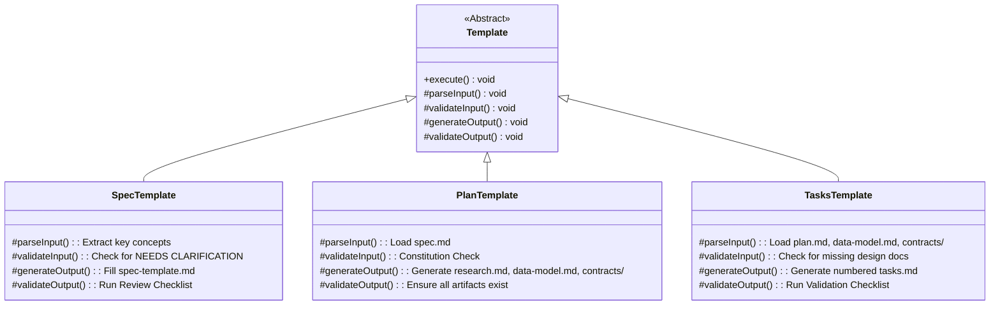
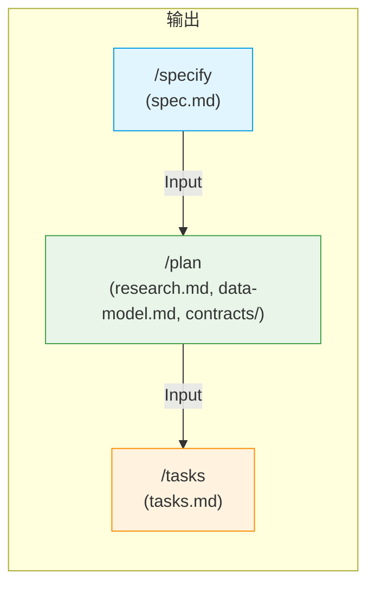

# SDD工作流详解

<cite>
**本文档引用的文件**
- [spec-template.md](file://templates/spec-template.md)
- [plan-template.md](file://templates/plan-template.md)
- [tasks-template.md](file://templates/tasks-template.md)
- [constitution.md](file://memory/constitution.md)
- [specify.md](file://templates/commands/specify.md)
- [plan.md](file://templates/commands/plan.md)
- [tasks.md](file://templates/commands/tasks.md)
- [create-new-feature.sh](file://scripts/bash/create-new-feature.sh)
- [setup-plan.sh](file://scripts/bash/setup-plan.sh)
</cite>

## 目录
1. [引言](#引言)
2. [SDD三大核心命令概述](#sdd三大核心命令概述)
3. [/specify命令详解](#specify命令详解)
4. [/plan命令详解](#plan命令详解)
5. [/tasks命令详解](#tasks命令详解)
6. [模板方法模式与质量控制](#模板方法模式与质量控制)
7. [端到端使用案例](#端到端使用案例)
8. [阶段间数据传递机制](#阶段间数据传递机制)
9. [结论](#结论)

## 引言
规范驱动开发（SDD）是一种系统化的软件开发方法，通过三个核心命令——/specify、/plan和/tasks——将模糊的用户需求逐步转化为可执行的开发任务。该方法依赖于预定义的Markdown模板来约束AI输出，确保每个阶段的输出具有一致性和高质量。本文将深入阐述这三个命令的工作流程、输入输出以及它们如何协同工作以实现高效、可靠的开发过程。

## SDD三大核心命令概述
SDD工作流由三个阶段性的命令构成，每个命令负责一个特定的开发阶段，形成一个从需求到任务的完整流水线。

```mermaid
flowchart TD
A["用户想法"] --> B[/specify\n生成功能规范]
B --> C[/plan\n生成实现计划]
C --> D[/tasks\n生成可执行任务]
D --> E["开发执行"]
style B fill:#e1f5fe,stroke:#039be5
style C fill:#e8f5e8,stroke:#43a047
style D fill:#fff3e0,stroke:#fb8c00
```

**Diagram sources**
- [specify.md](file://templates/commands/specify.md)
- [plan.md](file://templates/commands/plan.md)
- [tasks.md](file://templates/commands/tasks.md)

## /specify命令详解
`/specify` 命令是SDD工作流的起点，负责将用户的自然语言描述转化为结构化的功能规范。

### 输入与处理
- **输入**：用户的自然语言功能描述（如“创建一个用户注册系统”）。
- **处理流程**：
  1. 执行 `create-new-feature.sh` 脚本，创建新的功能分支和目录结构。
  2. 加载 `spec-template.md` 模板，该模板定义了规范的强制性结构。
  3. 解析用户描述，提取关键概念（参与者、行为、数据、约束）。
  4. 识别模糊点，并使用 `[NEEDS CLARIFICATION: ...]` 标记所有需要澄清的假设。
  5. 填充“用户场景与测试”和“功能需求”等核心部分。

### 输出与质量控制
- **输出**：位于 `specs/[###-feature-name]/spec.md` 的功能规范文件。
- **质量控制**：模板内置的“审查与验收清单”会自动检查：
  - 是否包含技术实现细节（禁止）。
  - 需求是否可测试且无歧义。
  - 所有强制性部分是否已完成。
  - 是否存在未解决的 `[NEEDS CLARIFICATION]` 标记。

**Section sources**
- [specify.md](file://templates/commands/specify.md#L1-L15)
- [spec-template.md](file://templates/spec-template.md#L1-L116)
- [create-new-feature.sh](file://scripts/bash/create-new-feature.sh#L1-L58)

## /plan命令详解
`/plan` 命令是SDD工作流的中枢，负责将功能规范转化为技术实现计划。

### 输入与处理
- **输入**：来自 `/specs/[###-feature-name]/spec.md` 的功能规范。
- **处理流程**：
  1. 加载 `plan-template.md` 模板和 `constitution.md` 宪法文件。
  2. 分析规范，提取技术上下文（语言、依赖、平台等）。
  3. 执行“宪法检查”，确保设计符合项目的核心原则（如TDD、库优先等）。
  4. 执行**第0阶段（研究）**：生成 `research.md`，解决规范中的所有 `[NEEDS CLARIFICATION]` 问题。
  5. 执行**第1阶段（设计）**：生成 `data-model.md`、API契约（`contracts/`）和 `quickstart.md`。

### 输出与质量控制
- **输出**：`plan.md` 文件，包含完整的实现计划、研究结果、数据模型和API契约。
- **质量控制**：模板的“执行流程”强制执行以下检查点：
  - 在开始研究前，必须通过初始宪法检查。
  - 在设计完成后，必须再次通过宪法检查。
  - 所有研究问题必须在进入下一阶段前解决。

**Section sources**
- [plan.md](file://templates/commands/plan.md#L1-L39)
- [plan-template.md](file://templates/plan-template.md#L1-L217)
- [constitution.md](file://memory/constitution.md#L1-L49)
- [setup-plan.sh](file://scripts/bash/setup-plan.sh#L1-L17)

## /tasks命令详解
`/tasks` 命令是SDD工作流的终点，负责将设计文档转化为具体的、可并行执行的任务列表。

### 输入与处理
- **输入**：`plan.md`、`research.md`、`data-model.md` 和 `contracts/` 等设计文档。
- **处理流程**：
  1. 加载 `tasks-template.md` 模板。
  2. 分析所有可用的设计文档。
  3. 根据模板规则生成任务：
     - 每个API契约 → 一个契约测试任务 `[P]`。
     - 每个数据实体 → 一个模型创建任务 `[P]`。
     - 每个用户故事 → 一个集成测试任务 `[P]`。
  4. 应用任务规则：
     - **测试先行**：所有测试任务必须在实现任务之前。
     - **依赖顺序**：模型任务在服务任务之前，服务任务在端点任务之前。
     - **并行标记 `[P]`**：仅当任务操作不同文件且无依赖时才标记。

### 输出与质量控制
- **输出**：`tasks.md` 文件，包含25-30个编号、有序、带依赖关系的任务。
- **质量控制**：模板的“验证检查清单”确保：
  - 所有契约都有对应的测试任务。
  - 所有实体都有模型任务。
  - 所有测试任务都在实现任务之前。
  - 并行任务（`[P]`）确实是独立的。

**Section sources**
- [tasks.md](file://templates/commands/tasks.md#L1-L61)
- [tasks-template.md](file://templates/tasks-template.md#L1-L126)

## 模板方法模式与质量控制
SDD的核心是**模板方法模式**，它通过预定义的Markdown模板来约束AI的输出，确保过程的一致性和输出的质量。

### 模板的作用机制
每个模板（`spec-template.md`, `plan-template.md`, `tasks-template.md`）都包含一个“执行流程”代码块，它定义了AI必须遵循的算法步骤。这类似于面向对象编程中的“模板方法模式”，其中父类定义了算法的骨架，而子类（在此处是AI）填充具体步骤。



**Diagram sources**
- [spec-template.md](file://templates/spec-template.md#L1-L116)
- [plan-template.md](file://templates/plan-template.md#L1-L217)
- [tasks-template.md](file://templates/tasks-template.md#L1-L126)

### 质量控制的实现
质量控制通过以下方式实现：
1. **结构强制**：模板的固定章节（如“用户场景”、“功能需求”）确保了信息的完整性。
2. **自动化检查**：每个模板都包含一个“检查清单”，AI在生成输出时必须模拟执行这些检查。
3. **错误处理**：模板中的“执行流程”明确指出了错误条件（如“未找到规范”）和相应的错误信息，防止AI生成无效输出。

## 端到端使用案例
以下是一个从模糊想法到可执行任务的完整示例。

### 场景：用户提出“创建一个登录系统”
1. **/specify 阶段**：
   - 用户输入：`/specify create a login system`
   - AI生成 `spec.md`，并在需求中包含：
     - `FR-001: System MUST authenticate users via [NEEDS CLARIFICATION: auth method not specified - email/password, SSO, OAuth?]`
     - `FR-002: System MUST retain user data for [NEEDS CLARIFICATION: retention period not specified]`
   - 输出：一个带有明确问题标记的、高质量的规范。

2. **/plan 阶段**：
   - AI加载 `spec.md` 和 `constitution.md`。
   - “宪法检查”可能要求“所有新功能必须有契约测试”。
   - AI生成 `research.md` 来研究“OAuth 2.0 vs. JWT”。
   - AI生成 `data-model.md` 定义 `User` 实体和 `Session` 实体。
   - AI生成 `contracts/` 中的 `POST /api/login` OpenAPI规范。

3. **/tasks 阶段**：
   - AI加载 `plan.md`、`data-model.md` 和 `contracts/`。
   - AI生成 `tasks.md`，包含：
     - `T001 [P] Create User model in src/models/user.py`
     - `T002 [P] Contract test POST /api/login in tests/contract/test_login.py`
     - `T003 [P] Research OAuth 2.0 best practices`
     - `T004 Implement POST /api/login endpoint`
   - 任务按TDD顺序排列，`[P]` 标记表示可并行执行。

**Section sources**
- [spec-template.md](file://templates/spec-template.md#L1-L116)
- [plan-template.md](file://templates/plan-template.md#L1-L217)
- [tasks-template.md](file://templates/tasks-template.md#L1-L126)

## 阶段间数据传递机制
SDD工作流的各个阶段通过文件系统和结构化数据进行无缝衔接。

### 数据流图


**Diagram sources**
- [specify.md](file://templates/commands/specify.md)
- [plan.md](file://templates/commands/plan.md)
- [tasks.md](file://templates/commands/tasks.md)

### 传递机制详解
- **/specify → /plan**：`/plan` 命令的输入是 `spec.md` 文件的路径。`plan-template.md` 的“执行流程”第一步就是“加载功能规范”。规范中的 `[NEEDS CLARIFICATION]` 标记直接驱动了 `research.md` 的内容。
- **/plan → /tasks**：`/tasks` 命令的输入是 `plan.md` 和其他设计文档的路径。`tasks-template.md` 明确规定了如何从 `data-model.md` 生成模型任务，从 `contracts/` 生成测试任务。技术上下文（如语言、框架）从 `plan.md` 传递，用于生成正确的设置任务。

## 结论
规范驱动开发（SDD）通过 `/specify`、`/plan` 和 `/tasks` 三个核心命令，构建了一个严谨、可重复的开发工作流。其核心创新在于利用Markdown模板作为“模板方法”，将AI的创造性输出约束在一个可预测、高质量的框架内。通过强制性的结构、自动化的检查清单和清晰的阶段划分，SDD有效解决了AI开发中常见的模糊性、不一致性和质量波动问题，为实现可靠、高效的AI辅助开发提供了一套强大的方法论。