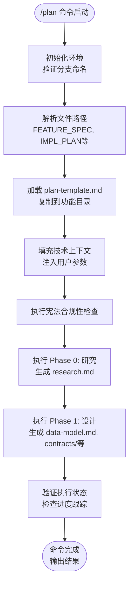
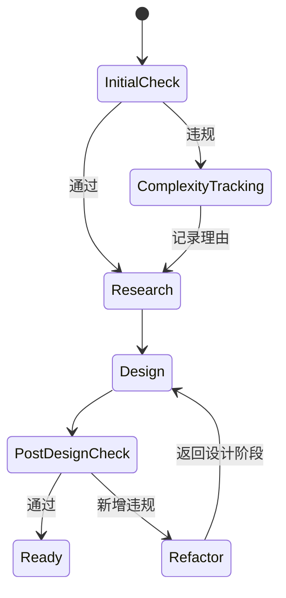
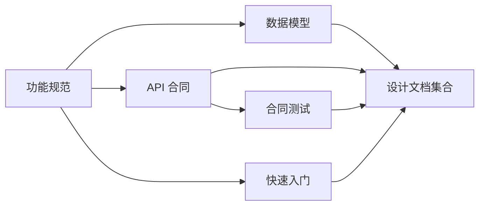

<docs>
# /plan 命令详解

<cite>
**本文档引用的文件**
- [plan.md](file://templates/commands/plan.md) - *更新执行流程描述*
- [constitution.md](file://memory/constitution.md) - *架构原则定义*
- [plan-template.md](file://templates/plan-template.md) - *计划模板结构，新增Phase 0-2策略说明*
- [setup-plan.sh](file://scripts/bash/setup-plan.sh) - *环境初始化脚本*
- [setup-plan.ps1](file://scripts/powershell/setup-plan.ps1) - *PowerShell版环境初始化脚本*
- [common.sh](file://scripts/bash/common.sh) - *Bash公共函数库*
- [common.ps1](file://scripts/powershell/common.ps1) - *PowerShell公共函数库*
- [update-agent-context.sh](file://scripts/bash/update-agent-context.sh) - *AI助手上下文更新脚本*
- [update-agent-context.ps1](file://scripts/powershell/update-agent-context.ps1) - *PowerShell版上下文更新脚本*
- [specify_cli/__init__.py](file://src/specify_cli/__init__.py) - *CLI核心实现*
</cite>

## 更新摘要
**变更内容**
- 根据最新提交 `3360c2d` 更新了 `/plan` 命令的深度解析，特别是 Phase 0-2 的具体执行策略
- 新增对 `plan-template.md` 中分阶段处理逻辑的详细说明
- 更新“设计阶段”和“端到端案例分析”以反映 Phase 2 不由 `/plan` 执行的事实
- 修正宪法检查流程图以匹配实际执行顺序

## 目录
1. [命令概述](#命令概述)
2. [执行流程解析](#执行流程解析)
3. [技术上下文填充机制](#技术上下文填充机制)
4. [宪法合规性检查](#宪法合规性检查)
5. [研究阶段（Phase 0）](#研究阶段phase-0)
6. [设计阶段（Phase 1）](#设计阶段phase-1)
7. [模板方法模式与结构化输出](#模板方法模式与结构化输出)
8. [AI助手集成与技术决策支持](#ai助手集成与技术决策支持)
9. [端到端案例分析](#端到端案例分析)
10. [冲突与违规处理](#冲突与违规处理)

## 命令概述

`/plan` 命令是 Spec-Kit 工具链中的核心组件，负责将由 `/specify` 命令生成的功能规范转化为可执行的技术实现计划。该命令遵循预定义的模板方法模式，通过标准化流程确保设计的一致性和可追溯性。

**Section sources**
- [plan.md](file://templates/commands/plan.md#L1-L39)

## 执行流程解析

`/plan` 命令的执行流程严格遵循模板驱动的分阶段处理模型：

1. **环境初始化**：调用 `setup-plan.sh` 或 `setup-plan.ps1` 脚本，验证当前处于符合命名规范的功能分支（如 `001-feature-name`），并创建必要的目录结构。
2. **路径解析**：获取功能规范文件（`spec.md`）、实现计划文件（`plan.md`）及输出目录的绝对路径，确保路径操作的可靠性。
3. **模板加载**：将 `templates/plan-template.md` 复制到功能目录，作为本次规划的主文档。
4. **上下文注入**：将用户输入参数填充至模板的“技术上下文”部分，为后续决策提供依据。
5. **流程执行**：按模板定义的“执行流程”逐步推进，包括技术上下文填充、宪法检查、研究与设计阶段。
6. **结果验证**：确认所有阶段完成且无错误状态，输出生成的文档路径和分支信息。

**Diagram sources**
- [plan.md](file://templates/commands/plan.md#L1-L39)
- [setup-plan.sh](file://scripts/bash/setup-plan.sh#L1-L17)
- [setup-plan.ps1](file://scripts/powershell/setup-plan.ps1#L1-L21)
- [common.sh](file://scripts/bash/common.sh#L1-L37)
- [common.ps1](file://scripts/powershell/common.ps1#L1-L65)

**Section sources**
- [plan.md](file://templates/commands/plan.md#L1-L39)
- [setup-plan.sh](file://scripts/bash/setup-plan.sh#L1-L17)
- [setup-plan.ps1](file://scripts/powershell/setup-plan.ps1#L1-L21)

## 技术上下文填充机制

技术上下文是实现计划的核心输入，定义了项目的关键技术参数。`/plan` 命令通过分析功能规范和用户输入，自动填充以下字段：

- **语言/版本**：指定开发语言及版本
- **主要依赖**：列出核心框架和库
- **存储**：说明数据持久化方案
- **测试**：定义测试框架
- **目标平台**：明确部署环境
- **项目类型**：识别为单体、Web或移动应用，决定目录结构
- **性能目标与约束**：设定关键性能指标

当信息不足时，字段标记为“NEEDS CLARIFICATION”，触发研究阶段进行补充。

**Section sources**
- [plan-template.md](file://templates/plan-template.md#L50-L65)

## 宪法合规性检查

`/plan` 命令强制执行 `memory/constitution.md` 中定义的架构原则，作为设计的约束条件。该检查在两个关键节点执行：

1. **初始检查**：在研究阶段前，基于初步技术上下文评估是否违反宪法原则。
2. **设计后检查**：在设计阶段后，重新评估最终设计的合规性。

若发现违规，系统要求在“复杂度跟踪”表中明确记录：
- **违规项**：具体违反的宪法条款
- **必要性说明**：为何必须违反该原则
- **被拒的简化方案**：为何更简单的方案不可行

此机制确保任何偏离标准架构的决策都经过深思熟虑并有据可查。

**Diagram sources**
- [constitution.md](file://memory/constitution.md#L1-L49)
- [plan-template.md](file://templates/plan-template.md#L70-L85)

**Section sources**
- [constitution.md](file://memory/constitution.md#L1-L49)
- [plan-template.md](file://templates/plan-template.md#L70-L85)

## 研究阶段（Phase 0）

研究阶段旨在解决技术上下文中的所有“NEEDS CLARIFICATION”项。其主要活动包括：

1. **提取未知项**：遍历技术上下文，为每个未决项生成研究任务。
2. **分派研究代理**：为每个未知项（如技术选型、最佳实践）创建具体的研究任务。
3. **整合研究成果**：将研究结果汇总至 `research.md` 文件，格式包含决策、理由和备选方案。

此阶段确保所有关键技术决策都有充分依据，避免设计中的假设和风险。

**Section sources**
- [plan-template.md](file://templates/plan-template.md#L90-L110)

## 设计阶段（Phase 1）

设计阶段基于研究结果生成具体的技术设计文档：

1. **数据模型**：从功能规范中提取实体、字段、关系和验证规则，生成 `data-model.md`。
2. **API 合同**：将用户操作转化为 API 端点，生成 OpenAPI 或 GraphQL 规范至 `contracts/` 目录。
3. **合同测试**：为每个 API 端点生成断言请求/响应模式的测试用例，确保测试先行。
4. **快速入门**：基于用户故事生成 `quickstart.md`，描述功能验证步骤。
5. **更新 AI 助手上下文**：调用 `update-agent-context.sh/.ps1` 脚本，将新技术栈增量更新至 AI 助手的上下文文件（如 `CLAUDE.md`）。

此阶段输出是后续任务生成和实现的基础。

**Diagram sources**
- [plan-template.md](file://templates/plan-template.md#L130-L150)

**Section sources