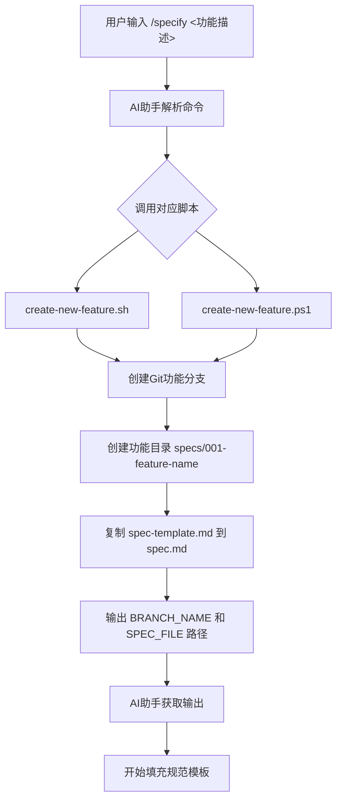
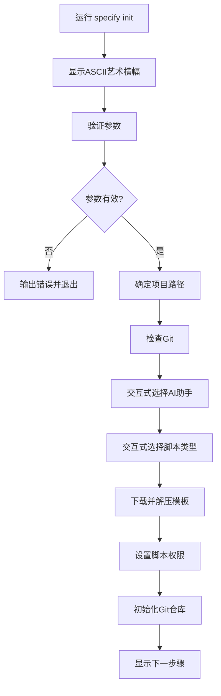
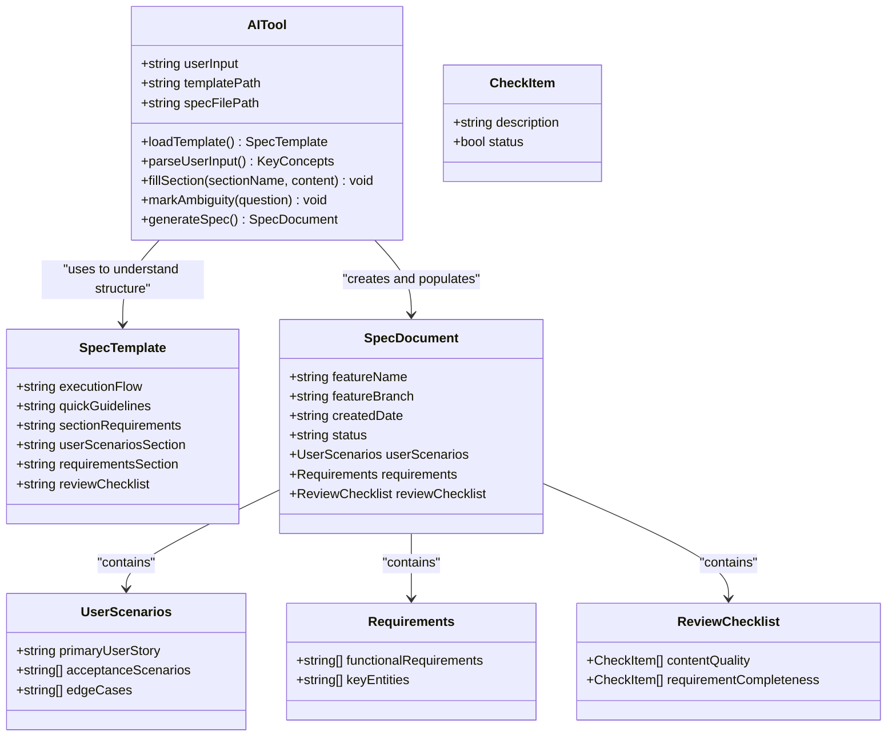

# /specify 命令详解

<cite>
**Referenced Files in This Document**   
- [spec-template.md](file://templates/spec-template.md)
- [__init__.py](file://src/specify_cli/__init__.py)
- [specify.md](file://templates/commands/specify.md)
- [create-new-feature.sh](file://scripts/bash/create-new-feature.sh)
- [create-new-feature.ps1](file://scripts/powershell/create-new-feature.ps1)
</cite>

## 目录
1. [引言](#引言)
2. [核心功能与工作流](#核心功能与工作流)
3. [交互式流程与输入验证](#交互式流程与输入验证)
4. [模板驱动的AI集成](#模板驱动的ai集成)
5. [完整执行流程示例](#完整执行流程示例)
6. [错误处理与常见问题](#错误处理与常见问题)
7. [结论](#结论)

## 引言

`/specify` 命令是 Spec-Driven Development (SDD) 工作流中的核心指令，它充当了从模糊的用户需求到精确、结构化功能规范文档的桥梁。该命令通过一个精心设计的交互式流程，引导用户将自然语言描述的功能需求，转化为符合 `spec-template.md` 严格结构的、可执行的规范文档。此过程不仅自动化了文档创建，更重要的是，它通过模板约束和AI集成，确保了生成内容的一致性、完整性和业务导向性，为后续的 `/plan` 和 `/tasks` 阶段提供了坚实可靠的输入基础。

**Section sources**
- [specify.md](file://templates/commands/specify.md)

## 核心功能与工作流

`/specify` 命令的核心功能是启动一个端到端的规范生成工作流。其工作流并非单一操作，而是一个由多个脚本和模板协同完成的复杂流程。

1.  **命令触发与参数解析**：当用户在支持的AI环境中（如Claude Code）输入 `/specify` 并附带功能描述时，该命令被触发。AI助手会解析用户提供的自然语言描述作为参数。
2.  **脚本执行与环境准备**：根据用户的操作系统，`/specify` 命令会调用相应的底层脚本——`create-new-feature.sh`（POSIX Shell）或 `create-new-feature.ps1`（PowerShell）。该脚本是工作流的“执行引擎”。
3.  **分支与目录创建**：脚本首先在Git仓库中创建一个新的功能分支。分支名称遵循 `[序号]-[功能描述关键词]` 的格式（例如 `001-user-login`），确保了分支的唯一性和可追溯性。同时，它会在 `specs/` 目录下创建一个与分支同名的文件夹，用于存放该功能的所有相关文档。
4.  **规范文档初始化**：脚本会将 `templates/spec-template.md` 文件复制到新创建的功能目录中，并重命名为 `spec.md`。这一步完成了规范文档的物理创建和结构初始化。
5.  **信息传递**：脚本以JSON格式输出关键信息，包括新创建的 `BRANCH_NAME` 和 `SPEC_FILE` 的绝对路径。这些信息被返回给AI助手，作为后续填充模板的上下文。



**Diagram sources**
- [specify.md](file://templates/commands/specify.md)
- [create-new-feature.sh](file://scripts/bash/create-new-feature.sh)
- [create-new-feature.ps1](file://scripts/powershell/create-new-feature.ps1)

**Section sources**
- [specify.md](file://templates/commands/specify.md)
- [create-new-feature.sh](file://scripts/bash/create-new-feature.sh)
- [create-new-feature.ps1](file://scripts/powershell/create-new-feature.ps1)

## 交互式流程与输入验证

`/specify` 命令的交互式流程主要体现在其底层支持工具 `specify-cli` 的 `init` 命令中，这为整个SDD工作流奠定了基础。虽然 `/specify` 本身直接处理功能描述，但其依赖的环境是通过一个高度交互的初始化流程建立的。

1.  **选择AI助手**：在项目初始化阶段，`init` 命令会通过一个基于箭头键的交互式菜单，让用户从 `claude`, `gemini`, `copilot`, `cursor`, `qwen`, `opencode` 等选项中选择其偏好的AI助手。这确保了后续 `/specify` 等命令能与正确的AI工具链集成。
2.  **选择脚本类型**：同样，用户可以选择使用 `sh` (Bash) 还是 `ps` (PowerShell) 脚本，系统会根据用户的操作系统提供默认选项。
3.  **输入验证**：`init` 命令在执行前会进行严格的输入验证。例如，它不允许同时指定 `--here` 标志和项目名称，会检查目标目录是否已存在或是否为空，防止意外覆盖。对于 `/specify` 命令，其输入验证主要由底层脚本 `create-new-feature.sh` 和 `create-new-feature.ps1` 完成。它们会检查用户是否提供了功能描述，如果为空，则会输出用法提示并退出，确保了工作流的起点是有效的。



**Diagram sources**
- [__init__.py](file://src/specify_cli/__init__.py)

**Section sources**
- [__init__.py](file://src/specify_cli/__init__.py)

## 模板驱动的AI集成

`/specify` 命令与AI助手的集成是其最强大的特性，而 `spec-template.md` 是实现这种集成的关键约束机制。

1.  **模板作为AI的“指南针”**：`spec-template.md` 不仅仅是一个文档框架，它是一个包含明确指令的“智能模板”。模板中的“Execution Flow (main)”部分定义了AI在生成规范时必须遵循的逻辑步骤，例如“提取关键概念”、“标记不明确之处”、“生成可测试的功能需求”等。这确保了AI的输出不是随意的，而是有逻辑、有结构的。
2.  **强制业务导向**：模板通过“Quick Guidelines”明确要求AI“关注用户需要什么和为什么（WHAT和WHY）”，并禁止提及“如何实现（HOW）”，如技术栈、API或代码结构。这迫使AI从商业和用户价值的角度思考，生成的文档面向利益相关者而非开发者。
3.  **处理不确定性**：模板要求AI在遇到任何不明确的地方时，使用 `[NEEDS CLARIFICATION: ...]` 标记。例如，如果用户描述“登录系统”但未指定认证方式，AI必须生成 `System MUST authenticate users via [NEEDS CLARIFICATION: auth method not specified - email/password, SSO, OAuth?]`。这将模糊性显式化，而不是让AI自行猜测，保证了规范的完整性。
4.  **AI的执行过程**：当AI助手收到 `/specify` 命令的输出（即 `SPEC_FILE` 路径）后，它会：
    *   读取 `spec-template.md` 以理解结构和规则。
    *   将用户的功能描述作为输入。
    *   严格按照模板中的执行流程，将用户描述的内容填充到“User Scenarios & Testing”、“Requirements”等相应章节。
    *   在填充过程中，主动识别并标记所有模糊点。
    *   最终生成一个结构完整、内容清晰、且明确标出所有待澄清项的 `spec.md` 文件。



**Diagram sources**
- [spec-template.md](file://templates/spec-template.md)

**Section sources**
- [spec-template.md](file://templates/spec-template.md)

## 完整执行流程示例

以下是一个从用户输入到规范生成的完整示例：

1.  **用户输入**：用户在编辑器中输入 `/specify Allow users to reset their password via email`。
2.  **脚本执行**：AI助手调用 `create-new-feature.sh` 脚本。
3.  **环境创建**：
    *   创建Git分支：`001-reset-password`。
    *   创建目录：`specs/001-reset-password/`。
    *   复制模板：`specs/001-reset-password/spec.md`。
    *   脚本返回：`{"BRANCH_NAME":"001-reset-password","SPEC_FILE":"/path/to/project/specs/001-reset-password/spec.md"}`。
4.  **AI填充规范**：AI助手读取 `spec-template.md`，并根据用户描述填充 `spec.md`，生成内容如下（节选）：

    ```
    ## User Scenarios & Testing *(mandatory)*

    ### Primary User Story
    作为忘记密码的用户，我希望能够通过邮箱收到重置链接，以便我可以设置一个新密码并重新访问我的账户。

    ### Acceptance Scenarios
    1. **Given** 用户在登录页面点击“忘记密码”，**When** 输入其注册邮箱并提交，**Then** 系统应发送一封包含一次性重置链接的邮件，并显示确认消息。
    2. **Given** 用户收到重置邮件，**When** 点击链接，**Then** 应跳转到一个安全的密码重置页面。
    3. **Given** 用户在重置页面，**When** 输入一个新密码并确认，**Then** 系统应更新密码并允许用户使用新密码登录。

    ## Requirements *(mandatory)*

    ### Functional Requirements
    - **FR-001**: 系统必须提供一个“忘记密码”入口点。
    - **FR-002**: 系统必须验证用户输入的邮箱是否已注册。
    - **FR-003**: 系统必须生成一个有时效性的一次性重置令牌。
    - **FR-004**: 系统必须通过邮件服务发送包含重置链接的邮件。
    - **FR-005**: 系统必须在用户成功重置密码后使令牌失效。
    - **FR-006**: 系统必须验证新密码的强度，例如 [NEEDS CLARIFICATION: 密码强度规则未指定，如最小长度、字符类型要求？]
    - **FR-007**: 系统必须在 [NEEDS CLARIFICATION: 令牌有效期未指定，例如15分钟？] 后使重置令牌失效。
    ```

5.  **结果**：用户现在可以在 `001-reset-password` 分支的 `specs/001-reset-password/spec.md` 文件中查看生成的、带有明确待澄清项的规范文档，可以继续与团队讨论或直接进入 `/plan` 阶段。

**Section sources**
- [spec-template.md](file://templates/spec-template.md)
- [create-new-feature.sh](file://scripts/bash/create-new-feature.sh)

## 错误处理与常见问题

`/specify` 工作流在多个层面都包含了错误处理机制。

1.  **脚本层错误**：
    *   **无输入**：如果用户未提供功能描述，`create-new-feature.sh/.ps1` 脚本会直接报错并输出用法提示。
    *   **Git操作失败**：如果创建分支失败（例如，分支已存在），脚本会抛出异常，导致整个流程中断。
2.  **AI层错误**：
    *   **模板约束**：`spec-template.md` 中的“Execution Flow”定义了多个检查点。例如，如果AI无法确定用户场景，流程会返回 `ERROR "Cannot determine user scenarios"`。如果AI在规范中包含了技术实现细节，会返回 `ERROR "Remove tech details"`。这些检查确保了输出质量。
    *   **模糊性处理**：最常见的“错误”是用户输入不完整。`/specify` 流程不将其视为错误，而是通过 `[NEEDS CLARIFICATION]` 标记将其转化为一个明确的行动项，这是一种优雅的错误处理方式。
3.  **常见问题**：
    *   **问题**：`/specify` 命令无响应。
      **解决**：检查AI助手（如Claude Code）是否已正确安装并激活。
    *   **问题**：生成的规范缺少关键部分。
      **解决**：检查 `spec-template.md` 是否被意外修改，确保其包含所有必需的章节。
    *   **问题**：脚本权限错误（在Linux/macOS上）。
      **解决**：`init` 命令中的 `ensure_executable_scripts` 函数会尝试修复，或手动运行 `chmod +x scripts/bash/*.sh`。

**Section sources**
- [spec-template.md](file://templates/spec-template.md)
- [create-new-feature.sh](file://scripts/bash/create-new-feature.sh)
- [create-new-feature.ps1](file://scripts/powershell/create-new-feature.ps1)

## 结论

`/specify` 命令是SDD工作流的基石，它通过一个自动化、模板驱动的流程，将模糊的用户需求转化为结构化、高质量的功能规范。其核心价值在于：
1.  **标准化**：通过 `spec-template.md` 强制执行统一的文档结构和内容标准。
2.  **智能化**：利用AI助手的强大生成能力，快速填充模板内容。
3.  **显式化**：主动识别并标记不确定性，促进团队沟通。
4.  **自动化**：与Git工作流集成，自动创建分支和文档，减少手动操作。

通过 `/specify` 命令生成的规范文档，为后续的 `/plan`（生成实现计划）和 `/tasks`（生成任务列表）阶段提供了清晰、可靠且无歧义的输入，从而实现了从需求到代码的无缝、高效衔接。