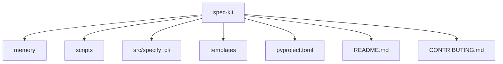
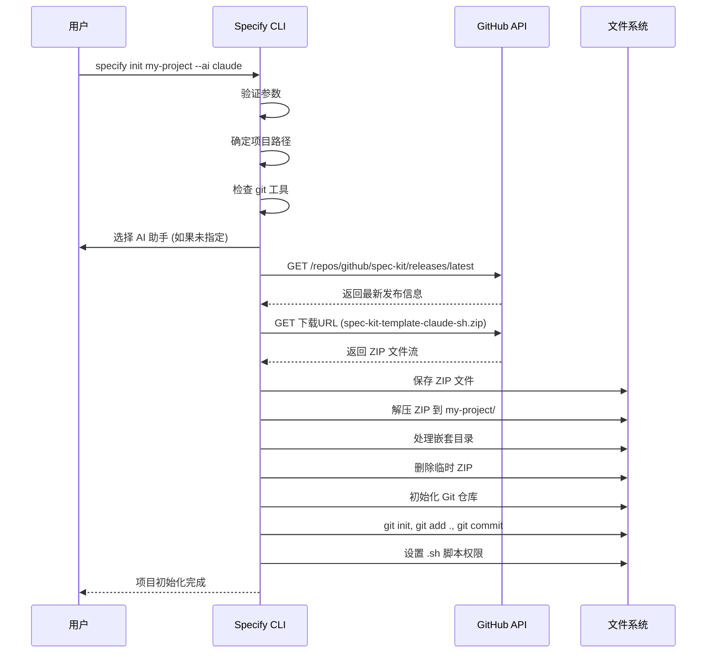

# 安装与配置

<cite>
**本文档中引用的文件**  
- [pyproject.toml](file://pyproject.toml)
- [CONTRIBUTING.md](file://CONTRIBUTING.md)
- [README.md](file://README.md)
- [src/specify_cli/__init__.py](file://src/specify_cli/__init__.py)
</cite>

## 目录
1. [简介](#简介)
2. [项目结构](#项目结构)
3. [环境依赖与包管理](#环境依赖与包管理)
4. [初始化项目：`specify init` 命令详解](#初始化项目specify-init-命令详解)
5. [配置文件与自定义选项](#配置文件与自定义选项)
6. [常见安装问题与解决方案](#常见安装问题与解决方案)
7. [开发者配置建议](#开发者配置建议)
8. [结论](#结论)

## 简介

`spec-kit` 是一个支持“规范驱动开发”（Spec-Driven Development）的工具包，旨在通过 AI 助手（如 Claude Code、GitHub Copilot、Gemini CLI 等）快速生成高质量软件项目。本指南将详细介绍如何在 Windows、Linux 和 macOS 系统上安装和配置 `spec-kit`，涵盖从 Python 环境设置到项目初始化的完整流程。

**Section sources**
- [README.md](file://README.md#L0-L443)

## 项目结构

`spec-kit` 的项目结构清晰，主要包含以下几个核心目录：

- `memory/`：存放项目宪法（constitution.md）和更新检查清单。
- `scripts/`：包含 Bash 和 PowerShell 脚本，用于自动化任务（如创建新功能、设置计划等）。
- `src/specify_cli/`：CLI 工具的核心源码。
- `templates/`：项目模板文件，用于生成规范、计划和任务文档。
- 根目录下的 `pyproject.toml`、`README.md`、`CONTRIBUTING.md` 等文件定义了项目元数据、依赖项和贡献指南。



**Diagram sources**
- [pyproject.toml](file://pyproject.toml#L0-L23)
- [README.md](file://README.md#L0-L443)

**Section sources**
- [README.md](file://README.md#L0-L443)

## 环境依赖与包管理

### Python 环境要求

`spec-kit` 要求 Python 版本为 3.11 或更高。您可以通过以下命令检查当前 Python 版本：

```bash
python --version
```

如果未安装或版本过低，请从 [Python 官方网站](https://www.python.org/downloads/) 下载并安装。

### 包管理工具：pip 与 Poetry

`spec-kit` 推荐使用 `uv` 作为包管理工具，它比 `pip` 更快，并且兼容 `pyproject.toml`。您也可以使用 `pip` 进行安装。

#### 使用 `uv` 安装（推荐）

1. 安装 `uv`：
   ```bash
   pip install uv
   ```

2. 安装 `spec-kit`：
   ```bash
   uv tool install --from git+https://github.com/github/spec-kit.git specify-cli
   ```

#### 使用 `pip` 安装

```bash
pip install git+https://github.com/github/spec-kit.git
```

#### 依赖项说明

根据 `pyproject.toml` 文件，`spec-kit` 的核心依赖项包括：

- `typer`: 用于构建 CLI 应用。
- `rich`: 提供丰富的终端输出。
- `httpx[socks]`: 用于从 GitHub 下载模板。
- `platformdirs`: 管理平台特定的目录。
- `readchar`: 处理键盘输入。
- `truststore`: 增强 SSL/TLS 信任。

```toml
[project]
name = "specify-cli"
version = "0.0.6"
requires-python = ">=3.11"
dependencies = [
    "typer",
    "rich",
    "httpx[socks]",
    "platformdirs",
    "readchar",
    "truststore>=0.10.4",
]
```

**Section sources**
- [pyproject.toml](file://pyproject.toml#L0-L23)
- [README.md](file://README.md#L0-L443)

## 初始化项目：`specify init` 命令详解

`specify init` 是 `spec-kit` 的核心命令，用于初始化一个新的项目。该命令会执行以下步骤：

1. **选择 AI 助手**：交互式地选择您使用的 AI 编码助手（如 Claude、Gemini、Copilot 等）。
2. **下载模板**：通过 `httpx` 从 GitHub 的最新发布版本中下载对应的模板 ZIP 文件。
3. **解压并初始化**：将模板解压到指定目录，并可选择性地初始化 Git 仓库。

### 命令语法与选项

```bash
specify init [OPTIONS] [PROJECT_NAME]
```

| 选项/参数 | 类型 | 描述 |
|---------|------|------|
| `<project-name>` | 参数 | 新项目的目录名（如果使用 `--here` 则可选） |
| `--ai` | 选项 | 指定 AI 助手：`claude`, `gemini`, `copilot`, `cursor`, `qwen`, `opencode` |
| `--script` | 选项 | 指定脚本类型：`sh` (Bash/Zsh) 或 `ps` (PowerShell) |
| `--ignore-agent-tools` | 标志 | 跳过对 AI 助手工具的检查 |
| `--no-git` | 标志 | 跳过 Git 仓库初始化 |
| `--here` | 标志 | 在当前目录初始化项目，而非创建新目录 |
| `--skip-tls` | 标志 | 跳过 SSL/TLS 验证（不推荐） |
| `--debug` | 标志 | 启用详细调试输出 |

### 执行流程分析

1. **参数验证**：检查 `--here` 和 `project_name` 是否冲突。
2. **项目路径确定**：根据 `--here` 选项决定是使用当前目录还是创建新目录。
3. **工具检查**：检查 `git` 等必要工具是否已安装。
4. **AI 助手选择**：如果未通过 `--ai` 指定，则通过交互式菜单让用户选择。
5. **模板下载**：
   - 调用 `download_template_from_github` 函数，通过 GitHub API 获取最新发布版本信息。
   - 根据 `ai_assistant` 和 `script_type` 构造模板文件名（如 `spec-kit-template-claude-sh.zip`）。
   - 使用 `httpx` 发起 HTTP 请求下载 ZIP 文件。
6. **模板解压**：
   - 调用 `download_and_extract_template` 函数，将 ZIP 文件解压到目标目录。
   - 处理 GitHub ZIP 文件常见的嵌套目录结构。
7. **Git 初始化**：
   - 调用 `init_git_repo` 函数，在项目目录中初始化 Git 仓库并提交初始文件。
8. **权限设置**：确保所有 `.sh` 脚本在类 Unix 系统上具有可执行权限。



**Diagram sources**
- [src/specify_cli/__init__.py](file://src/specify_cli/__init__.py#L521-L799)
- [README.md](file://README.md#L0-L443)

**Section sources**
- [src/specify_cli/__init__.py](file://src/specify_cli/__init__.py#L724-L799)
- [README.md](file://README.md#L0-L443)

## 配置文件与自定义选项

`spec-kit` 的行为主要通过命令行选项进行配置，目前没有独立的配置文件（如 `.specifyrc`）。所有配置均在 `init` 命令执行时通过参数传递。

### 自定义选项

- **默认 AI 模型**：虽然没有全局配置文件，但用户可以通过 shell 别名或脚本封装 `specify init` 命令，以设置默认的 `--ai` 和 `--script` 选项。
- **模板路径修改**：模板直接从 GitHub 发布版本下载，路径由 `pyproject.toml` 中的仓库地址硬编码。若需使用自定义模板，可 Fork 仓库并修改 `download_template_from_github` 函数中的 `repo_owner` 和 `repo_name`。

**Section sources**
- [src/specify_cli/__init__.py](file://src/specify_cli/__init__.py#L521-L799)

## 常见安装问题与解决方案

### 权限错误

- **问题**：在 Linux/macOS 上运行 `.sh` 脚本时提示“权限被拒绝”。
- **解决方案**：`spec-kit` 的 `ensure_executable_scripts` 函数会自动设置权限。如果失败，请手动执行：
  ```bash
  chmod +x scripts/bash/*.sh
  ```

### 网络连接失败

- **问题**：下载模板时超时或连接被拒绝。
- **解决方案**：
  1. 检查网络连接和防火墙设置。
  2. 尝试使用 `--skip-tls` 选项（仅用于测试，不安全）。
  3. 手动从 GitHub 发布页面下载模板 ZIP 并解压。

### 依赖冲突

- **问题**：`pip` 安装时与其他包发生版本冲突。
- **解决方案**：使用 `uv` 或虚拟环境（virtual environment）隔离依赖：
  ```bash
  python -m venv spec-env
  source spec-env/bin/activate  # Linux/macOS
  # spec-env\Scripts\activate   # Windows
  pip install git+https://github.com/github/spec-kit.git
  ```

### Git 认证问题（Linux）

- **问题**：在 Linux 上进行 Git 操作时出现认证失败。
- **解决方案**：安装 Git Credential Manager：
  ```bash
  wget https://github.com/git-ecosystem/git-credential-manager/releases/download/v2.6.1/gcm-linux_amd64.2.6.1.deb
  sudo dpkg -i gcm-linux_amd64.2.6.1.deb
  git config --global credential.helper manager
  ```

**Section sources**
- [README.md](file://README.md#L0-L443)
- [src/specify_cli/__init__.py](file://src/specify_cli/__init__.py#L521-L799)

## 开发者配置建议

根据 `CONTRIBUTING.md` 文件，为贡献者提供以下配置建议：

1. **安装必要工具**：
   - Python 3.11+
   - `uv` 包管理器
   - Git
   - 一个 AI 编码助手（Claude Code, GitHub Copilot, Gemini CLI, Qwen Code, 或 opencode）

2. **设置开发环境**：
   ```bash
   # Fork 并克隆仓库
   git clone https://github.com/<your-username>/spec-kit.git
   cd spec-kit

   # 安装依赖
   uv sync

   # 测试 CLI
   uv run specify --help
   ```

3. **开发工作流**：
   - 在 `src/specify_cli/` 目录下修改代码。
   - 使用 `specify` CLI 命令在示例项目中测试功能。
   - 确保 `templates/` 和 `scripts/` 目录下的文件正常工作。

**Section sources**
- [CONTRIBUTING.md](file://CONTRIBUTING.md#L0-L53)

## 结论

本指南详细介绍了 `spec-kit` 的安装与配置流程，涵盖了从环境准备到项目初始化的各个方面。通过遵循本指南，无论是新手还是有经验的开发者，都能快速上手 `spec-kit`，利用 AI 助手高效地进行规范驱动开发。遇到问题时，可参考“常见问题”部分或查阅官方文档获取帮助。