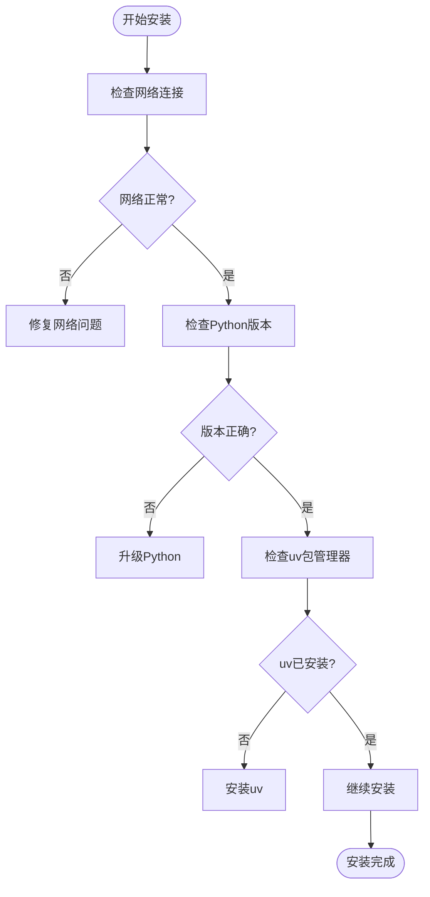
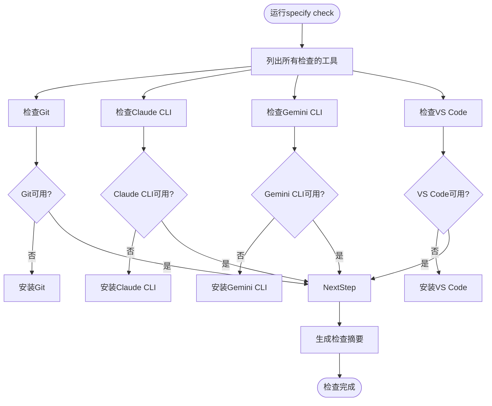
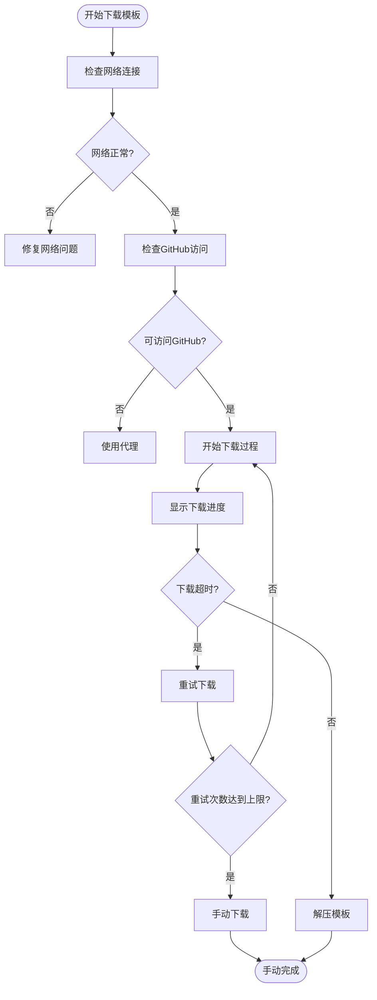
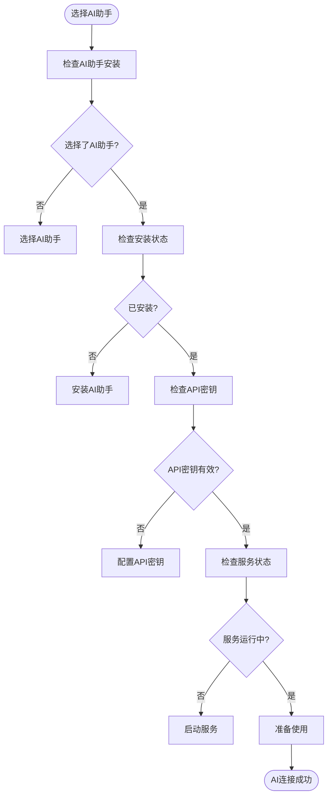

# 故障排除

<cite>
**本文档中引用的文件**  
- [README.md](file://README.md)
- [SUPPORT.md](file://SUPPORT.md)
- [src/specify_cli/__init__.py](file://src/specify_cli/__init__.py)
</cite>

## 目录
1. [简介](#简介)
2. [常见问题分类](#常见问题分类)
3. [系统健康检查](#系统健康检查)
4. [调试技巧](#调试技巧)
5. [错误代码列表](#错误代码列表)
6. [寻求社区支持](#寻求社区支持)

## 简介
本指南旨在帮助用户解决在使用spec-kit过程中可能遇到的各种问题。基于项目文档中的信息，我们将常见问题进行分类整理，并提供详细的诊断步骤和解决方案。本指南涵盖了安装失败、依赖检查错误、模板下载超时、AI连接问题等常见场景，同时介绍了如何利用`specify check`命令进行系统健康检查，以及如何启用详细日志模式或手动执行脚本来隔离问题。

**Section sources**
- [README.md](file://README.md#L1-L443)
- [SUPPORT.md](file://SUPPORT.md#L1-L19)

## 常见问题分类

### 安装失败
当用户尝试安装spec-kit时，可能会遇到各种安装失败的问题。这些问题通常与网络连接、权限设置或依赖项缺失有关。

**诊断步骤：**
1. 检查网络连接是否正常
2. 确认是否有足够的磁盘空间
3. 验证Python版本是否符合要求（Python 3.11+）
4. 检查uv包管理器是否已正确安装

**解决方案：**
- 如果网络连接不稳定，尝试使用代理或更换网络环境
- 确保有足够的磁盘空间来完成安装
- 升级到支持的Python版本
- 重新安装uv包管理器



**Diagram sources**
- [README.md](file://README.md#L1-L443)

### 依赖检查错误
在初始化项目时，spec-kit会检查所需的工具和依赖项。如果某些依赖项缺失或版本不兼容，可能会导致依赖检查错误。

**诊断步骤：**
1. 运行`specify check`命令查看哪些工具缺失
2. 检查缺失工具的安装路径是否正确配置
3. 验证工具版本是否符合要求

**解决方案：**
- 根据提示安装缺失的工具
- 将工具的可执行文件路径添加到系统PATH环境变量中
- 更新到兼容的工具版本



**Diagram sources**
- [src/specify_cli/__init__.py](file://src/specify_cli/__init__.py#L990-L1029)

### 模板下载超时
在初始化项目时，spec-kit需要从GitHub下载最新的模板。如果网络连接不稳定或GitHub服务暂时不可用，可能会导致模板下载超时。

**诊断步骤：**
1. 检查网络连接是否正常
2. 验证是否可以访问GitHub
3. 检查防火墙设置是否阻止了下载请求

**解决方案：**
- 尝试使用不同的网络环境
- 配置代理服务器以访问GitHub
- 使用`--skip-tls`选项跳过SSL/TLS验证（不推荐）
- 手动下载模板并解压到项目目录



**Diagram sources**
- [src/specify_cli/__init__.py](file://src/specify_cli/__init__.py#L420-L518)

### AI连接问题
当用户选择特定的AI助手（如Claude Code、Gemini CLI等）时，可能会遇到AI连接问题。这些问题通常与AI工具未正确安装或配置有关。

**诊断步骤：**
1. 确认所选AI助手是否已安装
2. 检查AI助手的API密钥是否正确配置
3. 验证AI助手的服务是否正常运行

**解决方案：**
- 根据提示安装所需的AI助手
- 配置正确的API密钥
- 重启AI助手服务
- 使用`--ignore-agent-tools`选项跳过AI工具检查



**Diagram sources**
- [src/specify_cli/__init__.py](file://src/specify_cli/__init__.py#L724-L986)

## 系统健康检查
`specify check`命令是诊断spec-kit环境健康状况的重要工具。该命令会检查所有必需的工具是否已正确安装和配置。

**使用方法：**
```bash
specify check
```

**检查内容：**
- Git版本控制系统
- Claude Code CLI
- Gemini CLI
- Qwen Code CLI
- VS Code（用于GitHub Copilot）
- Cursor IDE代理（可选）
- opencode

**输出示例：**
```
Check Available Tools
● Git version control (available)
● Claude Code CLI (available)
● Gemini CLI (not found - Install from: https://github.com/google-gemini/gemini-cli)
● Qwen Code CLI (available)
● VS Code (for GitHub Copilot) (available)
● Cursor IDE agent (optional) (not found - Install from: https://cursor.sh/)
● opencode (available)
```

**Section sources**
- [src/specify_cli/__init__.py](file://src/specify_cli/__init__.py#L990-L1029)

## 调试技巧

### 启用详细日志模式
当遇到难以诊断的问题时，可以启用详细日志模式来获取更多调试信息。

**启用方法：**
在`specify init`命令中添加`--debug`选项：
```bash
specify init my-project --ai claude --debug
```

**日志内容：**
- Python版本
- 平台信息
- 当前工作目录
- 网络请求详细信息
- 文件操作记录

### 手动执行脚本
对于复杂的安装或配置问题，可以手动执行相关脚本来隔离问题。

**常用脚本：**
- `check-task-prerequisites.sh`：检查任务先决条件
- `common.sh`：通用脚本功能
- `create-new-feature.sh`：创建新功能
- `get-feature-paths.sh`：获取功能路径
- `setup-plan.sh`：设置计划
- `update-agent-context.sh`：更新代理上下文

**执行步骤：**
1. 导航到scripts目录
2. 根据需要选择相应的脚本
3. 使用适当的参数执行脚本
4. 分析输出结果

**Section sources**
- [src/specify_cli/__init__.py](file://src/specify_cli/__init__.py#L724-L986)

## 错误代码列表
以下是spec-kit中可能出现的错误代码及其含义：

| 错误代码 | 含义 | 解决方案 |
|---------|------|---------|
| 1 | 参数验证失败 | 检查命令参数是否正确 |
| 2 | 工具未找到 | 安装缺失的工具 |
| 3 | 网络连接失败 | 检查网络连接或使用代理 |
| 4 | 文件操作失败 | 检查文件权限或磁盘空间 |
| 5 | 解压失败 | 验证ZIP文件完整性 |
| 6 | Git初始化失败 | 检查Git配置或权限 |

**Section sources**
- [src/specify_cli/__init__.py](file://src/specify_cli/__init__.py#L724-L986)

## 寻求社区支持
如果以上方法都无法解决问题，用户可以通过以下途径寻求社区支持：

### 提交问题报告
1. 访问[GitHub Issues](https://github.com/github/spec-kit/issues/new)
2. 搜索现有问题以避免重复提交
3. 提供详细的错误信息和重现步骤
4. 包括`specify check`命令的输出结果
5. 如果可能，提供启用`--debug`选项后的日志输出

### 获取帮助
- 查看[全面指南](./spec-driven.md)了解Spec-Driven Development流程
- 阅读[README](./README.md)获取入门说明和故障排除提示
- 加入社区讨论获取实时帮助

**项目状态：**
spec-kit正处于积极开发和维护中，由GitHub员工和社区共同维护。我们会在合理的时间内响应支持请求、功能需求和社区问题。

**Section sources**
- [SUPPORT.md](file://SUPPORT.md#L1-L19)
- [README.md](file://README.md#L1-L443)