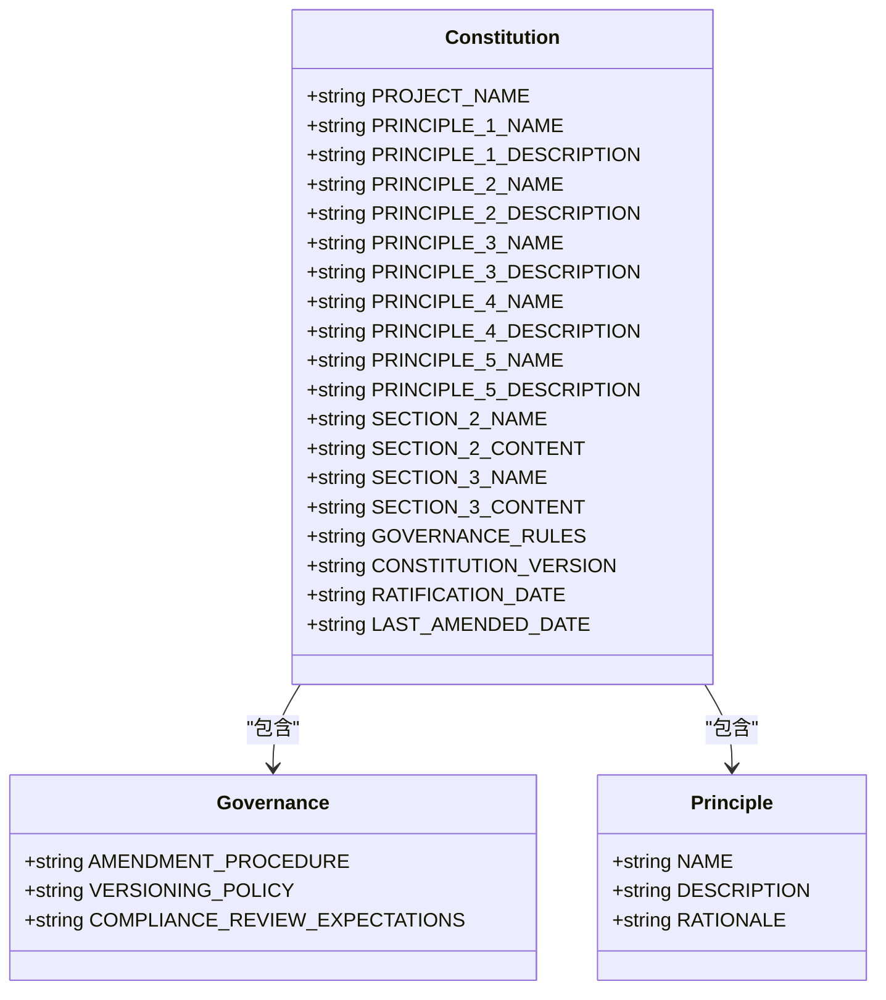
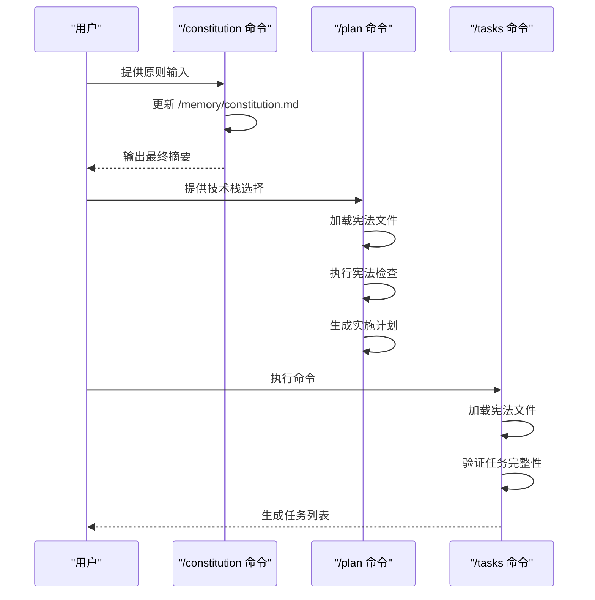

# /constitution 命令详解

<cite>
**本文档引用文件**  
- [templates/commands/constitution.md](file://templates/commands/constitution.md)
- [memory/constitution.md](file://memory/constitution.md)
- [templates/plan-template.md](file://templates/plan-template.md)
- [templates/spec-template.md](file://templates/spec-template.md)
- [templates/tasks-template.md](file://templates/tasks-template.md)
- [README.md](file://README.md)
- [spec-driven.md](file://spec-driven.md)
</cite>

## 目录
1. [引言](#引言)
2. [项目初始化与核心原则建立](#项目初始化与核心原则建立)
3. [/constitution 命令的指令结构与执行流程](#constitution-命令的指令结构与执行流程)
4. [宪法文件的生成与维护机制](#宪法文件的生成与维护机制)
5. [与其他命令的交互机制](#与其他命令的交互机制)
6. [实际使用场景示例](#实际使用场景示例)
7. [常见问题与调整策略](#常见问题与调整策略)
8. [结论](#结论)

## 引言

在 Spec-Driven Development（SDD）方法论中，`/constitution` 命令扮演着至关重要的角色。它不仅是项目初始化阶段的核心指令，更是整个开发流程的基石。该命令通过创建或更新项目的“宪法文件”（`/memory/constitution.md`），为团队建立统一的核心原则与开发规范。这些原则将作为后续所有开发活动的指导方针，确保技术决策的一致性和长期可维护性。

**Section sources**
- [README.md](file://README.md#L75-L78)
- [spec-driven.md](file://spec-driven.md#L270-L274)

## 项目初始化与核心原则建立

在项目启动阶段，`/constitution` 命令是首要执行的步骤。通过该命令，团队可以定义项目的基础准则，包括代码质量、测试标准、用户体验一致性和性能要求等。这些原则一旦确立，将成为项目的“根本大法”，指导所有后续开发活动。

该命令的执行标志着项目从模糊的创意阶段进入结构化的开发流程。通过建立明确的治理框架，团队能够确保技术决策和实现选择的一致性，避免因个人偏好或临时决策导致的架构偏离。

**Section sources**
- [README.md](file://README.md#L346-L352)
- [.qoder/repowiki/zh/content/项目概述.md](file://.qoder/repowiki/zh/content/项目概述.md#L117-L127)

## /constitution 命令的指令结构与执行流程

`/constitution` 命令的执行流程严格遵循预定义的步骤，确保宪法文件的生成过程系统化和规范化。

### 指令结构

该命令接受用户输入作为参数，这些输入可以是直接提供的原则描述，也可以是通过交互式对话逐步完善的规范。命令的核心任务是更新位于 `/memory/constitution.md` 的模板文件，该文件包含一系列占位符（如 `[PROJECT_NAME]`、`[PRINCIPLE_1_NAME]` 等），需要被具体的值填充。

### 执行流程

1. **加载宪法模板**：首先读取 `/memory/constitution.md` 文件，识别所有形式为 `[ALL_CAPS_IDENTIFIER]` 的占位符。
2. **收集/推导占位符值**：
   - 如果用户输入提供了具体值，则直接使用。
   - 否则，从项目上下文（如 README、文档或先前的宪法版本）中推导。
   - 对于治理日期，`RATIFICATION_DATE` 为原始采纳日期，`LAST_AMENDED_DATE` 为当前日期（如果有变更）。
   - `CONSTITUTION_VERSION` 必须根据语义化版本规则递增。
3. **起草更新的宪法内容**：将每个占位符替换为具体文本，确保每个原则部分简洁明了，并包含明确的非协商规则和理由。
4. **一致性传播检查**：验证并更新相关模板文件，确保整个系统的一致性。
5. **生成同步影响报告**：在宪法文件顶部添加 HTML 注释，记录版本变更、修改的原则、新增/删除的章节等信息。
6. **最终验证**：确保没有未解释的占位符，版本行与报告匹配，日期格式正确，原则表述明确且可测试。
7. **写回宪法文件**：将完成的宪法内容写回 `/memory/constitution.md`。
8. **输出最终摘要**：向用户报告新版本、变更理由以及建议的提交信息。

**Section sources**
- [templates/commands/constitution.md](file://templates/commands/constitution.md#L14-L73)

## 宪法文件的生成与维护机制

`/memory/constitution.md` 文件是项目的“根本大法”，定义了所有开发活动必须遵守的核心原则。该文件采用模板化设计，允许团队根据项目需求灵活定制。

### 核心原则示例

- **库优先原则**：每个功能必须首先作为独立库实现。
- **CLI 接口原则**：每个库必须提供 CLI 接口。
- **测试先行原则**：TDD 是强制性的，必须先写测试。
- **集成测试原则**：对契约变更等关键区域必须进行集成测试。

### 治理机制

宪法文件不仅定义了技术原则，还建立了治理框架，包括修订程序、版本策略和合规审查期望。这些机制确保了原则的权威性和可维护性。



**Diagram sources**
- [memory/constitution.md](file://memory/constitution.md#L1-L49)
- [spec-driven.md](file://spec-driven.md#L274-L284)

**Section sources**
- [memory/constitution.md](file://memory/constitution.md#L1-L49)
- [.qoder/repowiki/zh/content/模板系统/内容模板/内容模板.md](file://.qoder/repowiki/zh/content/模板系统/内容模板/内容模板.md#L214-L227)

## 与其他命令的交互机制

`/constitution` 命令生成的宪法文件在后续工作流中发挥着关键作用，影响着 `/specify`、`/plan` 等命令的决策逻辑。

### 与 `/plan` 命令的交互

`/plan` 命令在生成实施计划时，会严格检查设计是否符合宪法原则。`plan-template.md` 文件中的“宪法检查”部分会根据宪法文件的内容动态生成检查项。



**Diagram sources**
- [templates/plan-template.md](file://templates/plan-template.md#L52-L56)
- [templates/commands/plan.md](file://templates/commands/plan.md#L3-L43)

### 与 `/specify` 和 `/tasks` 命令的交互

- `/specify` 命令在生成功能规范时，会参考宪法文件中的原则，确保规范符合项目的核心价值观。
- `/tasks` 命令在生成任务列表时，会验证任务是否符合宪法中定义的测试和集成要求。

**Section sources**
- [templates/commands/constitution.md](file://templates/commands/constitution.md#L40-L48)
- [templates/spec-template.md](file://templates/spec-template.md#L1-L116)
- [templates/tasks-template.md](file://templates/tasks-template.md#L1-L126)

## 实际使用场景示例

### 场景一：建立新项目的核心原则

```bash
/constitution 创建专注于代码质量、测试标准、用户体验一致性和性能要求的原则。包括治理框架，说明这些原则如何指导技术决策和实现选择。
```

该命令执行后，将生成一个包含具体原则的宪法文件，为项目奠定坚实的基础。

### 场景二：更新现有项目的治理框架

```bash
/constitution 更新治理框架，增加对安全合规性的要求，并将版本策略从 PATCH 改为 MINOR。
```

该命令将触发宪法文件的版本更新，并生成同步影响报告，确保所有相关文件得到相应更新。

**Section sources**
- [README.md](file://README.md#L78-L79)
- [spec-driven.md](file://spec-driven.md#L379-L385)

## 常见问题与调整策略

### 问题一：宪法文件中的占位符未完全替换

**原因**：用户输入不完整或上下文信息不足。

**解决策略**：在同步影响报告中明确标记未替换的占位符，并提供 `TODO(<FIELD_NAME>): explanation` 提示，引导用户补充信息。

### 问题二：版本递增类型不明确

**原因**：变更内容介于 MAJOR 和 MINOR 之间。

**解决策略**：在最终摘要中提出推理，建议用户确认版本递增类型，确保版本管理的准确性。

### 问题三：宪法原则与现有设计冲突

**原因**：项目发展过程中出现了新的技术需求。

**解决策略**：通过正式的宪法修订流程，记录变更理由并获得项目维护者的批准，确保原则的权威性和灵活性。

**Section sources**
- [templates/commands/constitution.md](file://templates/commands/constitution.md#L65-L73)
- [spec-driven.md](file://spec-driven.md#L366-L372)

## 结论

`/constitution` 命令是 Spec-Driven Development 方法论的核心组成部分。它通过建立和维护项目的“根本大法”，确保了开发活动的一致性和可维护性。该命令不仅是一个技术工具，更是一种治理机制，帮助团队在快速变化的开发环境中保持方向和质量。通过深入理解和有效使用该命令，团队能够更好地实现意图驱动的开发，将自然语言输入转化为符合团队价值观的技术规范。