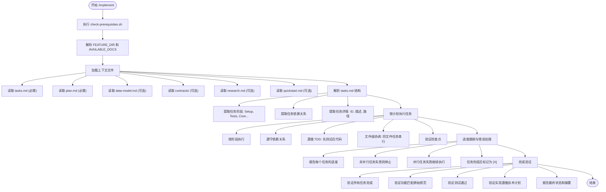
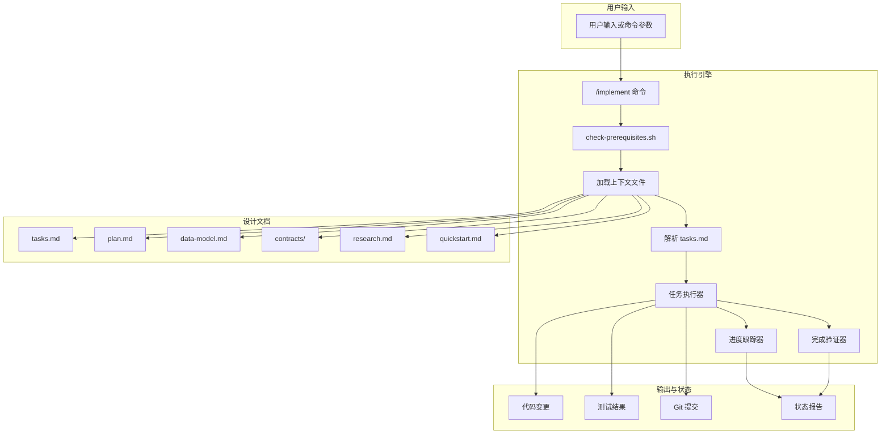
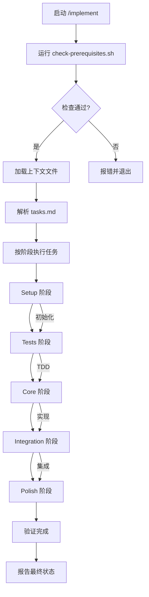
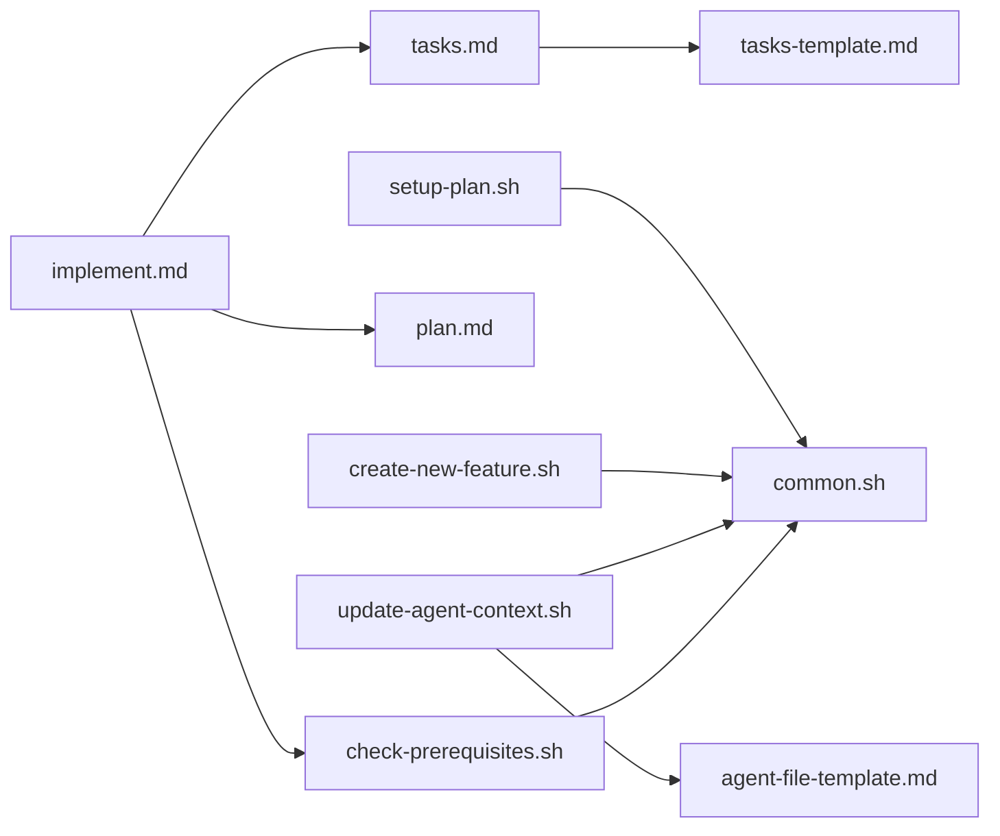

# /implement 命令详解

<cite>
**本文档中引用的文件**  
- [implement.md](file://templates/commands/implement.md)
- [check-prerequisites.sh](file://scripts/bash/check-prerequisites.sh)
- [tasks.md](file://templates/commands/tasks.md)
- [tasks-template.md](file://templates/tasks-template.md)
- [create-new-feature.sh](file://scripts/bash/create-new-feature.sh)
- [setup-plan.sh](file://scripts/bash/setup-plan.sh)
- [update-agent-context.sh](file://scripts/bash/update-agent-context.sh)
- [agent-file-template.md](file://templates/agent-file-template.md)
</cite>

## 目录
1. [简介](#简介)
2. [项目结构与执行流程](#项目结构与执行流程)
3. 核心组件分析
4. 架构概览
5. 详细组件分析
6. 依赖关系分析
7. 性能考量
8. 故障排查指南
9. 结论

## 简介
`/implement` 命令是 Spec-Driven Development（规范驱动开发）工作流中的核心自动化执行环节，负责将已分解的任务清单（tasks.md）转化为实际代码实现。该命令通过驱动 AI 代理按阶段、按依赖关系自动编写代码、运行测试并提交变更，实现了从设计到实现的端到端自动化。本文档基于 `templates/commands/implement.md` 文件内容，深入解析其执行策略、代码生成模式、与 Git 的集成方式、安全边界、人工审核机制及错误回滚策略。

## 项目结构与执行流程

**图示来源**  
- [implement.md](file://templates/commands/implement.md#L1-L58)
- [check-prerequisites.sh](file://scripts/bash/check-prerequisites.sh#L1-L165)

**本节来源**  
- [implement.md](file://templates/commands/implement.md#L1-L58)
- [check-prerequisites.sh](file://scripts/bash/check-prerequisites.sh#L1-L165)

## 核心组件分析

`/implement` 命令的执行依赖于一系列核心脚本和模板文件，共同构成了自动化实现的基石。

**本节来源**  
- [implement.md](file://templates/commands/implement.md#L1-L58)
- [check-prerequisites.sh](file://scripts/bash/check-prerequisites.sh#L1-L165)

## 架构概览

**图示来源**  
- [implement.md](file://templates/commands/implement.md#L1-L58)
- [tasks.md](file://templates/commands/tasks.md#L1-L65)

## 详细组件分析

### /implement 命令执行策略分析

`/implement` 命令的执行策略严格遵循预定义的流程，确保自动化过程的可靠性和可预测性。

#### 执行流程与依赖管理

**图示来源**  
- [implement.md](file://templates/commands/implement.md#L1-L58)

#### 代码生成与任务执行模式
`/implement` 命令本身不直接生成代码，而是作为指挥中心，驱动 AI 代理根据 `tasks.md` 中的详细指令进行代码生成。其核心模式包括：
- **阶段化执行**：任务被严格划分为 Setup、Tests、Core、Integration、Polish 五个阶段，必须按顺序完成。
- **TDD 优先**：在 `Tests` 阶段，AI 代理会根据 `contracts/` 目录下的 API 规范或 `data-model.md` 中的实体定义，自动生成测试用例，并确保这些测试在 `Core` 阶段前处于失败状态。
- **并行与串行控制**：通过 `[P]` 标记区分可并行和串行任务。影响同一文件的任务必须串行执行，以避免冲突。
- **文件路径协调**：任务描述中明确包含文件路径，执行器利用此信息协调任务顺序，确保代码一致性。

**本节来源**  
- [implement.md](file://templates/commands/implement.md#L1-L58)
- [tasks-template.md](file://templates/tasks-template.md#L1-L126)

### 与版本控制系统（Git）的集成方式

`/implement` 命令与 Git 的集成是其自动化流程的关键环节，主要通过以下方式实现：
1.  **分支管理**：在执行 `/implement` 前，通常已通过 `create-new-feature.sh` 脚本创建了独立的功能分支。`/implement` 命令在此分支上工作，隔离开发变更。
2.  **变更提交**：虽然 `implement.md` 未明确说明提交逻辑，但其“进度跟踪”要求和“验证检查点”暗示了在任务完成后进行提交。`update-agent-context.sh` 脚本中对 `Recent Changes` 的更新也表明了提交行为的存在。
3.  **状态同步**：通过 `update-agent-context.sh` 脚本，`/implement` 的成果（如新增的技术栈）会被写入 `AGENTS.md` 等文件，这些文件的变更也会被提交，从而保持 AI 代理上下文与代码库的同步。

**本节来源**  
- [implement.md](file://templates/commands/implement.md#L1-L58)
- [create-new-feature.sh](file://scripts/bash/create-new-feature.sh#L1-L97)
- [update-agent-context.sh](file://scripts/bash/update-agent-context.sh#L1-L719)

### 安全边界、人工审核与错误回滚

`/implement` 命令设计了多层安全机制，以平衡自动化效率与代码质量。

#### 安全边界与人工审核机制
- **先决条件检查**：`check-prerequisites.sh` 脚本强制要求 `plan.md` 和 `tasks.md` 存在，确保自动化有据可依，防止盲目执行。
- **任务粒度控制**：`tasks.md` 的生成（由 `/tasks` 命令完成）是人工审核的关键点。开发者可以审查任务分解是否合理，从而在自动化执行前设置安全边界。
- **进度报告**：执行过程中持续报告进度，为人工介入提供了观察窗口。
- **手动添加区**：`agent-file-template.md` 中的 `<!-- MANUAL ADDITIONS START -->` 区域允许开发者添加无法自动化的规则，作为对 AI 行为的补充约束。

#### 错误回滚策略
- **失败即停止**：对于非并行任务，一旦失败，整个执行流程将立即停止，防止错误蔓延。
- **并行任务隔离**：并行任务 `[P]` 的失败不会阻塞其他成功任务的执行，但会报告错误，便于定位问题。
- **Git 回滚**：虽然文档未直接描述，但基于 Git 的工作流天然支持回滚。当自动化执行失败或产生不良后果时，开发者可以通过 `git reset` 或 `git revert` 命令轻松回滚到执行前的状态，这是其最核心的回滚策略。

**本节来源**  
- [implement.md](file://templates/commands/implement.md#L1-L58)
- [check-prerequisites.sh](file://scripts/bash/check-prerequisites.sh#L1-L165)
- [agent-file-template.md](file://templates/agent-file-template.md#L1-L22)

## 依赖关系分析

**图示来源**  
- [implement.md](file://templates/commands/implement.md#L1-L58)
- [check-prerequisites.sh](file://scripts/bash/check-prerequisites.sh#L1-L165)
- [tasks.md](file://templates/commands/tasks.md#L1-L65)
- [tasks-template.md](file://templates/tasks-template.md#L1-L126)
- [update-agent-context.sh](file://scripts/bash/update-agent-context.sh#L1-L719)
- [agent-file-template.md](file://templates/agent-file-template.md#L1-L22)

**本节来源**  
- [implement.md](file://templates/commands/implement.md#L1-L58)
- [check-prerequisites.sh](file://scripts/bash/check-prerequisites.sh#L1-L165)
- [tasks.md](file://templates/commands/tasks.md#L1-L65)

## 性能考量

`/implement` 命令的性能主要体现在其并行执行能力上。通过识别可并行的任务（标记为 `[P]`），如独立的单元测试、不同文件的模型创建等，可以显著缩短整体实现时间。其性能瓶颈通常不在于脚本本身，而在于 AI 代理生成代码和运行测试的速度。合理的任务分解和依赖管理是最大化并行效率的关键。

## 故障排查指南

当 `/implement` 命令执行失败时，应按以下步骤排查：
1.  **检查先决条件**：确认 `plan.md` 和 `tasks.md` 文件存在且格式正确。
2.  **审查错误信息**：根据命令输出的错误信息，定位是哪个具体任务失败。
3.  **检查任务依赖**：确认 `tasks.md` 中的任务顺序和依赖关系是否正确，特别是并行任务是否真的独立。
4.  **验证上下文**：检查 `AGENTS.md` 等文件是否为最新，确保 AI 代理拥有正确的上下文。
5.  **手动干预**：对于无法自动解决的问题，进行手动修复后，可选择继续执行剩余任务或重新生成任务清单。

**本节来源**  
- [implement.md](file://templates/commands/implement.md#L1-L58)
- [check-prerequisites.sh](file://scripts/bash/check-prerequisites.sh#L1-L165)

## 结论

`/implement` 命令是 Spec-Kit 工具链中实现自动化开发的核心。它通过严格的阶段化执行、TDD 优先、依赖管理和与 Git 的深度集成，构建了一个高效、可靠的自动化实现流水线。其安全边界通过先决条件检查和人工审核点（`tasks.md`）来保障，而基于 Git 的版本控制则提供了强大的错误回滚能力。通过配置 `tasks.md` 的并行标记和任务粒度，可以灵活控制自动化程度，使其既能处理重复性工作，又能在复杂场景下保持可控性。