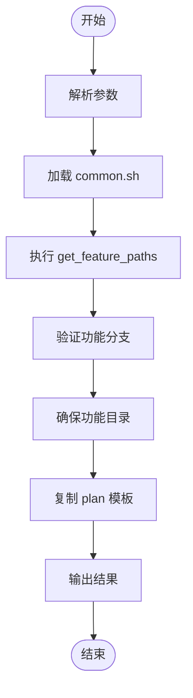

# /plan 命令详解

<cite>
**本文档引用文件**  
- [plan.md](file://templates/commands/plan.md)
- [setup-plan.sh](file://scripts/bash/setup-plan.sh)
- [plan-template.md](file://templates/plan-template.md)
- [constitution.md](file://memory/constitution.md)
- [common.sh](file://scripts/bash/common.sh)
</cite>

## 目录
1. [引言](#引言)
2. [技术实现路径规划机制](#技术实现路径规划机制)
3. [核心流程解析](#核心流程解析)
4. [技术选型与模块划分逻辑](#技术选型与模块划分逻辑)
5. [依赖分析与风险评估](#依赖分析与风险评估)
6. [实际转换案例](#实际转换案例)
7. [模板定制与架构约束](#模板定制与架构约束)
8. [结论](#结论)

## 引言
`/plan` 命令是 Spec-Driven Development (SDD) 流程中的核心环节，负责将高层次的功能规范（spec.md）转化为可执行的技术实施计划。该命令通过调用 `setup-plan.sh` 脚本并结合 `plan-template.md` 模板，系统性地推导出包含技术上下文、项目结构、设计文档和任务规划策略的完整技术方案。本文档深入解析其工作原理，重点阐述技术决策的生成逻辑。

**本节来源**
- [plan.md](file://templates/commands/plan.md#L1-L5)

## 技术实现路径规划机制

`/plan` 命令的执行是一个多阶段的自动化流程，其核心在于将 `plan-template.md` 模板实例化为具体的功能实现计划。整个过程始于 `setup-plan.sh` 脚本的调用，该脚本负责初始化环境并触发模板渲染。

**图示来源**
- [setup-plan.sh](file://scripts/bash/setup-plan.sh#L1-L17)

**本节来源**
- [setup-plan.sh](file://scripts/bash/setup-plan.sh#L1-L17)

## 核心流程解析

`/plan` 命令的执行遵循 `plan-template.md` 中定义的严格流程，确保技术方案的生成是可预测且符合项目规范的。

### 环境初始化与模板复制
`setup-plan.sh` 脚本首先解析命令行参数（如 `--json`），然后通过 `common.sh` 中的 `get_feature_paths` 函数确定当前功能分支、规格目录等关键路径。它会验证用户是否处于正确的功能分支（如 `001-feature-name`），并确保 `specs/[branch]` 目录存在。最后，脚本将 `templates/plan-template.md` 复制到目标位置（`specs/[branch]/plan.md`），为后续的模板填充做好准备。

### 执行流程与门控检查
模板的执行流程是其核心。流程首先加载功能规范（spec.md），然后进入关键的“技术上下文”填充阶段。此阶段会扫描规范，识别所有标记为 `[NEEDS CLARIFICATION]` 的模糊点。如果存在未解决的模糊点，流程将暂停并要求用户先运行 `/clarify` 命令，这是防止AI做出错误假设的关键门控检查。

### 宪法检查与设计迭代
在进入设计阶段前，流程会进行“宪法检查”（Constitution Check），将设计决策与 `memory/constitution.md` 中定义的项目核心原则（如“测试优先”、“库优先”）进行比对。如果发现违反原则的情况，必须在“复杂性跟踪”表中记录原因，否则流程将报错。这一检查在设计阶段（Phase 1）完成后会再次执行，确保设计演进没有引入新的违规。

**本节来源**
- [plan.md](file://templates/commands/plan.md#L1-L46)
- [plan-template.md](file://templates/plan-template.md#L1-L217)
- [common.sh](file://scripts/bash/common.sh#L1-L113)

## 技术选型与模块划分逻辑

`/plan` 命令通过分析功能规范和项目上下文，智能地推导出技术选型和项目结构。

### 技术上下文推断
在“技术上下文”部分，模板要求填写语言/版本、主要依赖、存储、测试框架、目标平台等关键信息。`/plan` 命令会从功能描述中提取线索（例如，提到“Web API”则推断为Web应用），并结合项目历史（通过 `update-agent-context.sh` 脚本）来填充这些信息。对于无法确定的项，会明确标记为 `NEEDS CLARIFICATION`，强制进行研究。

### 项目结构决策
模板根据“项目类型”（Project Type）自动选择源代码结构。它通过分析文件系统或上下文来判断是单项目、Web应用（前端+后端）还是移动应用+API。例如，如果检测到“frontend”和“backend”关键词，它将选择Web应用结构，并生成相应的目录树（`backend/src/`, `frontend/src/`），从而实现模块的合理划分。

**本节来源**
- [plan-template.md](file://templates/plan-template.md#L42-L50)
- [plan-template.md](file://templates/plan-template.md#L100-L117)

## 依赖分析与风险评估

`/plan` 命令内置了强大的依赖分析和风险评估机制，以确保技术方案的健壮性。

### Phase 0：研究与未知项解决
在“Phase 0: Outline & Research”阶段，命令会主动识别所有 `NEEDS CLARIFICATION` 的项，并为每一项生成研究任务。这相当于进行了一次正式的风险评估，将技术不确定性转化为具体的、可执行的研究行动，从而在设计阶段前就消除了主要风险。

### Phase 1：契约先行与接口定义
在“Phase 1: Design & Contracts”阶段，命令从功能需求中提取实体生成 `data-model.md`，并为每个用户操作生成API契约（输出到 `/contracts/` 目录）。这种“契约先行”（Contract-First）的方法强制明确了模块间的依赖关系和接口规范，是依赖分析的核心体现。同时，它会为每个契约生成失败的契约测试，确保实现必须符合设计。

### 复杂性跟踪
当设计决策（如引入新框架）违反了“简单性”等宪法原则时，“复杂性跟踪”表提供了一个正式的机制来记录这种权衡。它要求明确说明“为什么需要”以及“为什么更简单的替代方案被拒绝”，这本身就是一种结构化的风险评估和决策记录。

**本节来源**
- [plan-template.md](file://templates/plan-template.md#L118-L135)
- [plan-template.md](file://templates/plan-template.md#L137-L158)
- [plan-template.md](file://templates/plan-template.md#L199-L205)

## 实际转换案例

假设用户输入为：“创建一个用户登录功能，使用JWT进行认证”。

1.  **`/specify` 命令**：生成 `spec.md`，其中可能包含 `[NEEDS CLARIFICATION: JWT库选择 - PyJWT, Authlib?]`。
2.  **`/plan` 命令**：
    *   `setup-plan.sh` 被调用，复制 `plan-template.md` 到 `specs/001-login/plan.md`。
    *   模板执行流程，发现 `NEEDS CLARIFICATION`，暂停并提示用户运行 `/clarify`。
    *   用户澄清后，`/plan` 命令继续。
    *   填充技术上下文：语言/版本 → Python 3.11，主要依赖 → FastAPI, PyJWT。
    *   进行宪法检查，确认符合“测试优先”原则。
    *   执行 Phase 0：生成研究任务“研究PyJWT最佳实践”。
    *   执行 Phase 1：生成 `data-model.md`（User实体），生成 `/contracts/login.yaml`（OpenAPI规范），生成 `quickstart.md`。
    *   调用 `update-agent-context.sh`，将PyJWT添加到AI代理的上下文文件中。
3.  **输出**：一个完整的 `plan.md` 文件，包含了所有设计决策和待办事项。

**本节来源**
- [plan-template.md](file://templates/plan-template.md#L118-L158)
- [plan.md](file://templates/commands/plan.md#L1-L46)

## 模板定制与架构约束

`plan-template.md` 是引导AI输出符合项目架构约束的关键。通过修改此模板，可以精确控制技术方案的生成方向。

### 强化架构约束
可以在“宪法检查”部分添加针对特定架构的检查项。例如，如果项目采用微服务架构，可以添加“GATE: 新功能不得直接访问核心服务数据库，必须通过API网关”。任何违反此规则的设计都将被阻止。

### 引导技术选型
在“技术上下文”部分，可以预设默认值或提供选项。例如，将 `**Primary Dependencies**: [e.g., FastAPI, ... or NEEDS CLARIFICATION]` 修改为 `**Primary Dependencies**: FastAPI (MANDATORY)`，从而强制AI在所有新功能中使用FastAPI框架。

### 自定义项目结构
模板中的“项目结构”部分是可编辑的。团队可以删除不适用的选项（如移动应用），并为Web应用预填充具体的目录结构（如 `backend/apps/auth/`, `frontend/components/LoginForm`），确保所有新功能都遵循统一的模块划分标准。

**本节来源**
- [plan-template.md](file://templates/plan-template.md#L75-L117)
- [constitution.md](file://memory/constitution.md#L1-L50)

## 结论
`/plan` 命令通过一个精心设计的、基于模板的自动化流程，成功地将模糊的功能需求转化为清晰、可执行的技术蓝图。其核心价值在于通过“宪法检查”、“NEEDS CLARIFICATION”标记和分阶段设计流程，将项目架构约束和工程最佳实践编码到AI的决策过程中，从而确保了技术方案的一致性、健壮性和可维护性。通过定制 `plan-template.md`，团队可以持续引导和优化这一过程，使其成为项目技术治理的强大工具。