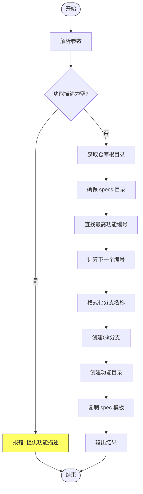

# /specify 命令详解

<cite>
**本文档中引用的文件**  
- [specify.md](file://templates/commands/specify.md)
- [spec-template.md](file://templates/spec-template.md)
- [create-new-feature.sh](file://scripts/bash/create-new-feature.sh)
- [create-new-feature.ps1](file://scripts/powershell/create-new-feature.ps1)
- [README.md](file://README.md)
- [spec-driven.md](file://spec-driven.md)
</cite>

## 目录
1. [介绍](#介绍)
2. [核心作用与执行流程](#核心作用与执行流程)
3. [指令设计与脚本调用](#指令设计与脚本调用)
4. [规范文档的关键组成部分](#规范文档的关键组成部分)
5. [从需求到规范的完整执行示例](#从需求到规范的完整执行示例)
6. [常见歧义场景与迭代优化](#常见歧义场景与迭代优化)
7. [结论](#结论)

## 介绍
`/specify` 命令是 Spec-Driven Development（SDD）流程中的关键入口点，负责将自然语言描述的功能需求转化为结构化的功能规范文档。该命令通过自动化分支创建、目录初始化和模板填充，确保开发流程从清晰、一致的规范开始。本文将深入解析 `/specify` 命令的核心机制，包括其如何调用脚本、填充模板，以及生成的规范文档如何影响后续开发阶段。

## 核心作用与执行流程
`/specify` 命令的核心作用是作为功能开发的起点，将模糊的用户需求转化为精确、可执行的规范文档。其执行流程如下：

1. **解析用户输入**：命令后的文本被视为功能描述，作为生成规范的基础。
2. **运行脚本**：调用 `create-new-feature.sh` 或 `create-new-feature.ps1` 脚本，该脚本负责创建新的功能分支和相关目录结构。
3. **初始化规范文件**：脚本复制 `spec-template.md` 模板到新创建的功能目录中，并初始化 `spec.md` 文件。
4. **生成规范**：AI 代理根据功能描述填充模板中的占位符，生成完整的功能规范文档。
5. **报告完成状态**：输出分支名称、规范文件路径及下一步操作建议。

此流程确保了每个新功能都从一个标准化的起点开始，减少了人为错误和不一致性。

**Section sources**
- [specify.md](file://templates/commands/specify.md#L1-L24)
- [create-new-feature.sh](file://scripts/bash/create-new-feature.sh#L1-L97)
- [create-new-feature.ps1](file://scripts/powershell/create-new-feature.ps1#L1-L43)

## 指令设计与脚本调用
`/specify` 命令的设计旨在简化功能开发的初始步骤。其指令结构如下：

```markdown
---
description: Create or update the feature specification from a natural language feature description.
scripts:
  sh: scripts/bash/create-new-feature.sh --json "{ARGS}"
  ps: scripts/powershell/create-new-feature.ps1 -Json "{ARGS}"
---
```

当用户输入 `/specify` 后跟功能描述时，系统会自动调用相应的脚本（Bash 或 PowerShell），并将功能描述作为参数传递。脚本的主要职责包括：

- **确定仓库根目录**：通过查找 `.git` 或 `.specify` 目录来确定项目根路径。
- **创建功能分支**：根据功能描述生成语义化的分支名称（如 `001-photo-albums`），并创建和切换到该分支。
- **初始化目录结构**：在 `specs/` 目录下创建对应的功能子目录。
- **复制模板文件**：将 `spec-template.md` 模板复制到新创建的功能目录中，生成 `spec.md` 文件。
- **设置环境变量**：设置 `SPECIFY_FEATURE` 环境变量，以便后续命令识别当前功能。

脚本的输出包含 `BRANCH_NAME`、`SPEC_FILE` 和 `FEATURE_NUM`，这些信息被 AI 代理用于后续的规范生成。



**Diagram sources**
- [create-new-feature.sh](file://scripts/bash/create-new-feature.sh#L1-L58)

**Section sources**
- [specify.md](file://templates/commands/specify.md#L1-L24)
- [create-new-feature.sh](file://scripts/bash/create-new-feature.sh#L1-L97)

## 规范文档的关键组成部分
生成的功能规范文档遵循 `spec-template.md` 的结构，确保了内容的完整性和一致性。关键组成部分包括：

### 用户场景与测试（必需）
- **主要用户故事**：描述主要用户旅程，用平实的语言说明用户如何与系统交互。
- **验收场景**：使用 Gherkin 语法（Given-When-Then）定义具体的测试场景，确保需求可验证。
- **边界情况**：列出系统在极端条件下的行为，如网络中断、数据溢出等。

### 功能需求（必需）
- **功能需求列表**：以 `FR-001`、`FR-002` 等编号格式列出所有功能需求，每个需求必须是可测试且无歧义的。
- **未明确需求标记**：对于不明确的需求，使用 `[NEEDS CLARIFICATION: specific question]` 占位符，提示需要进一步澄清。

### 关键实体（可选）
- **实体定义**：如果功能涉及数据处理，需定义关键实体及其属性和关系，避免技术实现细节。

### 审查与验收清单
- **内容质量检查**：确保没有实现细节，关注用户价值，面向非技术利益相关者编写。
- **需求完整性检查**：确保所有必需部分已完成，需求可测试且无歧义，成功标准可衡量。

这些组成部分共同确保了规范文档的高质量，为后续的技术设计和实现奠定了坚实基础。

**Section sources**
- [spec-template.md](file://templates/spec-template.md#L0-L116)

## 从需求到规范的完整执行示例
假设用户输入以下命令：
```
/specify Build an application that can help me organize my photos in separate photo albums. Albums are grouped by date and can be re-organized by dragging and dropping on the main page. Albums are never in other nested albums. Within each album, photos are previewed in a tile-like interface.
```

执行流程如下：

1. **调用脚本**：系统调用 `create-new-feature.sh` 脚本，传入功能描述。
2. **创建分支**：脚本生成分支名称 `001-photo-albums`，并创建相应分支。
3. **初始化目录**：在 `specs/001-photo-albums/` 目录下创建 `spec.md` 文件。
4. **填充模板**：AI 代理根据功能描述填充 `spec-template.md` 模板，生成如下内容：
   ```markdown
   # Feature Specification: Photo Album Organizer

   **Feature Branch**: `001-photo-albums`  
   **Created**: 2023-10-01  
   **Status**: Draft  
   **Input**: User description: "Build an application that can help me organize my photos in separate photo albums..."

   ## User Scenarios & Testing *(mandatory)*

   ### Primary User Story
   As a user, I want to organize my photos into albums grouped by date so that I can easily find and manage them.

   ### Acceptance Scenarios
   1. **Given** I have uploaded photos, **When** I view the main page, **Then** albums are grouped by date.
   2. **Given** I am on the main page, **When** I drag and drop an album, **Then** the album's position is updated.

   ### Edge Cases
   - What happens when I try to nest an album inside another album?
   - How does the system handle duplicate photo uploads?

   ## Requirements *(mandatory)*

   ### Functional Requirements
   - **FR-001**: System MUST allow users to create photo albums.
   - **FR-002**: System MUST group albums by date.
   - **FR-003**: Users MUST be able to re-organize albums by dragging and dropping.
   - **FR-004**: System MUST prevent nesting albums within other albums.
   - **FR-005**: System MUST display photos in a tile-like interface within each album.
   ```
5. **报告完成**：输出分支名称 `001-photo-albums` 和规范文件路径 `specs/001-photo-albums/spec.md`，建议下一步运行 `/clarify` 命令。

## 常见歧义场景与迭代优化
在实际开发中，用户描述往往存在歧义，需要通过 `/clarify` 命令进行迭代优化。常见歧义场景包括：

- **用户类型和权限**：未明确说明不同用户角色的权限，如管理员和普通用户的区别。
- **数据保留/删除策略**：未指定数据的保留期限或删除条件。
- **性能目标和规模**：未定义系统的性能要求，如响应时间、并发用户数等。
- **错误处理行为**：未说明系统在遇到错误时的行为，如网络中断、数据冲突等。
- **集成需求**：未明确与其他系统的集成方式，如第三方认证、数据同步等。
- **安全/合规需求**：未提及安全措施或合规要求，如数据加密、隐私保护等。

通过 `/clarify` 命令，AI 代理会提出最多 5 个有针对性的澄清问题，帮助用户明确这些模糊点。例如：
- **问题**：用户认证方式是什么？选项：A) 邮箱/密码 B) SSO C) OAuth
- **问题**：数据保留期限是多少？（回答不超过 5 个词）

每次澄清后，答案会被记录在规范文档的 `## Clarifications` 部分，并更新相关需求，确保规范的完整性和准确性。

**Section sources**
- [clarify.md](file://templates/commands/clarify.md#L1-L161)
- [spec-template.md](file://templates/spec-template.md#L0-L116)

## 结论
`/specify` 命令作为 Spec-Driven Development 流程的入口，通过自动化分支创建、目录初始化和模板填充，将自然语言需求转化为结构化的功能规范文档。其设计确保了开发流程的标准化和一致性，减少了人为错误。生成的规范文档包含用户场景、功能需求、关键实体和审查清单等关键组成部分，为后续的技术设计和实现提供了坚实基础。通过 `/clarify` 命令的迭代优化，可以有效解决需求中的歧义，确保规范的完整性和准确性。这一流程不仅提高了开发效率，还增强了团队协作和项目可维护性。