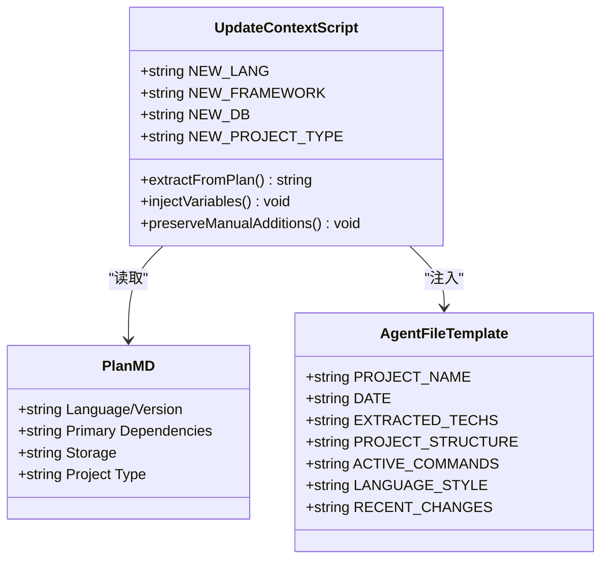
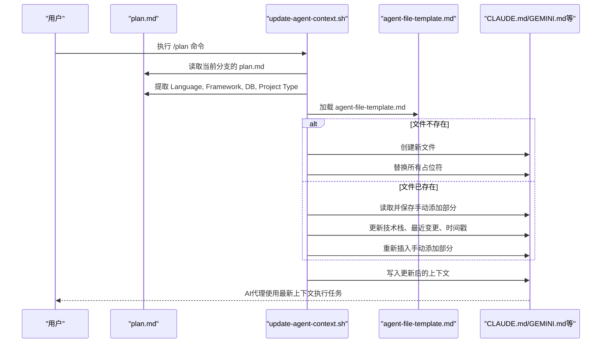
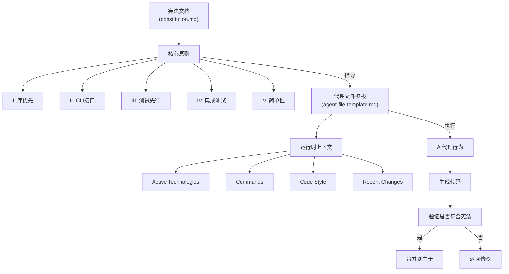

# 代理文件模板

<cite>
**本文档中引用的文件**  
- [agent-file-template.md](file://templates/agent-file-template.md)
- [update-agent-context.sh](file://scripts/bash/update-agent-context.sh)
- [update-agent-context.ps1](file://scripts/powershell/update-agent-context.ps1)
- [constitution.md](file://memory/constitution.md)
- [plan-template.md](file://templates/plan-template.md)
- [spec-template.md](file://templates/spec-template.md)
- [tasks-template.md](file://templates/tasks-template.md)
- [README.md](file://README.md)
- [spec-driven.md](file://spec-driven.md)
</cite>

## 目录
1. [引言](#引言)
2. [代理文件模板的核心作用](#代理文件模板的核心作用)
3. [模板结构与变量机制](#模板结构与变量机制)
4. [动态上下文更新流程](#动态上下文更新流程)
5. [与宪法文档的协同治理](#与宪法文档的协同治理)
6. [实际部署配置范例](#实际部署配置范例)
7. [调试技巧与最佳实践](#调试技巧与最佳实践)
8. [结论](#结论)

## 引言

在Spec-Driven Development（SDD）方法论中，`agent-file-template.md`作为AI代理运行时上下文框架的核心模板，承担着定义代理行为边界、技术栈约束和操作规范的关键职责。该模板通过与`update-agent-context.sh`脚本协同工作，确保AI代理在执行`/specify`、`/plan`、`/tasks`等命令时，其生成的代码和决策始终符合项目宪法（constitution.md）所规定的架构原则。本文将深入剖析该模板的设计原理、变量绑定机制及其在自动化开发流程中的治理作用。

**Section sources**
- [agent-file-template.md](file://templates/agent-file-template.md)
- [spec-driven.md](file://spec-driven.md#L1-L50)

## 代理文件模板的核心作用

`agent-file-template.md`是AI代理（如Claude Code、GitHub Copilot等）在执行开发任务时的运行时上下文文件。它并非静态文档，而是动态生成的指导性框架，其核心作用包括：

1. **角色定位**：明确AI代理在当前开发任务中的身份（如后端开发者、前端工程师），并为其提供项目专属的上下文信息。
2. **能力边界**：通过定义“Active Technologies”和“Commands”，限制AI代理可使用的语言、框架和工具，防止其引入未经批准的技术栈。
3. **操作指令**：提供标准化的构建、测试和验证命令，确保所有生成代码遵循统一的执行流程。
4. **安全约束**：通过“Manual Additions”区域保留人工干预能力，防止自动化流程覆盖关键安全策略。

该模板确保AI代理在“绿场”（Greenfield）开发、功能迭代或系统重构等不同阶段，其行为始终保持可控、可预测且符合组织工程规范。

**Section sources**
- [agent-file-template.md](file://templates/agent-file-template.md#L1-L23)
- [spec-driven.md](file://spec-driven.md#L270-L300)

## 模板结构与变量机制

`agent-file-template.md`采用占位符机制实现动态内容注入，其结构包含以下关键部分：

### 模板变量定义
- `[PROJECT NAME]`：自动替换为当前仓库名称，标识代理服务的具体项目。
- `[DATE]`：注入文件生成或更新的日期，确保上下文时效性。
- `[EXTRACTED FROM ALL PLAN.MD FILES]`：填充从`plan.md`中提取的语言、框架及分支信息。
- `[ACTUAL STRUCTURE FROM PLANS]`：根据项目类型（Web、Mobile、Single）动态生成目录结构。
- `[ONLY COMMANDS FOR ACTIVE TECHNOLOGIES]`：基于语言类型（Python、Rust、JavaScript等）注入对应的测试与检查命令。
- `[LANGUAGE-SPECIFIC, ONLY FOR LANGUAGES IN USE]`：添加语言特定的编码规范提示。
- `[LAST 3 FEATURES AND WHAT THEY ADDED]`：记录最近三个功能的变更摘要，提供历史上下文。

这些变量并非在模板中直接定义，而是由`update-agent-context.sh`脚本从`plan.md`文件中解析并注入，实现了“规范驱动”的上下文生成。



**Diagram sources**
- [agent-file-template.md](file://templates/agent-file-template.md#L1-L23)
- [update-agent-context.sh](file://scripts/bash/update-agent-context.sh#L1-L67)

**Section sources**
- [agent-file-template.md](file://templates/agent-file-template.md#L1-L23)
- [update-agent-context.sh](file://scripts/bash/update-agent-context.sh#L1-L67)

## 动态上下文更新流程

`update-agent-context.sh`（及PowerShell版本）脚本是实现上下文动态更新的核心工具。其执行流程如下：

1. **环境初始化**：获取仓库根目录、当前分支及`plan.md`路径。
2. **数据提取**：从`plan.md`中解析`Language/Version`、`Primary Dependencies`、`Storage`、`Project Type`等关键字段。
3. **文件生成策略**：
   - 若目标代理文件（如`CLAUDE.md`）不存在，则复制模板并替换所有占位符。
   - 若文件已存在，则保留`<!-- MANUAL ADDITIONS START -->`与`<!-- MANUAL ADDITIONS END -->`之间的手动内容，仅更新动态部分。
4. **内容更新**：
   - **技术栈**：将新语言、框架、数据库信息追加至“Active Technologies”列表。
   - **最近变更**：将当前功能变更插入“Recent Changes”列表头部，并保留最近三条记录。
   - **最后更新时间**：刷新时间戳。
5. **多代理支持**：脚本支持为Claude、Gemini、Copilot、Cursor、Qwen及opencode等不同AI代理生成专属上下文文件。

此流程确保了每当执行`/plan`命令时，AI代理的上下文都能即时反映最新的技术决策，同时避免覆盖人工维护的重要策略。



**Diagram sources**
- [update-agent-context.sh](file://scripts/bash/update-agent-context.sh#L1-L67)
- [update-agent-context.ps1](file://scripts/powershell/update-agent-context.ps1#L1-L105)

**Section sources**
- [update-agent-context.sh](file://scripts/bash/update-agent-context.sh#L1-L67)
- [update-agent-context.ps1](file://scripts/powershell/update-agent-context.ps1#L1-L105)

## 与宪法文档的协同治理

`agent-file-template.md`与`memory/constitution.md`共同构成了SDD方法论的治理双支柱。宪法文档定义了不可协商的架构原则（如“库优先”、“测试先行”），而代理文件模板则将这些原则转化为AI代理可执行的具体指令。

### 协同机制
1. **原则落地**：宪法中的“测试先行”原则通过模板中的`COMMANDS`变量（如`pytest && ruff check .`）转化为具体的测试执行命令。
2. **合规检查**：`/plan`命令在生成`plan.md`时，会引用宪法文档进行合规性检查（见`plan-template.md`中的“Constitution Check”部分），确保设计不违反核心原则。
3. **反馈闭环**：当AI代理在执行`/tasks`时，其行为受`agent-file-template.md`约束，而生成的代码又需通过宪法规定的质量门禁（如集成测试、性能标准）。

这种设计实现了“宪法为纲，模板为目”的治理模式，既保证了架构的长期一致性，又提供了足够的灵活性以适应具体项目需求。



**Diagram sources**
- [constitution.md](file://memory/constitution.md#L1-L50)
- [agent-file-template.md](file://templates/agent-file-template.md#L1-L23)
- [plan-template.md](file://templates/plan-template.md#L1-L218)

**Section sources**
- [constitution.md](file://memory/constitution.md#L1-L50)
- [plan-template.md](file://templates/plan-template.md#L1-L218)

## 实际部署配置范例

以下为一个典型的部署配置流程：

1. **初始化项目**：
   ```bash
   specify init my-project --ai claude
   ```
   此命令将创建项目骨架，包括`templates/`、`scripts/`和`memory/`目录。

2. **创建功能规格**：
   ```bash
   /specify 构建一个使用Python和FastAPI的用户管理API
   ```
   生成`specs/001-user-api/spec.md`。

3. **生成实施计划**：
   ```bash
   /plan 语言：Python 3.11，框架：FastAPI，数据库：PostgreSQL
   ```
   此命令触发`update-agent-context.sh`，生成`CLAUDE.md`，内容如下：
   ```markdown
   # my-project Development Guidelines
   Auto-generated from all feature plans. Last updated: 2023-10-01

   ## Active Technologies
   - Python 3.11 + FastAPI (001-user-api)
   - PostgreSQL (001-user-api)

   ## Project Structure
   ```
   backend/
   frontend/
   tests/
   ```

   ## Commands
   cd src && pytest && ruff check .

   ## Code Style
   Python: Follow standard conventions

   ## Recent Changes
   - 001-user-api: Added Python 3.11 + FastAPI
   ```
   <!-- MANUAL ADDITIONS START -->
   <!-- MANUAL ADDITIONS END -->
   ```

4. **执行任务**：AI代理根据`CLAUDE.md`中的上下文执行`/tasks`命令，生成符合规范的代码。

**Section sources**
- [README.md](file://README.md#L265-L443)
- [spec-driven.md](file://spec-driven.md#L300-L403)

## 调试技巧与最佳实践

### 调试技巧
- **检查上下文更新**：执行`/plan`后，立即检查`CLAUDE.md`等文件是否正确更新，特别是技术栈和命令部分。
- **验证手动添加**：确保`<!-- MANUAL ADDITIONS -->`区域的内容在脚本更新后未被清除。
- **日志分析**：查看`update-agent-context.sh`的输出，确认无“ERROR”信息，且“Summary of changes”符合预期。

### 最佳实践
- **明确宪法原则**：在`constitution.md`中清晰定义项目的核心原则，避免模糊表述。
- **模板定制化**：根据团队规范，在`agent-file-template.md`中预置通用的代码风格和安全要求。
- **版本控制**：将`agent-file-template.md`和`update-agent-context.sh`纳入版本控制，确保所有成员使用一致的模板。
- **定期审查**：定期审查生成的代理上下文文件，确保其准确反映了项目现状。

**Section sources**
- [update-agent-context.sh](file://scripts/bash/update-agent-context.sh#L1-L67)
- [README.md](file://README.md#L400-L443)

## 结论

`agent-file-template.md`作为SDD方法论中AI代理的运行时上下文框架，通过与`update-agent-context.sh`脚本的紧密结合，实现了对AI行为的精细化治理。它不仅定义了代理的角色、能力与约束，更通过动态更新机制，确保了开发过程的持续合规性。结合宪法文档，该模板构建了一个“原则驱动、规范执行”的自动化开发闭环，为高质量软件的快速交付提供了坚实的基础。在实际应用中，应充分利用其变量机制和手动添加功能，平衡自动化效率与人工控制，充分发挥AI代理的潜力。