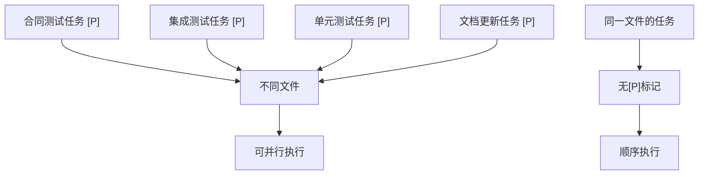
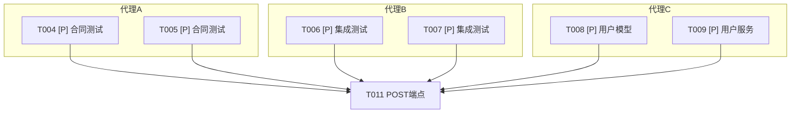
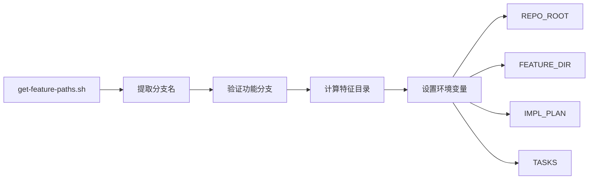

# 任务模板

<cite>
**本文档中引用的文件**
- [tasks-template.md](file://templates/tasks-template.md)
- [get-feature-paths.sh](file://scripts/bash/get-feature-paths.sh)
- [common.sh](file://scripts/bash/common.sh)
- [plan-template.md](file://templates/plan-template.md)
- [commands/tasks.md](file://templates/commands/tasks.md)
</cite>

## 目录
1. [引言](#引言)
2. [任务分解逻辑](#任务分解逻辑)
3. [并行化支持机制](#并行化支持机制)
4. [自动化任务生成流程](#自动化任务生成流程)
5. [多代理协作场景](#多代理协作场景)
6. [文件系统对齐机制](#文件系统对齐机制)
7. [任务模板执行流程](#任务模板执行流程)
8. [验证与完整性检查](#验证与完整性检查)

## 引言
任务模板系统是一种将技术计划系统性地分解为原子化、可分配开发任务的框架。该系统通过结构化的模板和自动化脚本，实现了从设计文档到可执行任务的无缝转换。核心目标是提高开发效率，确保任务的可执行性和上下文一致性，同时支持多代理协作环境下的并行开发。

## 任务分解逻辑
任务模板系统通过分析设计文档（如plan.md、data-model.md、contracts/等）来生成具体的开发任务。任务分解遵循严格的语义规则和填充策略：

- **{{tasks}}占位符**：代表从设计文档中提取的具体任务集合。每个合同文件生成一个合同测试任务，每个实体生成一个模型创建任务。
- **任务分类**：任务按类别生成，包括设置、测试、核心实现、集成和优化等阶段。
- **任务编号**：所有任务按顺序编号（T001, T002...），确保执行顺序的明确性。

**Section sources**
- [tasks-template.md](file://templates/tasks-template.md#L1-L42)
- [plan-template.md](file://templates/plan-template.md#L130-L171)

## 并行化支持机制
系统通过[P]标记来标识可以并行执行的任务，实现高效的并行开发：

- **[P]标记规则**：当任务涉及不同文件且无依赖关系时，标记为[P]，表示可并行执行。
- **并行组示例**：系统会生成并行执行示例，展示可以同时运行的任务组。
- **依赖管理**：明确的任务依赖关系确保了并行执行的安全性，避免了资源冲突。



**Diagram sources**
- [tasks-template.md](file://templates/tasks-template.md#L43-L47)
- [commands/tasks.md](file://templates/commands/tasks.md#L4-L6)

## 自动化任务生成流程
自动化任务生成是一个多步骤的流程，确保任务的完整性和正确性：

1. **加载plan.md**：从功能目录加载实施计划，提取技术栈、库和结构信息。
2. **加载可选设计文档**：包括data-model.md、contracts/和research.md等。
3. **按类别生成任务**：分为设置、测试、核心、集成和优化等类别。
4. **应用任务规则**：根据文件差异和依赖关系标记并行性。
5. **生成依赖图**：可视化任务间的依赖关系。
6. **验证任务完整性**：确保所有合同都有测试，所有实体都有模型任务。

**Section sources**
- [tasks-template.md](file://templates/tasks-template.md#L1-L42)
- [commands/tasks.md](file://templates/commands/tasks.md#L1-L56)

## 多代理协作场景
在多代理协作环境中，任务模板系统通过以下策略管理任务标记和依赖：

- **任务标记**：使用[P]标记明确标识可并行任务，便于代理分配。
- **依赖管理**：通过依赖图确保任务执行顺序的正确性，避免竞态条件。
- **上下文一致性**：确保所有代理基于相同的上下文执行任务，维护系统一致性。



**Diagram sources**
- [tasks-template.md](file://templates/tasks-template.md#L48-L52)
- [commands/tasks.md](file://templates/commands/tasks.md#L4-L6)

## 文件系统对齐机制
任务模板通过get-feature-paths.sh等脚本与文件系统结构对齐，确保生成任务的可执行性：

- **路径约定**：根据项目类型（单项目、Web应用、移动应用）确定路径结构。
- **环境变量**：脚本设置REPO_ROOT、FEATURE_DIR、IMPL_PLAN等环境变量，确保路径正确性。
- **动态调整**：根据plan.md中的结构决策动态调整路径。



**Diagram sources**
- [get-feature-paths.sh](file://scripts/bash/get-feature-paths.sh#L1-L8)
- [common.sh](file://scripts/bash/common.sh#L1-L38)

## 任务模板执行流程
任务模板的执行流程是一个结构化的主流程，确保任务生成的完整性和正确性：

```
1. 从功能目录加载plan.md
   → 如果未找到：错误 "未找到实施计划"
   → 提取：技术栈、库、结构
2. 加载可选设计文档：
   → data-model.md：提取实体 → 模型任务
   → contracts/：每个文件 → 合同测试任务
   → research.md：提取决策 → 设置任务
3. 按类别生成任务：
   → 设置：项目初始化、依赖、linting
   → 测试：合同测试、集成测试
   → 核心：模型、服务、CLI命令
   → 集成：数据库、中间件、日志
   → 优化：单元测试、性能、文档
4. 应用任务规则：
   → 不同文件 = 标记[P]用于并行
   → 相同文件 = 顺序（无[P]）
   → 测试在实现之前（TDD）
5. 按顺序编号任务（T001, T002...）
6. 生成依赖图
7. 创建并行执行示例
8. 验证任务完整性：
   → 所有合同都有测试？
   → 所有实体都有模型？
   → 所有端点都已实现？
9. 返回：成功（任务已准备好执行）
```

**Section sources**
- [tasks-template.md](file://templates/tasks-template.md#L1-L42)

## 验证与完整性检查
系统在返回任务列表前进行严格的验证和完整性检查：

- **验证清单**：
  - 所有合同都有相应的测试
  - 所有实体都有模型任务
  - 所有测试都在实现之前
  - 并行任务真正独立
  - 每个任务指定确切的文件路径
  - 没有任务修改另一个[P]任务的同一文件

- **门控检查**：在main()函数中执行的门控检查确保任务列表的完整性和正确性。

**Section sources**
- [tasks-template.md](file://templates/tasks-template.md#L118-L126)
- [commands/tasks.md](file://templates/commands/tasks.md#L58-L61)