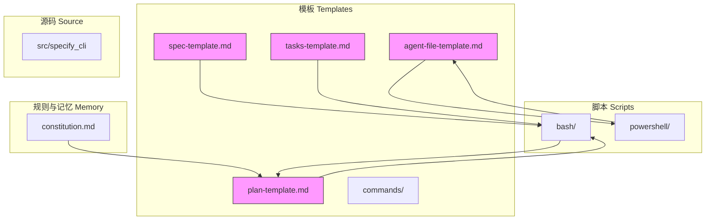
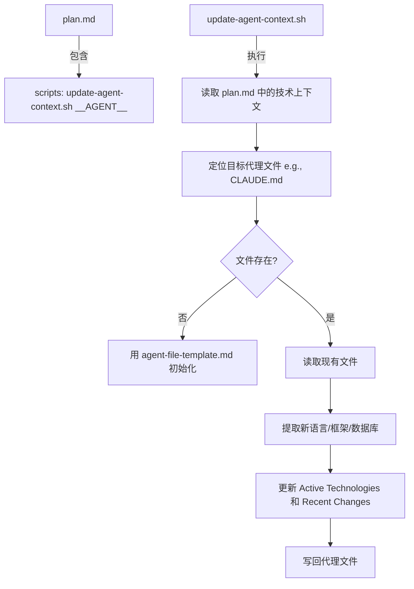

# 内容模板

<cite>
**本文档中引用的文件**  
- [spec-template.md](file://templates/spec-template.md)
- [plan-template.md](file://templates/plan-template.md)
- [tasks-template.md](file://templates/tasks-template.md)
- [agent-file-template.md](file://templates/agent-file-template.md)
- [setup-plan.sh](file://scripts/bash/setup-plan.sh)
- [update-agent-context.sh](file://scripts/bash/update-agent-context.sh)
- [constitution.md](file://memory/constitution.md)
</cite>

## 目录
1. [引言](#引言)
2. [项目结构](#项目结构)
3. [核心模板分析](#核心模板分析)
4. [技术计划与任务生成机制](#技术计划与任务生成机制)
5. [AI代理上下文框架](#ai代理上下文框架)
6. [自动化流程与脚本集成](#自动化流程与脚本集成)
7. [模板语法参考](#模板语法参考)
8. [团队协作与质量保障](#团队协作与质量保障)
9. [结论](#结论)

## 引言
本文档全面解析 `spec-kit` 项目中的核心内容模板系统，包括功能规范、技术计划、任务列表和AI代理上下文的标准化生成机制。通过分析 `spec-template.md`、`plan-template.md`、`tasks-template.md` 和 `agent-file-template.md` 四个核心模板文件，揭示其在软件开发流程中的作用、设计目标及自动化集成方式。重点说明这些模板如何通过结构化占位符和执行流程，确保开发过程的一致性、可追溯性和高质量输出。

## 项目结构
`spec-kit` 是一个用于驱动规范（specification-driven）开发的工具集，其目录结构清晰地划分了模板、脚本、内存规则和源码组件。模板文件集中存放在 `templates/` 目录下，分为命令模板和主模板两类；脚本存放在 `scripts/` 目录下，提供跨平台（Bash/PowerShell）支持；项目核心原则存储在 `memory/` 目录的宪法文件中。



**图示来源**
- [spec-template.md](file://templates/spec-template.md)
- [plan-template.md](file://templates/plan-template.md)
- [tasks-template.md](file://templates/tasks-template.md)
- [agent-file-template.md](file://templates/agent-file-template.md)
- [setup-plan.sh](file://scripts/bash/setup-plan.sh)

**本节来源**
- [templates](file://templates)
- [scripts](file://scripts)
- [memory](file://memory)

## 核心模板分析

### 功能规范模板 (spec-template.md)
`spec-template.md` 是功能需求定义的标准化模板，旨在引导用户或AI从模糊的用户描述中提取清晰、可测试的功能需求。其设计目标是**聚焦用户价值而非技术实现**，确保输出内容面向业务利益相关者。

该模板通过预定义的执行流程（Execution Flow）强制执行规范质量：
- 解析用户输入并提取关键概念（参与者、行为、数据）
- 明确标记所有模糊点（使用 `[NEEDS CLARIFICATION: ...]` 占位符）
- 基于用户场景生成可验证的验收条件
- 列出具体、可测试的功能需求（FR-XXX）
- 包含自动化的审查清单，防止技术细节渗入

此模板确保了需求文档的完整性、无歧义性和可测试性，为后续的技术设计奠定了坚实基础。

**本节来源**
- [spec-template.md](file://templates/spec-template.md#L1-L116)

### 技术计划模板 (plan-template.md)
`plan-template.md` 是连接功能需求与具体实现的桥梁，负责生成技术上下文、项目结构和设计文档。其设计目标是**将高层次需求转化为可执行的技术蓝图**。

该模板的核心机制包括：
- **技术上下文填充**：从需求中推断语言、依赖、存储、平台等关键信息
- **宪法检查（Constitution Check）**：强制设计决策符合项目核心原则（如TDD、库优先等）
- **分阶段设计流程**：
  - **第0阶段**：研究未知项，解决所有 `NEEDS CLARIFICATION`
  - **第1阶段**：生成数据模型、API契约、契约测试和快速入门指南
  - **第2阶段**：描述任务生成策略（由 `/tasks` 命令实际执行）

模板通过 `__AGENT__` 占位符与 `update-agent-context.sh` 脚本集成，实现AI代理上下文的动态更新。

**本节来源**
- [plan-template.md](file://templates/plan-template.md#L1-L217)

### 任务列表模板 (tasks-template.md)
`tasks-template.md` 的设计目标是**将设计文档转化为有序、可并行执行的原子化任务**，遵循测试驱动开发（TDD）原则。

该模板的关键特性：
- **任务生成规则**：从 `data-model.md` 生成模型任务，从 `contracts/` 生成契约测试任务，从用户故事生成集成测试任务
- **严格的执行顺序**：测试任务（Phase 3.2）必须在实现任务（Phase 3.3）之前完成
- **并行化支持**：使用 `[P]` 标记独立任务，允许并行执行
- **依赖关系管理**：明确列出任务间的阻塞关系
- **自动化验证**：内置检查清单，确保所有契约都有对应测试，所有实体都有模型任务

此模板确保了开发过程的纪律性，防止跳过测试或引入模糊任务。

**本节来源**
- [tasks-template.md](file://templates/tasks-template.md#L1-L126)

## 技术计划与任务生成机制

### 分阶段开发流程
`spec-kit` 定义了一个清晰的四阶段开发流程，由不同的命令和模板驱动：

```mermaid
graph LR
A[功能需求 spec.md] --> B[/plan 命令]
B --> C[技术计划 plan.md]
C --> D[研究 research.md]
C --> E[数据模型 data-model.md]
C --> F[API契约 contracts/]
C --> G[快速入门 quickstart.md]
C --> H[AI代理上下文]
C --> I[/tasks 命令]
I --> J[任务列表 tasks.md]
J --> K[Phase 3: 实现]
K --> L[Phase 4: 验证]
```

**图示来源**
- [plan-template.md](file://templates/plan-template.md#L1-L217)
- [tasks-template.md](file://templates/tasks-template.md#L1-L126)

### 模板间的依赖与数据流
各模板之间通过文件系统和预定义路径进行数据传递，形成一个闭环的工作流：
1. `spec-template.md` 输出 `spec.md`，作为 `plan-template.md` 的输入
2. `plan-template.md` 读取 `spec.md` 和 `constitution.md`，生成 `plan.md` 及一系列设计文档
3. `tasks-template.md` 读取 `plan.md`、`data-model.md` 和 `contracts/`，生成 `tasks.md`
4. 实现过程中的决策会通过脚本反馈到 `agent-file-template.md`

这种设计实现了关注点分离，每个模板只负责一个特定的转换步骤。

**本节来源**
- [plan-template.md](file://templates/plan-template.md#L1-L217)
- [tasks-template.md](file://templates/tasks-template.md#L1-L126)

## AI代理上下文框架

### 代理文件模板 (agent-file-template.md)
`agent-file-template.md` 是一个独特的模板，其设计目标是**为AI编程助手（如Claude、Copilot）提供一个动态更新的项目上下文框架**。它解决了AI在大型项目中缺乏全局视野的问题。

该模板的核心组成部分：
- **活跃技术栈**：自动提取当前项目使用的技术（语言、框架、数据库）
- **项目结构**：根据实际计划动态生成目录结构
- **命令**：提供针对当前技术栈的构建和测试命令
- **代码风格**：指定当前语言的编码规范
- **近期变更**：记录最近添加的功能，帮助AI理解项目演进

### 动态更新机制
`agent-file-template.md` 本身不直接使用，而是通过 `update-agent-context.sh` 脚本，结合 `plan-template.md` 中的 `scripts` 元数据进行动态渲染。



**图示来源**
- [agent-file-template.md](file://templates/agent-file-template.md#L1-L22)
- [update-agent-context.sh](file://scripts/bash/update-agent-context.sh)
- [plan-template.md](file://templates/plan-template.md#L2-L3)

**本节来源**
- [agent-file-template.md](file://templates/agent-file-template.md#L1-L22)
- [scripts/bash/update-agent-context.sh](file://scripts/bash/update-agent-context.sh)
- [scripts/powershell/update-agent-context.ps1](file://scripts/powershell/update-agent-context.ps1)

## 自动化流程与脚本集成

### 计划设置脚本 (setup-plan.sh)
`setup-plan.sh` 是启动技术计划流程的入口脚本，其作用是初始化环境并触发模板渲染。

其核心逻辑：
1. 解析命令行参数（如 `--json`）
2. 确定当前功能分支和对应的规格目录
3. 创建必要的目录结构
4. 将 `plan-template.md` 复制到目标位置（`specs/[branch]/plan.md`）
5. 输出关键路径信息（用于后续自动化步骤）

此脚本确保了计划流程的可靠启动，为后续的自动化处理提供了结构化的输出。

**本节来源**
- [scripts/bash/setup-plan.sh](file://scripts/bash/setup-plan.sh#L1-L17)

### 宪法文件 (constitution.md)
`constitution.md` 是项目的“根本大法”，定义了所有开发活动必须遵守的核心原则。`plan-template.md` 在执行过程中会多次检查设计是否符合宪法。

关键原则示例：
- **库优先原则**：每个功能必须首先作为独立库实现
- **CLI接口原则**：每个库必须提供CLI接口
- **测试先行原则**：TDD是强制性的，必须先写测试
- **集成测试原则**：对契约变更等关键区域必须进行集成测试

该文件的存在确保了技术决策的一致性和长期可维护性。

**本节来源**
- [memory/constitution.md](file://memory/constitution.md#L1-L49)

## 模板语法参考

### 变量插值
模板使用 `{{variable}}` 或 `[VARIABLE]` 形式的占位符进行变量插值。
- 示例：`[FEATURE NAME]`、`[DATE]`、`[###-feature-name]`
- 来源：`spec-template.md`、`plan-template.md`

### 条件块
虽然模板本身是纯Markdown，但其执行逻辑隐含了条件判断。
- 示例：`→ If empty: ERROR ...`、`→ If no justification possible: ERROR ...`
- 这些条件在模板的“执行流程”部分定义，指导用户或自动化工具进行决策。

### 重复块
模板通过列表和预定义的模式来实现重复结构。
- 示例：功能需求列表（FR-001, FR-002...）、任务列表（T001, T002...）
- 通过 `For each ...` 的指令（如 `For each unknown in Technical Context:`）指导内容生成。

### 元数据块
模板顶部使用YAML格式的元数据块来定义脚本和描述。
```markdown
---
description: "Implementation plan template for feature development"
scripts:
  sh: scripts/bash/update-agent-context.sh __AGENT__
  ps: scripts/powershell/update-agent-context.ps1 -AgentType __AGENT__
---
```
此块为自动化工具提供了执行上下文。

**本节来源**
- [plan-template.md](file://templates/plan-template.md#L1-L6)
- [spec-template.md](file://templates/spec-template.md)
- [tasks-template.md](file://templates/tasks-template.md)

## 团队协作与质量保障

### 模板一致性带来的优势
1. **降低沟通成本**：所有成员使用相同的文档结构，减少了理解偏差。
2. **提升代码质量**：通过强制执行TDD和宪法检查，从源头预防技术债务。
3. **加速新人上手**：清晰的模板和上下文文件让新成员能快速理解项目。
4. **增强自动化能力**：结构化的输出使得脚本和AI工具能可靠地解析和生成内容。
5. **保证可追溯性**：从需求到任务的完整链条，便于追踪和审计。

### 错误预防机制
整个系统内置了多层错误预防：
- **规范阶段**：标记所有模糊点，防止需求误解。
- **计划阶段**：宪法检查阻止违反核心原则的设计。
- **任务阶段**：验证清单确保所有设计元素都有对应的任务。
- **实现阶段**：AI代理上下文确保所有贡献者遵循相同的规范。

**本节来源**
- [spec-template.md](file://templates/spec-template.md)
- [plan-template.md](file://templates/plan-template.md)
- [tasks-template.md](file://templates/tasks-template.md)

## 结论
`spec-kit` 的内容模板系统是一个精心设计的、闭环的开发工作流引擎。通过 `spec-template.md`、`plan-template.md`、`tasks-template.md` 和 `agent-file-template.md` 四个核心模板，它将模糊的用户需求逐步转化为可执行的代码任务，并通过 `constitution.md` 确保技术决策的一致性。`setup-plan.sh` 和 `update-agent-context.sh` 等脚本则实现了流程的自动化和AI上下文的动态同步。这一整套机制不仅规范了文档输出，更重要的是，它通过结构化和自动化，系统性地提升了软件开发的质量、效率和团队协作水平。