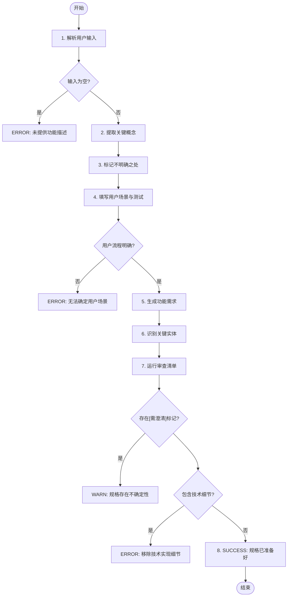
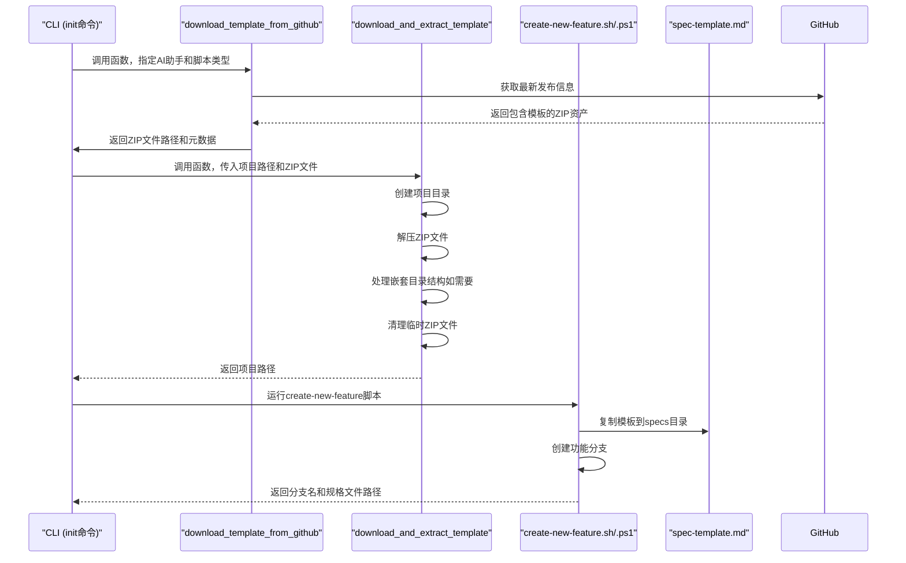

# 规范模板

<cite>
**本文档中引用的文件**  
- [spec-template.md](file://templates/spec-template.md)
- [__init__.py](file://src/specify_cli/__init__.py)
- [create-new-feature.sh](file://scripts/bash/create-new-feature.sh)
- [create-new-feature.ps1](file://scripts/powershell/create-new-feature.ps1)
- [plan-template.md](file://templates/plan-template.md)
- [tasks-template.md](file://templates/tasks-template.md)
- [agent-file-template.md](file://templates/agent-file-template.md)
- [constitution.md](file://memory/constitution.md)
</cite>

## 目录
1. [引言](#引言)
2. [模板设计结构与语义约束](#模板设计结构与语义约束)
3. [占位符替换逻辑与动态填充流程](#占位符替换逻辑与动态填充流程)
4. [模板章节功能与工作流支撑](#模板章节功能与工作流支撑)
5. [CLI初始化流程与跨项目一致性](#cli初始化流程与跨项目一致性)
6. [使用示例与自定义模式](#使用示例与自定义模式)
7. [结论](#结论)

## 引言
`spec-template.md` 是 Spec-Driven Development (SDD) 方法论中的核心组件，作为功能规格说明的标准化模板。该模板通过预定义的 Markdown 结构和语义约束，引导 AI 生成符合规范驱动开发原则的功能描述。它不仅确保了规格说明的完整性与一致性，还通过明确的占位符和执行流程，实现了从用户需求到技术实现的无缝衔接。本文档将深入解析该模板的设计结构、语义约束机制、占位符替换逻辑及其在 CLI 初始化流程中的作用。

## 模板设计结构与语义约束
`spec-template.md` 采用了一种结构化且自包含的设计，通过多个关键部分强制执行 SDD 原则。

### 执行流程与质量门禁
模板的核心是其内嵌的 **执行流程 (main)**，这是一个明确的、步骤化的指令集，指导 AI 如何处理用户输入并生成规格说明。该流程定义了从解析用户描述到最终生成可交付规格的完整路径，并包含严格的错误处理和质量门禁（GATE）。



**图示来源**
- [spec-template.md](file://templates/spec-template.md#L3-L30)

**本节来源**
- [spec-template.md](file://templates/spec-template.md#L1-L116)

### 快速指南与AI生成原则
模板通过 **⚡ 快速指南** 和 **For AI Generation** 部分，为 AI 提供了明确的生成原则。这些原则强调：
- **关注“做什么”和“为什么”**：要求规格说明以用户价值和业务需求为中心。
- **避免“如何做”**：严格禁止包含技术栈、API 或代码结构等实现细节。
- **标记所有歧义**：要求 AI 在遇到任何不确定之处时，必须使用 `[NEEDS CLARIFICATION: ...]` 明确标记，而不是猜测。
- **以测试者思维思考**：确保每个需求都是可测试且无歧义的。

这些原则共同构成了一个强大的语义约束框架，确保生成的规格说明是面向业务利益相关者的，而非开发人员。

## 占位符替换逻辑与动态填充流程
`spec-template.md` 中的占位符（如 `[FEATURE NAME]`、`[DATE]`）和动态填充流程是其灵活性与自动化能力的关键。

### 占位符的语义与作用
模板中的占位符并非简单的文本替换，而是具有明确语义的元数据标记：
- `[FEATURE NAME]`：代表功能的名称，通常由用户描述生成。
- `[###-feature-name]`：代表 Git 分支名称，遵循 `数字-短描述` 的命名约定。
- `[DATE]`：代表创建日期，用于追踪规格说明的时效性。
- `$ARGUMENTS`：代表用户输入的原始描述，是生成规格说明的起点。

### `download_and_extract_template` 函数中的动态填充
占位符的动态填充主要发生在 CLI 工具的初始化流程中，核心函数为 `download_and_extract_template`。



**图示来源**
- [__init__.py](file://src/specify_cli/__init__.py#L420-L518)
- [__init__.py](file://src/specify_cli/__init__.py#L521-L675)
- [create-new-feature.sh](file://scripts/bash/create-new-feature.sh#L41-L57)
- [create-new-feature.ps1](file://scripts/powershell/create-new-feature.ps1#L36-L51)

**本节来源**
- [__init__.py](file://src/specify_cli/__init__.py#L420-L675)
- [create-new-feature.sh](file://scripts/bash/create-new-feature.sh)
- [create-new-feature.ps1](file://scripts/powershell/create-new-feature.ps1)

该流程展示了从用户执行 `specify init` 命令开始，到最终生成一个包含 `spec.md` 文件的项目结构的完整过程。`spec-template.md` 作为静态模板，被 `create-new-feature` 脚本复制到新创建的功能目录中，此时占位符仍保持原样，等待后续的 AI 填充。

## 模板章节功能与工作流支撑
`spec-template.md` 的各个章节设计旨在支撑后续的 `/plan` 和 `/tasks` 工作流。

### 用户场景与测试
此部分是连接用户需求与技术实现的桥梁。
- **主要用户故事**：描述了用户的核心旅程，为 `/plan` 阶段的 `Technical Context` 提供了上下文。
- **验收场景**：采用 `Given-When-Then` 格式，直接转化为 `/tasks` 阶段的集成测试任务。
- **边界情况**：帮助识别潜在风险，确保 `/plan` 阶段的 `Constitution Check` 能够评估设计的健壮性。

### 功能需求与关键实体
- **功能需求 (FR)**：每个以 `FR-XXX` 开头的需求都必须是可测试的。这些需求是 `/plan` 阶段生成 `data-model.md` 和 API 合约的直接输入。
- **关键实体**：定义了功能涉及的数据模型，是生成数据库模式和后端模型代码的基础。

### 审查与验收清单
此清单是 SDD 的质量保证机制。
- **内容质量**：确保规格说明不包含技术细节，保持其业务导向性。
- **需求完整性**：检查所有 `[NEEDS CLARIFICATION]` 标记是否已解决，确保规格说明的完备性。该清单的通过是进入 `/plan` 阶段的先决条件。

## CLI初始化流程与跨项目一致性
`specify init` CLI 命令是整个工作流的起点，它通过一系列步骤确保了跨项目的一致性与可追溯性。

### 初始化流程
1.  **参数解析**：接收项目名称、AI 助手类型（`--ai`）、脚本类型（`--script`）等参数。
2.  **环境检查**：验证 `git` 等必要工具是否已安装。
3.  **模板下载**：根据指定的 AI 助手和脚本类型，从 GitHub 发布中下载对应的模板 ZIP 包。
4.  **项目创建**：解压模板，创建项目目录结构。
5.  **Git 初始化**：在项目目录中初始化 Git 仓库并进行首次提交。

此流程确保了每个新项目都从一个标准化、经过验证的模板开始，消除了手动创建项目时的配置差异。

### 确保一致性与可追溯性
- **标准化模板**：所有项目都使用相同的 `spec-template.md`，保证了规格说明的格式和内容结构一致。
- **自动化分支管理**：`create-new-feature` 脚本自动创建符合命名规范的 Git 分支，便于追踪。
- **版本化模板**：模板通过 GitHub 发布进行版本管理，确保团队成员使用的是同一版本。
- **可追溯的提交历史**：首次提交的记录为项目提供了明确的起点和可追溯性。

## 使用示例与自定义模式
### 基本使用示例
```bash
# 初始化一个新项目
specify init my-photo-app --ai claude --script sh

# 创建新功能
/specify 构建一个应用，帮助我按日期整理照片，并能通过拖拽重新组织相册。
```
执行上述命令后，系统会自动创建 `001-build-an-app` 分支，并在 `specs/001-build-an-app/spec.md` 中生成一份基于 `spec-template.md` 的规格说明草稿。

### 常见自定义模式
- **添加新章节**：如果某个功能需要特定的安全或性能要求，可以在 `Requirements` 部分后添加 `### Security Requirements` 或 `### Performance Requirements` 章节。
- **扩展审查清单**：团队可以根据项目特点，在 `Review & Acceptance Checklist` 中添加新的检查项，例如 `遵守GDPR` 或 `支持无障碍访问`。
- **自定义占位符**：虽然不推荐，但高级用户可以修改 `create-new-feature` 脚本，在复制模板后执行额外的 `sed` 命令来填充自定义占位符。

## 结论
`spec-template.md` 是一个精心设计的工程，它通过结构化的 Markdown 模板、明确的执行流程、严格的语义约束和与 CLI 工具的深度集成，成功地将 SDD 原则转化为可操作的实践。它不仅引导 AI 生成高质量、无歧义的规格说明，还通过标准化的初始化流程确保了跨项目的高度一致性与可追溯性。该模板是连接用户意图与技术实现的关键枢纽，为后续的 `/plan` 和 `/tasks` 工作流奠定了坚实的基础，是实现高效、可靠软件开发的核心工具。