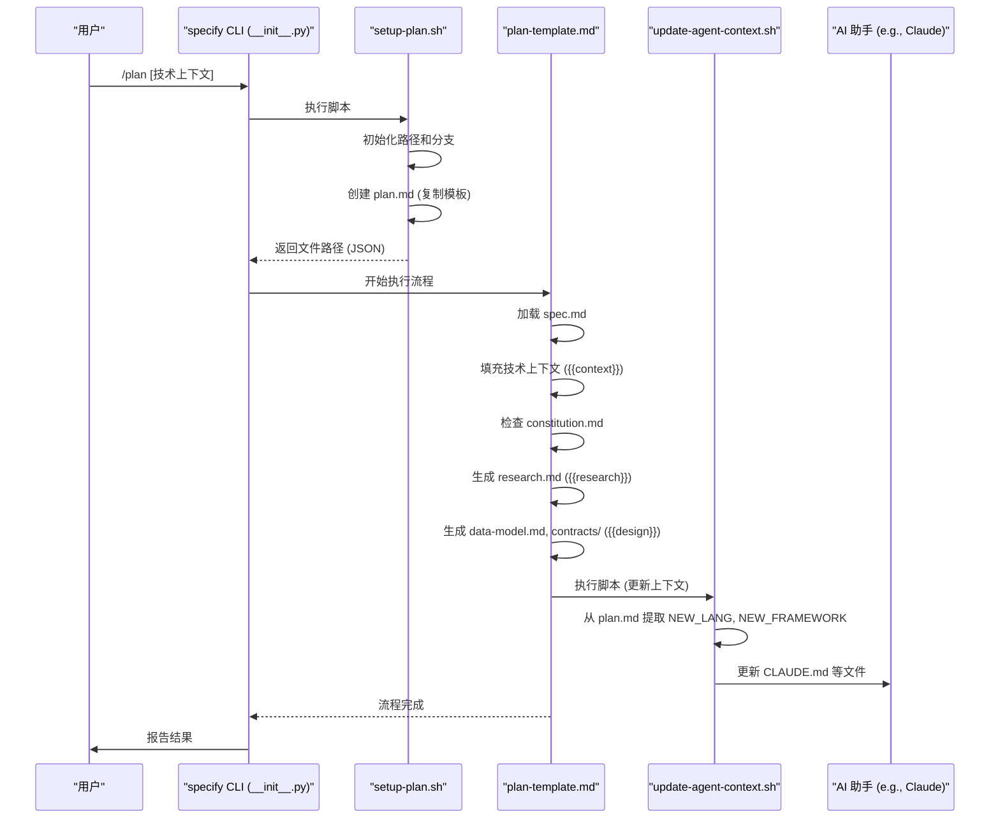
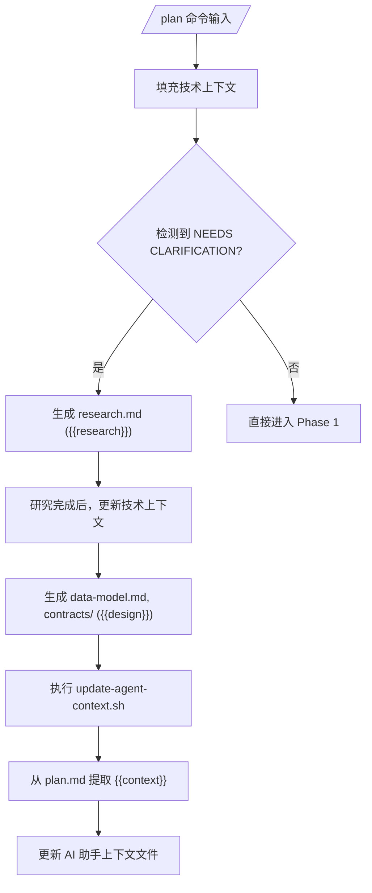
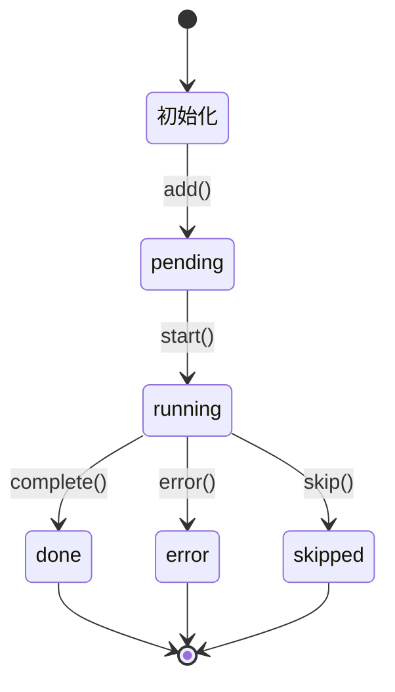

# 计划模板

<cite>
**本文档中引用的文件**  
- [plan-template.md](file://templates/plan-template.md)
- [setup-plan.sh](file://scripts/bash/setup-plan.sh)
- [update-agent-context.sh](file://scripts/bash/update-agent-context.sh)
- [constitution.md](file://memory/constitution.md)
- [__init__.py](file://src/specify_cli/__init__.py)
- [spec-template.md](file://templates/spec-template.md)
- [common.sh](file://scripts/bash/common.sh)
</cite>

## 目录
1. [引言](#引言)
2. [项目结构](#项目结构)
3. [核心组件](#核心组件)
4. [架构概述](#架构概述)
5. [详细组件分析](#详细组件分析)
6. [依赖分析](#依赖分析)
7. [性能考量](#性能考量)
8. [故障排除指南](#故障排除指南)
9. [结论](#结论)

## 引言
本文件全面文档化 `plan-template.md` 的技术设计引导机制，重点阐述该模板如何结构化地组织技术上下文、架构决策、依赖分析和实现路径。文档详细解释了 {{context}}、{{research}}、{{design}} 等关键变量的注入方式及其与 `setup-plan.sh` 脚本的协同逻辑。同时，说明该模板在规范驱动开发（SDD）流程中作为“技术桥梁”的角色，如何将高层规范转化为可执行方案。结合 `StepTracker` 在 CLI 中的进度反馈机制，展示模板渲染过程中的状态追踪与错误处理策略，并提供优化建议和扩展实践。

## 项目结构
本项目采用模块化设计，核心文件分布在特定目录中。`templates/` 目录存放所有文档模板，包括 `plan-template.md` 和 `spec-template.md`。`scripts/bash/` 目录包含核心的 Bash 脚本，如 `setup-plan.sh` 和 `update-agent-context.sh`，用于自动化工作流。`memory/` 目录存储项目宪法 `constitution.md`，作为架构决策的基石。`src/specify_cli/` 目录包含 Python CLI 工具的实现，负责初始化项目和管理开发流程。

```mermaid
graph TB
subgraph "模板 Templates"
PT[plan-template.md]
ST[spec-template.md]
TT[tasks-template.md]
end
subgraph "脚本 Scripts"
SPS[setup-plan.sh]
UAC[update-agent-context.sh]
CS[common.sh]
end
subgraph "内存 Memory"
CM[constitution.md]
end
subgraph "源码 Source"
CLI[__init__.py]
end
PT --> SPS : "由 /plan 命令执行"
SPS --> CS : "包含通用函数"
SPS --> CLI : "由 specify CLI 调用"
UAC --> PT : "从 plan.md 提取上下文"
CM --> PT : "提供宪法检查依据"
CLI --> SPS : "初始化并调用脚本"
```

**Diagram sources**
- [plan-template.md](file://templates/plan-template.md#L1-L218)
- [setup-plan.sh](file://scripts/bash/setup-plan.sh#L1-L18)
- [update-agent-context.sh](file://scripts/bash/update-agent-context.sh#L1-L67)
- [common.sh](file://scripts/bash/common.sh#L1-L38)
- [constitution.md](file://memory/constitution.md#L1-L50)
- [__init__.py](file://src/specify_cli/__init__.py#L1-L799)

**Section sources**
- [plan-template.md](file://templates/plan-template.md#L1-L218)
- [setup-plan.sh](file://scripts/bash/setup-plan.sh#L1-L18)
- [__init__.py](file://src/specify_cli/__init__.py#L1-L799)

## 核心组件
`plan-template.md` 是 SDD 流程的核心，它是一个自包含的执行计划模板，指导从功能规范到技术实现的转化。`setup-plan.sh` 脚本是该模板的启动器，负责初始化环境并创建必要的文件结构。`update-agent-context.sh` 脚本则扮演“上下文同步器”的角色，从生成的 `plan.md` 文件中提取技术栈信息，并动态更新 AI 助手（如 Claude Code）的上下文文件（如 `CLAUDE.md`），确保 AI 始终掌握最新的项目状态。

**Section sources**
- [plan-template.md](file://templates/plan-template.md#L1-L218)
- [setup-plan.sh](file://scripts/bash/setup-plan.sh#L1-L18)
- [update-agent-context.sh](file://scripts/bash/update-agent-context.sh#L1-L67)

## 架构概述
该系统的架构围绕“规范驱动”（Spec-Driven）的理念构建。用户通过 `/specify` 命令输入高层需求，系统自动生成 `spec.md`。随后，`/plan` 命令触发 `setup-plan.sh` 脚本，将 `plan-template.md` 复制到指定位置，并启动一个由模板自身定义的执行流程。该流程首先加载 `spec.md`，然后根据 `constitution.md` 进行宪法检查，接着填充技术上下文，并最终生成 `research.md`、`data-model.md` 等设计文档。`StepTracker` 类在 CLI 中提供实时的、树状的进度反馈，清晰地展示每个步骤的状态。



**Diagram sources**
- [__init__.py](file://src/specify_cli/__init__.py#L1-L799)
- [setup-plan.sh](file://scripts/bash/setup-plan.sh#L1-L18)
- [plan-template.md](file://templates/plan-template.md#L1-L218)
- [update-agent-context.sh](file://scripts/bash/update-agent-context.sh#L1-L67)

## 详细组件分析

### 计划模板分析
`plan-template.md` 不仅是一个静态文档，更是一个定义了严格执行流程的程序。其核心是“执行流程”部分，它规定了从加载规范到生成设计文档的九个步骤。该模板通过 `NEEDS CLARIFICATION` 标记强制处理不确定性，并通过“宪法检查”门禁确保架构一致性。

#### 模板变量注入机制


**Diagram sources**
- [plan-template.md](file://templates/plan-template.md#L1-L218)
- [update-agent-context.sh](file://scripts/bash/update-agent-context.sh#L1-L67)

### CLI 进度追踪分析
`StepTracker` 类是 CLI 用户体验的关键，它提供了一种清晰、动态的方式来展示长时间运行任务的进度。

#### StepTracker 状态流程图


**Diagram sources**
- [__init__.py](file://src/specify_cli/__init__.py#L80-L149)

**Section sources**
- [__init__.py](file://src/specify_cli/__init__.py#L80-L149)

## 依赖分析
该系统各组件之间存在明确的依赖关系。`setup-plan.sh` 脚本依赖于 `common.sh` 中定义的函数来获取仓库根目录、当前分支等信息。`plan-template.md` 的执行流程依赖于 `constitution.md` 文件来执行架构合规性检查。`update-agent-context.sh` 脚本直接依赖于 `plan-template.md` 渲染后生成的 `plan.md` 文件，从中提取技术栈信息。Python CLI 工具 `__init__.py` 是顶层协调者，它依赖于所有 Bash 脚本和模板来完成项目初始化和工作流管理。

```mermaid
graph TD
CLI[__init__.py] --> SPS[setup-plan.sh]
CLI --> CNF[create-new-feature.sh]
SPS --> CS[common.sh]
SPS --> PT[plan-template.md]
PT --> CM[constitution.md]
PT --> UAC[update-agent-context.sh]
UAC --> PT : 读取 plan.md
UAC --> AT[agent-file-template.md]
```

**Diagram sources**
- [__init__.py](file://src/specify_cli/__init__.py#L1-L799)
- [setup-plan.sh](file://scripts/bash/setup-plan.sh#L1-L18)
- [common.sh](file://scripts/bash/common.sh#L1-L38)
- [plan-template.md](file://templates/plan-template.md#L1-L218)
- [constitution.md](file://memory/constitution.md#L1-L50)
- [update-agent-context.sh](file://scripts/bash/update-agent-context.sh#L1-L67)
- [agent-file-template.md](file://templates/agent-file-template.md#L1-L23)

**Section sources**
- [setup-plan.sh](file://scripts/bash/setup-plan.sh#L1-L18)
- [common.sh](file://scripts/bash/common.sh#L1-L38)
- [update-agent-context.sh](file://scripts/bash/update-agent-context.sh#L1-L67)

## 性能考量
由于该系统主要由 Shell 脚本和文本处理构成，其性能开销极低。主要的性能瓶颈在于外部操作，如 Git 命令、网络下载（在 `specify init` 时）以及 AI 助手生成内容的速度。`update-agent-context.sh` 脚本中使用 Python 代码片段进行文本处理，这是一种高效的方式，避免了复杂的 Bash 字符串操作。整体而言，该工作流的设计是轻量级且高效的，适合快速迭代的开发场景。

## 故障排除指南
当使用 `/plan` 命令时，常见的问题包括：
- **错误：未在功能分支上**：确保当前 Git 分支名称以三位数字开头，例如 `001-feature-name`。这是 `check_feature_branch` 函数在 `common.sh` 中强制执行的。
- **错误：未找到 plan.md**：`update-agent-context.sh` 脚本在执行前会检查 `plan.md` 是否存在。如果 `setup-plan.sh` 未能成功创建该文件，则此脚本会失败。
- **宪法检查失败**：如果 `plan-template.md` 中的“宪法检查”部分存在未解决的违规项，流程将停止并报错。需要根据“复杂性追踪”部分的要求，提供合理的解释或简化设计方案。
- **AI 上下文未更新**：检查 `update-agent-context.sh` 脚本是否被正确调用，以及 `plan.md` 中的“技术上下文”部分是否已正确填充，没有 `NEEDS CLARIFICATION` 标记。

**Section sources**
- [setup-plan.sh](file://scripts/bash/setup-plan.sh#L1-L18)
- [common.sh](file://scripts/bash/common.sh#L1-L38)
- [update-agent-context.sh](file://scripts/bash/update-agent-context.sh#L1-L67)
- [plan-template.md](file://templates/plan-template.md#L1-L218)

## 结论
`plan-template.md` 是 Spec-Driven Development 方法论的核心执行引擎。它通过结构化的模板和严格的执行流程，成功地将模糊的高层规范转化为精确的、可执行的技术方案。其与 `setup-plan.sh` 和 `update-agent-context.sh` 脚本的协同工作，实现了工作流的自动化和 AI 上下文的动态同步。`StepTracker` 提供的清晰进度反馈，极大地提升了用户体验。该设计不仅提高了开发效率，更重要的是，通过“宪法检查”等机制，确保了生成代码的架构一致性和质量，为构建高质量软件提供了一套强大而可靠的框架。