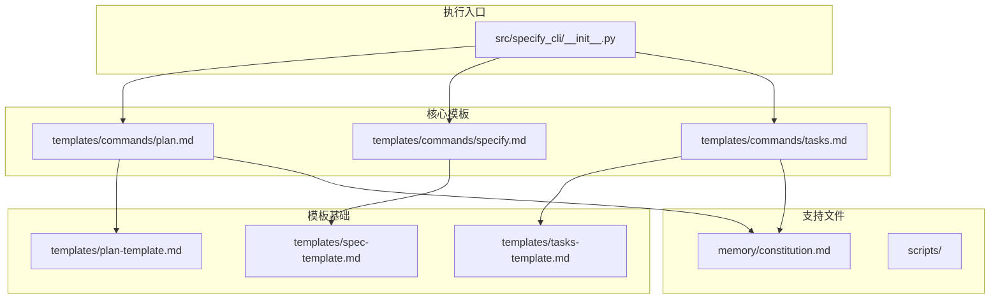
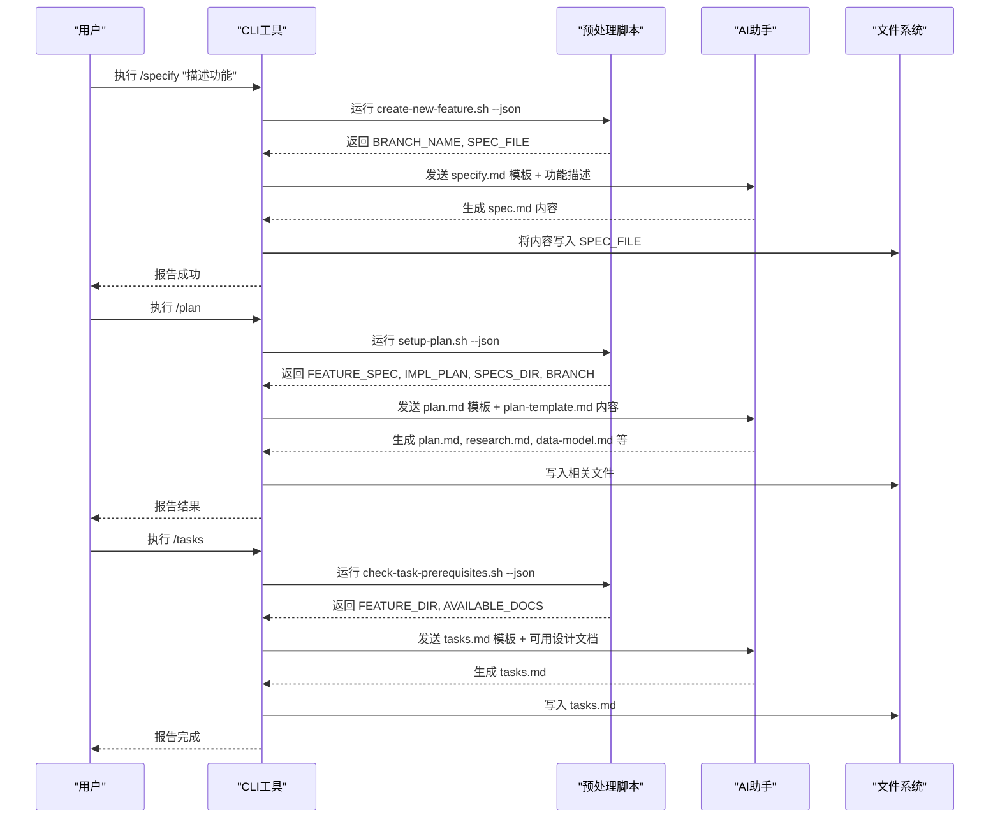
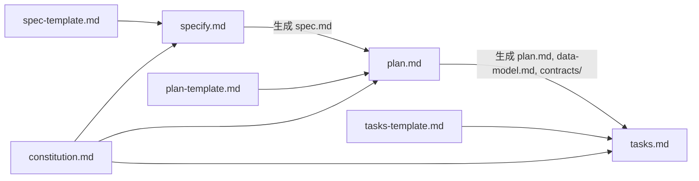

# 命令模板

<cite>
**本文档中引用的文件**  
- [plan.md](file://templates/commands/plan.md)
- [specify.md](file://templates/commands/specify.md)
- [tasks.md](file://templates/commands/tasks.md)
- [spec-template.md](file://templates/spec-template.md)
- [plan-template.md](file://templates/plan-template.md)
- [tasks-template.md](file://templates/tasks-template.md)
- [constitution.md](file://memory/constitution.md)
- [__init__.py](file://src/specify_cli/__init__.py)
</cite>

## 目录
1. [简介](#简介)
2. [项目结构](#项目结构)
3. [核心组件](#核心组件)
4. [架构概述](#架构概述)
5. [详细组件分析](#详细组件分析)
6. [依赖分析](#依赖分析)
7. [性能考虑](#性能考虑)
8. [故障排除指南](#故障排除指南)
9. [结论](#结论)

## 简介
本文档深入分析 `templates/commands/` 目录下的三个核心命令模板：`plan.md`、`specify.md` 和 `tasks.md`。这些模板是 Spec-Kit 工具链的核心，用于指导 AI 助手执行特定开发任务，如生成技术计划、功能规范或任务分解。文档将详细说明每个模板的用途、提示工程结构（包括角色定义、上下文注入、输出格式约束和宪法原则引用），并结合 CLI 工具的实际调用流程，解释这些模板如何被 `/specify`、`/plan`、`/tasks` 命令动态加载并传递给 AI 接口。同时提供实际使用示例，并讨论如何扩展或自定义这些模板以支持新的 AI 模型或工作流阶段。

## 项目结构
Spec-Kit 项目采用模块化结构，主要分为以下几个部分：
- `memory/`：存放项目宪法（`constitution.md`）等核心治理文件。
- `scripts/`：包含用于设置、检查和更新上下文的 Bash 和 PowerShell 脚本。
- `src/specify_cli/`：CLI 工具的主程序入口。
- `templates/`：存放所有模板文件，其中 `commands/` 子目录包含核心命令模板。

**Diagram sources**
- [plan.md](file://templates/commands/plan.md)
- [specify.md](file://templates/commands/specify.md)
- [tasks.md](file://templates/commands/tasks.md)
- [spec-template.md](file://templates/spec-template.md)
- [plan-template.md](file://templates/plan-template.md)
- [tasks-template.md](file://templates/tasks-template.md)
- [constitution.md](file://memory/constitution.md)

**Section sources**
- [plan.md](file://templates/commands/plan.md)
- [specify.md](file://templates/commands/specify.md)
- [tasks.md](file://templates/commands/tasks.md)

## 核心组件
`templates/commands/` 目录下的三个 `.md` 文件是驱动 Spec-Kit 工作流的“命令模板”。它们不是静态文档，而是包含元数据和执行指令的动态脚本。每个模板都通过 `description` 字段定义其用途，并通过 `scripts` 字段指定在执行前需要运行的本地脚本，以准备上下文（如解析 JSON 输出获取分支名、文件路径等）。这些模板被 CLI 工具读取后，其内容作为提示词（prompt）的一部分传递给 AI 接口，从而精确控制 AI 的行为和输出。

**Section sources**
- [plan.md](file://templates/commands/plan.md)
- [specify.md](file://templates/commands/specify.md)
- [tasks.md](file://templates/commands/tasks.md)

## 架构概述
Spec-Kit 的工作流遵循一个清晰的、由模板驱动的管道架构。用户通过 CLI 发出命令（如 `/specify`），CLI 工具根据命令类型加载相应的命令模板（如 `specify.md`），执行预处理脚本获取上下文，然后将模板内容和用户参数组合成一个结构化的提示词发送给 AI。AI 根据提示词中的指令生成符合要求的输出（如 `spec.md`）。后续命令（如 `/plan`）会读取前一阶段的输出，并加载自己的模板（如 `plan.md`），形成一个链式、可验证的开发流程。

**Diagram sources**
- [specify.md](file://templates/commands/specify.md)
- [plan.md](file://templates/commands/plan.md)
- [tasks.md](file://templates/commands/tasks.md)
- [__init__.py](file://src/specify_cli/__init__.py)

## 详细组件分析

### specify.md 模板分析
`specify.md` 模板负责启动工作流，指导 AI 从自然语言描述中创建或更新功能规范。

**用途**：确保功能定义聚焦于“做什么”而非“怎么做”，为后续阶段提供清晰、无歧义的输入。

**提示工程结构**：
- **角色与上下文**：指令明确要求 AI “Given the feature description provided as an argument, do this:”，并引导其运行脚本获取 `BRANCH_NAME` 和 `SPEC_FILE`。
- **输出格式约束**：强制要求使用 `templates/spec-template.md` 的结构，保留章节顺序和标题，确保输出的一致性。
- **宪法原则引用**：虽然模板本身未直接引用宪法，但其生成的 `spec.md` 必须遵守宪法中“避免实现细节”的原则。

**执行流程**：
1.  CLI 运行 `create-new-feature.sh` 脚本，创建新分支并初始化 `spec.md` 文件。
2.  CLI 加载 `specify.md` 模板。
3.  CLI 将模板内容、用户提供的功能描述和上下文（如文件路径）组合成提示词发送给 AI。
4.  AI 根据 `spec-template.md` 的结构，填充具体内容，标记任何不明确之处（`[NEEDS CLARIFICATION]`）。
5.  CLI 将 AI 的响应写入 `spec.md`。

**Section sources**
- [specify.md](file://templates/commands/specify.md)
- [spec-template.md](file://templates/spec-template.md)

### plan.md 模板分析
`plan.md` 模板负责将功能规范转化为详细的技术实现计划。

**用途**：指导 AI 执行设计阶段，生成 `research.md`、`data-model.md`、`contracts/` 等设计工件，并为任务分解做准备。

**提示工程结构**：
- **角色与上下文**：指令要求 AI 运行 `setup-plan.sh` 脚本，获取 `FEATURE_SPEC`、`IMPL_PLAN` 等关键路径，并将用户参数注入“Technical Context”。
- **输出格式约束**：明确要求加载 `plan-template.md` 并遵循其“Execution Flow”中的步骤 1-9，确保计划的完整性和可追溯性。
- **宪法原则引用**：指令第 3 步要求读取 `/memory/constitution.md`，并在第 4 步进行“Constitution Check”，将宪法原则直接融入设计决策过程。

**执行流程**：
1.  CLI 运行 `setup-plan.sh` 脚本，解析当前状态。
2.  CLI 加载 `plan.md` 模板。
3.  CLI 将模板、`plan-template.md` 的内容、用户参数和上下文路径组合成提示词。
4.  AI 执行“Execution Flow”，分析规范，检查宪法，执行 Phase 0 和 Phase 1，生成设计文档。
5.  CLI 将 AI 的响应写入相应文件。

**Section sources**
- [plan.md](file://templates/commands/plan.md)
- [plan-template.md](file://templates/plan-template.md)
- [constitution.md](file://memory/constitution.md)

### tasks.md 模板分析
`tasks.md` 模板负责将设计工件转化为可执行的任务列表。

**用途**：生成一个有序、可并行化的任务清单，指导开发人员或自动化工具进行实现。

**提示工程结构**：
- **角色与上下文**：指令要求 AI 运行 `check-task-prerequisites.sh` 脚本，获取 `FEATURE_DIR` 和可用文档列表，动态适应项目状态。
- **输出格式约束**：强制要求使用 `tasks-template.md` 作为基础，并遵循严格的任务生成规则（如 `[P]` 标记并行任务）和排序逻辑（TDD、依赖顺序）。
- **宪法原则引用**：模板隐含了“Test-First (NON-NEGOTIABLE)”原则，通过“CRITICAL: These tests MUST be written and MUST FAIL before ANY implementation”来强制执行。

**执行流程**：
1.  CLI 运行 `check-task-prerequisites.sh` 脚本，检查先决条件。
2.  CLI 加载 `tasks.md` 模板。
3.  CLI 将模板、`tasks-template.md` 的内容、可用的设计文档和上下文路径组合成提示词。
4.  AI 分析设计文档，根据规则生成 `tasks.md`，明确任务 ID、并行性、文件路径和依赖关系。
5.  CLI 将 AI 的响应写入 `tasks.md`。

**Section sources**
- [tasks.md](file://templates/commands/tasks.md)
- [tasks-template.md](file://templates/tasks-template.md)

## 依赖分析
这三个命令模板构成了一个强依赖的流水线。`specify.md` 的输出是 `plan.md` 的输入，而 `plan.md` 的输出又是 `tasks.md` 的输入。这种依赖关系通过预处理脚本和模板中的路径变量（如 `FEATURE_SPEC`、`IMPL_PLAN`）在代码层面得到保证。此外，它们都依赖于 `memory/constitution.md` 中定义的宪法原则，确保整个开发流程符合项目的核心价值观。

**Diagram sources**
- [specify.md](file://templates/commands/specify.md)
- [plan.md](file://templates/commands/plan.md)
- [tasks.md](file://templates/commands/tasks.md)
- [spec-template.md](file://templates/spec-template.md)
- [plan-template.md](file://templates/plan-template.md)
- [tasks-template.md](file://templates/tasks-template.md)
- [constitution.md](file://memory/constitution.md)

**Section sources**
- [specify.md](file://templates/commands/specify.md)
- [plan.md](file://templates/commands/plan.md)
- [tasks.md](file://templates/commands/tasks.md)

## 性能考虑
由于这些模板直接作为 AI 提示词的一部分，其大小和复杂性会影响 AI 接口的响应时间和成本。`plan.md` 和 `tasks.md` 模板会加载完整的 `plan-template.md` 和 `tasks-template.md`，这些文件较长，可能导致提示词接近或超过某些 AI 模型的上下文窗口限制。优化策略包括精简模板中的注释，或将部分通用逻辑移至 CLI 工具内部处理。

## 故障排除指南
当命令模板未能产生预期结果时，应检查以下方面：
- **脚本执行**：确认 `scripts/` 目录下的预处理脚本（如 `setup-plan.sh`）能正确执行并输出有效的 JSON。
- **路径问题**：确保所有文件路径都是绝对路径，避免因相对路径错误导致 AI 无法找到文件。
- **模板完整性**：检查 `spec-template.md`、`plan-template.md` 等基础模板文件是否存在且内容完整。
- **宪法冲突**：如果 `/plan` 命令失败，检查 `plan.md` 中的“Constitution Check”是否因设计违反宪法原则而被阻止。

**Section sources**
- [plan.md](file://templates/commands/plan.md)
- [scripts/bash/setup-plan.sh](file://scripts/bash/setup-plan.sh)
- [scripts/powershell/setup-plan.ps1](file://scripts/powershell/setup-plan.ps1)

## 结论
`specify.md`、`plan.md` 和 `tasks.md` 是 Spec-Kit 实现“规范驱动开发”的核心机制。它们通过精心设计的提示工程，将开发流程分解为可管理、可验证的阶段。每个模板都结合了角色定义、上下文注入、格式约束和原则引用，确保 AI 助手能够生成高度结构化和一致的输出。通过 CLI 工具的协调，这些模板形成了一个强大的自动化工作流，极大地提升了开发效率和代码质量。未来可以通过创建新的命令模板（如 `/review.md`）来扩展此系统，以覆盖开发周期的更多阶段。