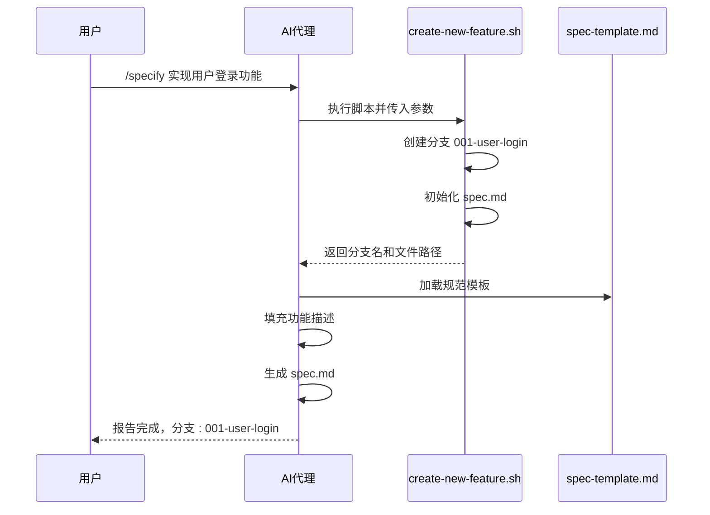
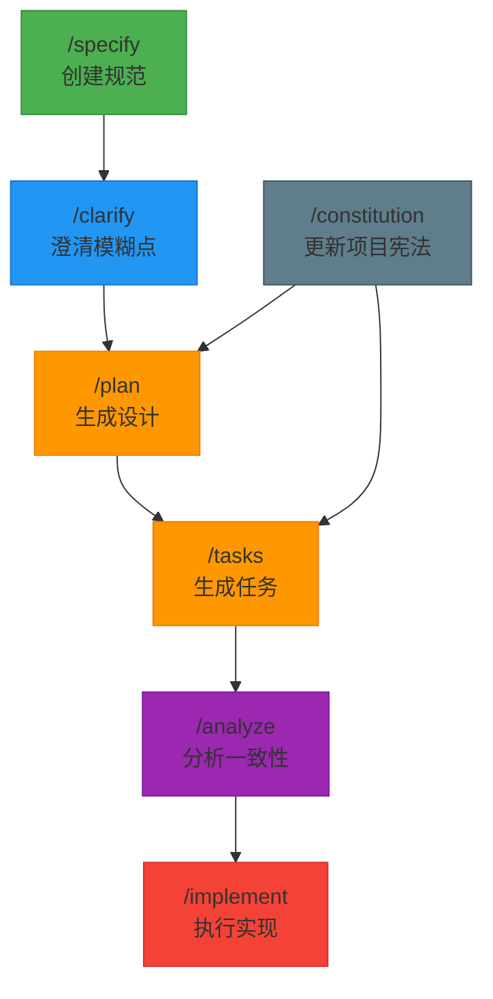

# 命令模板

<cite>
**本文档中引用的文件**  
- [specify.md](file://templates/commands/specify.md)
- [plan.md](file://templates/commands/plan.md)
- [tasks.md](file://templates/commands/tasks.md)
- [clarify.md](file://templates/commands/clarify.md)
- [analyze.md](file://templates/commands/analyze.md)
- [implement.md](file://templates/commands/implement.md)
- [constitution.md](file://templates/commands/constitution.md)
- [create-new-feature.sh](file://scripts/bash/create-new-feature.sh)
- [setup-plan.sh](file://scripts/bash/setup-plan.sh)
- [check-prerequisites.sh](file://scripts/bash/check-prerequisites.sh)
- [common.sh](file://scripts/bash/common.sh)
- [spec-template.md](file://templates/spec-template.md)
- [plan-template.md](file://templates/plan-template.md)
- [tasks-template.md](file://templates/tasks-template.md)
- [constitution.md](file://memory/constitution.md)
</cite>

## 目录
1. [引言](#引言)
2. [命令模板结构解析](#命令模板结构解析)
3. [核心命令模板分析](#核心命令模板分析)
4. [脚本执行机制](#脚本执行机制)
5. [占位符与变量注入](#占位符与变量注入)
6. [各命令模板行为差异与设计模式](#各命令模板行为差异与设计模式)
7. [工作流中的角色与执行顺序](#工作流中的角色与执行顺序)
8. [自定义命令模板实践指南](#自定义命令模板实践指南)
9. [结论](#结论)

## 引言

Spec-Kit 是一个基于自然语言驱动的软件开发自动化框架，其核心机制依赖于一组预定义的命令模板（Command Templates）。这些模板位于 `templates/commands/` 目录下，通过 Markdown 文件定义了每个斜杠命令（如 `/specify`、`/plan`、`/tasks` 等）的执行逻辑。每个模板不仅描述了命令的用途，还通过内嵌的脚本调用和结构化指令，驱动整个开发流程的自动化执行。

本文档深入分析这些命令模板，解释其指令结构、占位符机制、脚本执行流程，并结合具体示例说明它们如何协同工作，形成一个完整的规范驱动开发（Spec-Driven Development）工作流。

**Section sources**
- [specify.md](file://templates/commands/specify.md)
- [plan.md](file://templates/commands/plan.md)
- [tasks.md](file://templates/commands/tasks.md)

## 命令模板结构解析

每个命令模板（`.md` 文件）都遵循一个统一的结构，包含元数据头和主体指令两大部分。

### 元数据头（Frontmatter）

模板以 YAML 格式的元数据头开始，定义了命令的描述和关联脚本：

```yaml
---
description: 对命令功能的简要描述。
scripts:
  sh: 要执行的 Bash 脚本路径及参数
  ps: 要执行的 PowerShell 脚本路径及参数
---
```

- **description**: 提供命令的简明功能说明，用于帮助用户理解其用途。
- **scripts**: 定义了在不同操作系统下执行的脚本。`{SCRIPT}` 占位符在运行时会被替换为实际的脚本路径。

### 主体指令

元数据头之后是主体指令，以自然语言和结构化步骤的形式，指导 AI 代理如何执行该命令。关键组成部分包括：

- **$ARGUMENTS**: 表示用户在斜杠命令后输入的参数，是命令执行的主要输入。
- **{SCRIPT}**: 在执行过程中被替换为 `scripts` 字段中定义的实际脚本命令。
- **结构化步骤**: 一系列编号的指令，详细说明了代理应执行的操作，包括脚本调用、文件读取、内容生成和状态报告。

**Section sources**
- [specify.md](file://templates/commands/specify.md#L1-L5)
- [plan.md](file://templates/commands/plan.md#L1-L7)

## 核心命令模板分析

### /specify 命令模板

`/specify` 命令是工作流的起点，负责根据用户提供的功能描述创建或更新功能规范。

**执行逻辑**:
1. 运行 `create-new-feature.sh` 脚本，创建新的功能分支和规范文件。
2. 加载 `spec-template.md` 模板。
3. 将用户输入的功能描述填充到模板中，生成具体的 `spec.md` 文件。
4. 报告新分支和规范文件的路径。

该模板确保了每个新功能都从一个结构化的规范开始，为后续步骤提供基础。



**Diagram sources**
- [specify.md](file://templates/commands/specify.md)
- [create-new-feature.sh](file://scripts/bash/create-new-feature.sh)
- [spec-template.md](file://templates/spec-template.md)

**Section sources**
- [specify.md](file://templates/commands/specify.md#L1-L24)

### /plan 命令模板

`/plan` 命令负责执行实现规划工作流，生成设计工件。

**执行逻辑**:
1. 运行 `setup-plan.sh` 脚本，验证环境并准备路径。
2. 检查规范文件中是否存在 `## Clarifications` 部分，若缺少关键澄清，则暂停并建议运行 `/clarify`。
3. 加载 `plan-template.md`，并根据规范和用户输入填充技术上下文。
4. 指导生成 `research.md`、`data-model.md`、`contracts/` 和 `quickstart.md` 等设计文档。
5. 报告生成的工件和分支信息。

该模板强调了在进入详细任务分解前，必须先完成设计和澄清。

**Section sources**
- [plan.md](file://templates/commands/plan.md#L1-L46)

### /tasks 命令模板

`/tasks` 命令根据可用的设计工件生成可执行的任务列表。

**执行逻辑**:
1. 运行 `check-prerequisites.sh` 脚本，检查并获取可用的设计文档列表。
2. 分析 `plan.md`、`data-model.md`、`contracts/` 等文件。
3. 使用 `tasks-template.md` 作为基础，生成具体的 `tasks.md` 文件。
4. 任务按依赖关系排序（如设置 -> 测试 -> 核心 -> 集成 -> 润色），并标记可并行执行的任务 `[P]`。
5. 确保任务足够具体，以便 LLM 可以直接执行。

该模板将设计转化为一个有序、可操作的执行计划。

**Section sources**
- [tasks.md](file://templates/commands/tasks.md#L1-L65)

### /clarify 命令模板

`/clarify` 命令用于识别规范中的模糊之处，并通过交互式提问来减少歧义。

**执行逻辑**:
1. 运行 `check-prerequisites.sh` 获取规范文件路径。
2. 对规范文件进行结构化扫描，识别在功能范围、数据模型、非功能性需求等方面的模糊或缺失项。
3. 生成最多 5 个高度针对性的澄清问题，每次只提出一个问题。
4. 将用户的回答整合回规范文件，更新 `## Clarifications` 部分和相关章节。
5. 报告澄清结果和建议的下一步操作。

该模板是确保规范质量的关键环节，旨在降低下游返工的风险。

**Section sources**
- [clarify.md](file://templates/commands/clarify.md#L1-L161)

### /analyze 命令模板

`/analyze` 命令在任务生成后执行，对 `spec.md`、`plan.md` 和 `tasks.md` 进行一致性分析。

**执行逻辑**:
1. 运行 `check-prerequisites.sh` 确保所有核心工件都存在。
2. 加载并解析三个核心工件和项目宪法。
3. 执行多项检测，包括重复、模糊、规范不足、宪法对齐、覆盖缺口和不一致性。
4. 生成一个包含严重性分级的 Markdown 分析报告。
5. 建议下一步操作，如运行 `/specify` 进行细化或手动编辑 `tasks.md`。

该模板是一个只读的“质量门禁”，确保在进入实现阶段前，所有工件都是一致且完整的。

**Section sources**
- [analyze.md](file://templates/commands/analyze.md#L1-L104)

### /implement 命令模板

`/implement` 命令负责执行 `tasks.md` 中定义的实现计划。

**执行逻辑**:
1. 运行 `check-prerequisites.sh` 获取任务列表。
2. 按阶段（设置、测试、核心、集成、润色）和依赖关系执行任务。
3. 遵循测试驱动开发（TDD）原则，先执行测试任务。
4. 在任务完成后，在 `tasks.md` 文件中将其标记为 `[X]`。
5. 报告最终的实现状态。

该模板是自动化实现的最终执行者。

**Section sources**
- [implement.md](file://templates/commands/implement.md#L1-L58)

### /constitution 命令模板

`/constitution` 命令用于创建或更新项目宪法，确保所有依赖模板保持同步。

**执行逻辑**:
1. 加载 `memory/constitution.md` 模板，识别占位符。
2. 收集或推导占位符的具体值。
3. 更新宪法文件，并根据语义化版本规则递增版本号。
4. 检查并更新所有依赖模板（如 `plan-template.md`、`spec-template.md` 等）以保持一致性。
5. 生成同步影响报告并输出最终摘要。

该模板是整个框架的“宪法”，定义了不可协商的原则。

**Section sources**
- [constitution.md](file://templates/commands/constitution.md#L1-L73)

## 脚本执行机制

命令模板通过 `scripts` 字段与底层 Bash/PowerShell 脚本紧密集成，形成“声明式指令 + 命令式执行”的混合模式。

### 脚本职责

- **create-new-feature.sh**: 负责初始化新功能的环境，包括创建分支、生成唯一功能编号和复制规范模板。
- **setup-plan.sh**: 验证当前是否在有效的功能分支上，并复制 `plan-template.md` 到功能目录。
- **check-prerequisites.sh**: 一个多功能的先决条件检查器，用于获取路径、验证文件存在性，并返回可用文档列表。它被 `/plan`、`/tasks`、`/analyze` 和 `/implement` 多个命令复用，体现了设计的DRY（Don't Repeat Yourself）原则。
- **common.sh**: 提供跨脚本共享的函数，如 `get_repo_root`、`get_current_branch`，确保路径解析逻辑的一致性。

### 执行流程

1. **模板解析**: AI 代理解析命令模板，识别 `{SCRIPT}` 占位符。
2. **脚本调用**: 代理在仓库根目录下执行由 `scripts` 字段指定的脚本。
3. **JSON 输出**: 脚本以 JSON 格式输出关键路径和状态（当使用 `--json` 参数时），这些信息被代理捕获并用于后续步骤。
4. **指令执行**: 代理根据脚本的输出，继续执行模板中的后续指令，如读取文件、生成内容等。

这种机制将复杂的环境设置和路径解析逻辑从 AI 指令中剥离，交由可靠的脚本处理，提高了系统的健壮性。

**Section sources**
- [create-new-feature.sh](file://scripts/bash/create-new-feature.sh)
- [setup-plan.sh](file://scripts/bash/setup-plan.sh)
- [check-prerequisites.sh](file://scripts/bash/check-prerequisites.sh)
- [common.sh](file://scripts/bash/common.sh)

## 占位符与变量注入

命令模板和关联文件中广泛使用了占位符机制，实现动态内容注入。

### 主要占位符类型

- **`{ARGS}`**: 在命令模板中，代表用户输入的参数。例如，在 `/specify` 后输入的“实现用户登录功能”会被注入到模板中。
- **`{SCRIPT}`**: 代表根据操作系统选择的实际脚本命令，由代理在执行时替换。
- **`[FEATURE NAME]`**, `[###-feature-name]`**: 在模板文件（如 `spec-template.md`）中，代表功能的名称和分支名，由代理根据上下文填充。
- **`[PRINCIPLE_1_NAME]`**, `[CONSTITUTION_VERSION]`**: 在 `constitution.md` 模板中，代表需要用户定义的宪法原则和版本信息。

### 变量注入流程

1. **用户输入**: 用户通过斜杠命令提供参数。
2. **代理处理**: AI 代理将参数与模板结合，替换 `{ARGS}`。
3. **脚本执行**: 脚本执行后生成环境变量（如 `SPECIFY_FEATURE`）或 JSON 输出（如 `BRANCH_NAME`, `SPEC_FILE`）。
4. **内容生成**: 代理读取这些输出，并将其注入到后续的模板文件中，完成最终的文档生成。

这种分层的变量注入机制，使得模板既保持了通用性，又能生成高度具体化的输出。

**Section sources**
- [specify.md](file://templates/commands/specify.md#L6)
- [spec-template.md](file://templates/spec-template.md#L1)

## 各命令模板行为差异与设计模式

| 命令 | 主要行为 | 设计模式 | 关键脚本 |
| :--- | :--- | :--- | :--- |
| `/specify` | **初始化** - 创建分支和规范文件 | **工厂模式** - 为新功能创建初始结构 | `create-new-feature.sh` |
| `/clarify` | **交互式澄清** - 通过提问减少歧义 | **状态机模式** - 维护澄清会话状态 | `check-prerequisites.sh` |
| `/plan` | **设计生成** - 产出架构和设计工件 | **模板方法模式** - 执行预定义的设计流程 | `setup-plan.sh` |
| `/tasks` | **任务分解** - 将设计转化为有序任务 | **策略模式** - 根据可用文档选择生成策略 | `check-prerequisites.sh` |
| `/analyze` | **质量分析** - 检查工件间的一致性 | **观察者模式** - 只读分析，不修改状态 | `check-prerequisites.sh` |
| `/implement` | **执行实现** - 按计划执行任务 | **命令模式** - 将任务封装为可执行的指令 | `check-prerequisites.sh` |
| `/constitution` | **元配置** - 更新项目核心原则 | **发布-订阅模式** - 修改后通知所有依赖项 | 无（纯模板操作） |

**Section sources**
- [specify.md](file://templates/commands/specify.md)
- [clarify.md](file://templates/commands/clarify.md)
- [plan.md](file://templates/commands/plan.md)
- [tasks.md](file://templates/commands/tasks.md)
- [analyze.md](file://templates/commands/analyze.md)
- [implement.md](file://templates/commands/implement.md)
- [constitution.md](file://templates/commands/constitution.md)

## 工作流中的角色与执行顺序

这些命令模板共同构成了一个完整的开发工作流，其推荐的执行顺序如下：



**Diagram sources**
- [specify.md](file://templates/commands/specify.md)
- [clarify.md](file://templates/commands/clarify.md)
- [plan.md](file://templates/commands/plan.md)
- [tasks.md](file://templates/commands/tasks.md)
- [analyze.md](file://templates/commands/analyze.md)
- [implement.md](file://templates/commands/implement.md)
- [constitution.md](file://templates/commands/constitution.md)

1. **启动**: 以 `/specify` 开始，定义功能。
2. **澄清**: 运行 `/clarify` 以确保规范无歧义。
3. **规划**: 执行 `/plan` 来制定技术方案。
4. **分解**: 使用 `/tasks` 生成详细的执行任务。
5. **验证**: 通过 `/analyze` 检查所有工件的一致性。
6. **实现**: 最后，由 `/implement` 执行任务。
7. **治理**: `/constitution` 可在任何阶段运行，以更新项目的核心原则，其变更会级联影响后续的 `/plan` 和 `/tasks`。

**Section sources**
- [specify.md](file://templates/commands/specify.md)
- [plan.md](file://templates/commands/plan.md)
- [tasks.md](file://templates/commands/tasks.md)

## 自定义命令模板实践指南

要创建或修改自定义命令模板，请遵循以下步骤：

1. **选择模板位置**: 在 `templates/commands/` 目录下创建新的 `.md` 文件，或修改现有文件。
2. **定义元数据头**: 编写清晰的 `description`，并根据需要定义 `scripts` 字段。如果命令不需要脚本，可以省略该字段。
3. **编写主体指令**: 使用清晰、结构化的步骤描述代理应执行的操作。确保指令是原子的、可操作的。
4. **利用占位符**: 使用 `{ARGS}` 接收用户输入，并在需要时引用 `{SCRIPT}`。
5. **集成脚本**: 如果需要执行环境操作，编写相应的 Bash/PowerShell 脚本，并确保其能通过 `--json` 参数输出结构化数据。
6. **测试**: 在实际环境中测试新命令，确保其行为符合预期。
7. **文档化**: 更新 `README.md` 或相关文档，说明新命令的用途和用法。

**最佳实践**:
- **单一职责**: 每个命令应专注于一个明确的任务。
- **幂等性**: 设计命令使其可以安全地重复执行。
- **错误处理**: 在指令中明确说明如何处理常见错误和边界情况。
- **可发现性**: 为命令提供清晰的描述，便于用户理解。

**Section sources**
- [specify.md](file://templates/commands/specify.md)
- [custom-template.md](file://templates/commands/custom-template.md) (示例)

## 结论

Spec-Kit 的命令模板是其自动化工作流的核心。通过将自然语言指令、结构化模板和底层脚本执行相结合，这些模板为 AI 代理提供了一个清晰、可预测的执行框架。每个模板都扮演着特定的角色，从初始化、澄清、规划到最终的实现，形成了一个完整的开发生命周期。理解这些模板的结构、机制和相互关系，是有效利用 Spec-Kit 进行规范驱动开发的关键。通过遵循本文档的指南，用户可以不仅使用现有命令，还能创建自定义模板，以适应其独特的开发流程。