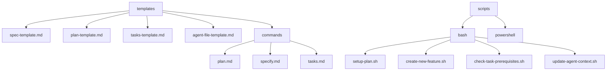

# 模板系统

<cite>
**本文档中引用的文件**  
- [spec-template.md](file://templates/spec-template.md)
- [plan-template.md](file://templates/plan-template.md)
- [tasks-template.md](file://templates/tasks-template.md)
- [agent-file-template.md](file://templates/agent-file-template.md)
- [plan.md](file://templates/commands/plan.md)
- [specify.md](file://templates/commands/specify.md)
- [tasks.md](file://templates/commands/tasks.md)
- [setup-plan.sh](file://scripts/bash/setup-plan.sh)
- [create-new-feature.sh](file://scripts/bash/create-new-feature.sh)
- [check-task-prerequisites.sh](file://scripts/bash/check-task-prerequisites.sh)
- [update-agent-context.sh](file://scripts/bash/update-agent-context.sh)
- [common.sh](file://scripts/bash/common.sh)
- [constitution.md](file://memory/constitution.md)
</cite>

## 目录
1. [简介](#简介)
2. [项目结构](#项目结构)
3. [核心模板文件](#核心模板文件)
4. [spec-template.md 结构详解](#spec-template.md-结构详解)
5. [plan-template.md 结构详解](#plan-template.md-结构详解)
6. [tasks-template.md 结构详解](#tasks-template.md-结构详解)
7. [agent-file-template.md 作用分析](#agent-file-template.md-作用分析)
8. [命令模板文件说明](#命令模板文件说明)
9. [模板系统与CLI工具的协同工作](#模板系统与cli工具的协同工作)
10. [模板的可扩展性与自定义](#模板的可扩展性与自定义)
11. [模板语法完整参考](#模板语法完整参考)
12. [模板对AI生成内容的影响](#模板对ai生成内容的影响)
13. [结论](#结论)

## 简介
模板系统是Spec-Driven Development（SDD）方法论的核心组成部分，它通过结构化的模板文件指导AI代理生成高质量、一致性的软件开发文档。该系统旨在将模糊的用户需求转化为精确的可执行规范，确保开发过程中的每个阶段都有明确的指导原则和输出标准。模板不仅定义了文档的结构，还包含了质量检查清单、执行流程和约束条件，从而保证生成内容的完整性和专业性。

**Section sources**
- [README.md](file://README.md#L0-L443)
- [spec-driven.md](file://spec-driven.md#L0-L403)

## 项目结构
模板系统位于项目的`templates`目录下，包含多个关键文件和子目录。主要结构包括：`spec-template.md`用于创建功能规格说明，`plan-template.md`用于生成实施计划，`tasks-template.md`用于分解具体任务，以及`agent-file-template.md`用于定义AI代理上下文。`commands`子目录包含`plan.md`、`specify.md`和`tasks.md`三个命令模板，指导AI助手执行特定任务。这些模板与`scripts`目录下的Bash和PowerShell脚本协同工作，实现自动化的工作流。



**Diagram sources**
- [project_structure](file://#L0-L30)

**Section sources**
- [project_structure](file://#L0-L30)

## 核心模板文件
模板系统包含四个核心模板文件，分别对应软件开发的不同阶段。`spec-template.md`用于创建功能规格说明，强调用户需求和业务价值，避免技术实现细节。`plan-template.md`用于生成技术实施计划，将业务需求转化为具体的技术架构和实现方案。`tasks-template.md`用于分解具体的开发任务，遵循测试驱动开发（TDD）原则，确保任务的可执行性和并行性。`agent-file-template.md`用于定义AI代理的上下文，保持项目技术栈和代码风格的一致性。这些模板共同构成了从需求到实现的完整工作流。

**Section sources**
- [spec-template.md](file://templates/spec-template.md#L0-L116)
- [plan-template.md](file://templates/plan-template.md#L0-L217)
- [tasks-template.md](file://templates/tasks-template.md#L0-L126)
- [agent-file-template.md](file://templates/agent-file-template.md#L0-L22)

## spec-template.md 结构详解
`spec-template.md`是创建功能规格说明的基础模板，其结构设计旨在引导AI代理关注用户需求而非技术实现。模板以"Feature Specification: [FEATURE NAME]"开头，包含功能分支、创建日期、状态和输入参数等元数据。执行流程部分定义了从解析用户描述到生成功能需求的完整步骤，包括提取关键概念、标记不明确之处、填写用户场景和测试用例等。模板特别强调"关注WHAT而非HOW"的原则，要求避免技术栈、API和代码结构等实现细节。

### 快速指南与AI生成要求
模板中的"⚡ Quick Guidelines"部分提供了清晰的指导原则：必须关注用户需求和业务价值，避免技术实现细节，面向业务利益相关者而非开发者编写。对于AI生成，模板要求标记所有不确定性，使用"[NEEDS CLARIFICATION: specific question]"占位符，不得猜测未明确的信息。常见需要澄清的领域包括用户类型和权限、数据保留策略、性能目标、错误处理行为、集成需求和安全合规要求。

### 必需与可选部分
模板定义了必需和可选部分的要求。必需部分必须为每个功能完成，包括"User Scenarios & Testing"和"Requirements"。可选部分仅在与功能相关时才包含，如果不适用则应完全删除，而不是留空或标记为"N/A"。用户场景部分要求描述主要用户旅程，并提供验收场景和边界情况。功能需求部分使用"FR-001"等编号格式，确保每个需求都是可测试和无歧义的。

### 审查与验收清单
模板包含两个审查清单："Content Quality"检查内容质量，确保没有实现细节、关注用户价值、面向非技术利益相关者且所有必需部分已完成；"Requirement Completeness"检查需求完整性，确保没有"[NEEDS CLARIFICATION]"标记、需求可测试且无歧义、成功标准可衡量、范围明确且识别了依赖关系和假设。

**Section sources**
- [spec-template.md](file://templates/spec-template.md#L0-L116)

## plan-template.md 结构详解
`plan-template.md`是生成技术实施计划的核心模板，它将功能规格说明转化为具体的实施策略和技术决策。模板以YAML格式的元数据开头，定义了描述和脚本路径。主标题"Implementation Plan: [FEATURE]"后跟随分支、日期和规格链接等元数据。执行流程部分详细描述了从加载功能规格到完成设计的完整步骤，包括填充技术上下文、进行宪法检查、执行研究阶段和设计阶段等。

### 技术上下文与宪法检查
技术上下文部分要求填写语言/版本、主要依赖、存储、测试、目标平台、项目类型、性能目标、约束和规模/范围等信息，未明确的部分标记为"NEEDS CLARIFICATION"。宪法检查部分基于`memory/constitution.md`文件中的原则进行验证，确保设计符合项目的核心原则，如库优先、CLI接口、测试优先等。如果发现违反宪法的情况，必须在复杂性跟踪表中记录原因和拒绝的替代方案。

### 项目结构与设计阶段
模板定义了文档和源代码的项目结构。文档结构包括`plan.md`、`research.md`、`data-model.md`、`quickstart.md`和`contracts/`等文件。源代码结构根据项目类型（单项目、Web应用或移动应用+API）提供不同的选项。设计阶段分为三个主要部分：Phase 0（研究）要求提取技术上下文中的未知项并生成研究任务；Phase 1（设计与合同）要求从功能规格中提取实体生成数据模型，生成API合同和契约测试，更新代理文件；Phase 2（任务规划方法）描述了`/tasks`命令将如何生成任务，但不在此阶段执行。

### 进度与复杂性跟踪
进度跟踪部分提供了一个检查清单，记录各阶段的完成状态，包括研究完成、设计完成、任务规划完成等。宪法检查状态也在此跟踪，确保初始和设计后的宪法检查都通过。复杂性跟踪表用于记录任何违反宪法但必须保留的复杂性决策，包括违反项、需要的原因和拒绝的更简单替代方案。

**Section sources**
- [plan-template.md](file://templates/plan-template.md#L0-L217)

## tasks-template.md 结构详解
`tasks-template.md`是生成具体开发任务的模板，它将设计文档转化为可执行的任务列表。模板以"Tasks: [FEATURE NAME]"开头，包含输入路径和先决条件等元数据。执行流程部分定义了从加载`plan.md`到生成任务的完整步骤，包括加载可选设计文档、按类别生成任务、应用任务规则、编号任务、生成依赖图、创建并行执行示例和验证任务完整性等。

### 任务格式与路径约定
任务格式定义为`[ID] [P?] Description`，其中`[P]`表示可以并行执行的任务（不同文件，无依赖）。模板强调包含确切的文件路径在描述中。路径约定根据项目类型（单项目、Web应用或移动应用）提供不同的路径前缀。任务分为五个阶段：Setup（项目初始化）、Tests First（测试先行）、Core Implementation（核心实现）、Integration（集成）和Polish（完善）。

### 任务生成规则与验证
任务生成规则部分详细说明了如何从不同设计文档生成任务：从合同文件生成契约测试任务，从数据模型中的实体生成模型创建任务，从用户故事生成集成测试任务。任务排序遵循依赖关系：设置在所有任务之前，测试在实现之前，模型在服务之前，服务在端点之前，核心在集成之前，所有任务在完善之前。验证清单确保所有合同都有对应的测试，所有实体都有模型任务，所有测试都在实现之前，平行任务真正独立，每个任务指定确切的文件路径，且没有任务修改与其他`[P]`任务相同的文件。

**Section sources**
- [tasks-template.md](file://templates/tasks-template.md#L0-L126)

## agent-file-template.md 作用分析
`agent-file-template.md`是定义AI代理上下文的关键模板，它确保项目在整个开发过程中保持技术栈和代码风格的一致性。模板以"#[PROJECT NAME] Development Guidelines"开头，包含最后更新日期。主要部分包括"Active Technologies"（从所有`plan.md`文件中提取的活动技术）、"Project Structure"（实际结构来自计划）、"Commands"（仅针对活动技术的命令）、"Code Style"（仅针对使用语言的代码风格）和"Recent Changes"（最近3个功能及其添加内容）。

### 手动添加区域
模板特别设计了"<!-- MANUAL ADDITIONS START -->"和"<!-- MANUAL ADDITIONS END -->"标记，允许开发者在这些标记之间添加手动配置。这种设计确保了自动化更新不会覆盖重要的手动配置，同时保持了上下文文件的动态更新能力。当`update-agent-context.sh`脚本运行时，它会智能地更新自动部分，同时保留手动添加的内容。

### 上下文维护机制
该模板通过`update-agent-context.sh`脚本与实施计划协同工作。每当生成新的`plan.md`文件时，脚本会提取其中的技术上下文信息，更新代理文件中的活动技术、项目结构、命令和最近变更等部分。这种机制确保了AI代理始终拥有最新的项目上下文，能够生成符合当前技术栈和架构的代码。

**Section sources**
- [agent-file-template.md](file://templates/agent-file-template.md#L0-L22)
- [update-agent-context.sh](file://scripts/bash/update-agent-context.sh#L0-L66)

## 命令模板文件说明
`commands`目录下的三个模板文件`plan.md`、`specify.md`和`tasks.md`指导AI助手执行特定任务，它们是连接用户指令与自动化脚本的桥梁。每个命令模板都以YAML格式的元数据开头，定义了描述和对应的脚本路径（Bash和PowerShell版本）。

### specify.md 命令
`specify.md`命令用于创建或更新功能规格说明。它首先运行`create-new-feature.sh`脚本，该脚本会自动确定下一个功能编号，创建语义化的分支名称，创建功能目录，并复制`spec-template.md`作为基础。然后，AI助手根据用户提供的功能描述，使用模板结构填写具体的细节，生成完整的规格说明文件。

### plan.md 命令
`plan.md`命令用于生成实施计划。它首先运行`setup-plan.sh`脚本，该脚本会检查当前是否在功能分支上，创建必要的目录，并复制`plan-template.md`到实施计划路径。然后，AI助手分析功能规格，理解需求和用户故事，读取项目宪法，并执行实施计划模板中的步骤，生成`research.md`、`data-model.md`、`contracts/`等设计文档。

### tasks.md 命令
`tasks.md`命令用于生成可执行的任务列表。它首先运行`check-task-prerequisites.sh`脚本，检查先决条件是否满足，如存在`plan.md`文件。然后，AI助手分析可用的设计文档，使用`tasks-template.md`作为基础，根据设计文档生成具体的任务，确保遵循TDD原则和并行执行规则。

**Section sources**
- [commands/plan.md](file://templates/commands/plan.md#L0-L39)
- [commands/specify.md](file://templates/commands/specify.md#L0-L15)
- [commands/tasks.md](file://templates/commands/tasks.md#L0-L61)
- [setup-plan.sh](file://scripts/bash/setup-plan.sh#L0-L17)
- [create-new-feature.sh](file://scripts/bash/create-new-feature.sh#L0-L58)
- [check-task-prerequisites.sh](file://scripts/bash/check-task-prerequisites.sh#L0-L15)

## 模板系统与CLI工具的协同工作
模板系统与`scripts`目录下的CLI工具紧密协同，形成了一个自动化的开发工作流。这个协同工作始于`/specify`命令，通过`create-new-feature.sh`脚本自动创建功能分支、目录结构和初始规格文件。然后，`/plan`命令通过`setup-plan.sh`脚本准备实施计划环境，复制模板并设置必要的路径变量。最后，`/tasks`命令通过`check-task-prerequisites.sh`脚本验证先决条件，确保工作流的正确执行顺序。

### 脚本功能详解
`create-new-feature.sh`脚本负责新功能的初始化。它会扫描现有的规格目录，确定下一个功能编号，创建语义化的分支名称（如`001-feature-name`），创建功能目录，并复制`spec-template.md`作为`spec.md`文件。`setup-plan.sh`脚本负责实施计划的准备工作。它会检查当前是否在正确的功能分支上，创建必要的目录，并复制`plan-template.md`到实施计划路径。`check-task-prerequisites.sh`脚本在生成任务前进行验证，确保`plan.md`文件存在且功能目录已创建。

### 数据流与自动化
这些脚本通过`common.sh`中的`get_feature_paths`函数获取一致的路径变量，确保所有脚本和模板使用相同的路径约定。`update-agent-context.sh`脚本在每次生成新的`plan.md`后自动更新AI代理的上下文文件，保持技术栈信息的最新状态。这种自动化减少了人为错误，确保了工作流的一致性和可靠性。

**Section sources**
- [create-new-feature.sh](file://scripts/bash/create-new-feature.sh#L0-L58)
- [setup-plan.sh](file://scripts/bash/setup-plan.sh#L0-L17)
- [check-task-prerequisites.sh](file://scripts/bash/check-task-prerequisites.sh#L0-L15)
- [update-agent-context.sh](file://scripts/bash/update-agent-context.sh#L0-L66)
- [common.sh](file://scripts/bash/common.sh#L0-L37)

## 模板的可扩展性与自定义
模板系统设计具有高度的可扩展性和可定制性，允许用户根据不同的项目需求进行调整。基本的自定义可以通过修改现有模板实现，例如调整`spec-template.md`中的审查清单以适应特定的业务需求，或在`plan-template.md`中添加新的技术上下文字段。对于更复杂的扩展，用户可以创建全新的模板文件，并在相应的命令模板中引用它们。

### 创建新模板
要创建新的模板，用户可以在`templates`目录下创建新的`.md`文件，遵循现有模板的结构和最佳实践。例如，可以创建`api-spec-template.md`专门用于生成API规范，或创建`ui-design-template.md`用于生成UI设计文档。然后，在相应的命令模板中更新脚本路径和描述，使其指向新的模板文件。

### 集成新AI代理
模板系统支持多种AI代理（如Claude、Gemini、Copilot等），通过`update-agent-context.sh`脚本中的`case`语句实现。要集成新的AI代理，用户需要在脚本中添加新的`case`分支，指定代理类型的名称和对应的上下文文件路径。同时，需要创建或更新相应的代理文件模板，确保其格式与新代理的要求兼容。

**Section sources**
- [update-agent-context.sh](file://scripts/bash/update-agent-context.sh#L0-L66)

## 模板语法完整参考
模板系统使用一套简洁而强大的语法来指导AI代理生成内容。核心语法元素包括占位符、执行流程、检查清单和特殊标记。

### 占位符
- `[FEATURE NAME]`：功能名称占位符，在生成时被具体的功能名称替换。
- `[DATE]`：日期占位符，通常被当前日期替换。
- `[###-feature-name]`：功能分支占位符，包含三位数编号和功能名称。
- `__AGENT__`：在YAML元数据中使用的代理类型占位符。

### 执行流程
使用代码块语法（```` ``` ````）定义执行流程，描述AI代理应遵循的步骤。流程中使用箭头（→）表示步骤间的转换，条件判断用括号表示（如"→ If not found: ERROR"）。

### 检查清单
使用Markdown的复选框语法（`- [ ]`和`- [x]`）定义检查清单。这些清单在生成过程中被用作质量门禁，确保生成内容的完整性和正确性。

### 特殊标记
- `[NEEDS CLARIFICATION: ...]`：标记需要澄清的不明确之处，防止AI代理做出错误假设。
- `[P]`：标记可以并行执行的任务，优化开发效率。
- `<!-- MANUAL ADDITIONS START -->`和`<!-- MANUAL ADDITIONS END -->`：定义手动添加区域，保护重要的手动配置不被自动化覆盖。

**Section sources**
- [spec-template.md](file://templates/spec-template.md#L0-L116)
- [plan-template.md](file://templates/plan-template.md#L0-L217)
- [tasks-template.md](file://templates/tasks-template.md#L0-L126)
- [agent-file-template.md](file://templates/agent-file-template.md#L0-L22)

## 模板对AI生成内容的影响
模板系统通过结构化约束显著提升了AI生成内容的质量和一致性。首先，模板防止了过早的技术实现细节，通过明确的指导原则（如"Focus on WHAT users need and WHY"）引导AI代理保持适当的抽象层次。其次，模板强制显式标记不确定性，使用`[NEEDS CLARIFICATION]`标记防止AI代理做出可能错误的假设。

### 质量保证机制
模板中的检查清单充当了"单元测试"的角色，迫使AI代理系统地自我审查输出，捕捉可能遗漏的差距。宪法检查门禁确保设计符合项目的核心原则，防止过度工程化。测试优先的思维通过文件创建顺序的约束得到强化，确保AI代理在生成实现代码之前先考虑可测试性和契约。

### 信息架构管理
模板通过分层细节管理防止规格说明变成难以阅读的代码转储。高亮显示重要信息的语法（如`**bold**`）帮助AI代理识别关键元数据。这种结构化的提示将AI代理从创意写作者转变为纪律严明的规格工程师，引导其能力产生一致高质量、可执行的规格说明，真正驱动开发过程。

**Section sources**
- [spec-driven.md](file://spec-driven.md#L0-L403)

## 结论
模板系统是Spec-Driven Development方法论的基石，它通过结构化的模板文件将模糊的用户需求转化为精确的可执行规范。该系统不仅提高了开发效率，更重要的是保证了生成内容的质量和一致性。通过`spec-template.md`、`plan-template.md`和`tasks-template.md`三个核心模板，实现了从需求到实施再到任务分解的完整工作流。`agent-file-template.md`确保了项目上下文的持续更新和一致性。与CLI工具的协同工作实现了高度自动化，减少了人为错误。模板的可扩展性允许用户根据特定需求进行定制，而其语法设计则有效引导AI代理生成高质量的输出。总体而言，这一模板系统为AI辅助软件开发提供了一个强大而可靠的框架。