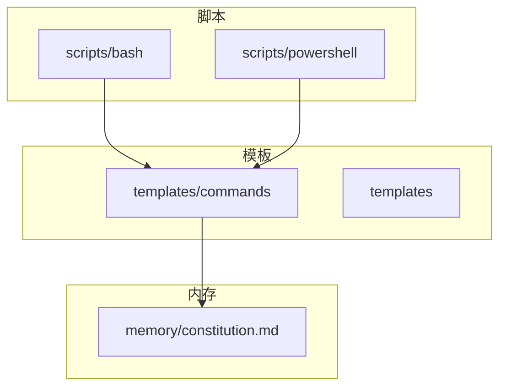
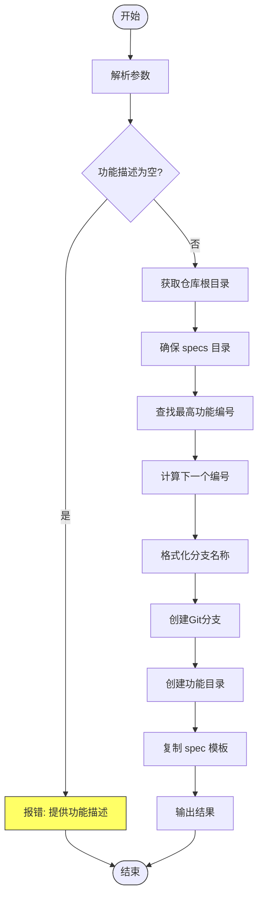
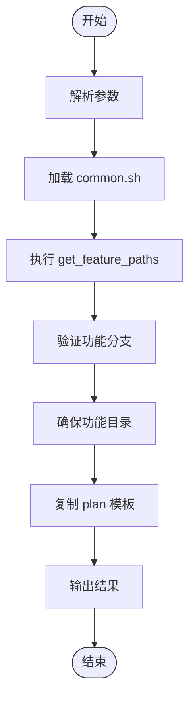
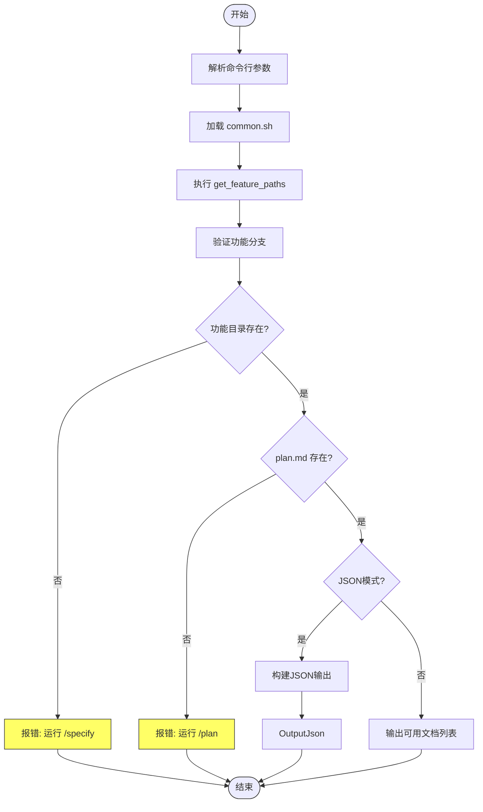
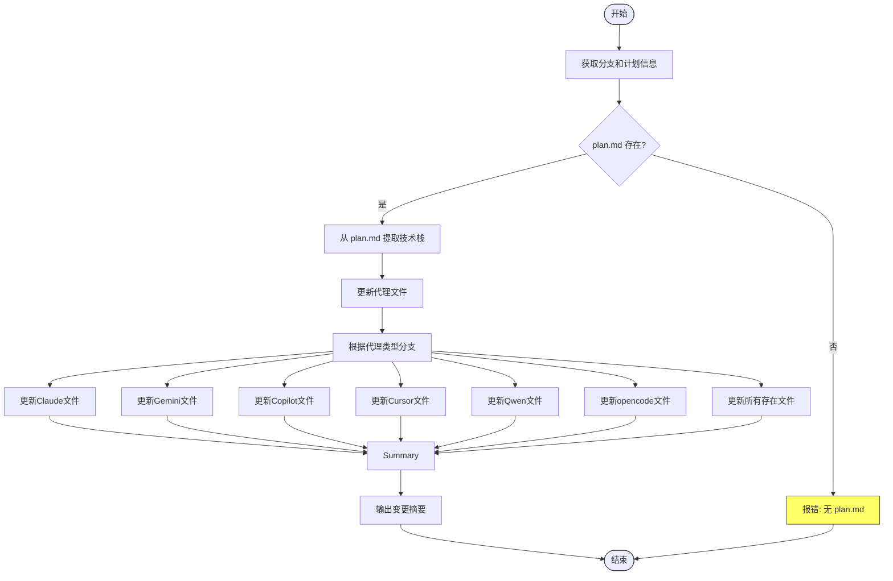
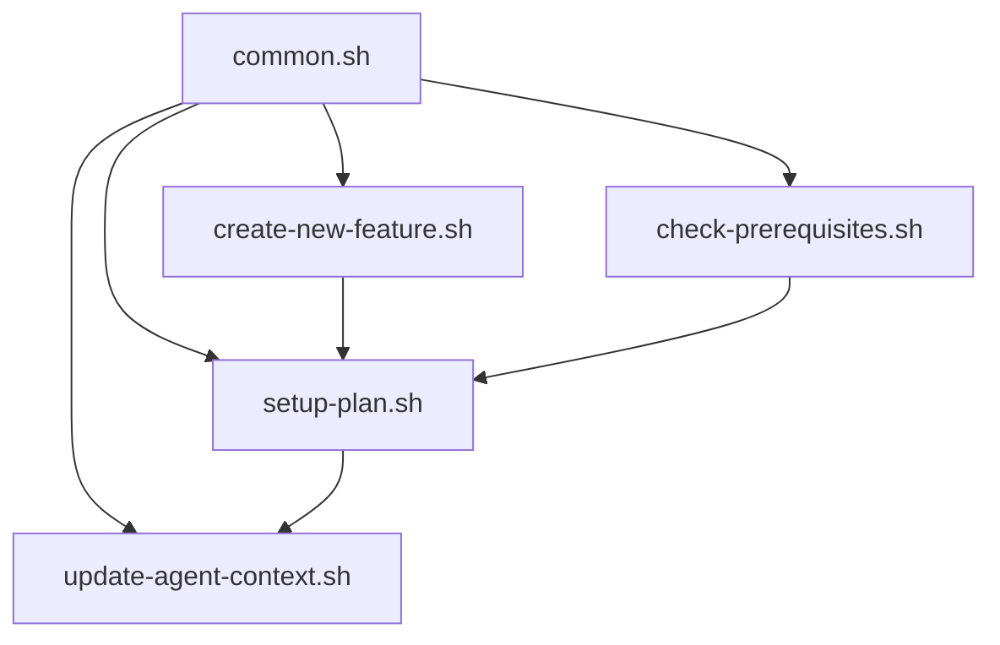

# Bash 脚本

<cite>
**本文档中引用的文件**  
- [create-new-feature.sh](file://scripts/bash/create-new-feature.sh)
- [setup-plan.sh](file://scripts/bash/setup-plan.sh)
- [check-prerequisites.sh](file://scripts/bash/check-prerequisites.sh)
- [update-agent-context.sh](file://scripts/bash/update-agent-context.sh)
- [common.sh](file://scripts/bash/common.sh)
- [specify.md](file://templates/commands/specify.md)
- [plan.md](file://templates/commands/plan.md)
- [tasks.md](file://templates/commands/tasks.md)
- [spec-template.md](file://templates/spec-template.md)
- [plan-template.md](file://templates/plan-template.md)
- [tasks-template.md](file://templates/tasks-template.md)
- [constitution.md](file://memory/constitution.md)
</cite>

## 目录
1. [简介](#简介)
2. [项目结构](#项目结构)
3. [核心组件](#核心组件)
4. [架构概述](#架构概述)
5. [详细组件分析](#详细组件分析)
6. [依赖分析](#依赖分析)
7. [性能考虑](#性能考虑)
8. [故障排除指南](#故障排除指南)
9. [结论](#结论)

## 简介
本文档详细阐述了Spec-Kit中的Bash脚本系统，重点介绍其在Linux/macOS环境下的自动化执行能力。这些脚本构成了Spec-Driven Development（SDD）工作流的核心，通过与Markdown命令模板的协同工作，实现了从功能构思到技术实现的自动化流程。文档将深入分析每个脚本的功能、调用方式、执行流程以及它们如何被AI代理集成使用。

## 项目结构
Spec-Kit的Bash脚本系统位于`scripts/bash/`目录下，与PowerShell脚本并行存在，支持跨平台操作。该系统通过`templates/`目录中的Markdown模板与AI代理进行交互，形成一个完整的自动化开发工作流。



**Diagram sources**
- [project_structure](file://#L1-L10)

**Section sources**
- [project_structure](file://#L1-L10)

## 核心组件
核心组件包括五个主要的Bash脚本：`create-new-feature.sh`、`setup-plan.sh`、`check-prerequisites.sh`、`update-agent-context.sh`和`common.sh`。这些脚本分别负责功能创建、计划设置、环境检查、AI上下文更新和共享功能，共同构成了SDD工作流的自动化基础。

**Section sources**
- [create-new-feature.sh](file://scripts/bash/create-new-feature.sh#L1-L97)
- [setup-plan.sh](file://scripts/bash/setup-plan.sh#L1-L60)
- [check-prerequisites.sh](file://scripts/bash/check-prerequisites.sh#L1-L165)
- [update-agent-context.sh](file://scripts/bash/update-agent-context.sh#L1-L719)
- [common.sh](file://scripts/bash/common.sh#L1-L113)

## 架构概述
Bash脚本系统采用模块化设计，`common.sh`作为共享库提供基础功能，其他脚本通过`source`命令引入。AI代理通过解析Markdown命令模板来调用这些脚本，形成一个从用户指令到自动化执行的闭环。

```mermaid
graph LR
A[用户指令] --> B[/specify]
B --> C[specify.md]
C --> D[create-new-feature.sh]
D --> E[spec.md]
A --> F[/plan]
F --> G[plan.md]
G --> H[setup-plan.sh]
H --> I[plan.md]
I --> J[update-agent-context.sh]
A --> K[/tasks]
K --> L[tasks.md]
L --> M[check-prerequisites.sh]
M --> N[tasks.md]
D --> O[common.sh]
H --> O
J --> O
M --> O
```

**Diagram sources**
- [specify.md](file://templates/commands/specify.md#L1-L24)
- [plan.md](file://templates/commands/plan.md#L1-L46)
- [tasks.md](file://templates/commands/tasks.md#L1-L65)
- [common.sh](file://scripts/bash/common.sh#L1-L113)

## 详细组件分析
本节将深入分析每个核心Bash脚本的实现细节、功能逻辑和执行流程。

### create-new-feature.sh 分析
该脚本自动化创建新功能分支和相关目录结构，是SDD流程的起点。



**Diagram sources**
- [create-new-feature.sh](file://scripts/bash/create-new-feature.sh#L1-L58)

**Section sources**
- [create-new-feature.sh](file://scripts/bash/create-new-feature.sh#L1-L58)

### setup-plan.sh 分析
该脚本协调SDD流程中的计划阶段，为实施准备环境。



**Diagram sources**
- [setup-plan.sh](file://scripts/bash/setup-plan.sh#L1-L17)

**Section sources**
- [setup-plan.sh](file://scripts/bash/setup-plan.sh#L1-L17)

### check-prerequisites.sh 分析
该脚本验证任务生成前的系统依赖和环境配置，确保SDD流程的完整性。



**Diagram sources**
- [check-prerequisites.sh](file://scripts/bash/check-prerequisites.sh#L1-L15)

**Section sources**
- [check-prerequisites.sh](file://scripts/bash/check-prerequisites.sh#L1-L15)

### update-agent-context.sh 分析
该脚本动态更新AI代理的上下文文件，是人机协作的关键组件。



**Diagram sources**
- [update-agent-context.sh](file://scripts/bash/update-agent-context.sh#L1-L66)

**Section sources**
- [update-agent-context.sh](file://scripts/bash/update-agent-context.sh#L1-L66)

### common.sh 分析
该脚本封装了共享函数和变量，是整个脚本系统的基础。

```mermaid
classDiagram
class common.sh {
+get_repo_root() string
+get_current_branch() string
+check_feature_branch(branch) bool
+get_feature_dir(repo_root, branch) string
+get_feature_paths() string
+check_file(path, label) void
+check_dir(path, label) void
}
class create-new-feature.sh {
+FEATURE_DESCRIPTION string
+FEATURE_NUM string
+BRANCH_NAME string
}
class setup-plan.sh {
+JSON_MODE bool
}
class check-prerequisites.sh {
+JSON_MODE bool
}
class update-agent-context.sh {
+AGENT_TYPE string
}
common.sh <|-- create-new-feature.sh : "source"
common.sh <|-- setup-plan.sh : "source"
common.sh <|-- check-prerequisites.sh : "source"
common.sh <|-- get-feature-paths.sh : "source"
common.sh <|-- update-agent-context.sh : "source"
style common.sh fill : #69f,stroke : #333
style create-new-feature.sh fill : #f96,stroke : #333
style setup-plan.sh fill : #f96,stroke : #333
style check-prerequisites.sh fill : #f96,stroke : #333
style get-feature-paths.sh fill : #f96,stroke : #333
style update-agent-context.sh fill : #f96,stroke : #333
```

**Diagram sources**
- [common.sh](file://scripts/bash/common.sh#L1-L37)

**Section sources**
- [common.sh](file://scripts/bash/common.sh#L1-L37)

## 依赖分析
Bash脚本系统内部依赖关系清晰，`common.sh`作为基础库被其他所有脚本依赖。外部依赖主要通过`git`命令和文件系统操作实现，确保了跨平台兼容性。



**Diagram sources**
- [common.sh](file://scripts/bash/common.sh#L1-L113)
- [create-new-feature.sh](file://scripts/bash/create-new-feature.sh#L1-L97)
- [setup-plan.sh](file://scripts/bash/setup-plan.sh#L1-L60)
- [check-prerequisites.sh](file://scripts/bash/check-prerequisites.sh#L1-L165)
- [update-agent-context.sh](file://scripts/bash/update-agent-context.sh#L1-L719)

**Section sources**
- [common.sh](file://scripts/bash/common.sh#L1-L113)

## 性能考虑
脚本系统设计注重执行效率和资源消耗。通过使用内置的Bash功能和最小化外部命令调用，确保了快速执行。错误处理机制完善，能够在早期发现问题，避免资源浪费。

## 故障排除指南
常见问题包括Git仓库未初始化、环境变量未设置和文件权限问题。建议使用`--json`参数进行调试，检查输出的路径和状态信息。确保`SPECIFY_FEATURE`环境变量正确设置，或在Git仓库中运行脚本。

**Section sources**
- [create-new-feature.sh](file://scripts/bash/create-new-feature.sh#L1-L97)
- [common.sh](file://scripts/bash/common.sh#L1-L113)

## 结论
Spec-Kit的Bash脚本系统提供了一个强大而灵活的自动化框架，通过模块化设计和清晰的职责划分，实现了从功能创建到任务生成的完整工作流。与AI代理的深度集成使得开发过程更加高效和智能化，为现代软件开发提供了创新的解决方案。