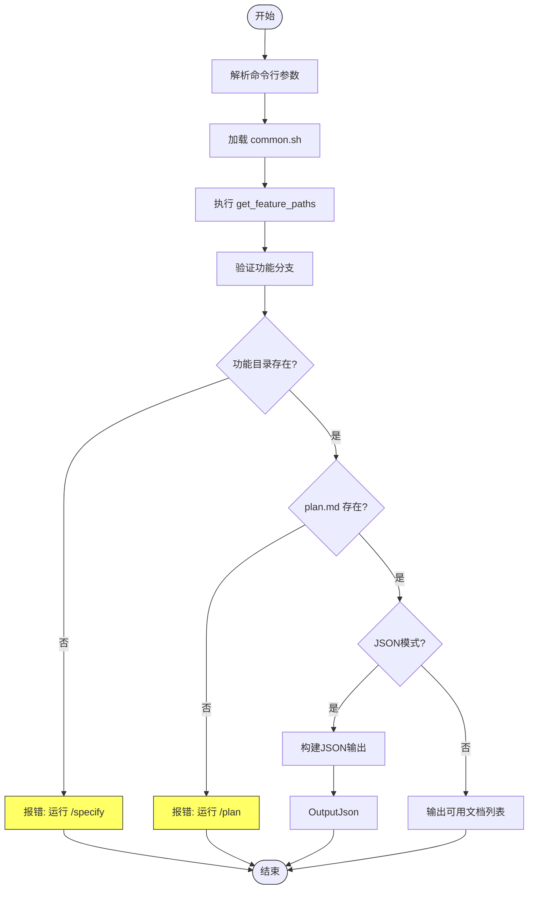
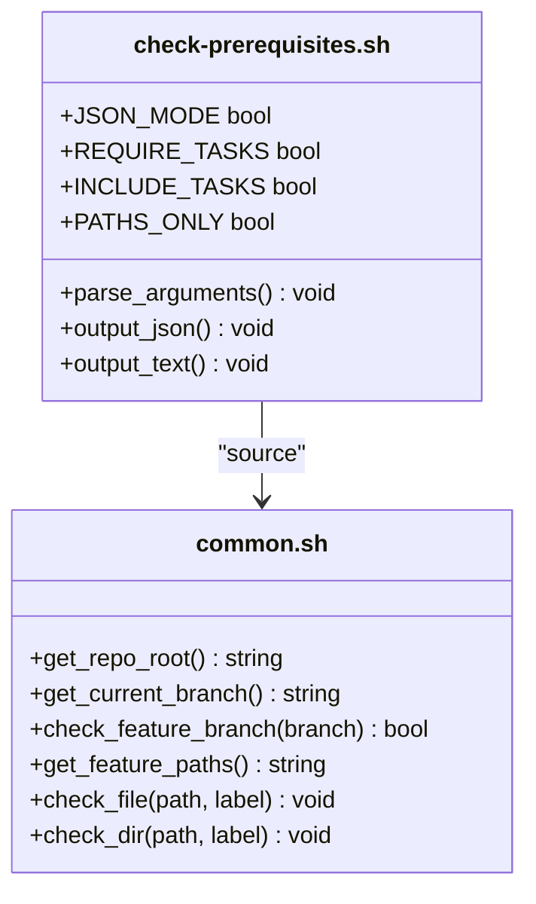
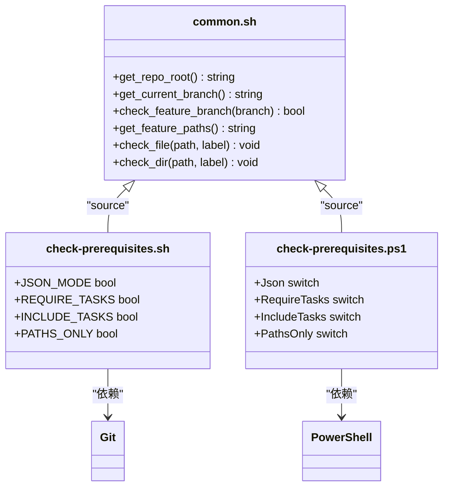

# check-prerequisites.sh 脚本

<cite>
**本文档引用的文件**
- [check-prerequisites.sh](file://scripts/bash/check-prerequisites.sh)
- [common.sh](file://scripts/bash/common.sh)
- [check-prerequisites.ps1](file://scripts/powershell/check-prerequisites.ps1)
</cite>

## 目录
1. [简介](#简介)
2. [项目结构](#项目结构)
3. [核心组件](#核心组件)
4. [架构概述](#架构概述)
5. [详细组件分析](#详细组件分析)
6. [依赖分析](#依赖分析)
7. [性能考虑](#性能考虑)
8. [故障排除指南](#故障排除指南)
9. [结论](#结论)

## 简介
`check-prerequisites.sh` 脚本是 Spec-Driven Development (SDD) 工作流中的核心验证工具，负责统一检查开发环境的先决条件。该脚本取代了原先分散在多个脚本中的功能，为整个开发流程提供一致的依赖检查机制。脚本的主要功能包括验证功能分支命名规范、检查必要的文档文件是否存在，以及为后续的 AI 代理决策提供结构化输出。通过命令行参数控制，脚本能够以 JSON 格式或文本格式输出检查结果，支持在自动化工作流中集成使用。

## 项目结构
`check-prerequisites.sh` 脚本位于 `scripts/bash/` 目录下，是整个脚本系统的重要组成部分。该脚本与 `common.sh` 共享函数库，同时存在对应的 PowerShell 版本 `check-prerequisites.ps1`，确保在不同操作系统环境下的兼容性。脚本通过调用 `common.sh` 中定义的通用函数来获取仓库根目录、当前分支等环境信息，并基于这些信息进行先决条件检查。

```mermaid
graph TB
subgraph "脚本系统"
Bash[scripts/bash]
Powershell[scripts/powershell]
end
Bash --> check-prerequisites.sh
Bash --> common.sh
Powershell --> check-prerequisites.ps1
Powershell --> common.ps1
check-prerequisites.sh --> common.sh : "source"
check-prerequisites.ps1 --> common.ps1 : "source"
```

**Diagram sources**
- [check-prerequisites.sh](file://scripts/bash/check-prerequisites.sh#L1-L165)
- [common.sh](file://scripts/bash/common.sh#L1-L113)

**Section sources**
- [check-prerequisites.sh](file://scripts/bash/check-prerequisites.sh#L1-L165)
- [common.sh](file://scripts/bash/common.sh#L1-L113)

## 核心组件
`check-prerequisites.sh` 脚本的核心功能围绕先决条件检查展开，主要包括命令行参数解析、环境变量获取、分支验证和文件存在性检查。脚本通过 `get_feature_paths` 函数从 `common.sh` 中获取所有必要的路径变量，并验证当前是否处于正确的功能分支上。对于不同的工作阶段（如任务生成或实施阶段），脚本可以通过 `--require-tasks` 和 `--include-tasks` 参数调整检查的严格程度。输出格式可以通过 `--json` 参数控制，为自动化系统提供机器可读的 JSON 输出。

**Section sources**
- [check-prerequisites.sh](file://scripts/bash/check-prerequisites.sh#L1-L165)

## 架构概述
`check-prerequisites.sh` 脚本采用模块化设计，将通用功能封装在 `common.sh` 库中，实现了代码复用和维护性提升。脚本的执行流程清晰：首先解析命令行参数，然后加载共享函数，获取环境路径并验证分支，最后根据模式输出结果。这种设计使得脚本既能独立运行，也能作为更大工作流的一部分被调用。JSON 输出模式特别适用于与 AI 代理或其他自动化工具集成，而文本模式则便于开发者直接查看检查结果。



**Diagram sources**
- [check-prerequisites.sh](file://scripts/bash/check-prerequisites.sh#L1-L165)

## 详细组件分析
### 核心功能分析
`check-prerequisites.sh` 脚本的核心功能是确保开发环境满足 SDD 工作流的要求。脚本首先通过命令行参数确定运行模式，如 JSON 输出、是否需要 `tasks.md` 文件等。然后，脚本通过 `source` 命令加载 `common.sh` 中的共享函数，获取仓库根目录、当前分支和功能目录等关键路径。分支验证确保开发者在正确的功能分支上工作，这是 SDD 流程的基础。

#### 参数解析与模式控制


**Diagram sources**
- [check-prerequisites.sh](file://scripts/bash/check-prerequisites.sh#L1-L165)
- [common.sh](file://scripts/bash/common.sh#L1-L113)

#### 文件检查逻辑
脚本通过一系列条件判断检查必要的文件是否存在。`plan.md` 是必须存在的文件，而 `research.md`、`data-model.md` 等则是可选的。通过 `INCLUDE_TASKS` 标志，脚本可以灵活地将 `tasks.md` 包含在可用文档列表中。这种设计使得脚本能够适应工作流的不同阶段，从初步规划到具体实施。

**Section sources**
- [check-prerequisites.sh](file://scripts/bash/check-prerequisites.sh#L1-L165)
- [common.sh](file://scripts/bash/common.sh#L1-L113)

## 依赖分析
`check-prerequisites.sh` 脚本的主要依赖是 `common.sh` 脚本库，其中包含了获取仓库信息和验证分支的通用函数。这种依赖关系通过 `source` 命令实现，确保了代码的复用性和一致性。脚本还间接依赖于 Git 命令行工具来确定仓库状态和当前分支，但在非 Git 仓库中也能通过回退机制正常工作。PowerShell 版本的脚本 `check-prerequisites.ps1` 提供了跨平台兼容性，使得 SDD 工作流可以在 Windows 环境下顺利运行。



**Diagram sources**
- [check-prerequisites.sh](file://scripts/bash/check-prerequisites.sh#L1-L165)
- [common.sh](file://scripts/bash/common.sh#L1-L113)
- [check-prerequisites.ps1](file://scripts/powershell/check-prerequisites.ps1#L1-L85)

**Section sources**
- [check-prerequisites.sh](file://scripts/bash/check-prerequisites.sh#L1-L165)
- [common.sh](file://scripts/bash/common.sh#L1-L113)
- [check-prerequisites.ps1](file://scripts/powershell/check-prerequisites.ps1#L1-L85)

## 性能考虑
`check-prerequisites.sh` 脚本的性能表现优异，主要因为其操作都是轻量级的文件系统检查和环境变量读取。脚本使用 `set -e` 确保在遇到错误时立即退出，避免了不必要的后续检查。通过将常用函数封装在 `common.sh` 中，减少了代码重复，提高了执行效率。在 `--paths-only` 模式下，脚本仅输出路径变量而不进行任何验证，这为需要快速获取环境信息的场景提供了高性能的选项。

## 故障排除指南
当 `check-prerequisites.sh` 脚本执行失败时，通常会输出明确的错误信息。最常见的问题是未在功能分支上运行脚本，此时会提示 "Not on a feature branch" 错误。另一个常见问题是缺少必要的文件，如 `plan.md`，脚本会建议先运行 `/plan` 命令。使用 `--help` 参数可以查看所有可用选项和使用示例，帮助用户正确配置脚本运行环境。对于非 Git 仓库，脚本会发出警告但继续执行，确保工作流的灵活性。

**Section sources**
- [check-prerequisites.sh](file://scripts/bash/check-prerequisites.sh#L1-L165)

## 结论
`check-prerequisites.sh` 脚本是 SDD 工作流中不可或缺的基础设施组件，通过统一的先决条件检查确保了开发流程的规范性和一致性。其模块化设计、灵活的参数控制和跨平台支持使其能够适应各种开发环境和工作流阶段。脚本不仅为开发者提供了清晰的环境状态反馈，还为 AI 代理等自动化工具提供了可靠的决策依据，是实现高效、规范的 Spec-Driven Development 的关键环节。