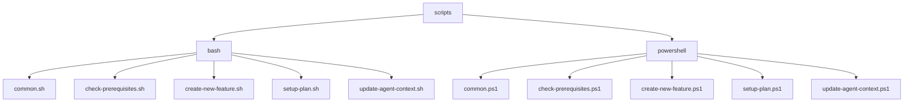
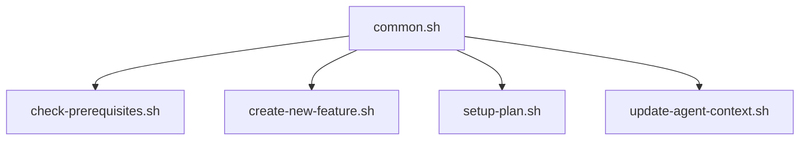
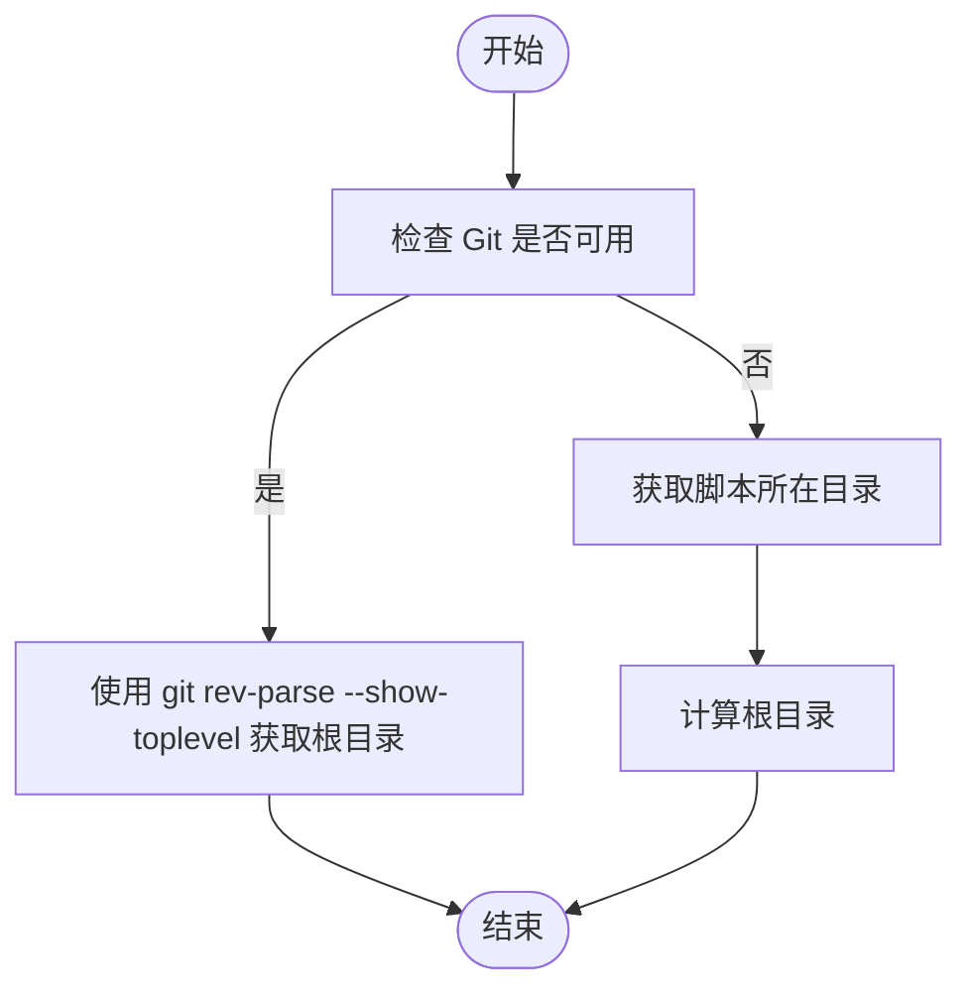
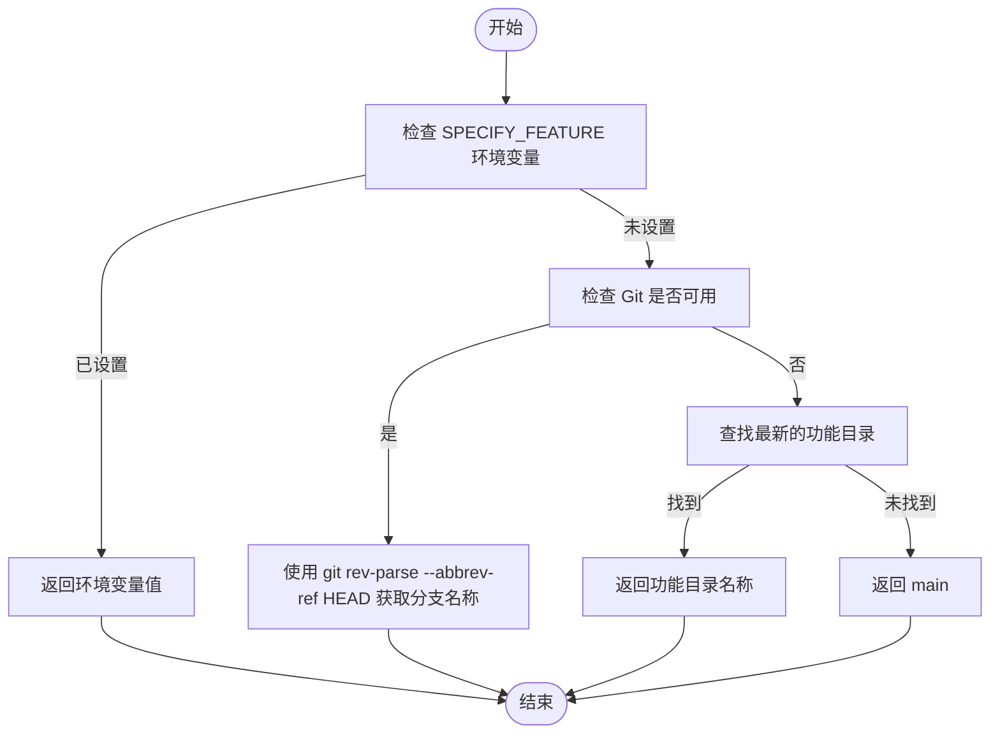
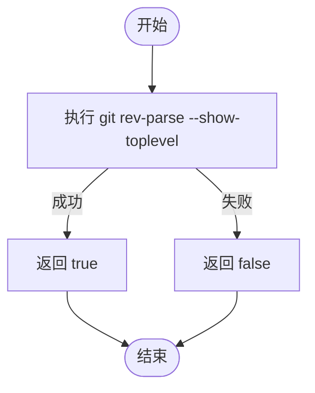
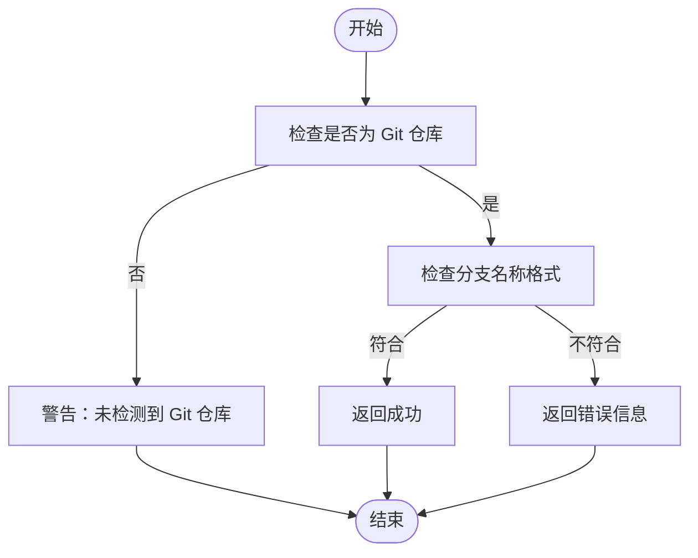
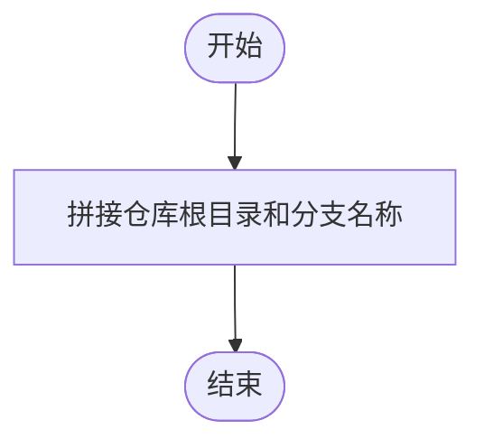
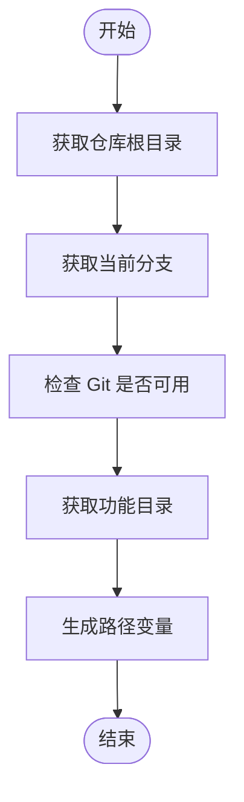
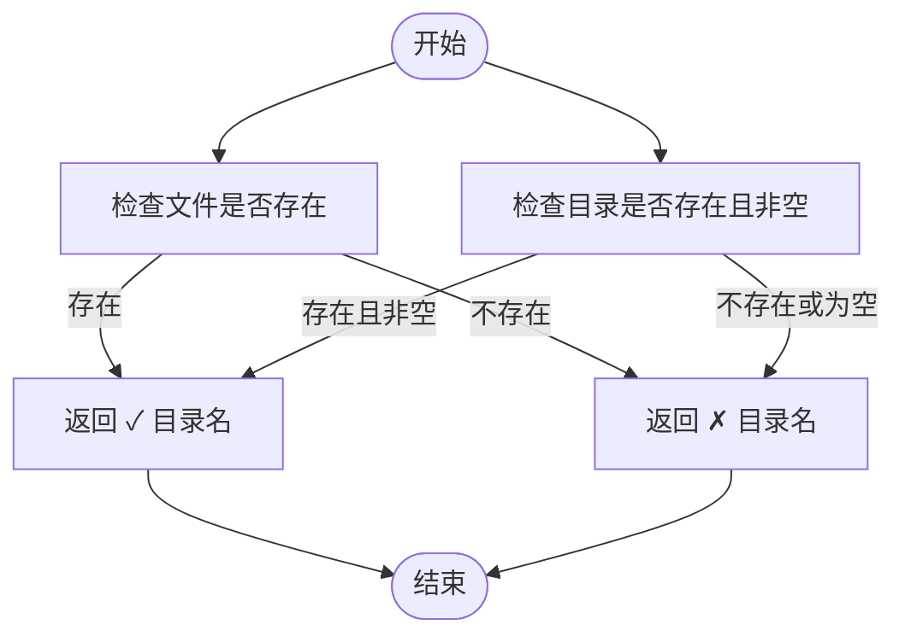

# common.sh 共享库

<cite>
**Referenced Files in This Document**   
- [common.sh](file://scripts/bash/common.sh)
- [check-prerequisites.sh](file://scripts/bash/check-prerequisites.sh)
- [create-new-feature.sh](file://scripts/bash/create-new-feature.sh)
- [setup-plan.sh](file://scripts/bash/setup-plan.sh)
- [update-agent-context.sh](file://scripts/bash/update-agent-context.sh)
</cite>

## 目录
1. [简介](#简介)
2. [项目结构](#项目结构)
3. [核心组件](#核心组件)
4. [架构概述](#架构概述)
5. [详细组件分析](#详细组件分析)
6. [依赖分析](#依赖分析)
7. [性能考虑](#性能考虑)
8. [故障排除指南](#故障排除指南)
9. [结论](#结论)

## 简介

`common.sh` 是一个 Bash 脚本共享工具库，旨在通过提供一组可重用的函数和变量来减少代码重复并提升脚本的可维护性。该库被项目中的所有 Bash 脚本通过 `source` 机制引入，为跨脚本的配置管理和功能实现提供了统一的基础。文档将详细解析其中定义的核心函数，如 `get_repo_root`、`get_current_branch`、`log_info`/`log_error`、`ensure_dir` 等，并说明其在项目中的角色和使用方式。

## 项目结构

项目结构如下所示，`common.sh` 位于 `scripts/bash/` 目录下，是所有 Bash 脚本的核心依赖。

**Diagram sources**
- [common.sh](file://scripts/bash/common.sh)
- [check-prerequisites.sh](file://scripts/bash/check-prerequisites.sh)
- [create-new-feature.sh](file://scripts/bash/create-new-feature.sh)
- [setup-plan.sh](file://scripts/bash/setup-plan.sh)
- [update-agent-context.sh](file://scripts/bash/update-agent-context.sh)

**Section sources**
- [common.sh](file://scripts/bash/common.sh)
- [check-prerequisites.sh](file://scripts/bash/check-prerequisites.sh)
- [create-new-feature.sh](file://scripts/bash/create-new-feature.sh)
- [setup-plan.sh](file://scripts/bash/setup-plan.sh)
- [update-agent-context.sh](file://scripts/bash/update-agent-context.sh)

## 核心组件

`common.sh` 提供了多个核心函数，这些函数被其他脚本广泛使用。主要功能包括获取仓库根目录、获取当前分支、检查 Git 可用性、验证功能分支、获取功能目录、获取功能路径、检查文件和目录等。

**Section sources**
- [common.sh](file://scripts/bash/common.sh)

## 架构概述

`common.sh` 作为共享库，被所有其他 Bash 脚本通过 `source` 机制引入。这种设计模式确保了代码的可重用性和一致性，减少了重复代码的编写。

**Diagram sources**
- [common.sh](file://scripts/bash/common.sh)
- [check-prerequisites.sh](file://scripts/bash/check-prerequisites.sh)
- [create-new-feature.sh](file://scripts/bash/create-new-feature.sh)
- [setup-plan.sh](file://scripts/bash/setup-plan.sh)
- [update-agent-context.sh](file://scripts/bash/update-agent-context.sh)

## 详细组件分析

### get_repo_root 函数分析

`get_repo_root` 函数用于获取仓库的根目录。它首先尝试使用 `git rev-parse --show-toplevel` 命令获取根目录，如果失败则回退到脚本所在目录的上级目录。

**Diagram sources**
- [common.sh](file://scripts/bash/common.sh#L4-L15)

**Section sources**
- [common.sh](file://scripts/bash/common.sh#L4-L15)

### get_current_branch 函数分析

`get_current_branch` 函数用于获取当前分支名称。它首先检查 `SPECIFY_FEATURE` 环境变量是否设置，然后尝试使用 `git rev-parse --abbrev-ref HEAD` 命令获取分支名称，最后回退到查找最新的功能目录。

**Diagram sources**
- [common.sh](file://scripts/bash/common.sh#L17-L68)

**Section sources**
- [common.sh](file://scripts/bash/common.sh#L17-L68)

### has_git 函数分析

`has_git` 函数用于检查 Git 是否可用。它通过 `git rev-parse --show-toplevel` 命令的执行结果来判断。

**Diagram sources**
- [common.sh](file://scripts/bash/common.sh#L70-L72)

**Section sources**
- [common.sh](file://scripts/bash/common.sh#L70-L72)

### check_feature_branch 函数分析

`check_feature_branch` 函数用于检查当前分支是否符合功能分支命名规范。它检查分支名称是否以三位数字开头。

**Diagram sources**
- [common.sh](file://scripts/bash/common.sh#L74-L85)

**Section sources**
- [common.sh](file://scripts/bash/common.sh#L74-L85)

### get_feature_dir 函数分析

`get_feature_dir` 函数用于获取功能目录的路径。它将仓库根目录和当前分支名称拼接成完整的路径。

**Diagram sources**
- [common.sh](file://scripts/bash/common.sh#L87-L88)

**Section sources**
- [common.sh](file://scripts/bash/common.sh#L87-L88)

### get_feature_paths 函数分析

`get_feature_paths` 函数用于获取所有功能路径的变量。它调用 `get_repo_root` 和 `get_current_branch` 函数，然后生成一系列路径变量。

**Diagram sources**
- [common.sh](file://scripts/bash/common.sh#L90-L112)

**Section sources**
- [common.sh](file://scripts/bash/common.sh#L90-L112)

### check_file 和 check_dir 函数分析

`check_file` 和 `check_dir` 函数用于检查文件和目录是否存在。它们返回带有检查结果的字符串。

**Diagram sources**
- [common.sh](file://scripts/bash/common.sh#L114-L115)

**Section sources**
- [common.sh](file://scripts/bash/common.sh#L114-L115)

## 依赖分析

`common.sh` 被多个脚本依赖，这些脚本通过 `source` 机制引入 `common.sh` 中的函数和变量。

**Diagram sources**
- [common.sh](file://scripts/bash/common.sh)
- [check-prerequisites.sh](file://scripts/bash/check-prerequisites.sh)
- [create-new-feature.sh](file://scripts/bash/create-new-feature.sh)
- [setup-plan.sh](file://scripts/bash/setup-plan.sh)
- [update-agent-context.sh](file://scripts/bash/update-agent-context.sh)

**Section sources**
- [common.sh](file://scripts/bash/common.sh)
- [check-prerequisites.sh](file://scripts/bash/check-prerequisites.sh)
- [create-new-feature.sh](file://scripts/bash/create-new-feature.sh)
- [setup-plan.sh](file://scripts/bash/setup-plan.sh)
- [update-agent-context.sh](file://scripts/bash/update-agent-context.sh)

## 性能考虑

`common.sh` 中的函数设计简洁，避免了不必要的复杂逻辑，确保了脚本的高效执行。通过使用 `set -e` 和 `set -u` 等选项，增强了脚本的健壮性和错误处理能力。

## 故障排除指南

当使用 `common.sh` 中的函数时，如果遇到问题，可以检查以下几点：
- 确保脚本有执行权限。
- 确保 `common.sh` 文件路径正确。
- 检查环境变量是否设置正确。
- 确认 Git 仓库状态正常。

**Section sources**
- [common.sh](file://scripts/bash/common.sh)

## 结论

`common.sh` 作为 Bash 脚本共享工具库，通过提供一组可重用的函数和变量，显著减少了代码重复并提升了脚本的可维护性。其设计模式确保了代码的一致性和可靠性，为项目的自动化流程提供了坚实的基础。