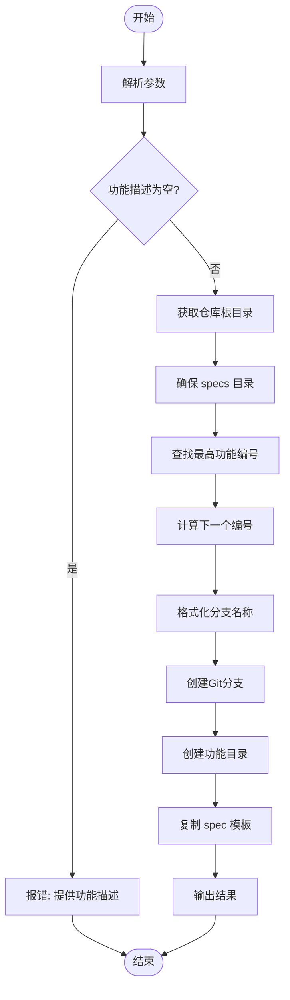
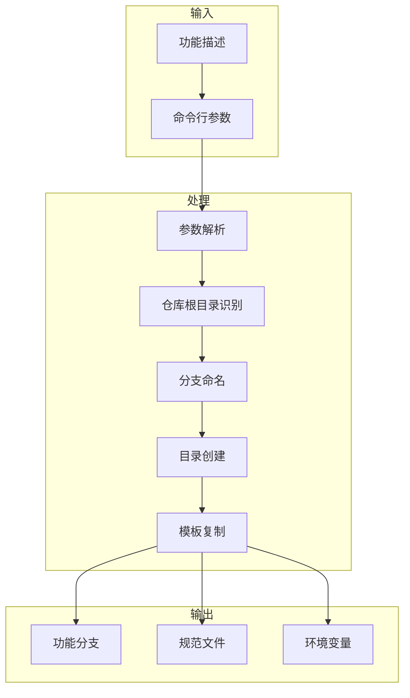
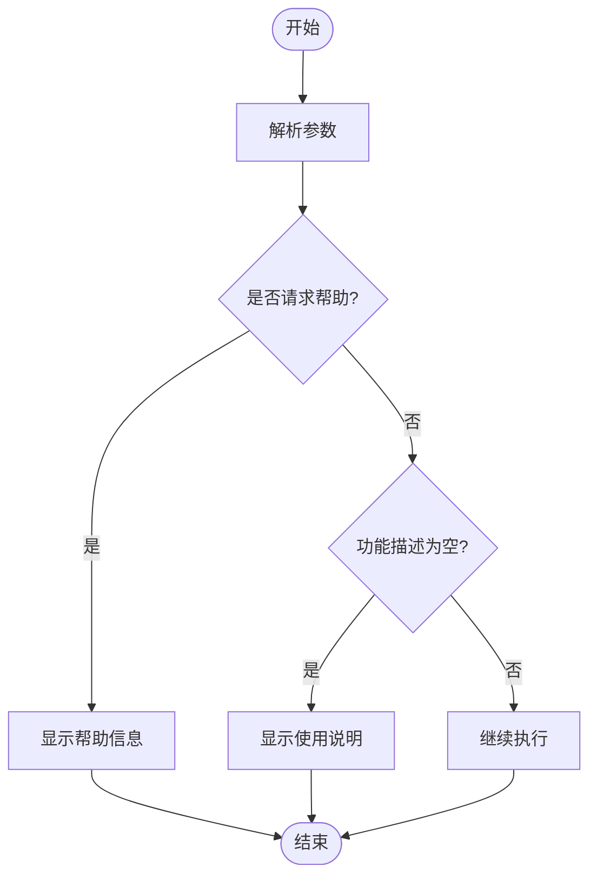
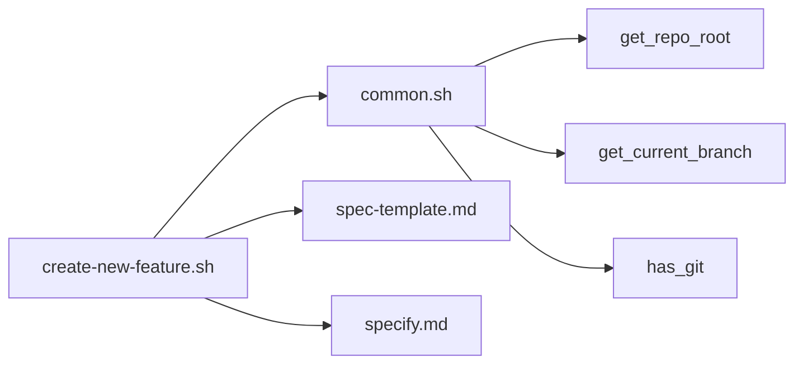

# create-new-feature.sh 脚本

<cite>
**本文档中引用的文件**  
- [create-new-feature.sh](file://scripts/bash/create-new-feature.sh)
- [spec-template.md](file://templates/spec-template.md)
- [common.sh](file://scripts/bash/common.sh)
- [specify.md](file://templates/commands/specify.md)
- [create-new-feature.ps1](file://scripts/powershell/create-new-feature.ps1)
</cite>

## 目录
1. [简介](#简介)
2. [项目结构](#项目结构)
3. [核心组件](#核心组件)
4. [架构概述](#架构概述)
5. [详细组件分析](#详细组件分析)
6. [依赖分析](#依赖分析)
7. [性能考虑](#性能考虑)
8. [故障排除指南](#故障排除指南)
9. [结论](#结论)

## 简介
`create-new-feature.sh` 脚本是规范驱动开发（SDD）流程的起点，用于自动化初始化新功能开发。该脚本通过创建新的 Git 功能分支、生成功能规范文件并填充模板内容，为开发者提供标准化的开发环境。脚本支持通过命令行参数和环境变量接收 AI 代理输入，确保与 `/specify` 命令模板的无缝集成。

## 项目结构
`create-new-feature.sh` 脚本位于 `scripts/bash/` 目录下，是 `spec-kit` 项目中用于初始化新功能的核心组件。该脚本与 `templates/` 目录下的 `spec-template.md` 模板文件协同工作，创建结构化的功能规范文档。

**图示来源**
- [create-new-feature.sh](file://scripts/bash/create-new-feature.sh#L1-L58)

**本节来源**
- [create-new-feature.sh](file://scripts/bash/create-new-feature.sh#L1-L58)

## 核心组件
`create-new-feature.sh` 脚本的核心功能包括参数解析、仓库根目录识别、功能分支创建、规范文件生成和环境变量设置。脚本通过 `--json` 参数支持 JSON 格式输出，便于与其他工具集成。

**本节来源**
- [create-new-feature.sh](file://scripts/bash/create-new-feature.sh#L1-L97)

## 架构概述
`create-new-feature.sh` 脚本采用模块化设计，通过一系列函数和条件判断实现功能初始化。脚本首先解析命令行参数，然后确定仓库根目录，接着创建功能分支和目录结构，最后生成规范文件并设置环境变量。

**图示来源**
- [create-new-feature.sh](file://scripts/bash/create-new-feature.sh#L1-L97)

## 详细组件分析

### 参数解析与验证
脚本首先解析命令行参数，支持 `--json` 和 `--help` 选项。如果未提供功能描述，脚本将输出使用说明并退出。

**图示来源**
- [create-new-feature.sh](file://scripts/bash/create-new-feature.sh#L1-L20)

**本节来源**
- [create-new-feature.sh](file://scripts/bash/create-new-feature.sh#L1-L20)

### 仓库根目录识别
脚本通过 `git rev-parse --show-toplevel` 命令或搜索 `.git` 和 `.specify` 目录来确定仓库根目录，确保在非 Git 仓库中也能正常工作。

**本节来源**
- [create-new-feature.sh](file://scripts/bash/create-new-feature.sh#L22-L40)

### 功能分支创建
脚本根据现有功能目录的最高编号生成新的三位数编号，并将功能描述转换为小写、用连字符分隔的格式，创建符合规范的功能分支名称。

**本节来源**
- [create-new-feature.sh](file://scripts/bash/create-new-feature.sh#L50-L70)

### 规范文件生成
脚本在 `specs/` 目录下创建新的功能目录，并从 `.specify/templates/spec-template.md` 复制模板文件到 `spec.md`，如果模板不存在则创建空文件。

**本节来源**
- [create-new-feature.sh](file://scripts/bash/create-new-feature.sh#L72-L85)

### 环境变量设置
脚本设置 `SPECIFY_FEATURE` 环境变量，为后续的开发流程提供上下文信息。

**本节来源**
- [create-new-feature.sh](file://scripts/bash/create-new-feature.sh#L86-L87)

## 依赖分析
`create-new-feature.sh` 脚本依赖于 `common.sh` 中的通用函数，并与 `specify.md` 命令模板集成。脚本还依赖于 `spec-template.md` 模板文件来生成规范文档。

**图示来源**
- [create-new-feature.sh](file://scripts/bash/create-new-feature.sh#L1-L97)
- [common.sh](file://scripts/bash/common.sh#L1-L113)
- [specify.md](file://templates/commands/specify.md#L1-L24)

**本节来源**
- [create-new-feature.sh](file://scripts/bash/create-new-feature.sh#L1-L97)
- [common.sh](file://scripts/bash/common.sh#L1-L113)
- [specify.md](file://templates/commands/specify.md#L1-L24)

## 性能考虑
`create-new-feature.sh` 脚本采用高效的 Bash 脚本编写，避免了不必要的系统调用和文件操作。脚本通过 `set -e` 确保在任何命令失败时立即退出，提高了执行的可靠性。

## 故障排除指南
当 `create-new-feature.sh` 脚本执行失败时，应首先检查是否提供了功能描述。如果仓库根目录无法确定，确保在仓库内执行脚本。如果 Git 分支创建失败，检查 Git 配置和权限。

**本节来源**
- [create-new-feature.sh](file://scripts/bash/create-new-feature.sh#L1-L97)

## 结论
`create-new-feature.sh` 脚本是规范驱动开发流程的关键组件，通过自动化功能初始化，提高了开发效率和一致性。脚本的设计考虑了各种边界情况，确保在不同环境下都能可靠运行。