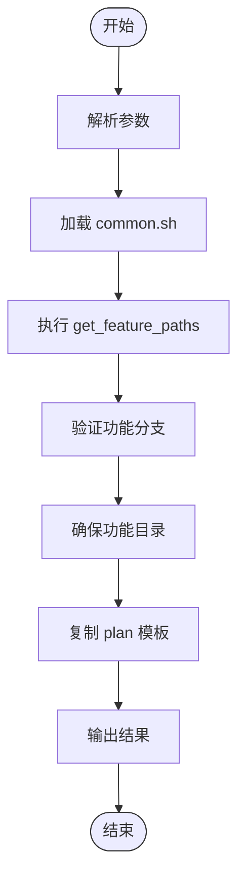
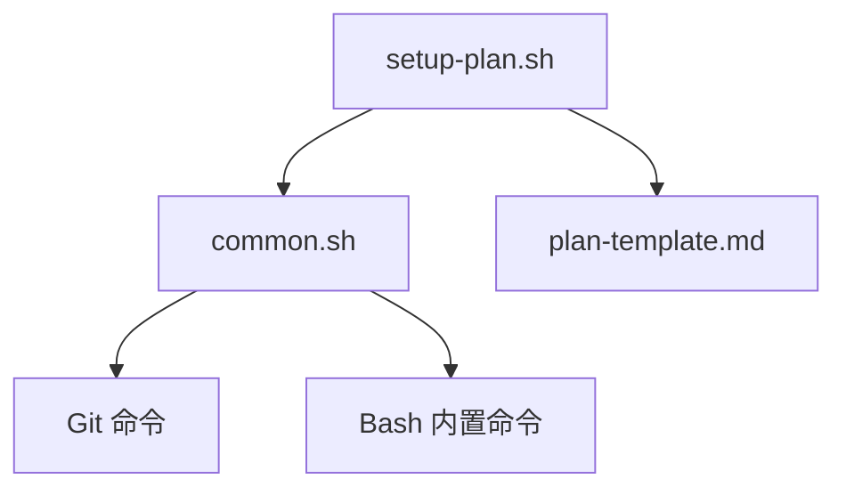

# setup-plan.sh 脚本

<cite>
**本文档中引用的文件**  
- [setup-plan.sh](file://scripts/bash/setup-plan.sh)
- [common.sh](file://scripts/bash/common.sh)
- [plan-template.md](file://templates/plan-template.md)
- [memory/constitution.md](file://memory/constitution.md)
</cite>

## 目录
1. [简介](#简介)
2. [项目结构](#项目结构)
3. [核心组件](#核心组件)
4. [架构概述](#架构概述)
5. [详细组件分析](#详细组件分析)
6. [依赖分析](#依赖分析)
7. [性能考虑](#性能考虑)
8. [故障排除指南](#故障排除指南)
9. [结论](#结论)
10. [附录](#附录)（如有必要）

## 简介
`setup-plan.sh` 脚本是 Spec-Driven Development (SDD) 工作流中的关键组件，负责在技术方案生成阶段初始化环境。该脚本通过解析功能规范（`spec.md`）、调用 `plan-template.md` 模板来生成实现计划（`plan.md`），并设置必要的上下文环境。它与 `/plan` 命令模板紧密交互，传递需求上下文和目标架构约束，为后续的自动化处理提供结构化的输出。

## 项目结构
`setup-plan.sh` 脚本位于 `scripts/bash/` 目录下，是整个脚本系统的一部分。它依赖于 `common.sh` 提供的共享函数和变量，并使用 `templates/plan-template.md` 作为生成实现计划的基础模板。脚本的执行结果（`plan.md`）将被放置在 `specs/[feature-branch]/` 目录下，与功能规范（`spec.md`）和其他设计文档（如 `research.md`、`data-model.md`）共同构成完整的规格文档集。



**图示来源**
- [setup-plan.sh](file://scripts/bash/setup-plan.sh#L1-L17)

**本节来源**
- [setup-plan.sh](file://scripts/bash/setup-plan.sh#L1-L17)

## 核心组件
`setup-plan.sh` 脚本的核心功能包括：解析命令行参数、加载共享函数、获取路径变量、验证功能分支、确保功能目录存在、复制计划模板以及输出结果。这些功能协同工作，确保了计划流程的可靠启动。

**本节来源**
- [setup-plan.sh](file://scripts/bash/setup-plan.sh#L1-L60)
- [common.sh](file://scripts/bash/common.sh#L1-L114)

## 架构概述
`setup-plan.sh` 脚本的架构设计遵循模块化原则，通过 `common.sh` 封装了共享的逻辑，如获取仓库根目录、确定当前分支、检查 Git 状态等。这种设计提高了代码的可维护性和可重用性。脚本的执行流程清晰，从参数解析到结果输出，每一步都有明确的目的和作用。

```mermaid
classDiagram
class common.sh {
+get_repo_root() string
+get_current_branch() string
+check_feature_branch(branch) bool
+get_feature_dir(repo_root, branch) string
+get_feature_paths() string
+check_file(path, label) void
+check_dir(path, label) void
}
class create-new-feature.sh {
+FEATURE_DESCRIPTION string
+FEATURE_NUM string
+BRANCH_NAME string
}
class setup-plan.sh {
+JSON_MODE bool
}
class check-task-prerequisites.sh {
+JSON_MODE bool
}
class update-agent-context.sh {
+AGENT_TYPE string
}
common.sh <|-- create-new-feature.sh : "source"
common.sh <|-- setup-plan.sh : "source"
common.sh <|-- check-task-prerequisites.sh : "source"
common.sh <|-- get-feature-paths.sh : "source"
common.sh <|-- update-agent-context.sh : "source"
style common.sh fill : #69f,stroke : #333
style create-new-feature.sh fill : #f96,stroke : #333
style setup-plan.sh fill : #f96,stroke : #333
style check-task-prerequisites.sh fill : #f96,stroke : #333
style get-feature-paths.sh fill : #f96,stroke : #333
style update-agent-context.sh fill : #f96,stroke : #333
```

**图示来源**
- [common.sh](file://scripts/bash/common.sh#L1-L37)

## 详细组件分析
### setup-plan.sh 分析
`setup-plan.sh` 脚本的主要职责是协调 SDD 流程中的计划阶段，为实施准备环境。

#### 执行流程分析
1. **解析参数**：脚本首先解析命令行参数，支持 `--json` 和 `--help` 选项。
2. **加载 common.sh**：通过 `source` 命令加载 `common.sh`，获取共享函数和变量。
3. **获取路径**：执行 `get_feature_paths` 函数，获取仓库根目录、当前分支、功能目录等关键路径。
4. **验证分支**：调用 `check_feature_branch` 函数，确保当前处于正确的功能分支上。
5. **确保目录**：使用 `mkdir -p` 确保功能目录存在。
6. **复制模板**：检查 `plan-template.md` 是否存在，如果存在则复制到目标位置（`specs/[branch]/plan.md`），否则创建一个空文件。
7. **输出结果**：根据是否启用 `--json` 模式，以文本或 JSON 格式输出关键路径信息。

**本节来源**
- [setup-plan.sh](file://scripts/bash/setup-plan.sh#L1-L60)

### common.sh 分析
`common.sh` 是整个脚本系统的基础，封装了所有脚本共享的函数和变量。

#### 核心函数
- `get_repo_root()`：获取仓库根目录，支持 Git 和非 Git 仓库。
- `get_current_branch()`：确定当前分支，优先使用 `SPECIFY_FEATURE` 环境变量，其次使用 Git，最后尝试从 `specs/` 目录推断。
- `check_feature_branch(branch)`：验证分支名称是否符合 `###-feature-name` 的格式。
- `get_feature_paths()`：生成一系列路径变量，如 `FEATURE_DIR`、`FEATURE_SPEC`、`IMPL_PLAN` 等。

**本节来源**
- [common.sh](file://scripts/bash/common.sh#L1-L114)

## 依赖分析
`setup-plan.sh` 脚本依赖于 `common.sh` 提供的函数和变量。`common.sh` 本身不依赖外部脚本，但其功能依赖于 Git 命令（用于确定仓库根目录和当前分支）和 Bash 内置命令。此外，脚本还依赖于 `templates/plan-template.md` 文件的存在，如果该文件不存在，脚本会发出警告并创建一个空的 `plan.md` 文件。



**图示来源**
- [setup-plan.sh](file://scripts/bash/setup-plan.sh#L1-L60)
- [common.sh](file://scripts/bash/common.sh#L1-L114)

## 性能考虑
`setup-plan.sh` 脚本的性能主要受文件系统操作的影响。脚本执行的大部分时间都花在了文件读取和写入上，如加载 `common.sh`、复制 `plan-template.md` 等。由于这些操作通常很快，因此脚本的整体性能是高效的。在非 Git 仓库中，脚本会尝试从 `specs/` 目录推断最新功能分支，这可能会涉及目录遍历，但通常不会成为性能瓶颈。

## 故障排除指南
### 常见执行错误
- **错误：未在功能分支上**：如果当前分支名称不符合 `###-feature-name` 的格式，脚本会报错并退出。解决方案是切换到正确的功能分支。
- **错误：无法确定当前功能**：如果既没有 Git 仓库也没有设置 `SPECIFY_FEATURE` 环境变量，脚本无法确定当前功能。解决方案是设置 `SPECIFY_FEATURE` 环境变量或创建一个功能分支。
- **警告：未找到计划模板**：如果 `plan-template.md` 文件不存在，脚本会发出警告并创建一个空的 `plan.md` 文件。解决方案是确保 `.specify/templates/` 目录下存在 `plan-template.md` 文件。

**本节来源**
- [setup-plan.sh](file://scripts/bash/setup-plan.sh#L1-L60)
- [common.sh](file://scripts/bash/common.sh#L1-L114)

## 结论
`setup-plan.sh` 脚本是 SDD 工作流中不可或缺的一环，它通过自动化的方式初始化了技术方案的生成环境。脚本设计简洁、功能明确，通过与 `common.sh` 和 `plan-template.md` 的协同工作，为后续的自动化处理奠定了坚实的基础。对于高级用户，可以通过定制 `plan-template.md` 模板、集成外部分析工具或修改输出格式来扩展脚本的功能。

## 附录
### 参数说明
- `--json`：以 JSON 格式输出结果。
- `--help` 或 `-h`：显示帮助信息。

### 依赖项检查机制
脚本通过 `common.sh` 中的 `has_git()` 和 `check_feature_branch()` 函数来检查 Git 依赖项和分支状态。

### 执行成功与失败的判定标准
- **成功**：脚本成功复制模板（或创建空文件）并输出结果。
- **失败**：脚本因分支验证失败或无法确定当前功能而退出。

### 扩展指南
- **定制化计划模板**：修改 `templates/plan-template.md` 文件以适应特定项目的需求。
- **集成外部分析工具**：在 `plan-template.md` 中添加对第三方分析工具的调用。
- **修改输出格式**：在 `setup-plan.sh` 脚本中添加新的输出格式选项。