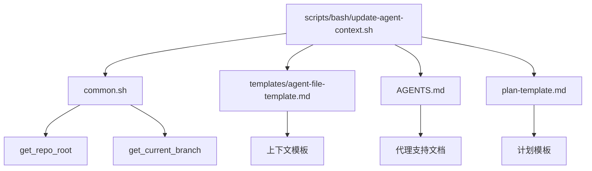
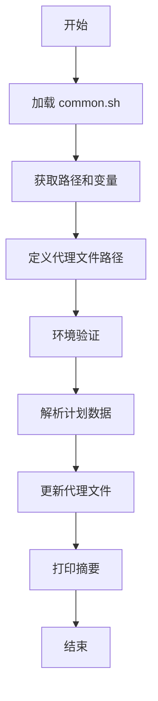
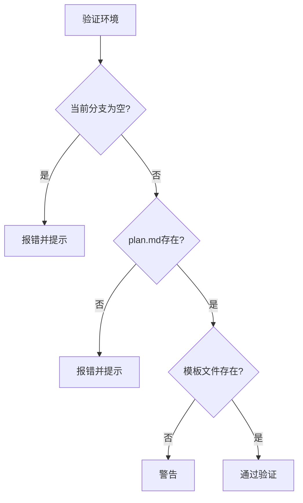
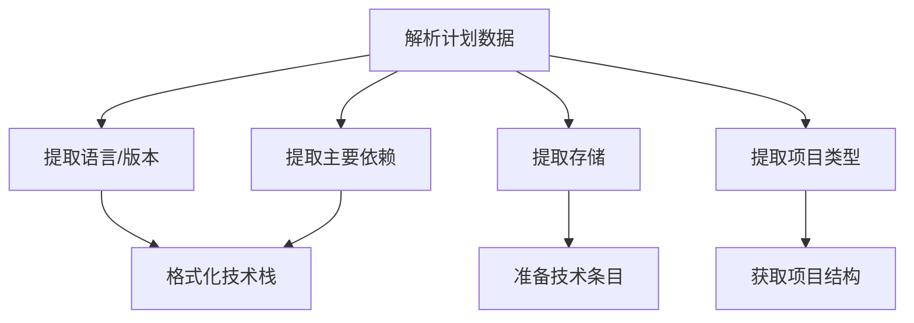
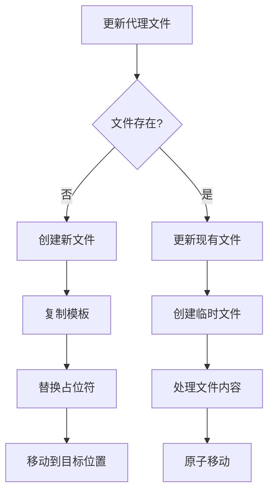
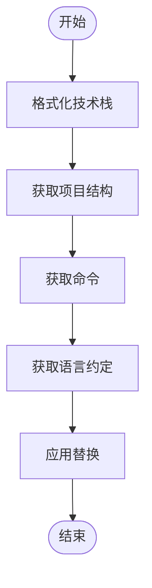
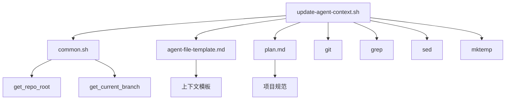

# update-agent-context.sh 脚本

<cite>
**本文档引用的文件**
- [update-agent-context.sh](file://scripts/bash/update-agent-context.sh)
- [common.sh](file://scripts/bash/common.sh)
- [agent-file-template.md](file://templates/agent-file-template.md)
- [AGENTS.md](file://AGENTS.md)
- [plan-template.md](file://templates/plan-template.md)
</cite>

## 目录
1. [简介](#简介)
2. [项目结构](#项目结构)
3. [核心组件](#核心组件)
4. [架构概述](#架构概述)
5. [详细组件分析](#详细组件分析)
6. [依赖分析](#依赖分析)
7. [性能考虑](#性能考虑)
8. [故障排除指南](#故障排除指南)
9. [结论](#结论)

## 简介
`update-agent-context.sh` 脚本是 Spec-Driven Development (SDD) 工作流中的关键组件，负责维护 AI 代理上下文的一致性。该脚本通过解析项目规范文件（如 plan.md）来收集当前项目状态，包括最新提交、当前分支和待办任务等信息，并更新相应的上下文缓存文件。此过程确保 AI 代理始终基于最新的项目信息进行推理和决策。

脚本支持多种 AI 代理，包括 Claude、Gemini、Copilot、Cursor、Qwen、opencode、Codex 和 Windsurf，能够根据指定的代理类型更新单个或所有现有的代理文件。当没有指定特定代理时，脚本会更新所有现有代理文件；如果不存在任何代理文件，则会创建一个默认的 Claude 文件。

该脚本在 `/implement` 或其他持续集成命令触发时执行，确保开发过程中的上下文同步。它实现了环境验证、计划数据提取、代理文件管理、内容生成和多代理支持等功能，为开发者提供了自定义上下文采集字段、集成项目管理工具（如 Jira）或优化性能的扩展路径，并包含处理权限错误和磁盘写入失败的容错方案。

**Section sources**
- [update-agent-context.sh](file://scripts/bash/update-agent-context.sh#L1-L720)

## 项目结构
`update-agent-context.sh` 脚本位于 `scripts/bash/` 目录下，与 `common.sh` 公共函数脚本和 `update-agent-context.ps1` PowerShell 版本脚本并列。该脚本依赖于 `templates/agent-file-template.md` 模板文件来创建新的代理上下文文件，并将生成的上下文文件（如 CLAUDE.md、GEMINI.md 等）放置在仓库根目录或特定子目录中。

脚本通过 `common.sh` 中的 `get_repo_root` 和 `get_current_branch` 函数获取仓库根目录和当前分支信息，确保在 Git 和非 Git 环境下都能正确运行。主要的上下文数据结构设计遵循 `agent-file-template.md` 的格式，包含活动技术、项目结构、命令、代码风格和最近更改等部分。

**Diagram sources**
- [update-agent-context.sh](file://scripts/bash/update-agent-context.sh#L1-L720)
- [common.sh](file://scripts/bash/common.sh#L1-L114)
- [agent-file-template.md](file://templates/agent-file-template.md#L1-L23)

**Section sources**
- [update-agent-context.sh](file://scripts/bash/update-agent-context.sh#L1-L720)
- [common.sh](file://scripts/bash/common.sh#L1-L114)

## 核心组件
`update-agent-context.sh` 脚本的核心组件包括环境验证、计划数据提取、代理文件管理和内容生成。环境验证函数 `validate_environment` 确保当前分支/功能、plan.md 文件和模板文件的存在性和可访问性。计划数据提取函数 `parse_plan_data` 和 `extract_plan_field` 从 plan.md 文件中解析项目元数据，如语言/版本、主要依赖、存储和项目类型。

代理文件管理通过 `update_agent_file`、`create_new_agent_file` 和 `update_existing_agent_file` 函数实现，支持创建新文件或更新现有文件，同时保留手动添加的内容。内容生成函数如 `format_technology_stack`、`get_project_structure` 和 `get_commands_for_language` 根据项目信息动态生成技术栈、项目结构和构建/测试命令。

脚本还实现了多代理支持，通过 `update_specific_agent` 和 `update_all_existing_agents` 函数处理不同代理类型的文件路径和命名约定，确保与各种 AI 代理的兼容性。

**Section sources**
- [update-agent-context.sh](file://scripts/bash/update-agent-context.sh#L148-L720)

## 架构概述
`update-agent-context.sh` 脚本的架构分为配置与全局变量、实用工具函数、验证函数、计划解析函数、模板与内容生成函数、主代理文件更新函数、代理选择与处理以及主执行流程几个主要部分。脚本首先加载 `common.sh` 中的公共函数，获取所有路径和变量，然后定义代理特定的文件路径和模板文件。

实用工具函数包括日志记录、清理临时文件和陷阱设置，确保脚本的健壮性和资源管理。验证函数检查环境是否满足运行条件，而计划解析函数负责从 plan.md 文件中提取关键项目信息。模板与内容生成函数根据提取的数据创建或更新代理上下文文件，保持格式一致性和信息完整性。

主执行流程由 `main` 函数控制，依次进行环境验证、计划数据解析、代理文件更新和结果汇总，确保整个更新过程的有序性和可靠性。

**Diagram sources**
- [update-agent-context.sh](file://scripts/bash/update-agent-context.sh#L1-L720)

## 详细组件分析

### 环境验证分析
`validate_environment` 函数确保脚本运行所需的环境条件得到满足。它检查当前分支/功能是否可以确定，plan.md 文件是否存在，以及模板文件是否可读。对于 Git 仓库，它验证是否处于功能分支上；对于非 Git 仓库，它检查 `SPECIFY_FEATURE` 环境变量或尝试找到最新的功能目录。

**Diagram sources**
- [update-agent-context.sh](file://scripts/bash/update-agent-context.sh#L148-L179)

**Section sources**
- [update-agent-context.sh](file://scripts/bash/update-agent-context.sh#L148-L179)

### 计划数据提取分析
`parse_plan_data` 函数使用 `extract_plan_field` 辅助函数从 plan.md 文件中提取项目元数据。`extract_plan_field` 使用 `grep` 和 `sed` 命令查找特定模式的行并提取其值，过滤掉 "NEEDS CLARIFICATION" 和 "N/A" 等无效值。提取的信息包括语言/版本、主要依赖、存储和项目类型，这些信息用于后续的内容生成。

**Diagram sources**
- [update-agent-context.sh](file://scripts/bash/update-agent-context.sh#L181-L261)

**Section sources**
- [update-agent-context.sh](file://scripts/bash/update-agent-context.sh#L181-L261)

### 代理文件管理分析
`update_agent_file` 函数是代理文件管理的核心，负责创建新文件或更新现有文件。对于新文件，它使用 `create_new_agent_file` 函数从模板复制并替换占位符；对于现有文件，它调用 `update_existing_agent_file` 函数进行增量更新。更新过程使用临时文件确保原子性，避免写入冲突。

**Diagram sources**
- [update-agent-context.sh](file://scripts/bash/update-agent-context.sh#L471-L539)

**Section sources**
- [update-agent-context.sh](file://scripts/bash/update-agent-context.sh#L263-L539)

### 内容生成分析
内容生成涉及多个函数协同工作。`format_technology_stack` 将语言和框架组合成适当格式的技术栈字符串。`get_project_structure` 根据项目类型返回相应的目录结构。`get_commands_for_language` 为不同编程语言生成适当的构建和测试命令。这些函数的输出被用于创建或更新代理上下文文件中的相应部分。

**Diagram sources**
- [update-agent-context.sh](file://scripts/bash/update-agent-context.sh#L263-L354)

**Section sources**
- [update-agent-context.sh](file://scripts/bash/update-agent-context.sh#L263-L354)

## 依赖分析
`update-agent-context.sh` 脚本的主要依赖包括 `common.sh` 提供的公共函数、`agent-file-template.md` 模板文件和 `plan.md` 规范文件。脚本通过 `source "$SCRIPT_DIR/common.sh"` 加载公共函数，获取仓库根目录、当前分支等关键信息。

脚本还依赖于系统工具如 `git`、`grep`、`sed` 和 `mktemp`，这些工具用于版本控制操作、文本处理和临时文件管理。对于不同的 AI 代理，脚本需要访问特定的文件路径，如 `.claude/commands/` 或 `.github/copilot-instructions.md`，这些路径在脚本中作为全局变量定义。

**Diagram sources**
- [update-agent-context.sh](file://scripts/bash/update-agent-context.sh#L1-L720)
- [common.sh](file://scripts/bash/common.sh#L1-L114)

**Section sources**
- [update-agent-context.sh](file://scripts/bash/update-agent-context.sh#L1-L720)
- [common.sh](file://scripts/bash/common.sh#L1-L114)

## 性能考虑
`update-agent-context.sh` 脚本在性能方面考虑了几个关键点。首先，它使用 `set -e`、`set -u` 和 `set -o pipefail` 来启用严格的错误处理，确保任何错误都会导致脚本立即退出，避免产生不完整或错误的上下文文件。

其次，脚本在更新现有文件时使用临时文件和原子移动操作，这不仅保证了数据完整性，还减少了文件锁定的时间窗口，降低了并发写入冲突的风险。此外，脚本通过 `trap cleanup EXIT INT TERM` 设置清理陷阱，确保即使在脚本被中断的情况下也能正确清理临时文件。

对于大规模项目，脚本可以通过并行处理多个代理文件来进一步优化性能，尽管当前实现是顺序处理的。未来可以通过引入并行执行机制来提高效率，特别是在需要更新多个代理文件的情况下。

## 故障排除指南
当 `update-agent-context.sh` 脚本遇到问题时，常见的错误包括无法确定当前功能、缺少 plan.md 文件、模板文件不可读或不可写、以及代理文件的权限问题。脚本提供了详细的日志输出，帮助诊断这些问题。

对于权限错误，应检查目标文件和目录的读写权限。对于磁盘写入失败，应确认磁盘空间充足且文件系统正常。如果脚本因缺少依赖工具而失败，应确保 `git`、`grep`、`sed` 等系统工具已正确安装。

脚本的容错机制包括对关键操作的错误检查和适当的错误消息输出，以及通过清理陷阱确保资源的正确释放。开发者可以通过查看脚本输出的日志信息来快速定位和解决问题。

**Section sources**
- [update-agent-context.sh](file://scripts/bash/update-agent-context.sh#L85-L147)
- [update-agent-context.sh](file://scripts/bash/update-agent-context.sh#L471-L539)

## 结论
`update-agent-context.sh` 脚本是 Spec-Driven Development 工作流中不可或缺的一部分，它通过自动化的方式维护 AI 代理的上下文一致性，确保开发过程的高效和准确。脚本的设计充分考虑了环境验证、数据提取、文件管理和内容生成等多个方面，支持多种 AI 代理，并提供了良好的扩展性和容错能力。

通过深入理解脚本的架构和实现细节，开发者可以更好地利用这一工具，甚至根据项目需求进行定制和优化。无论是集成新的项目管理工具，还是调整上下文采集字段，`update-agent-context.sh` 都提供了一个坚实的基础，助力团队实现更高效的软件开发。