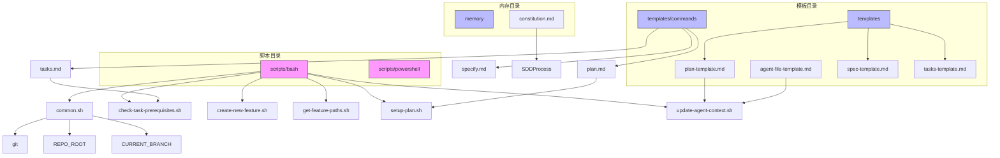
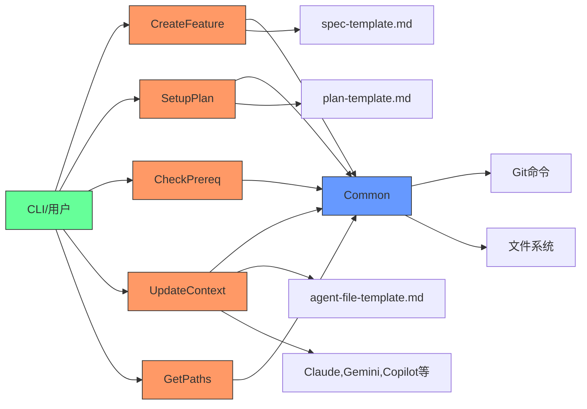
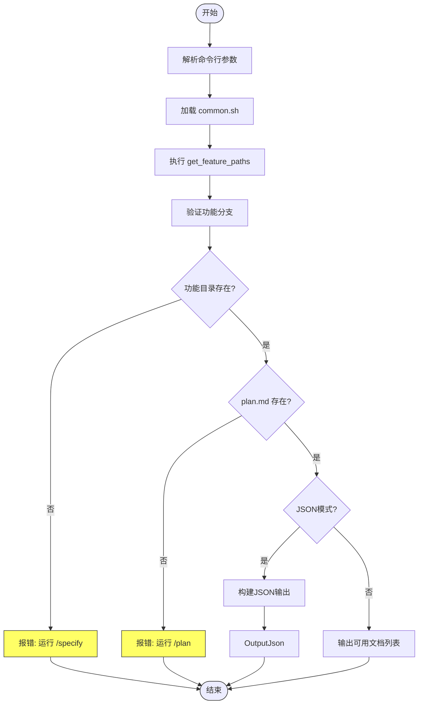
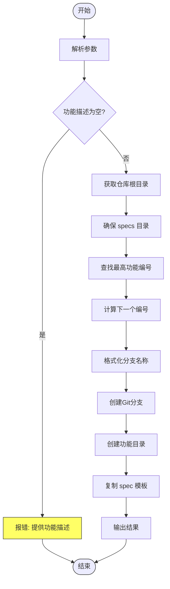
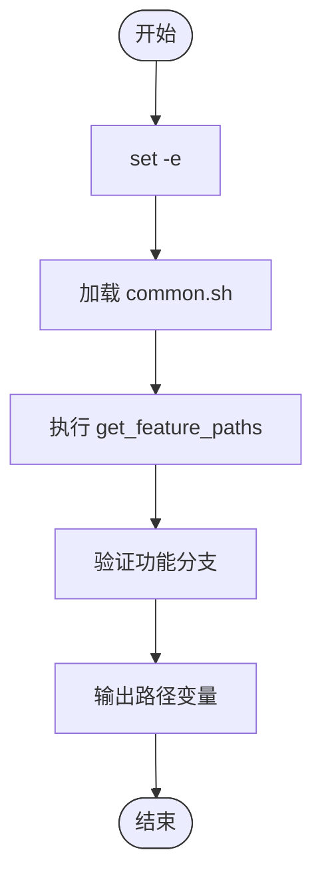
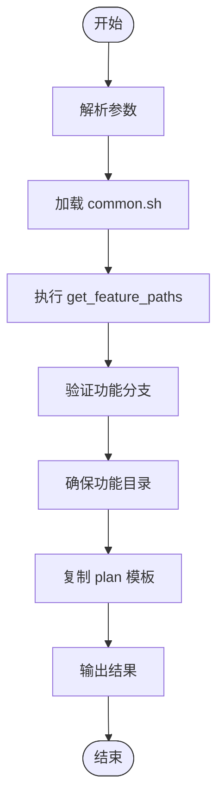
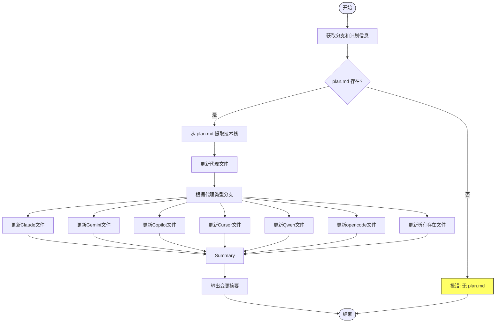
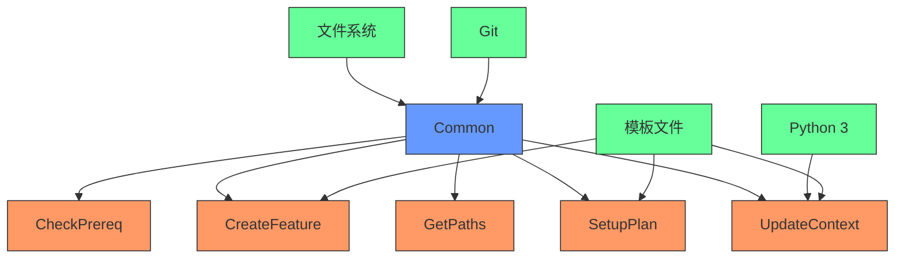

# Bash脚本

<cite>
**本文档中引用的文件**   
- [check-task-prerequisites.sh](file://scripts/bash/check-task-prerequisites.sh)
- [create-new-feature.sh](file://scripts/bash/create-new-feature.sh)
- [get-feature-paths.sh](file://scripts/bash/get-feature-paths.sh)
- [setup-plan.sh](file://scripts/bash/setup-plan.sh)
- [update-agent-context.sh](file://scripts/bash/update-agent-context.sh)
- [common.sh](file://scripts/bash/common.sh)
</cite>

## 目录
1. [简介](#简介)
2. [项目结构](#项目结构)
3. [核心组件](#核心组件)
4. [架构概述](#架构概述)
5. [详细组件分析](#详细组件分析)
6. [依赖分析](#依赖分析)
7. [性能考虑](#性能考虑)
8. [故障排除指南](#故障排除指南)
9. [结论](#结论)

## 简介
本文档详细说明了Spec-Driven Development（SDD）工具包中的Bash脚本系统。这些脚本构成了自动化开发流水线的核心，通过标准化的流程协调从功能创建到AI代理上下文更新的各个阶段。脚本设计遵循意图驱动开发原则，在编码之前优先定义"做什么"而非"如何做"。系统包含五个主要功能脚本和一个共享函数库，支持JSON模式输出以实现与其他工具的集成，并通过严格的分支命名约定（如001-feature-name）确保工作流的一致性。

## 项目结构
Bash脚本系统位于`scripts/bash/`目录下，与PowerShell脚本并列，为不同操作系统提供跨平台支持。脚本通过`common.sh`共享核心功能，并与`templates/`目录中的文档模板协同工作，形成完整的SDD自动化流水线。



**Diagram sources**
- [check-task-prerequisites.sh](file://scripts/bash/check-task-prerequisites.sh)
- [create-new-feature.sh](file://scripts/bash/create-new-feature.sh)
- [get-feature-paths.sh](file://scripts/bash/get-feature-paths.sh)
- [setup-plan.sh](file://scripts/bash/setup-plan.sh)
- [update-agent-context.sh](file://scripts/bash/update-agent-context.sh)
- [common.sh](file://scripts/bash/common.sh)

**Section sources**
- [check-task-prerequisites.sh](file://scripts/bash/check-task-prerequisites.sh)
- [create-new-feature.sh](file://scripts/bash/create-new-feature.sh)
- [get-feature-paths.sh](file://scripts/bash/get-feature-paths.sh)
- [setup-plan.sh](file://scripts/bash/setup-plan.sh)
- [update-agent-context.sh](file://scripts/bash/update-agent-context.sh)
- [common.sh](file://scripts/bash/common.sh)

## 核心组件
核心组件由五个功能脚本和一个共享函数库组成。`common.sh`提供了路径解析、分支验证和文件检查等基础功能，被所有其他脚本引用。`create-new-feature.sh`负责初始化新功能的整个环境，包括创建Git分支和目录结构。`setup-plan.sh`协调计划阶段，为实施准备模板。`check-task-prerequisites.sh`在任务生成前验证系统依赖和环境配置。`update-agent-context.sh`作为AI集成的关键，动态更新多个AI代理的上下文文件。`get-feature-paths.sh`提供路径解析服务，确保所有脚本使用一致的路径约定。

**Section sources**
- [check-task-prerequisites.sh](file://scripts/bash/check-task-prerequisites.sh#L1-L15)
- [create-new-feature.sh](file://scripts/bash/create-new-feature.sh#L1-L58)
- [get-feature-paths.sh](file://scripts/bash/get-feature-paths.sh#L1-L7)
- [setup-plan.sh](file://scripts/bash/setup-plan.sh#L1-L17)
- [update-agent-context.sh](file://scripts/bash/update-agent-context.sh#L1-L66)
- [common.sh](file://scripts/bash/common.sh#L1-L37)

## 架构概述
Bash脚本系统采用模块化架构，以`common.sh`为核心共享库，其他脚本作为独立的功能模块。系统通过环境变量和函数调用进行通信，遵循Unix哲学的"做一件事并做好"原则。脚本间通过标准化的路径约定和JSON输出格式实现松耦合集成，支持与CLI工具和AI代理的无缝交互。



**Diagram sources**
- [common.sh](file://scripts/bash/common.sh#L1-L37)
- [create-new-feature.sh](file://scripts/bash/create-new-feature.sh#L1-L58)
- [setup-plan.sh](file://scripts/bash/setup-plan.sh#L1-L17)
- [check-task-prerequisites.sh](file://scripts/bash/check-task-prerequisites.sh#L1-L15)
- [update-agent-context.sh](file://scripts/bash/update-agent-context.sh#L1-L66)

## 详细组件分析

### check-task-prerequisites.sh 分析
该脚本验证任务生成前的系统依赖和环境配置，确保SDD流程的完整性。



**Diagram sources**
- [check-task-prerequisites.sh](file://scripts/bash/check-task-prerequisites.sh#L1-L15)

**Section sources**
- [check-task-prerequisites.sh](file://scripts/bash/check-task-prerequisites.sh#L1-L15)

### create-new-feature.sh 分析
该脚本自动化创建新功能分支和相关目录结构，是SDD流程的起点。



**Diagram sources**
- [create-new-feature.sh](file://scripts/bash/create-new-feature.sh#L1-L58)

**Section sources**
- [create-new-feature.sh](file://scripts/bash/create-new-feature.sh#L1-L58)

### get-feature-paths.sh 分析
该脚本解析并输出当前功能的项目路径，为其他脚本提供路径信息。



**Diagram sources**
- [get-feature-paths.sh](file://scripts/bash/get-feature-paths.sh#L1-L7)

**Section sources**
- [get-feature-paths.sh](file://scripts/bash/get-feature-paths.sh#L1-L7)

### setup-plan.sh 分析
该脚本协调SDD流程中的计划阶段，为实施准备环境。



**Diagram sources**
- [setup-plan.sh](file://scripts/bash/setup-plan.sh#L1-L17)

**Section sources**
- [setup-plan.sh](file://scripts/bash/setup-plan.sh#L1-L17)

### update-agent-context.sh 分析
该脚本动态更新AI代理的上下文文件，是人机协作的关键组件。



**Diagram sources**
- [update-agent-context.sh](file://scripts/bash/update-agent-context.sh#L1-L66)

**Section sources**
- [update-agent-context.sh](file://scripts/bash/update-agent-context.sh#L1-L66)

### common.sh 分析
该脚本封装了共享函数和变量，是整个脚本系统的基础。

```mermaid
classDiagram
class common.sh {
+get_repo_root() string
+get_current_branch() string
+check_feature_branch(branch) bool
+get_feature_dir(repo_root, branch) string
+get_feature_paths() string
+check_file(path, label) void
+check_dir(path, label) void
}
class create-new-feature.sh {
+FEATURE_DESCRIPTION string
+FEATURE_NUM string
+BRANCH_NAME string
}
class setup-plan.sh {
+JSON_MODE bool
}
class check-task-prerequisites.sh {
+JSON_MODE bool
}
class update-agent-context.sh {
+AGENT_TYPE string
}
common.sh <|-- create-new-feature.sh : "source"
common.sh <|-- setup-plan.sh : "source"
common.sh <|-- check-task-prerequisites.sh : "source"
common.sh <|-- get-feature-paths.sh : "source"
common.sh <|-- update-agent-context.sh : "source"
style common.sh fill : #69f,stroke : #333
style create-new-feature.sh fill : #f96,stroke : #333
style setup-plan.sh fill : #f96,stroke : #333
style check-task-prerequisites.sh fill : #f96,stroke : #333
style get-feature-paths.sh fill : #f96,stroke : #333
style update-agent-context.sh fill : #f96,stroke : #333
```

**Diagram sources**
- [common.sh](file://scripts/bash/common.sh#L1-L37)

**Section sources**
- [common.sh](file://scripts/bash/common.sh#L1-L37)

## 依赖分析
脚本系统依赖Git进行版本控制，依赖文件系统进行目录和文件操作，并通过模板文件与文档系统集成。脚本间通过`common.sh`形成依赖关系，所有功能脚本都依赖于这个共享库。`update-agent-context.sh`还依赖Python 3进行复杂的文本处理。



**Diagram sources**
- [common.sh](file://scripts/bash/common.sh#L1-L37)
- [create-new-feature.sh](file://scripts/bash/create-new-feature.sh#L1-L58)
- [setup-plan.sh](file://scripts/bash/setup-plan.sh#L1-L17)
- [check-task-prerequisites.sh](file://scripts/bash/check-task-prerequisites.sh#L1-L15)
- [update-agent-context.sh](file://scripts/bash/update-agent-context.sh#L1-L66)

**Section sources**
- [common.sh](file://scripts/bash/common.sh#L1-L37)
- [create-new-feature.sh](file://scripts/bash/create-new-feature.sh#L1-L58)
- [setup-plan.sh](file://scripts/bash/setup-plan.sh#L1-L17)
- [check-task-prerequisites.sh](file://scripts/bash/check-task-prerequisites.sh#L1-L15)
- [update-agent-context.sh](file://scripts/bash/update-agent-context.sh#L1-L66)

## 性能考虑
脚本系统性能主要受Git操作和文件I/O影响。`create-new-feature.sh`中的分支创建和`update-agent-context.sh`中的Python文本处理是潜在的性能瓶颈。脚本使用`set -e`确保错误立即终止，避免了无效操作的累积。对于大型项目，建议在SSD上运行以优化文件操作性能。

## 故障排除指南
常见问题包括分支命名不符合规范、缺少必要的模板文件、Git未正确安装等。`check-task-prerequisites.sh`提供了内置的依赖检查功能。当`update-agent-context.sh`失败时，应检查`plan.md`文件是否存在且格式正确。权限问题可能导致脚本无法创建目录或文件，应确保执行用户具有适当的文件系统权限。

**Section sources**
- [check-task-prerequisites.sh](file://scripts/bash/check-task-prerequisites.sh#L1-L15)
- [update-agent-context.sh](file://scripts/bash/update-agent-context.sh#L1-L66)

## 结论
Bash脚本系统为Spec-Driven Development提供了强大而灵活的自动化基础。通过模块化设计和清晰的职责划分，系统实现了从功能创建到AI集成的完整闭环。脚本的可组合性和JSON输出支持使其易于集成到更大的开发工作流中，为现代软件开发提供了一套高效的工具集。