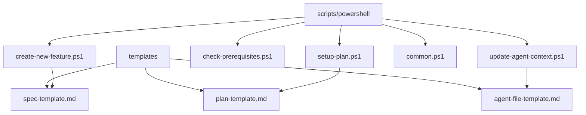
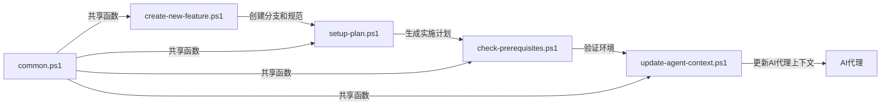
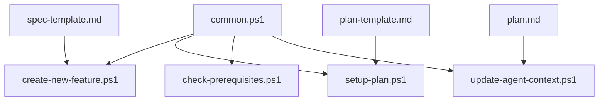

# PowerShell 脚本

<cite>
**本文档中引用的文件**  
- [create-new-feature.ps1](file://scripts/powershell/create-new-feature.ps1)
- [setup-plan.ps1](file://scripts/powershell/setup-plan.ps1)
- [check-prerequisites.ps1](file://scripts/powershell/check-prerequisites.ps1)
- [update-agent-context.ps1](file://scripts/powershell/update-agent-context.ps1)
- [common.ps1](file://scripts/powershell/common.ps1)
- [spec-template.md](file://templates/spec-template.md)
- [plan-template.md](file://templates/plan-template.md)
- [agent-file-template.md](file://templates/agent-file-template.md)
</cite>

## 目录
1. [简介](#简介)
2. [项目结构](#项目结构)
3. [核心组件](#核心组件)
4. [架构概述](#架构概述)
5. [详细组件分析](#详细组件分析)
6. [依赖分析](#依赖分析)
7. [性能考虑](#性能考虑)
8. [故障排除指南](#故障排除指南)
9. [结论](#结论)

## 简介
本文档详细阐述了Spec-Kit工具集中PowerShell脚本在Windows环境下的自动化支持能力。重点分析了`create-new-feature.ps1`、`setup-plan.ps1`、`check-prerequisites.ps1`和`update-agent-context.ps1`四个核心脚本的功能与行为，以及它们如何协同工作以实现自动化开发流程。文档还解析了`common.ps1`中定义的共享函数和跨脚本依赖关系，解释了PowerShell脚本与CLI工具、模板系统之间的集成方式，以及它们如何响应斜杠命令触发的自动化流程。为希望在Windows平台上定制自动化流程的用户提供开发与测试指南。

## 项目结构
Spec-Kit项目的PowerShell脚本位于`scripts/powershell`目录下，与Bash脚本并列存放。这些脚本通过调用模板文件和共享函数，实现了跨平台的自动化功能。项目结构清晰地分离了脚本、模板和配置文件，便于维护和扩展。

**图示来源**  
- [create-new-feature.ps1](file://scripts/powershell/create-new-feature.ps1#L80-L85)
- [setup-plan.ps1](file://scripts/powershell/setup-plan.ps1#L20-L25)
- [update-agent-context.ps1](file://scripts/powershell/update-agent-context.ps1#L40-L45)
- [spec-template.md](file://templates/spec-template.md)
- [plan-template.md](file://templates/plan-template.md)
- [agent-file-template.md](file://templates/agent-file-template.md)

**本节来源**  
- [scripts/powershell](file://scripts/powershell)
- [templates](file://templates)

## 核心组件
Spec-Kit的PowerShell脚本集成了多个核心组件，包括特征创建、计划设置、先决条件检查和代理上下文更新。这些组件共同构成了一个完整的自动化开发流程，从特征创建到实施计划的生成，再到环境验证和AI代理的同步。

**本节来源**  
- [create-new-feature.ps1](file://scripts/powershell/create-new-feature.ps1)
- [setup-plan.ps1](file://scripts/powershell/setup-plan.ps1)
- [check-prerequisites.ps1](file://scripts/powershell/check-prerequisites.ps1)
- [update-agent-context.ps1](file://scripts/powershell/update-agent-context.ps1)

## 架构概述
Spec-Kit的PowerShell脚本架构基于模块化设计，每个脚本负责特定的自动化任务。`create-new-feature.ps1`负责创建新的特征分支和规范文档，`setup-plan.ps1`用于构建技术实现方案，`check-prerequisites.ps1`检测本地开发工具链的可用性，而`update-agent-context.ps1`则同步项目上下文给AI代理。这些脚本通过`common.ps1`中的共享函数进行通信和数据交换。

**图示来源**  
- [create-new-feature.ps1](file://scripts/powershell/create-new-feature.ps1)
- [setup-plan.ps1](file://scripts/powershell/setup-plan.ps1)
- [check-prerequisites.ps1](file://scripts/powershell/check-prerequisites.ps1)
- [update-agent-context.ps1](file://scripts/powershell/update-agent-context.ps1)
- [common.ps1](file://scripts/powershell/common.ps1)

## 详细组件分析
### create-new-feature.ps1 分析
`create-new-feature.ps1`脚本的主要功能是创建新的特征分支并生成功能规范文档。它首先解析用户提供的特征描述，然后确定仓库根目录，创建新的特征目录，并生成相应的规范文件。该脚本还支持JSON格式的输出，便于与其他工具集成。

**本节来源**  
- [create-new-feature.ps1](file://scripts/powershell/create-new-feature.ps1)

### setup-plan.ps1 分析
`setup-plan.ps1`脚本用于为特征设置实施计划。它加载`common.ps1`中的共享函数，验证当前是否处于正确的特征分支上，并确保特征目录存在。然后，它会复制计划模板到特征目录中，如果模板不存在，则创建一个空的计划文件。

**本节来源**  
- [setup-plan.ps1](file://scripts/powershell/setup-plan.ps1)

### check-prerequisites.ps1 分析
`check-prerequisites.ps1`脚本负责检测本地开发工具链的可用性。它检查Git、Claude、Gemini等工具是否存在，并验证特征目录和计划文件的完整性。该脚本支持多种输出格式，包括JSON和文本，便于在不同场景下使用。

**本节来源**  
- [check-prerequisites.ps1](file://scripts/powershell/check-prerequisites.ps1)

### update-agent-context.ps1 分析
`update-agent-context.ps1`脚本用于同步项目上下文给AI代理。它从`plan.md`文件中提取技术栈信息，并更新相应的代理文件（如`CLAUDE.md`、`GEMINI.md`等）。该脚本支持多种AI代理类型，并能智能地合并新旧信息，保持上下文的连续性。

**本节来源**  
- [update-agent-context.ps1](file://scripts/powershell/update-agent-context.ps1)

## 依赖分析
Spec-Kit的PowerShell脚本之间存在明确的依赖关系。`common.ps1`作为共享库，被其他所有脚本所依赖。`create-new-feature.ps1`和`setup-plan.ps1`依赖于模板文件来生成规范和计划文档。`update-agent-context.ps1`依赖于`plan.md`文件中的技术信息来更新AI代理上下文。

**图示来源**  
- [common.ps1](file://scripts/powershell/common.ps1)
- [create-new-feature.ps1](file://scripts/powershell/create-new-feature.ps1#L80-L85)
- [setup-plan.ps1](file://scripts/powershell/setup-plan.ps1#L20-L25)
- [update-agent-context.ps1](file://scripts/powershell/update-agent-context.ps1#L100-L105)

**本节来源**  
- [common.ps1](file://scripts/powershell/common.ps1)
- [spec-template.md](file://templates/spec-template.md)
- [plan-template.md](file://templates/plan-template.md)

## 性能考虑
Spec-Kit的PowerShell脚本在设计时考虑了执行效率。通过使用`$ErrorActionPreference = 'Stop'`来统一错误处理，避免了冗余的错误检查代码。脚本还利用了PowerShell的管道和对象模型，减少了文件I/O操作，提高了执行速度。对于频繁调用的函数，如`Get-RepoRoot`和`Get-CurrentBranch`，脚本采用了缓存机制，避免重复计算。

**本节来源**  
- [common.ps1](file://scripts/powershell/common.ps1#L10-L15)
- [create-new-feature.ps1](file://scripts/powershell/create-new-feature.ps1#L5-L10)

## 故障排除指南
当使用Spec-Kit的PowerShell脚本时，可能会遇到一些常见问题。例如，如果`create-new-feature.ps1`无法创建Git分支，可能是因为当前目录不在Git仓库中。如果`update-agent-context.ps1`无法找到`plan.md`文件，可能是因为尚未运行`/plan`命令。建议在遇到问题时，首先检查相关文件是否存在，然后查看脚本的输出信息，以确定具体原因。

**本节来源**  
- [create-new-feature.ps1](file://scripts/powershell/create-new-feature.ps1#L10-L15)
- [update-agent-context.ps1](file://scripts/powershell/update-agent-context.ps1#L100-L105)

## 结论
Spec-Kit的PowerShell脚本为Windows环境下的自动化开发提供了强大的支持。通过模块化设计和共享函数，这些脚本能够高效地完成特征创建、计划设置、环境验证和AI代理同步等任务。开发者可以根据需要定制和扩展这些脚本，以适应不同的开发流程和工具链。