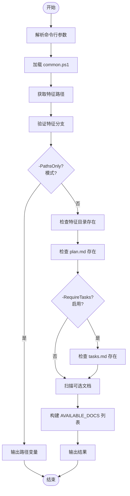

# check-prerequisites.ps1 脚本

<cite>
**本文档引用的文件**   
- [check-prerequisites.ps1](file://scripts/powershell/check-prerequisites.ps1)
- [common.ps1](file://scripts/powershell/common.ps1)
</cite>

## 目录
1. [简介](#简介)
2. [核心功能与工作流程](#核心功能与工作流程)
3. [参数与使用模式](#参数与使用模式)
4. [检测机制与实现逻辑](#检测机制与实现逻辑)
5. [错误处理与用户提示](#错误处理与用户提示)
6. [与其他工作流的集成](#与其他工作流的集成)
7. [输出格式](#输出格式)
8. [维护与扩展指南](#维护与扩展指南)

## 简介

`check-prerequisites.ps1` 是一个用于 PowerShell 环境的脚本，作为 Spec-Driven Development（规范驱动开发）工作流中的核心健康检查工具。该脚本的主要职责是系统性地验证当前开发环境是否满足执行特定开发任务的先决条件。它通过检查关键文件、目录结构和分支命名规范，确保开发者在进入如 `/tasks`、`/analyze`、`/implement` 等关键阶段前，其工作区处于正确的、一致的状态。该脚本与其 Bash 版本 `check-prerequisites.sh` 功能对等，为跨平台开发提供了统一的环境验证机制。

## 核心功能与工作流程

`check-prerequisites.ps1` 脚本的核心功能是作为一个“守门人”，在执行任何开发任务之前，对本地环境进行一系列系统性的检查。其工作流程始于脚本的参数解析，随后通过调用 `common.ps1` 中的函数获取当前工作区的上下文信息。

首先，脚本会确定仓库的根目录（`REPO_ROOT`）和当前所在的 Git 分支（`CURRENT_BRANCH`）。它利用 `Get-RepoRoot` 和 `Get-CurrentBranch` 函数来实现这一点，这些函数会尝试使用 `git` 命令，如果失败则提供合理的回退方案。接着，脚本会验证当前分支是否符合命名规范（以三位数字开头，如 `001-feature-name`），这是确保工作流有序进行的重要一环。

在通过分支验证后，脚本会检查项目结构中的关键文件是否存在。它会强制要求 `spec.md` 和 `plan.md` 文件必须存在。如果启用了 `-RequireTasks` 参数，它还会检查 `tasks.md` 文件。此外，脚本会扫描 `research.md`、`data-model.md`、`quickstart.md` 以及 `contracts/` 目录，将所有存在的项目汇总为一个可用文档列表（`AVAILABLE_DOCS`），为后续任务提供上下文。

**Section sources**
- [check-prerequisites.ps1](file://scripts/powershell/check-prerequisites.ps1#L41-L147)
- [common.ps1](file://scripts/powershell/common.ps1#L1-L136)

## 参数与使用模式

该脚本支持多种命令行参数，以适应不同的使用场景。其参数设计灵活，允许脚本在不同的开发阶段被调用。

- **`-Json`**: 此参数指示脚本以 JSON 格式输出结果。这是与其他自动化脚本或命令集成时的标准模式，便于程序化地解析输出。
- **`-RequireTasks`**: 当需要确保 `tasks.md` 文件存在时使用此参数。这通常在 `/implement` 阶段被调用，以保证在开始编码前，任务分解已经完成。
- **`-IncludeTasks`**: 此参数指示脚本在 `AVAILABLE_DOCS` 列表中包含 `tasks.md`。它通常与 `-RequireTasks` 一起使用。
- **`-PathsOnly`**: 此模式下，脚本仅输出与当前功能分支相关的路径变量（如 `REPO_ROOT`、`FEATURE_DIR` 等），而不执行任何文件或分支的验证。这对于需要获取路径信息但不进行健康检查的场景非常有用。
- **`-Help` 或 `-h`**: 显示脚本的使用帮助信息，包括所有参数的说明和使用示例。

**Section sources**
- [check-prerequisites.ps1](file://scripts/powershell/check-prerequisites.ps1#L15-L39)

## 检测机制与实现逻辑

`check-prerequisites.ps1` 的检测机制建立在对文件系统和 Git 状态的精确查询之上。其实现逻辑清晰地分为几个层次。

首先，脚本通过 `Test-Path` cmdlet 来检查文件和目录的存在性。例如，`Test-Path $paths.FEATURE_DIR -PathType Container` 用于验证功能目录是否为一个有效的容器（目录），而 `Test-Path $paths.IMPL_PLAN -PathType Leaf` 则用于验证 `plan.md` 是否为一个具体的文件（叶子节点）。

其次，对于 `contracts/` 这类可能包含多个文件的目录，脚本使用了更复杂的逻辑。它不仅检查目录是否存在，还通过 `Get-ChildItem` 命令并结合 `Where-Object { -not $_.PSIsContainer }` 来确认目录中至少包含一个非目录的文件，从而判断该目录是否“有内容”。

最后，分支验证逻辑由 `Test-FeatureBranch` 函数实现。该函数使用正则表达式 `$Branch -notmatch '^[0-9]{3}-'` 来检查分支名称是否以三位数字开头。如果 Git 不可用，函数会发出警告但不会阻止脚本继续执行，体现了其健壮性。

**Diagram sources **
- [check-prerequisites.ps1](file://scripts/powershell/check-prerequisites.ps1#L41-L147)
- [common.ps1](file://scripts/powershell/common.ps1#L1-L136)

**Section sources**
- [check-prerequisites.ps1](file://scripts/powershell/check-prerequisites.ps1#L41-L147)
- [common.ps1](file://scripts/powershell/common.ps1#L1-L136)

## 错误处理与用户提示

该脚本具备清晰的错误处理机制，旨在为用户提供明确的故障排除指引。当检测到关键问题时，脚本会通过 `Write-Output` 命令向标准错误流输出具体的错误信息，并以非零状态码退出，从而中断后续的自动化流程。

最常见的错误提示包括：
- **“Feature directory not found”**: 表明指定的功能目录不存在。提示用户应先运行 `/specify` 命令来创建特征结构。
- **“plan.md not found”**: 表明实施计划文件缺失。提示用户应先运行 `/plan` 命令来生成计划。
- **“tasks.md not found”**: 在启用了 `-RequireTasks` 参数时，如果 `tasks.md` 不存在，会触发此错误。提示用户应先运行 `/tasks` 命令来创建任务列表。
- **“Not on a feature branch”**: 表明当前所在的 Git 分支不符合命名规范。提示用户应切换到一个以三位数字开头的特征分支。

这些提示信息不仅指出了问题所在，还直接给出了修复问题的具体命令，极大地降低了用户的使用门槛。

**Section sources**
- [check-prerequisites.ps1](file://scripts/powershell/check-prerequisites.ps1#L89-L105)

## 与其他工作流的集成

`check-prerequisites.ps1` 脚本是整个 Spec-Kit 工作流的基石，被多个核心命令在执行前调用，以确保环境就绪。

根据 `templates/commands/` 目录下的配置文件，该脚本被以下命令集成：
- **`/tasks`**: 在生成任务列表前，调用 `.\check-prerequisites.ps1 -Json` 来验证 `spec.md` 和 `plan.md` 是否存在。
- **`/analyze`**: 在分析阶段，调用 `.\check-prerequisites.ps1 -Json -RequireTasks -IncludeTasks`，确保任务列表已存在。
- **`/implement`**: 在实施编码阶段，同样调用 `.\check-prerequisites.ps1 -Json -RequireTasks -IncludeTasks`，作为开始编码前的最终检查。
- **`/clarify`**: 在澄清需求阶段，调用 `.\check-prerequisites.ps1 -Json -PathsOnly`，仅获取路径信息用于上下文构建。

这种集成方式确保了工作流的每个阶段都建立在前一个阶段成功完成的基础之上，形成了一个可靠的、防错的开发流水线。

**Section sources**
- [templates/commands/tasks.md](file://templates/commands/tasks.md#L4)
- [templates/commands/analyze.md](file://templates/commands/analyze.md#L4)
- [templates/commands/implement.md](file://templates/commands/implement.md#L4)
- [templates/commands/clarify.md](file://templates/commands/clarify.md#L4)

## 输出格式

脚本根据是否启用 `-Json` 参数，提供两种不同的输出格式。

- **文本模式 (Text Mode)**: 当未指定 `-Json` 时，脚本以人类可读的文本格式输出。它会打印 `FEATURE_DIR` 的路径，然后列出 `AVAILABLE_DOCS`，并使用 `✓` 或 `✗` 符号直观地显示每个可选文档（如 `research.md`、`data-model.md` 等）的存在状态。
- **JSON 模式 (JSON Mode)**: 当指定 `-Json` 时，脚本输出一个结构化的 JSON 对象，包含 `FEATURE_DIR` 字符串和 `AVAILABLE_DOCS` 字符串数组。这种格式便于其他脚本或程序进行解析和使用。

**Section sources**
- [check-prerequisites.ps1](file://scripts/powershell/check-prerequisites.ps1#L137-L147)

## 维护与扩展指南

为了维护和扩展 `check-prerequisites.ps1` 脚本，开发者应遵循以下指南：

1.  **修改检测项**: 要添加新的文件检测，可以在 `Build list of available documents` 部分添加新的 `Test-Path` 判断，并将其描述添加到 `$docs` 数组中。
2.  **修改路径逻辑**: 所有与路径相关的逻辑（如 `REPO_ROOT`, `FEATURE_DIR`）都封装在 `common.ps1` 的 `Get-FeaturePathsEnv` 函数中。修改此函数可以统一调整所有脚本的路径行为。
3.  **增强健壮性**: 当前脚本在 Git 不可用时提供了回退逻辑。可以进一步增强，例如通过检查环境变量或配置文件来确定特征分支。
4.  **添加新参数**: 可以通过在 `param()` 块中添加新的 `[switch]` 参数来扩展脚本功能，并在主逻辑中添加相应的处理分支。

通过理解其模块化的设计（主脚本负责流程控制，`common.ps1` 提供基础函数），开发者可以安全地对脚本进行定制，以满足特定项目的需求。

**Section sources**
- [check-prerequisites.ps1](file://scripts/powershell/check-prerequisites.ps1#L41-L147)
- [common.ps1](file://scripts/powershell/common.ps1#L1-L136)