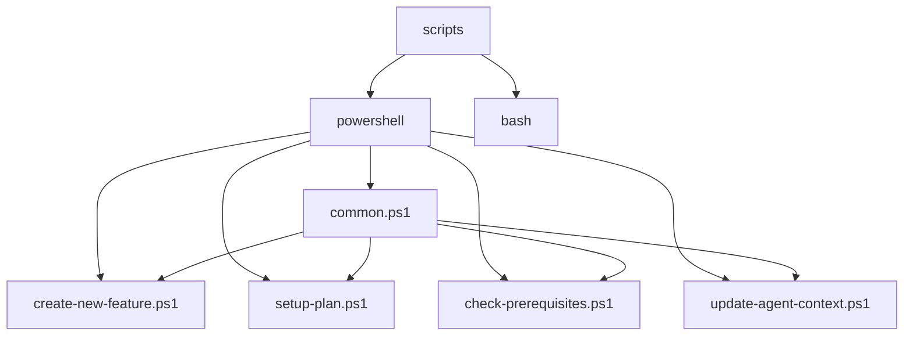
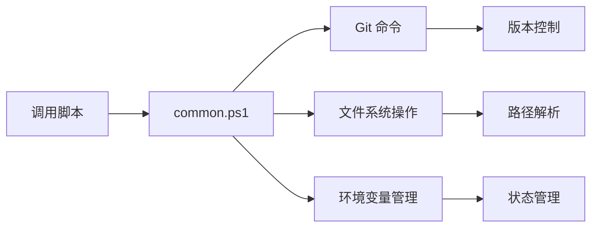
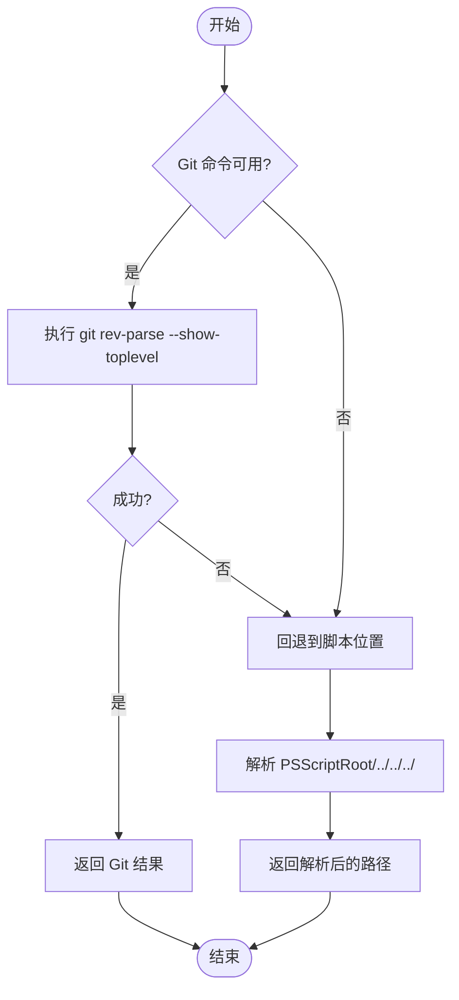
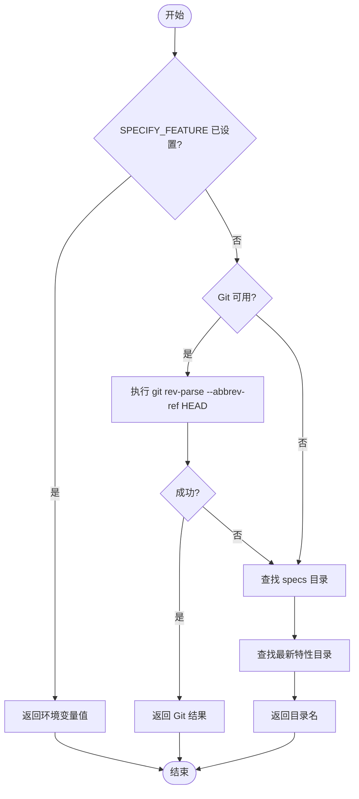
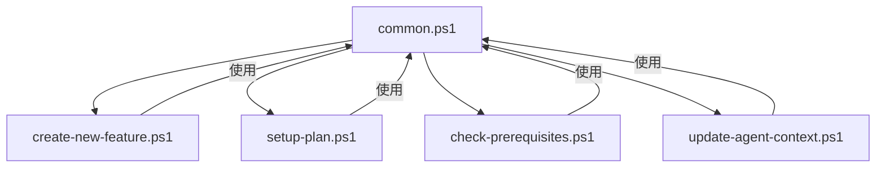

# common.ps1 共享模块

<cite>
**本文档中引用的文件**  
- [common.ps1](file://scripts/powershell/common.ps1)
- [check-prerequisites.ps1](file://scripts/powershell/check-prerequisites.ps1)
- [setup-plan.ps1](file://scripts/powershell/setup-plan.ps1)
- [create-new-feature.ps1](file://scripts/powershell/create-new-feature.ps1)
- [update-agent-context.ps1](file://scripts/powershell/update-agent-context.ps1)
</cite>

## 目录
1. [简介](#简介)
2. [项目结构](#项目结构)
3. [核心组件](#核心组件)
4. [架构概述](#架构概述)
5. [详细组件分析](#详细组件分析)
6. [依赖分析](#依赖分析)
7. [性能考虑](#性能考虑)
8. [故障排除指南](#故障排除指南)
9. [结论](#结论)

## 简介
`common.ps1` 是一个 PowerShell 脚本库，为 Spec-Driven Development 工作流提供共享功能集合。该模块封装了多个可复用的函数，用于统一日志输出、检测命令可用性、定位项目根目录、安全执行 Git 操作等。这些函数被多个 `.ps1` 脚本导入和复用，实现了代码解耦和维护性提升。

## 项目结构
项目结构遵循功能划分原则，将不同类型的脚本组织在独立的目录中。PowerShell 脚本位于 `scripts/powershell/` 目录下，与 Bash 脚本并列存放。`common.ps1` 作为核心共享模块，被其他脚本通过点源操作符（`.`）导入使用。



**图示来源**
- [common.ps1](file://scripts/powershell/common.ps1)
- [create-new-feature.ps1](file://scripts/powershell/create-new-feature.ps1)
- [setup-plan.ps1](file://scripts/powershell/setup-plan.ps1)
- [check-prerequisites.ps1](file://scripts/powershell/check-prerequisites.ps1)
- [update-agent-context.ps1](file://scripts/powershell/update-agent-context.ps1)

**节来源**
- [common.ps1](file://scripts/powershell/common.ps1)
- [project_structure](file://project_structure)

## 核心组件
`common.ps1` 模块定义了多个核心函数，这些函数构成了整个 PowerShell 脚本体系的基础。主要函数包括 `Get-RepoRoot`（获取仓库根目录）、`Get-CurrentBranch`（获取当前分支）、`Test-HasGit`（检测 Git 可用性）、`Test-FeatureBranch`（验证特性分支命名）、`Get-FeaturePathsEnv`（获取特性路径环境变量）等。

**节来源**
- [common.ps1](file://scripts/powershell/common.ps1#L3-L135)

## 架构概述
`common.ps1` 模块的设计遵循了错误处理一致性、跨平台路径处理和安全性考虑的原则。它通过封装底层操作，为上层脚本提供了统一的接口。模块中的函数广泛使用了 PowerShell 的管道和对象模型，确保了代码的可读性和可维护性。



**图示来源**
- [common.ps1](file://scripts/powershell/common.ps1)
- [check-prerequisites.ps1](file://scripts/powershell/check-prerequisites.ps1)
- [setup-plan.ps1](file://scripts/powershell/setup-plan.ps1)

## 详细组件分析
### Get-RepoRoot 函数分析
`Get-RepoRoot` 函数用于确定仓库的根目录。它首先尝试使用 `git rev-parse --show-toplevel` 命令获取 Git 仓库的根目录，如果失败则回退到脚本位置的相对路径。



**图示来源**
- [common.ps1](file://scripts/powershell/common.ps1#L3-L15)

**节来源**
- [common.ps1](file://scripts/powershell/common.ps1#L3-L15)

### Get-CurrentBranch 函数分析
`Get-CurrentBranch` 函数用于获取当前分支名称。它首先检查 `SPECIFY_FEATURE` 环境变量，然后尝试使用 Git 命令获取当前分支，最后通过查找最新的特性目录作为回退方案。



**图示来源**
- [common.ps1](file://scripts/powershell/common.ps1#L17-L58)

**节来源**
- [common.ps1](file://scripts/powershell/common.ps1#L17-L58)

### Test-FeatureBranch 函数分析
`Test-FeatureBranch` 函数用于验证分支命名是否符合规范。它检查分支名称是否以三位数字开头，这是特性分支的命名约定。

```mermaid
flowchart TD
Start([开始]) --> HasGit{HasGit 参数为真?}
HasGit --> |否| ReturnTrue["返回 true (跳过验证)"]
HasGit --> |是| MatchCheck{分支名匹配 ^[0-9]{3}-?}
MatchCheck --> |是| ReturnTrue2["返回 true"]
MatchCheck --> |否| WriteError["输出错误信息"]
WriteError --> ReturnFalse["返回 false"]
ReturnTrue --> End([结束])
ReturnTrue2 --> End
ReturnFalse --> End
```

**图示来源**
- [common.ps1](file://scripts/powershell/common.ps1#L69-L87)

**节来源**
- [common.ps1](file://scripts/powershell/common.ps1#L69-L87)

## 依赖分析
`common.ps1` 模块被多个 PowerShell 脚本所依赖，形成了一个以 `common.ps1` 为核心的依赖网络。这些脚本通过导入 `common.ps1` 来复用其中定义的函数，避免了代码重复。



**图示来源**
- [common.ps1](file://scripts/powershell/common.ps1)
- [create-new-feature.ps1](file://scripts/powershell/create-new-feature.ps1)
- [setup-plan.ps1](file://scripts/powershell/setup-plan.ps1)
- [check-prerequisites.ps1](file://scripts/powershell/check-prerequisites.ps1)
- [update-agent-context.ps1](file://scripts/powershell/update-agent-context.ps1)

**节来源**
- [common.ps1](file://scripts/powershell/common.ps1)
- [create-new-feature.ps1](file://scripts/powershell/create-new-feature.ps1)
- [setup-plan.ps1](file://scripts/powershell/setup-plan.ps1)
- [check-prerequisites.ps1](file://scripts/powershell/check-prerequisites.ps1)
- [update-agent-context.ps1](file://scripts/powershell/update-agent-context.ps1)

## 性能考虑
`common.ps1` 模块中的函数设计考虑了性能因素。例如，`Get-RepoRoot` 和 `Get-CurrentBranch` 函数都实现了回退机制，确保在没有 Git 的环境中也能正常工作。函数使用了 PowerShell 的原生命令和管道操作，避免了不必要的进程创建和数据转换。

## 故障排除指南
当使用 `common.ps1` 模块时，可能会遇到一些常见问题。例如，如果 Git 命令不可用，`Get-RepoRoot` 和 `Get-CurrentBranch` 函数会自动回退到基于脚本位置的路径解析。如果特性分支验证失败，`Test-FeatureBranch` 函数会输出详细的错误信息，指导用户如何正确命名分支。

**节来源**
- [common.ps1](file://scripts/powershell/common.ps1)
- [check-prerequisites.ps1](file://scripts/powershell/check-prerequisites.ps1)

## 结论
`common.ps1` 模块是 Spec-Driven Development 工作流中 PowerShell 脚本体系的核心组件。它通过提供一组可复用的函数，实现了代码的解耦和维护性提升。模块的设计遵循了错误处理一致性、跨平台路径处理和安全性考虑的原则，为开发者提供了稳定可靠的脚本开发基础。