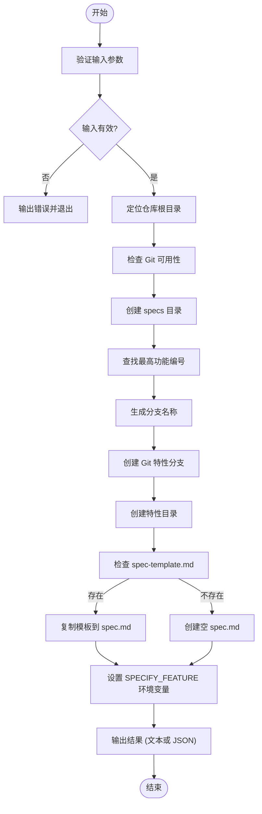
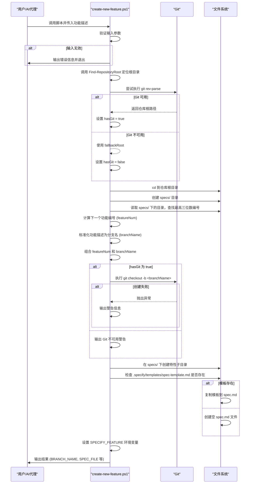
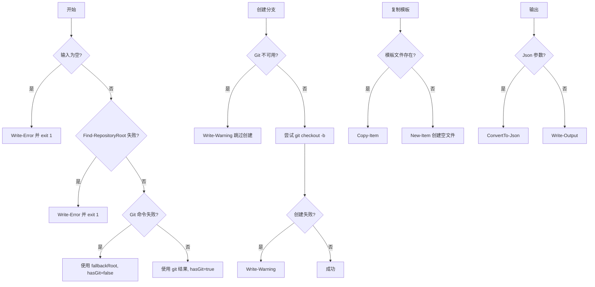
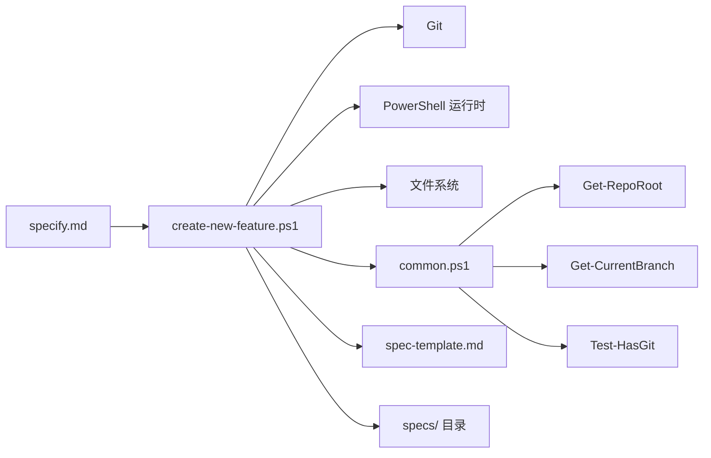

# create-new-feature.ps1 脚本

<cite>
**本文档中引用的文件**  
- [create-new-feature.ps1](file://scripts/powershell/create-new-feature.ps1)
- [common.ps1](file://scripts/powershell/common.ps1)
- [spec-template.md](file://templates/spec-template.md)
- [specify.md](file://templates/commands/specify.md)
</cite>

## 目录
1. [简介](#简介)
2. [项目结构](#项目结构)
3. [核心组件](#核心组件)
4. [架构概述](#架构概述)
5. [详细组件分析](#详细组件分析)
6. [依赖分析](#依赖分析)
7. [性能考虑](#性能考虑)
8. [故障排除指南](#故障排除指南)
9. [结论](#结论)

## 简介
`create-new-feature.ps1` 是一个 PowerShell 脚本，用于在 Windows 环境下自动化创建新功能分支并初始化规范文档。该脚本是 AI 代理驱动开发流程的第一步，通过 `/specify` 斜杠命令集成，实现从用户输入的功能描述到 Git 特性分支创建、规范文档生成及初始提交推送的完整自动化流程。脚本解析用户输入，创建符合命名规范的特性分支，基于模板生成 `spec.md` 文件，并设置环境变量以支持后续开发阶段。

## 项目结构
项目结构遵循功能驱动的组织方式，核心脚本位于 `scripts/powershell/` 目录下，模板文件存放在 `templates/` 目录中。`create-new-feature.ps1` 脚本与 `common.ps1` 共享函数库，依赖 `spec-template.md` 作为规范文档的生成模板。

```mermaid
graph TB
subgraph "脚本"
create-new-feature.ps1["create-new-feature.ps1<br/>功能分支创建主脚本"]
common.ps1["common.ps1<br/>共享函数库"]
end
subgraph "模板"
spec-template.md["spec-template.md<br/>规范文档模板"]
end
subgraph "命令配置"
specify.md["specify.md<br/>斜杠命令定义"]
end
create-new-feature.ps1 --> common.ps1 : "依赖"
create-new-feature.ps1 --> spec-template.md : "读取模板"
specify.md --> create-new-feature.ps1 : "触发执行"
```

**图示来源**
- [create-new-feature.ps1](file://scripts/powershell/create-new-feature.ps1)
- [common.ps1](file://scripts/powershell/common.ps1)
- [spec-template.md](file://templates/spec-template.md)
- [specify.md](file://templates/commands/specify.md)

**本节来源**
- [create-new-feature.ps1](file://scripts/powershell/create-new-feature.ps1)
- [project_structure](file://project_structure)

## 核心组件
`create-new-feature.ps1` 的核心功能包括：解析用户输入的功能描述、确定仓库根目录、生成递增的三位数功能编号、创建标准化的分支名称、创建特性分支（如果 Git 可用）、初始化 `specs` 目录和特性子目录、基于模板生成 `spec.md` 文件，以及设置 `SPECIFY_FEATURE` 环境变量。

**本节来源**
- [create-new-feature.ps1](file://scripts/powershell/create-new-feature.ps1#L1-L117)

## 架构概述
该脚本的执行流程是一个线性的、原子化的初始化过程。它首先验证输入，然后定位仓库根目录，接着计算下一个功能编号并生成分支名，创建必要的目录结构，最后生成规范文件并输出结果。整个过程设计为幂等，可安全地在 CI/CD 环境中调用。



**图示来源**
- [create-new-feature.ps1](file://scripts/powershell/create-new-feature.ps1#L1-L117)

## 详细组件分析
### 功能分支创建与规范初始化分析
该脚本是 AI 驱动开发工作流的入口点，负责将自然语言的功能描述转化为一个结构化的开发环境。

#### 执行流程分析


**图示来源**
- [create-new-feature.ps1](file://scripts/powershell/create-new-feature.ps1#L1-L117)
- [common.ps1](file://scripts/powershell/common.ps1#L1-L137)

#### 错误处理与健壮性分析


**图示来源**
- [create-new-feature.ps1](file://scripts/powershell/create-new-feature.ps1#L1-L117)

**本节来源**
- [create-new-feature.ps1](file://scripts/powershell/create-new-feature.ps1#L1-L117)
- [common.ps1](file://scripts/powershell/common.ps1#L1-L137)

## 依赖分析
`create-new-feature.ps1` 脚本依赖于多个外部组件和内部函数，形成了一个清晰的依赖链。



**图示来源**
- [create-new-feature.ps1](file://scripts/powershell/create-new-feature.ps1)
- [common.ps1](file://scripts/powershell/common.ps1)
- [spec-template.md](file://templates/spec-template.md)
- [specify.md](file://templates/commands/specify.md)

**本节来源**
- [create-new-feature.ps1](file://scripts/powershell/create-new-feature.ps1)
- [common.ps1](file://scripts/powershell/common.ps1)

## 性能考虑
该脚本的性能开销极低，主要操作是文件系统读写和简单的字符串处理。在大多数现代系统上，执行时间通常在毫秒级。性能瓶颈可能出现在网络文件系统上读取大量目录以确定最高功能编号时，但这种情况在典型开发环境中不常见。

## 故障排除指南
当 `create-new-feature.ps1` 脚本执行失败时，应按以下步骤进行排查：

1.  **输入验证错误**：确保至少提供了一个功能描述词。检查错误信息 "Usage: ./create-new-feature.ps1 [-Json] <feature description>"。
2.  **仓库根目录定位失败**：脚本无法找到 `.git` 或 `.specify` 目录。确保在正确的项目目录中运行脚本，或检查 `Find-RepositoryRoot` 函数的逻辑。
3.  **Git 分支创建失败**：如果 `hasGit` 为 `true` 但 `git checkout -b` 失败，可能是分支已存在或 Git 配置问题。检查 `Write-Warning` 输出。
4.  **模板文件缺失**：如果 `.specify/templates/spec-template.md` 不存在，脚本会创建一个空的 `spec.md`。确保项目已通过 `specify init` 正确初始化。
5.  **环境变量未设置**：检查 `SPECIFY_FEATURE` 环境变量是否被正确设置，这对于后续脚本（如 `setup-plan.ps1`）的执行至关重要。

**本节来源**
- [create-new-feature.ps1](file://scripts/powershell/create-new-feature.ps1#L1-L117)
- [common.ps1](file://scripts/powershell/common.ps1#L1-L137)

## 结论
`create-new-feature.ps1` 脚本是 Spec-Driven Development 工作流中一个高效且关键的自动化工具。它通过标准化的流程，将模糊的功能想法快速转化为一个结构化的开发任务，为后续的规划、任务分解和实现阶段奠定了坚实的基础。其与 `/specify` 命令的集成，使得 AI 代理能够无缝地启动新功能的开发，极大地提升了开发效率和流程的自动化程度。