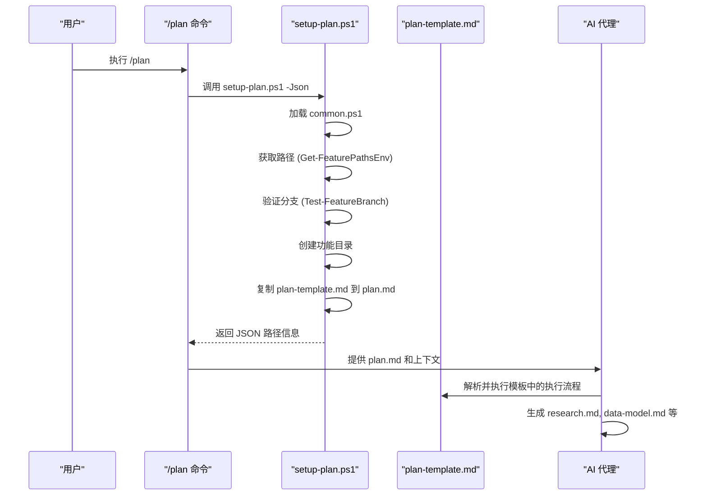
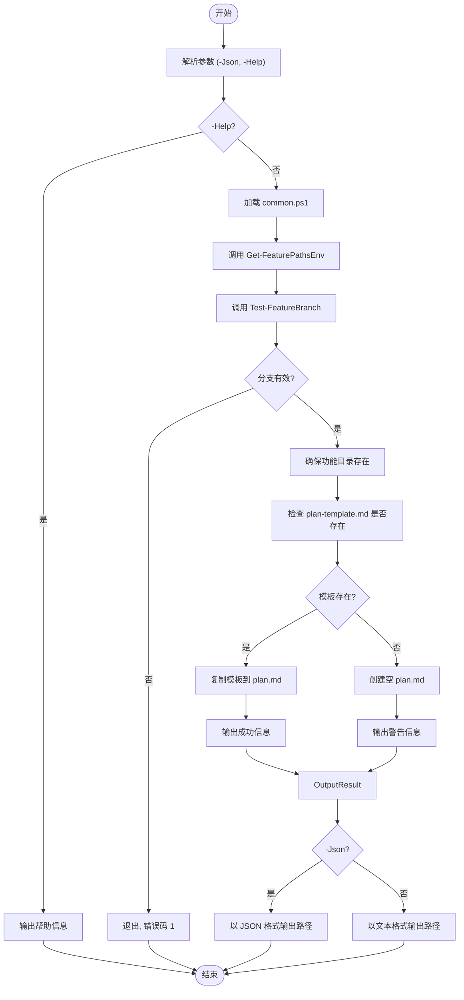
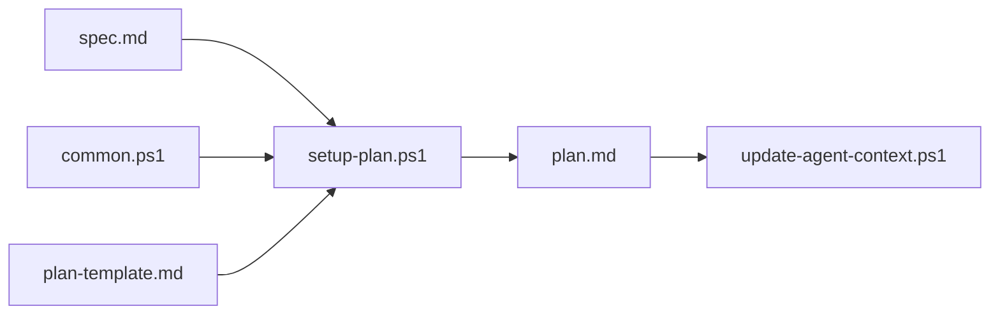

# setup-plan.ps1 脚本

<cite>
**本文档中引用的文件**  
- [setup-plan.ps1](file://scripts/powershell/setup-plan.ps1)
- [common.ps1](file://scripts/powershell/common.ps1)
- [plan-template.md](file://templates/plan-template.md)
- [update-agent-context.ps1](file://scripts/powershell/update-agent-context.ps1)
- [constitution.md](file://memory/constitution.md)
- [plan.md](file://templates/commands/plan.md)
</cite>

## 目录
1. [简介](#简介)
2. [项目结构](#项目结构)
3. [核心组件](#核心组件)
4. [架构概述](#架构概述)
5. [详细组件分析](#详细组件分析)
6. [依赖分析](#依赖分析)
7. [性能考虑](#性能考虑)
8. [故障排除指南](#故障排除指南)
9. [结论](#结论)

## 简介
`setup-plan.ps1` 是 Spec-Kit 工具链中的核心 PowerShell 脚本，用于在 SDD（Spec-Driven Development）流程中生成技术实现方案文档。该脚本作为 `/plan` 命令的底层执行器，负责从需求到实现的关键转换。它通过读取当前功能分支的上下文，将 `plan-template.md` 模板复制到指定的功能目录中，生成初始的 `plan.md` 文件。此脚本确保了开发流程的标准化，为后续的研究、设计和任务分解阶段奠定了基础。

## 项目结构
Spec-Kit 项目采用模块化结构，将脚本、模板和配置文件清晰分离。`setup-plan.ps1` 位于 `scripts/powershell/` 目录下，与 Bash 版本并存，体现了对多平台的支持。

```mermaid
graph TB
subgraph "根目录"
A[specs/] --> B[功能分支目录]
C[templates/] --> D[plan-template.md]
C --> E[agent-file-template.md]
F[scripts/] --> G[powershell/]
F --> H[bash/]
I[memory/] --> J[constitution.md]
end
subgraph "脚本"
G --> K[setup-plan.ps1]
G --> L[common.ps1]
G --> M[update-agent-context.ps1]
end
K --> D : "复制模板"
K --> B : "创建 plan.md"
M --> K : "依赖"
L --> K : "共享函数"
```

**Diagram sources**
- [setup-plan.ps1](file://scripts/powershell/setup-plan.ps1#L0-L61)
- [plan-template.md](file://templates/plan-template.md#L0-L225)

**Section sources**
- [setup-plan.ps1](file://scripts/powershell/setup-plan.ps1#L0-L61)
- [project_structure](file://project_structure)

## 核心组件
`setup-plan.ps1` 的核心功能是初始化实现方案文档。它首先加载 `common.ps1` 中的共享函数，获取当前仓库、分支和功能目录的路径。接着，它验证当前是否处于符合命名规范的功能分支上（如 `001-feature-name`）。最后，它将位于 `.specify/templates/` 下的 `plan-template.md` 复制到功能目录中，生成 `plan.md`。如果模板不存在，则创建一个空文件。该脚本支持 `-Json` 参数以 JSON 格式输出路径信息，便于与其他工具集成。

**Section sources**
- [setup-plan.ps1](file://scripts/powershell/setup-plan.ps1#L0-L61)
- [common.ps1](file://scripts/powershell/common.ps1#L0-L136)

## 架构概述
`setup-plan.ps1` 在 SDD 流程中扮演着承上启下的角色。它由 `/plan` 命令触发，是实现方案生成阶段的起点。其主要职责是为后续的 AI 代理提供一个结构化的文档框架。该脚本本身不进行复杂的逻辑判断或内容填充，而是依赖 `plan-template.md` 中定义的执行流程。真正的逻辑判断（如依赖检查、环境变量读取）发生在模板被 AI 代理解析和执行的过程中。`setup-plan.ps1` 与 `common.ps1` 共享路径解析和环境检查逻辑，确保了不同脚本间行为的一致性。



**Diagram sources**
- [setup-plan.ps1](file://scripts/powershell/setup-plan.ps1#L0-L61)
- [plan-template.md](file://templates/plan-template.md#L0-L225)
- [plan.md](file://templates/commands/plan.md#L0-L46)

## 详细组件分析

### setup-plan.ps1 分析
`setup-plan.ps1` 的执行流程简洁而关键。它首先处理 `-Help` 和 `-Json` 参数。随后，通过 `common.ps1` 中的 `Get-FeaturePathsEnv` 函数获取所有必要的路径变量，包括仓库根目录、当前分支名、功能目录、`spec.md` 和 `plan.md` 的路径。分支验证逻辑由 `Test-FeatureBranch` 函数实现，确保开发工作在正确的分支上进行。模板复制是其核心操作，它使用 `Join-Path` 构造模板的绝对路径，并使用 `Copy-Item` 进行复制。日志输出清晰地指示了操作结果，成功时输出 "Copied plan template..."，失败时发出警告。

#### 脚本执行流程图


**Diagram sources**
- [setup-plan.ps1](file://scripts/powershell/setup-plan.ps1#L0-L61)

**Section sources**
- [setup-plan.ps1](file://scripts/powershell/setup-plan.ps1#L0-L61)

### 与AI代理的上下文同步策略
`setup-plan.ps1` 本身不直接与 AI 代理同步上下文，但它为 `update-agent-context.ps1` 脚本的执行创造了条件。`plan-template.md` 中定义了 `update-agent-context.ps1` 的调用命令。当 AI 代理完成 `plan.md` 的填充后，`update-agent-context.ps1` 会被触发。该脚本会解析 `plan.md` 文件，提取 `Language/Version`、`Primary Dependencies`、`Storage` 和 `Project Type` 等关键信息。然后，它会更新根目录下的代理文件（如 `CLAUDE.md`），添加新的技术栈条目和最近的变更记录，从而实现与 AI 代理的上下文同步，确保代理始终拥有最新的项目信息。

**Section sources**
- [plan-template.md](file://templates/plan-template.md#L0-L225)
- [update-agent-context.ps1](file://scripts/powershell/update-agent-context.ps1#L0-L429)

## 依赖分析
`setup-plan.ps1` 的依赖关系清晰明了。其主要依赖是 `common.ps1`，它提供了路径解析、分支验证等核心功能，避免了代码重复。`setup-plan.ps1` 依赖于 `plan-template.md` 文件的存在，该模板定义了后续所有工作的蓝图。在执行流程上，它依赖于 `spec.md` 文件已被创建（通常由 `/specify` 或 `/clarify` 命令完成）。最终，它生成的 `plan.md` 文件是 `update-agent-context.ps1` 脚本的输入依赖。这种依赖链确保了 SDD 流程的有序进行。



**Diagram sources**
- [setup-plan.ps1](file://scripts/powershell/setup-plan.ps1#L0-L61)
- [common.ps1](file://scripts/powershell/common.ps1#L0-L136)
- [plan-template.md](file://templates/plan-template.md#L0-L225)
- [update-agent-context.ps1](file://scripts/powershell/update-agent-context.ps1#L0-L429)

**Section sources**
- [setup-plan.ps1](file://scripts/powershell/setup-plan.ps1#L0-L61)
- [common.ps1](file://scripts/powershell/common.ps1#L0-L136)

## 性能考虑
`setup-plan.ps1` 是一个轻量级的初始化脚本，其性能开销极低。主要的性能考量在于文件系统操作：
1.  **Git 操作**：`Get-RepoRoot` 和 `Get-CurrentBranch` 函数会调用 `git rev-parse`，这在大型仓库中可能有轻微延迟。脚本已通过异常处理和回退机制（如使用 `SPECIFY_FEATURE` 环境变量）来优化。
2.  **文件 I/O**：复制模板文件是一个简单的文件操作，性能取决于文件大小和磁盘速度。脚本使用 `Force` 参数确保操作成功。
3.  **路径解析**：`Join-Path` 和 `Resolve-Path` 是高效的 PowerShell 内建命令。

总体而言，该脚本的执行时间通常在毫秒级，对整体开发流程的性能影响可以忽略不计。

## 故障排除指南
当 `setup-plan.ps1` 执行失败时，应按以下步骤排查：

1.  **检查分支名称**：最常见的错误是 `ERROR: Not on a feature branch`。请确保您在以三位数字开头的分支上，例如 `001-add-login`。
2.  **检查模板路径**：如果脚本输出 `Plan template not found` 警告，请确认 `templates/plan-template.md` 文件存在于项目根目录下。
3.  **检查权限**：确保您有权限在 `specs/` 目录下创建文件和目录。
4.  **检查 Git 状态**：如果仓库不是 Git 仓库，脚本会发出警告但通常仍能继续。如果 Git 命令因权限问题失败，可能会导致路径解析错误。
5.  **使用 -Json 参数**：使用 `-Json` 参数运行脚本，可以清晰地看到脚本解析出的所有路径，有助于诊断路径错误。

**Section sources**
- [setup-plan.ps1](file://scripts/powershell/setup-plan.ps1#L0-L61)
- [common.ps1](file://scripts/powershell/common.ps1#L0-L136)

## 结论
`setup-plan.ps1` 脚本是 SDD 开发流程自动化的重要一环。它通过标准化的初始化操作，确保了每个新功能都从一个一致的、结构化的方案文档开始。该脚本设计简洁，依赖明确，与 `common.ps1` 和 `plan-template.md` 紧密协作，为 AI 代理的介入提供了完美的起点。其与 `update-agent-context.ps1` 的联动，实现了开发过程中上下文的动态同步，极大地提升了开发效率和一致性。对于高级用户，理解其内部逻辑和日志输出，有助于在复杂项目中进行调试和流程扩展。