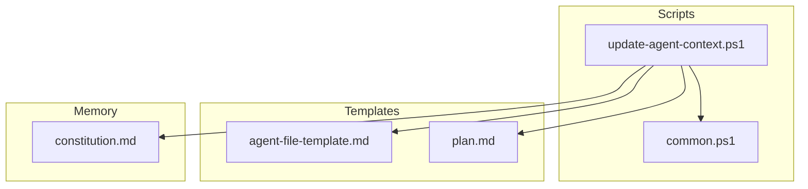
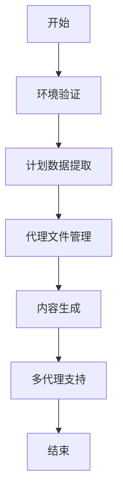
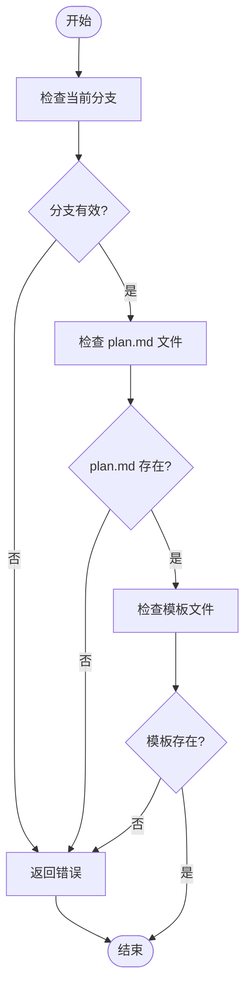
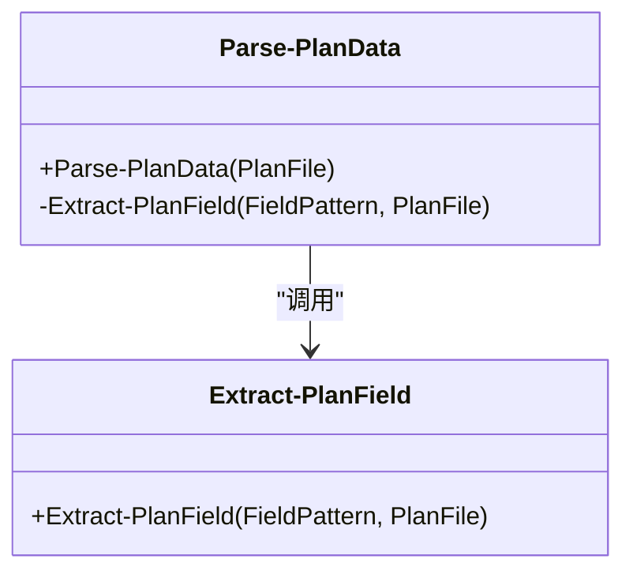
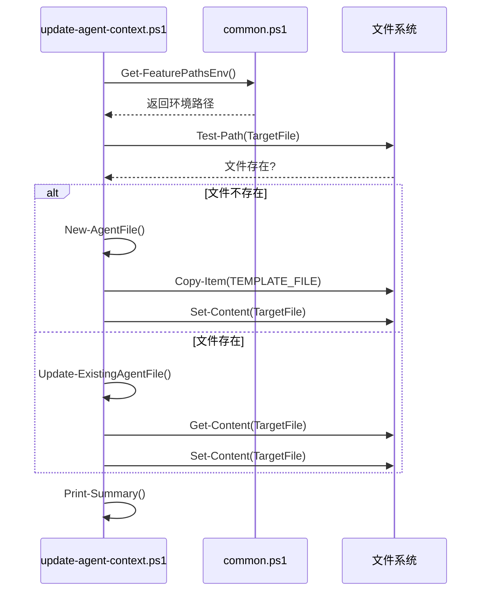
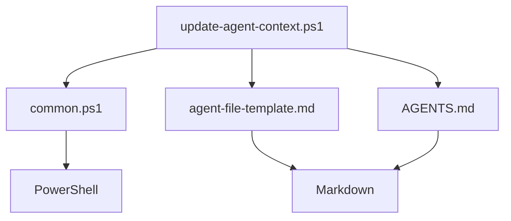

# update-agent-context.ps1 脚本

<cite>
**本文档引用的文件**
- [update-agent-context.ps1](file://scripts/powershell/update-agent-context.ps1)
- [common.ps1](file://scripts/powershell/common.ps1)
- [agent-file-template.md](file://templates/agent-file-template.md)
- [constitution.md](file://memory/constitution.md)
- [plan.md](file://templates/commands/plan.md)
- [AGENTS.md](file://AGENTS.md)
- [README.md](file://README.md)
</cite>

## 目录
1. [简介](#简介)
2. [项目结构](#项目结构)
3. [核心组件](#核心组件)
4. [架构概述](#架构概述)
5. [详细组件分析](#详细组件分析)
6. [依赖分析](#依赖分析)
7. [性能考虑](#性能考虑)
8. [故障排除指南](#故障排除指南)
9. [结论](#结论)

## 简介
`update-agent-context.ps1` 脚本是 Spec-Driven Development (SDD) 工作流中的关键组件，负责维护 AI 代理的上下文一致性。该脚本通过解析项目中的 `plan.md` 文件，提取技术栈信息，并更新各种 AI 代理（如 Claude、Gemini、Copilot 等）的上下文文件，确保 AI 代理在开发过程中始终基于最新的项目状态进行决策。脚本支持环境验证、计划数据提取、代理文件管理、内容生成和多代理支持。

**Section sources**
- [update-agent-context.ps1](file://scripts/powershell/update-agent-context.ps1#L1-L43)

## 项目结构
`update-agent-context.ps1` 脚本位于项目的 `scripts/powershell` 目录下，与 `common.ps1` 和其他 PowerShell 脚本一起工作。脚本依赖于项目根目录下的 `templates/agent-file-template.md` 模板文件来生成或更新 AI 代理的上下文文件。`memory/constitution.md` 文件包含项目的宪法和核心原则，而 `templates/commands/plan.md` 文件定义了实施计划的工作流。

**Diagram sources**
- [update-agent-context.ps1](file://scripts/powershell/update-agent-context.ps1#L1-L43)
- [common.ps1](file://scripts/powershell/common.ps1#L1-L137)
- [agent-file-template.md](file://templates/agent-file-template.md#L1-L23)
- [plan.md](file://templates/commands/plan.md#L1-L47)
- [constitution.md](file://memory/constitution.md#L1-L50)

**Section sources**
- [update-agent-context.ps1](file://scripts/powershell/update-agent-context.ps1#L1-L43)
- [common.ps1](file://scripts/powershell/common.ps1#L1-L137)
- [agent-file-template.md](file://templates/agent-file-template.md#L1-L23)
- [plan.md](file://templates/commands/plan.md#L1-L47)
- [constitution.md](file://memory/constitution.md#L1-L50)

## 核心组件
`update-agent-context.ps1` 脚本的核心组件包括环境验证、计划数据提取、代理文件管理和内容生成。脚本首先验证环境，确保当前分支和 `plan.md` 文件存在。然后，它从 `plan.md` 文件中提取语言、框架、数据库和项目类型等信息。接着，脚本根据这些信息创建或更新 AI 代理的上下文文件。最后，脚本生成技术栈、项目结构、命令、代码风格和最近更改等内容。

**Section sources**
- [update-agent-context.ps1](file://scripts/powershell/update-agent-context.ps1#L44-L430)

## 架构概述
`update-agent-context.ps1` 脚本的架构包括环境验证、计划数据提取、代理文件管理和内容生成五个主要功能。脚本通过 `common.ps1` 中的辅助函数获取环境路径，并使用正则表达式从 `plan.md` 文件中提取项目信息。脚本支持多种 AI 代理，包括 Claude、Gemini、Copilot、Cursor、Qwen、opencode、Codex、Windsurf、kilocode、auggie 和 roo。脚本可以更新单个代理或所有现有代理的上下文文件。

**Diagram sources**
- [update-agent-context.ps1](file://scripts/powershell/update-agent-context.ps1#L44-L430)

## 详细组件分析

### 环境验证分析
`Validate-Environment` 函数负责验证脚本运行所需的环境条件。它检查当前分支、`plan.md` 文件和模板文件是否存在。如果任何条件不满足，函数将输出错误信息并退出脚本。

**Diagram sources**
- [update-agent-context.ps1](file://scripts/powershell/update-agent-context.ps1#L104-L128)

**Section sources**
- [update-agent-context.ps1](file://scripts/powershell/update-agent-context.ps1#L104-L128)

### 计划数据提取分析
`Parse-PlanData` 函数负责从 `plan.md` 文件中提取项目信息。它调用 `Extract-PlanField` 函数来提取语言、框架、数据库和项目类型等字段。提取的信息存储在全局变量中，供后续步骤使用。

**Diagram sources**
- [update-agent-context.ps1](file://scripts/powershell/update-agent-context.ps1#L130-L178)

**Section sources**
- [update-agent-context.ps1](file://scripts/powershell/update-agent-context.ps1#L130-L178)

### 代理文件管理分析
`Update-AgentFile` 函数负责创建或更新 AI 代理的上下文文件。如果文件不存在，它将从模板创建新文件；如果文件存在，它将更新现有文件。函数处理目录创建、文件读写和错误处理。

**Diagram sources**
- [update-agent-context.ps1](file://scripts/powershell/update-agent-context.ps1#L361-L429)

**Section sources**
- [update-agent-context.ps1](file://scripts/powershell/update-agent-context.ps1#L361-L429)

## 依赖分析
`update-agent-context.ps1` 脚本依赖于 `common.ps1` 中的辅助函数来获取环境路径和执行文件操作。脚本还依赖于 `templates/agent-file-template.md` 模板文件来生成 AI 代理的上下文文件。`AGENTS.md` 文件提供了关于支持的 AI 代理的详细信息，包括目录约定和命令文件格式。

**Diagram sources**
- [update-agent-context.ps1](file://scripts/powershell/update-agent-context.ps1#L1-L43)
- [common.ps1](file://scripts/powershell/common.ps1#L1-L137)
- [agent-file-template.md](file://templates/agent-file-template.md#L1-L23)
- [AGENTS.md](file://AGENTS.md#L1-L272)

**Section sources**
- [update-agent-context.ps1](file://scripts/powershell/update-agent-context.ps1#L1-L43)
- [common.ps1](file://scripts/powershell/common.ps1#L1-L137)
- [agent-file-template.md](file://templates/agent-file-template.md#L1-L23)
- [AGENTS.md](file://AGENTS.md#L1-L272)

## 性能考虑
`update-agent-context.ps1` 脚本在设计时考虑了性能优化。脚本通过正则表达式高效地提取计划数据，并使用临时文件来避免直接修改现有文件。脚本还支持增量更新，只添加新的技术栈和最近更改，而不是重新生成整个文件。对于大型项目，建议在非高峰时段运行脚本，以减少对系统资源的影响。

## 故障排除指南
如果 `update-agent-context.ps1` 脚本运行失败，请检查以下常见问题：
- 确保当前分支是有效的功能分支（如 `001-feature-name`）。
- 确保 `plan.md` 文件存在于相应的功能目录中。
- 确保 `templates/agent-file-template.md` 模板文件存在且可读。
- 检查脚本是否有足够的权限读写目标文件。
- 查看脚本输出的错误信息，根据提示进行修复。

**Section sources**
- [update-agent-context.ps1](file://scripts/powershell/update-agent-context.ps1#L104-L128)
- [common.ps1](file://scripts/powershell/common.ps1#L1-L137)

## 结论
`update-agent-context.ps1` 脚本是 Spec-Driven Development 工作流中不可或缺的一部分，它确保了 AI 代理在开发过程中始终基于最新的项目状态进行决策。通过自动化上下文文件的更新，脚本提高了开发效率，减少了人为错误。脚本的设计考虑了可扩展性和性能优化，支持多种 AI 代理，并提供了详细的错误处理和日志记录功能。