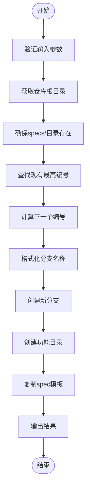
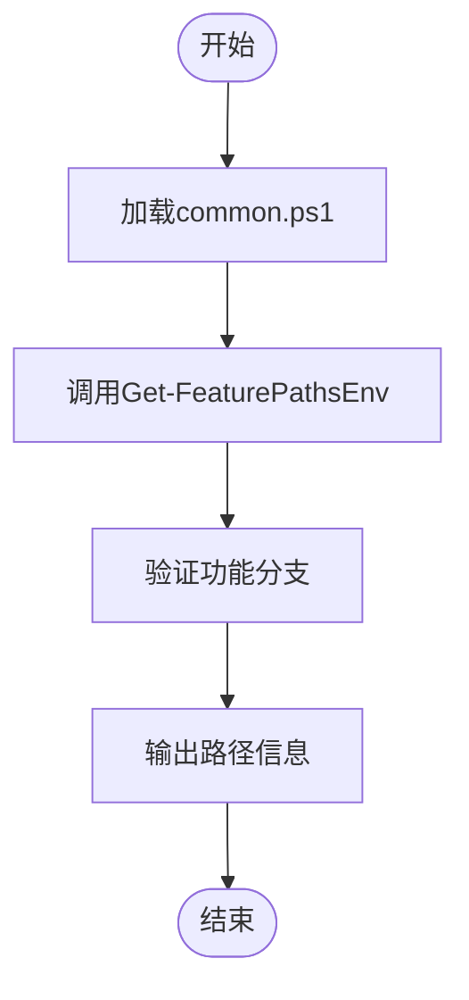

# PowerShell脚本

<cite>
**本文档中引用的文件**
- [check-task-prerequisites.ps1](file://scripts\powershell\check-task-prerequisites.ps1)
- [create-new-feature.ps1](file://scripts\powershell\create-new-feature.ps1)
- [get-feature-paths.ps1](file://scripts\powershell\get-feature-paths.ps1)
- [setup-plan.ps1](file://scripts\powershell\setup-plan.ps1)
- [update-agent-context.ps1](file://scripts\powershell\update-agent-context.ps1)
- [common.ps1](file://scripts\powershell\common.ps1)
- [README.md](file://README.md)
- [spec-driven.md](file://spec-driven.md)
</cite>

## 目录
1. [简介](#简介)
2. [项目结构](#项目结构)
3. [核心组件](#核心组件)
4. [架构概述](#架构概述)
5. [详细组件分析](#详细组件分析)
6. [依赖分析](#依赖分析)
7. [性能考虑](#性能考虑)
8. [故障排除指南](#故障排除指南)
9. [结论](#结论)

## 简介
PowerShell脚本集是Spec-Driven Development（SDD）工作流的核心组成部分，专为Windows平台设计，提供跨平台兼容的自动化功能。这些脚本与Bash版本并行存在，确保在不同操作系统上的一致性体验。它们共同支持SDD方法论中的关键命令（如`/specify`、`/plan`、`/tasks`），通过自动化分支管理、文件结构初始化、依赖检查和AI代理上下文同步，显著提升开发效率。本文档详细解析各脚本的作用与实现机制。

## 项目结构
项目结构清晰地分离了不同平台的脚本，`scripts/powershell`目录包含所有PowerShell脚本，与`scripts/bash`目录中的Bash脚本功能对应。这种设计支持通过`specify init`命令的`--script`选项选择脚本变体（`sh`或`ps`），实现跨平台一致性。

**图示来源**
- [项目结构](file://)

**本节来源**
- [项目结构](file://)

## 核心组件
核心组件包括五个主要的PowerShell脚本和一个通用函数库。`create-new-feature.ps1`负责初始化新功能，`setup-plan.ps1`用于创建实施计划，`check-task-prerequisites.ps1`验证任务先决条件，`get-feature-paths.ps1`输出环境路径，`update-agent-context.ps1`维护AI代理的状态，而`common.ps1`则为所有脚本提供共享功能。

**本节来源**
- [create-new-feature.ps1](file://scripts\powershell\create-new-feature.ps1)
- [setup-plan.ps1](file://scripts\powershell\setup-plan.ps1)
- [check-task-prerequisites.ps1](file://scripts\powershell\check-task-prerequisites.ps1)
- [get-feature-paths.ps1](file://scripts\powershell\get-feature-paths.ps1)
- [update-agent-context.ps1](file://scripts\powershell\update-agent-context.ps1)
- [common.ps1](file://scripts\powershell\common.ps1)

## 架构概述
PowerShell脚本的架构围绕SDD工作流构建，以`common.ps1`为基石，提供跨脚本复用的函数。主流程始于`create-new-feature.ps1`创建新功能分支和目录，随后`setup-plan.ps1`生成计划文件。在开发过程中，`check-task-prerequisites.ps1`确保环境就绪，`get-feature-paths.ps1`提供路径信息，最后`update-agent-context.ps1`同步AI代理的上下文。所有脚本通过`. "$PSScriptRoot/common.ps1"`导入公共函数，实现代码复用和逻辑一致性。

**图示来源**
- [create-new-feature.ps1](file://scripts\powershell\create-new-feature.ps1)
- [setup-plan.ps1](file://scripts\powershell\setup-plan.ps1)
- [check-task-prerequisites.ps1](file://scripts\powershell\check-task-prerequisites.ps1)
- [get-feature-paths.ps1](file://scripts\powershell\get-feature-paths.ps1)
- [update-agent-context.ps1](file://scripts\powershell\update-agent-context.ps1)
- [common.ps1](file://scripts\powershell\common.ps1)

## 详细组件分析
本节深入分析每个核心脚本的实现逻辑和功能。

### create-new-feature.ps1 分析
`create-new-feature.ps1`脚本实现了跨平台兼容的功能初始化逻辑。它首先验证输入参数，然后通过`git rev-parse --show-toplevel`获取仓库根目录，并确保`specs`目录存在。脚本的核心是自动编号机制：它扫描`specs`目录下的现有子目录，匹配`^(\d{3})`模式，找出最大的三位数编号，然后递增1，生成新的`001`格式编号。接着，它将功能描述转换为小写，用连字符替换非字母数字字符，并去除多余的连字符和首尾连字符，最终形成`<编号>-<描述词>`的分支名（最多包含3个词）。创建分支后，它在`specs`目录下创建对应的子目录，并从`templates/spec-template.md`复制模板文件生成`spec.md`。

**图示来源**
- [create-new-feature.ps1](file://scripts\powershell\create-new-feature.ps1)

**本节来源**
- [create-new-feature.ps1](file://scripts\powershell\create-new-feature.ps1)

### setup-plan.ps1 分析
`setup-plan.ps1`脚本驱动计划生成流程。它首先加载`common.ps1`并验证当前分支是否为功能分支。随后，它确保功能目录存在，然后从`templates/plan-template.md`复制模板文件到功能目录下的`plan.md`。此脚本是`/plan`命令的核心，为后续的实施步骤提供基础文档。

**图示来源**
- [setup-plan.ps1](file://scripts\powershell\setup-plan.ps1)

**本节来源**
- [setup-plan.ps1](file://scripts\powershell\setup-plan.ps1)

### check-task-prerequisites.ps1 分析
`check-task-prerequisites.ps1`脚本负责检测Windows环境中的依赖项。它首先验证当前分支是否为功能分支，然后检查功能目录和`plan.md`文件是否存在。如果`-Json`参数被指定，它会以JSON格式输出功能目录和可用文档列表（如`research.md`、`data-model.md`等），否则以文本格式输出。此脚本确保在执行关键任务前，必要的文件结构已就绪。

**图示来源**
- [check-task-prerequisites.ps1](file://scripts\powershell\check-task-prerequisites.ps1)

**本节来源**
- [check-task-prerequisites.ps1](file://scripts\powershell\check-task-prerequisites.ps1)

### get-feature-paths.ps1 分析
`get-feature-paths.ps1`脚本处理路径解析。它调用`Get-FeaturePathsEnv`函数获取所有与当前功能相关的路径（如仓库根目录、功能目录、`spec.md`、`plan.md`等），并以键值对的形式输出。此脚本为其他脚本或用户提供了便捷的环境信息查询方式。

**图示来源**
- [get-feature-paths.ps1](file://scripts\powershell\get-feature-paths.ps1)

**本节来源**
- [get-feature-paths.ps1](file://scripts\powershell\get-feature-paths.ps1)

### update-agent-context.ps1 分析
`update-agent-context.ps1`脚本维护AI代理的状态同步。它首先验证`plan.md`是否存在，然后从`plan.md`中提取关键技术栈信息（如语言、框架、数据库）。脚本支持多种代理类型（Claude, Gemini, Copilot等），通过`switch`语句选择更新目标。对于每个代理文件，它会先尝试初始化（如果文件不存在，则从模板创建），然后更新内容，添加新的技术栈和最近变更记录。这确保了AI代理始终拥有最新的项目上下文。

**图示来源**
- [update-agent-context.ps1](file://scripts\powershell\update-agent-context.ps1)

**本节来源**
- [update-agent-context.ps1](file://scripts\powershell\update-agent-context.ps1)

### common.ps1 分析
`common.ps1`提供了通用函数库。它包含`Get-RepoRoot`和`Get-CurrentBranch`等基础函数，以及`Test-FeatureBranch`用于验证分支命名规范。`Get-FeaturePathsEnv`函数是核心，它返回一个包含所有相关路径的自定义对象。`Test-FileExists`和`Test-DirHasFiles`函数用于检查文件和目录，并输出带图标的可读结果。这些函数被所有其他脚本复用，保证了逻辑的一致性。

**图示来源**
- [common.ps1](file://scripts\powershell\common.ps1)

**本节来源**
- [common.ps1](file://scripts\powershell\common.ps1)

## 依赖分析
PowerShell脚本集依赖于Git命令行工具（用于`git rev-parse`和`git checkout`）、PowerShell 7+环境以及项目自身的目录结构（如`templates/`和`specs/`）。脚本之间通过`common.ps1`形成强依赖，确保了功能的统一。与Bash版本相比，PowerShell版本在语法上更结构化（使用`[CmdletBinding()]`和`param()`），错误处理更严格（`$ErrorActionPreference = 'Stop'`），并且在文件路径操作上更符合Windows习惯。

**图示来源**
- [common.ps1](file://scripts\powershell\common.ps1)
- [项目结构](file://)

**本节来源**
- [common.ps1](file://scripts\powershell\common.ps1)

## 性能考虑
这些脚本主要执行文件系统和Git操作，性能开销较低。`create-new-feature.ps1`中的目录扫描操作在`specs`目录非常大时可能稍慢，但通常影响不大。脚本设计为一次性执行，不涉及复杂计算，因此性能不是主要瓶颈。跨平台一致性设计原则确保了在Windows和类Unix系统上的行为一致，通过使用`$PSScriptRoot`和`Join-Path`等跨平台安全的路径操作，避免了路径分隔符问题。

## 故障排除指南
常见问题及解决方案：
- **错误：未在功能分支上**：确保当前Git分支名以三位数字开头，如`001-feature-name`。
- **错误：未找到功能目录**：运行`/specify`命令以创建功能结构。
- **错误：未找到plan.md**：运行`/plan`命令以创建实施计划。
- **权限问题**：在Windows上通常无需特殊权限，但需确保对项目目录有写权限。
- **与CLI工具协作**：这些脚本由`specify` CLI调用，例如`/specify`命令会调用`create-new-feature.ps1`，`/plan`命令会调用`setup-plan.ps1`。用户也可以直接在终端中执行这些脚本。

**本节来源**
- [check-task-prerequisites.ps1](file://scripts\powershell\check-task-prerequisites.ps1)
- [README.md](file://README.md)

## 结论
PowerShell脚本集是Spec-Driven Development工作流在Windows平台上的关键实现。它们通过`common.ps1`提供的通用函数库，实现了功能初始化、计划生成、依赖检查、路径解析和AI代理同步等一系列自动化任务。与Bash版本相比，PowerShell脚本利用了其面向对象的特性和更强大的错误处理机制，同时遵循跨平台一致性设计原则，确保了在不同环境下的可靠运行。这些脚本极大地简化了SDD流程，使开发者能够专注于产品场景而非基础设置。