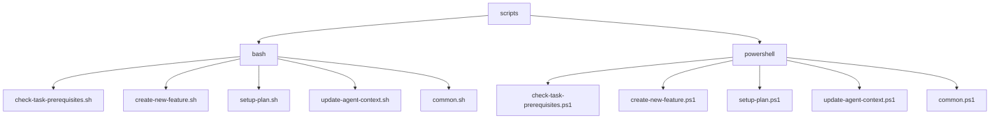
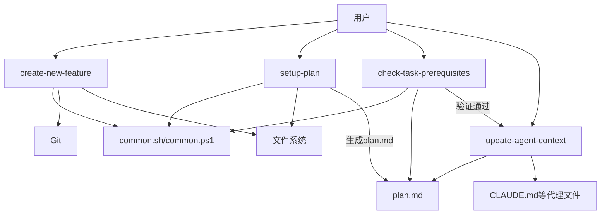

# 脚本系统

<cite>
**本文档引用的文件**  
- [check-task-prerequisites.sh](file://scripts/bash/check-task-prerequisites.sh)
- [check-task-prerequisites.ps1](file://scripts/powershell/check-task-prerequisites.ps1)
- [create-new-feature.sh](file://scripts/bash/create-new-feature.sh)
- [create-new-feature.ps1](file://scripts/powershell/create-new-feature.ps1)
- [update-agent-context.sh](file://scripts/bash/update-agent-context.sh)
- [update-agent-context.ps1](file://scripts/powershell/update-agent-context.ps1)
- [setup-plan.sh](file://scripts/bash/setup-plan.sh)
- [setup-plan.ps1](file://scripts/powershell/setup-plan.ps1)
- [common.sh](file://scripts/bash/common.sh)
- [common.ps1](file://scripts/powershell/common.ps1)
</cite>

## 目录
1. [简介](#简介)
2. [项目结构](#项目结构)
3. [核心脚本功能分析](#核心脚本功能分析)
4. [脚本调用关系与数据流](#脚本调用关系与数据流)
5. [Bash与PowerShell实现差异对比](#bash与powershell实现差异对比)
6. [参数说明与使用示例](#参数说明与使用示例)
7. [错误处理机制](#错误处理机制)
8. [作为CLI工具补充的自动化能力](#作为cli工具补充的自动化能力)
9. [高级用户扩展指南](#高级用户扩展指南)

## 简介
本项目包含一套完整的跨平台自动化脚本系统，位于`scripts`目录下，分为`bash`和`powershell`两个子目录，分别支持Linux/macOS和Windows平台。这些脚本协同工作，用于自动化新功能创建、任务依赖验证、计划设置和AI代理上下文同步等关键开发流程。所有脚本共享通用逻辑（通过`common.sh`和`common.ps1`），确保行为一致性，并通过JSON模式输出支持程序化调用。

## 项目结构



**图示来源**  
- [scripts/bash](file://scripts/bash)
- [scripts/powershell](file://scripts/powershell)

**本节来源**  
- [scripts/bash](file://scripts/bash)
- [scripts/powershell](file://scripts/powershell)

## 核心脚本功能分析

### check-task-prerequisites 脚本
该脚本用于验证当前开发环境是否满足执行任务的先决条件。它检查是否处于正确的功能分支（以三位数字开头），并确认功能目录和`plan.md`文件是否存在。如果使用`--json`参数，将以JSON格式输出功能目录路径和可用文档列表。

**本节来源**  
- [check-task-prerequisites.sh](file://scripts/bash/check-task-prerequisites.sh#L1-L15)
- [check-task-prerequisites.ps1](file://scripts/powershell/check-task-prerequisites.ps1#L1-L35)

### create-new-feature 脚本
此脚本自动化新功能的创建过程。它根据功能描述生成符合规范的分支名称（格式为`001-feature-name`），创建对应的Git分支和项目目录结构，并复制`spec-template.md`模板生成`spec.md`文件。脚本会自动递增功能编号，确保唯一性。

**本节来源**  
- [create-new-feature.sh](file://scripts/bash/create-new-feature.sh#L1-L58)
- [create-new-feature.ps1](file://scripts/powershell/create-new-feature.ps1#L1-L52)

### update-agent-context 脚本
该脚本负责同步AI代理的上下文信息。它从当前分支的`plan.md`文件中提取编程语言、框架、数据库等技术栈信息，并更新`CLAUDE.md`、`GEMINI.md`等代理配置文件。支持为Claude、Gemini、GitHub Copilot等多种AI工具更新上下文，自动维护“活跃技术”和“最近变更”列表。

**本节来源**  
- [update-agent-context.sh](file://scripts/bash/update-agent-context.sh#L1-L66)
- [update-agent-context.ps1](file://scripts/powershell/update-agent-context.ps1#L1-L104)

### setup-plan 脚本
此脚本用于初始化功能开发计划。它确保功能目录存在，并将`plan-template.md`模板复制到当前功能目录下生成`plan.md`文件，为后续的计划制定提供标准结构。

**本节来源**  
- [setup-plan.sh](file://scripts/bash/setup-plan.sh#L1-L17)
- [setup-plan.ps1](file://scripts/powershell/setup-plan.ps1#L1-L21)

## 脚本调用关系与数据流



**图示来源**  
- [create-new-feature.sh](file://scripts/bash/create-new-feature.sh)
- [setup-plan.sh](file://scripts/bash/setup-plan.sh)
- [check-task-prerequisites.sh](file://scripts/bash/check-task-prerequisites.sh)
- [update-agent-context.sh](file://scripts/bash/update-agent-context.sh)
- [common.sh](file://scripts/bash/common.sh)

**本节来源**  
- [scripts/bash](file://scripts/bash)
- [scripts/powershell](file://scripts/powershell)

## Bash与PowerShell实现差异对比

| 特性 | Bash 实现 | PowerShell 实现 |
|------|----------|----------------|
| **参数处理** | 使用`for arg in "$@"`循环解析 | 使用`[CmdletBinding()]`和`param()`声明参数 |
| **变量作用域** | 使用`local`关键字声明局部变量 | 函数参数自动为局部作用域 |
| **路径拼接** | 使用`$REPO_ROOT/specs/$CURRENT_BRANCH`字符串拼接 | 使用`Join-Path` cmdlet进行跨平台路径拼接 |
| **文件存在性检查** | 使用`[[ -f "$file" ]]`语法 | 使用`Test-Path -Path $path -PathType Leaf` |
| **目录创建** | 使用`mkdir -p`命令 | 使用`New-Item -ItemType Directory -Force` |
| **JSON输出** | 手动格式化字符串 | 使用`ConvertTo-Json` cmdlet生成标准JSON |
| **错误处理** | 使用`set -e`和`exit 1` | 使用`$ErrorActionPreference = 'Stop'` |

尽管实现语法不同，两个版本的脚本在功能和行为上保持高度一致，体现了良好的跨平台设计。

**本节来源**  
- [common.sh](file://scripts/bash/common.sh)
- [common.ps1](file://scripts/powershell/common.ps1)
- [create-new-feature.sh](file://scripts/bash/create-new-feature.sh)
- [create-new-feature.ps1](file://scripts/powershell/create-new-feature.ps1)

## 参数说明与使用示例

### 公共参数
- `--json`: 以JSON格式输出结果，便于程序解析
- `--help` 或 `-h`: 显示使用帮助

### create-new-feature 使用示例
```bash
# 创建一个新功能
./scripts/bash/create-new-feature.sh "用户登录功能"

# 以JSON格式输出创建结果
./scripts/bash/create-new-feature.sh --json "API性能优化"
```

### update-agent-context 使用示例
```bash
# 更新所有AI代理的上下文
./scripts/bash/update-agent-context.sh

# 仅更新Claude代理的上下文
./scripts/bash/update-agent-context.sh claude
```

**本节来源**  
- [create-new-feature.sh](file://scripts/bash/create-new-feature.sh#L1-L58)
- [update-agent-context.sh](file://scripts/bash/update-agent-context.sh#L1-L66)

## 错误处理机制

脚本系统实现了健壮的错误处理机制：

1. **前置条件检查**：`check-task-prerequisites`脚本在所有关键操作前运行，确保环境正确。
2. **早期失败**：使用`set -e`（Bash）和`$ErrorActionPreference = 'Stop'`（PowerShell）确保任何命令失败立即终止脚本。
3. **清晰的错误信息**：所有错误都提供明确的错误消息和解决建议（如"Run /specify first"）。
4. **分支验证**：`common.sh`中的`check_feature_branch`函数确保用户在正确的功能分支上工作。
5. **文件/目录存在性检查**：在访问文件前检查其是否存在，避免运行时错误。

**本节来源**  
- [common.sh](file://scripts/bash/common.sh#L1-L37)
- [common.ps1](file://scripts/powershell/common.ps1#L1-L65)
- [check-task-prerequisites.sh](file://scripts/bash/check-task-prerequisites.sh#L1-L15)

## 作为CLI工具补充的自动化能力

这些脚本系统与CLI工具形成互补，实现了更复杂的自动化任务：

- **CLI工具**：通常负责原子性操作，如`/specify`、`/plan`等。
- **脚本系统**：负责协调多个步骤，实现端到端的自动化流程，如`create-new-feature`脚本协调了Git分支创建、目录结构生成和文件初始化等多个操作。

脚本系统通过读取和解析`plan.md`等CLI工具生成的文件，实现了与CLI生态的无缝集成。

**本节来源**  
- [create-new-feature.sh](file://scripts/bash/create-new-feature.sh)
- [update-agent-context.sh](file://scripts/bash/update-agent-context.sh)

## 高级用户扩展指南

高级用户可以按以下方式修改或扩展脚本：

1. **修改模板路径**：调整脚本中`TEMPLATE`变量的值以使用自定义模板。
2. **扩展技术栈支持**：在`update-agent-context`脚本中添加新的语言/框架检测逻辑和对应的测试命令。
3. **添加新代理支持**：在`update-agent-context`的`case`语句中添加对新AI代理的支持。
4. **自定义分支命名规则**：修改`create-new-feature`脚本中的正则表达式和字符串处理逻辑。
5. **添加预/后处理钩子**：在脚本关键位置添加自定义命令执行点。

所有修改都应在两个平台（Bash和PowerShell）上保持同步，以确保跨平台一致性。

**本节来源**  
- [create-new-feature.sh](file://scripts/bash/create-new-feature.sh)
- [update-agent-context.sh](file://scripts/bash/update-agent-context.sh)
- [common.sh](file://scripts/bash/common.sh)