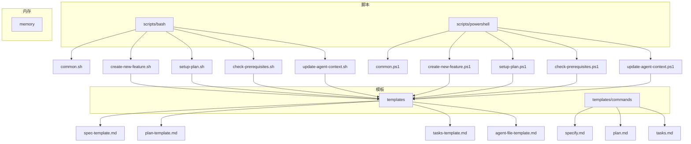
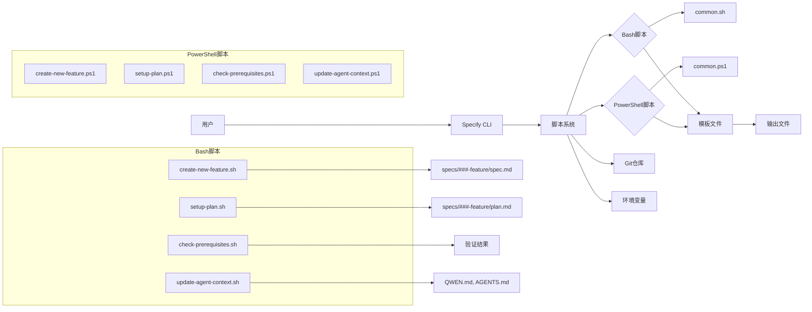
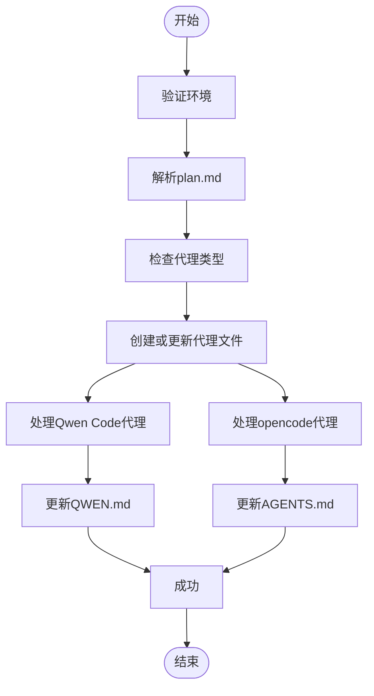
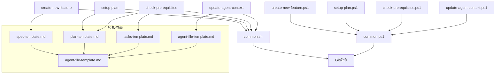

# 脚本系统

<cite>
**本文档引用文件**  
- [create-new-feature.sh](file://scripts/bash/create-new-feature.sh)
- [setup-plan.sh](file://scripts/bash/setup-plan.sh)
- [check-prerequisites.sh](file://scripts/bash/check-prerequisites.sh)
- [common.sh](file://scripts/bash/common.sh)
- [create-new-feature.ps1](file://scripts/powershell/create-new-feature.ps1)
- [setup-plan.ps1](file://scripts/powershell/setup-plan.ps1)
- [check-prerequisites.ps1](file://scripts/powershell/check-prerequisites.ps1)
- [common.ps1](file://scripts/powershell/common.ps1)
- [spec-template.md](file://templates/spec-template.md)
- [plan-template.md](file://templates/plan-template.md)
- [tasks-template.md](file://templates/tasks-template.md)
- [specify.md](file://templates/commands/specify.md)
- [plan.md](file://templates/commands/plan.md)
- [tasks.md](file://templates/commands/tasks.md)
- [update-agent-context.sh](file://scripts/bash/update-agent-context.sh) - *新增对Qwen Code和opencode代理的支持*
- [update-agent-context.ps1](file://scripts/powershell/update-agent-context.ps1) - *新增对Qwen Code和opencode代理的支持*
- [agent-file-template.md](file://templates/agent-file-template.md) - *代理文件模板*
- [AGENTS.md](file://AGENTS.md) - *代理支持文档*
</cite>

## 更新摘要
**变更内容**  
- 在 `update-agent-context.sh` 和 `update-agent-context.ps1` 脚本中添加了对 Qwen Code 和 opencode 代理的支持
- 更新了相关脚本的文件路径和处理逻辑
- 在文档中新增了对这两个代理的详细说明
- 更新了核心组件和架构概述部分以反映新增功能

## 目录
1. [引言](#引言)
2. [项目结构](#项目结构)
3. [核心组件](#核心组件)
4. [架构概述](#架构概述)
5. [详细组件分析](#详细组件分析)
6. [依赖分析](#依赖分析)
7. [性能考虑](#性能考虑)
8. [故障排除指南](#故障排除指南)
9. [结论](#结论)

## 引言
Spec-Kit脚本系统是一个自动化任务执行引擎，旨在通过标准化的脚本流程支持Spec-Driven Development方法论。该系统提供Bash和PowerShell两套脚本实现，以满足不同操作系统环境下的用户需求。脚本系统在开发流程中扮演关键角色，负责自动化创建功能分支、生成规范文件、设置技术实现计划以及验证环境依赖等核心任务。通过与模板文件和CLI工具的协同工作，脚本系统实现了开发流程的自动化和标准化，显著提升了开发效率和一致性。

## 项目结构
Spec-Kit项目的脚本系统采用清晰的分层结构，将Bash和PowerShell脚本分别组织在独立的目录中，同时共享模板和公共函数。这种设计既保证了跨平台兼容性，又实现了代码复用。

**图示来源**
- [create-new-feature.sh](file://scripts/bash/create-new-feature.sh)
- [setup-plan.sh](file://scripts/bash/setup-plan.sh)
- [check-prerequisites.sh](file://scripts/bash/check-prerequisites.sh)
- [update-agent-context.sh](file://scripts/bash/update-agent-context.sh)
- [spec-template.md](file://templates/spec-template.md)
- [plan-template.md](file://templates/plan-template.md)
- [tasks-template.md](file://templates/tasks-template.md)
- [agent-file-template.md](file://templates/agent-file-template.md)

**本节来源**
- [scripts/bash](file://scripts/bash)
- [scripts/powershell](file://scripts/powershell)
- [templates](file://templates)

## 核心组件
Spec-Kit脚本系统的核心组件包括三个主要脚本：`create-new-feature`用于创建新功能分支并生成规范文件，`setup-plan`用于设置技术实现计划，`check-prerequisites`用于验证环境依赖。这些脚本通过调用公共函数库`common.sh`或`common.ps1`来获取项目路径和分支信息，确保了跨脚本的一致性。每个脚本都支持JSON输出模式，便于与其他工具集成。脚本系统与模板文件紧密协作，通过复制模板并填充实际内容来生成标准化的文档，从而实现了开发流程的自动化。

此外，系统还包含`update-agent-context`脚本，该脚本用于更新AI代理上下文文件，支持包括Qwen Code和opencode在内的多种AI代理。此脚本能够解析`plan.md`文件中的项目元数据，并相应地更新代理配置文件。

**本节来源**
- [create-new-feature.sh](file://scripts/bash/create-new-feature.sh#L1-L98)
- [setup-plan.sh](file://scripts/bash/setup-plan.sh#L1-L61)
- [check-prerequisites.sh](file://scripts/bash/check-prerequisites.sh#L1-L166)
- [common.sh](file://scripts/bash/common.sh#L1-L114)
- [update-agent-context.sh](file://scripts/bash/update-agent-context.sh#L1-L773) - *新增对Qwen Code和opencode代理的支持*

## 架构概述
Spec-Kit脚本系统的架构设计体现了模块化和跨平台兼容性的原则。系统采用双栈设计，分别为Bash和PowerShell提供了功能对等的脚本实现。核心功能被抽象为公共函数库，避免了代码重复。脚本通过环境变量`SPECIFY_FEATURE`来跟踪当前处理的功能分支，确保了上下文的一致性。整个系统与模板文件和CLI工具形成了完整的自动化工作流，从功能创建到计划设置再到依赖验证，每个环节都通过脚本自动化完成。

**图示来源**
- [create-new-feature.sh](file://scripts/bash/create-new-feature.sh)
- [setup-plan.sh](file://scripts/bash/setup-plan.sh)
- [check-prerequisites.sh](file://scripts/bash/check-prerequisites.sh)
- [update-agent-context.sh](file://scripts/bash/update-agent-context.sh)
- [common.sh](file://scripts/bash/common.sh)

## 详细组件分析

### create-new-feature脚本分析
`create-new-feature`脚本负责创建新功能分支并初始化规范文件。脚本首先解析输入参数，然后确定仓库根目录，创建递增编号的功能分支，并生成对应的规范文件。

**图示来源**
- [create-new-feature.sh](file://scripts/bash/create-new-feature.sh#L1-L98)
- [create-new-feature.ps1](file://scripts/powershell/create-new-feature.ps1#L1-L118)
- [spec-template.md](file://templates/spec-template.md)

**本节来源**
- [create-new-feature.sh](file://scripts/bash/create-new-feature.sh#L1-L98)
- [create-new-feature.ps1](file://scripts/powershell/create-new-feature.ps1#L1-L118)

### setup-plan脚本分析
`setup-plan`脚本用于设置技术实现计划，它验证当前分支的有效性，并复制计划模板以供后续填充。

**图示来源**
- [setup-plan.sh](file://scripts/bash/setup-plan.sh#L1-L61)
- [setup-plan.ps1](file://scripts/powershell/setup-plan.ps1#L1-L62)
- [plan-template.md](file://templates/plan-template.md)

**本节来源**
- [setup-plan.sh](file://scripts/bash/setup-plan.sh#L1-L61)
- [setup-plan.ps1](file://scripts/powershell/setup-plan.ps1#L1-L62)

### check-prerequisites脚本分析
`check-prerequisites`脚本验证执行特定开发阶段所需的先决条件，确保工作流程的完整性。

```mermaid
classDiagram
class CheckPrerequisites {
+JSON_MODE boolean
+REQUIRE_TASKS boolean
+INCLUDE_TASKS boolean
+PATHS_ONLY boolean
+main() void
+parse_args() void
+validate_prerequisites() boolean
+output_results() void
}
class CommonFunctions {
+get_repo_root() string
+get_current_branch() string
+get_feature_paths() map
+check_feature_branch() boolean
}
class TemplateFiles {
+spec-template.md
+plan-template.md
+tasks-template.md
}
CheckPrerequisites --> CommonFunctions : "使用"
CheckPrerequisites --> TemplateFiles : "验证"
CommonFunctions --> Git : "查询"
CommonFunctions --> FileSystem : "读取"
```

**图示来源**
- [check-prerequisites.sh](file://scripts/bash/check-prerequisites.sh#L1-L166)
- [check-prerequisites.ps1](file://scripts/powershell/check-prerequisites.ps1#L1-L148)
- [common.sh](file://scripts/bash/common.sh)

**本节来源**
- [check-prerequisites.sh](file://scripts/bash/check-prerequisites.sh#L1-L166)
- [check-prerequisites.ps1](file://scripts/powershell/check-prerequisites.ps1#L1-L148)

### update-agent-context脚本分析
`update-agent-context`脚本用于维护AI代理上下文文件，通过解析功能规范并使用项目信息更新代理特定的配置文件。该脚本支持包括Qwen Code和opencode在内的多种AI代理。

**图示来源**
- [update-agent-context.sh](file://scripts/bash/update-agent-context.sh#L1-L773)
- [update-agent-context.ps1](file://scripts/powershell/update-agent-context.ps1#L1-L440)
- [agent-file-template.md](file://templates/agent-file-template.md)

**本节来源**
- [update-agent-context.sh](file://scripts/bash/update-agent-context.sh#L1-L773) - *新增对Qwen Code和opencode代理的支持*
- [update-agent-context.ps1](file://scripts/powershell/update-agent-context.ps1#L1-L440) - *新增对Qwen Code和opencode代理的支持*

## 依赖分析
Spec-Kit脚本系统的组件之间存在清晰的依赖关系。主脚本依赖于公共函数库来获取项目上下文信息，同时依赖于模板文件来生成标准化的输出。Bash和PowerShell脚本实现之间不存在直接依赖，但它们共享相同的模板和功能逻辑。

**图示来源**
- [common.sh](file://scripts/bash/common.sh#L1-L114)
- [common.ps1](file://scripts/powershell/common.ps1#L1-L137)
- [spec-template.md](file://templates/spec-template.md)
- [plan-template.md](file://templates/plan-template.md)
- [tasks-template.md](file://templates/tasks-template.md)
- [agent-file-template.md](file://templates/agent-file-template.md)

**本节来源**
- [common.sh](file://scripts/bash/common.sh#L1-L114)
- [common.ps1](file://scripts/powershell/common.ps1#L1-L137)

## 性能考虑
Spec-Kit脚本系统的设计考虑了执行效率和资源使用。脚本采用模块化设计，避免了重复的路径计算和环境检测。通过使用`set -e`选项，脚本能够在遇到错误时立即终止，防止无效操作的累积。公共函数库的引入减少了代码重复，提高了维护效率。脚本支持JSON输出模式，便于与其他自动化工具集成，减少了文本解析的开销。对于大型项目，建议使用持久化安装的CLI工具，以避免每次执行时的环境初始化开销。

## 故障排除指南
当使用Spec-Kit脚本系统时，可能会遇到一些常见问题。如果`create-new-feature`脚本无法确定仓库根目录，请确保在正确的目录中执行脚本或检查.git或.specify标记文件的存在。如果`setup-plan`脚本报告分支验证失败，请确认当前分支名称符合`###-feature-name`的命名约定。对于`check-prerequisites`脚本的依赖检查失败，应首先运行`/specify`命令创建功能结构，然后运行`/plan`命令生成实施计划。在非Git仓库中使用脚本时，系统会自动降级到基于文件系统的路径检测，但某些Git相关功能将不可用。

对于`update-agent-context`脚本，如果无法更新Qwen Code或opencode代理文件，请检查以下事项：
- 确认`QWEN.md`或`AGENTS.md`文件是否存在且可写
- 验证`plan.md`文件中包含必要的项目元数据
- 确保代理文件模板`agent-file-template.md`存在且可读
- 检查脚本是否有足够的权限创建或更新文件

**本节来源**
- [create-new-feature.sh](file://scripts/bash/create-new-feature.sh#L1-L98)
- [setup-plan.sh](file://scripts/bash/setup-plan.sh#L1-L61)
- [check-prerequisites.sh](file://scripts/bash/check-prerequisites.sh#L1-L166)
- [update-agent-context.sh](file://scripts/bash/update-agent-context.sh#L1-L773) - *新增对Qwen Code和opencode代理的支持*

## 结论
Spec-Kit脚本系统通过提供Bash和PowerShell两套实现，成功实现了跨平台的自动化任务执行。系统设计体现了模块化、可维护性和用户友好的原则。核心脚本`create-new-feature`、`setup-plan`和`check-prerequisites`构成了开发流程的骨架，通过与模板文件的协同工作，实现了从功能创建到计划设置再到依赖验证的完整自动化。公共函数库的设计避免了代码重复，提高了系统的可维护性。对于希望扩展或修改自动化流程的高级用户，建议遵循现有的编码规范，保持JSON输出模式的一致性，并在修改公共函数时充分考虑对所有依赖脚本的影响。

特别地，`update-agent-context`脚本的更新增加了对Qwen Code和opencode代理的支持，扩展了系统的AI代理兼容性。这一更新通过在脚本中添加新的文件路径和处理逻辑来实现，确保了对这些新兴AI工具的无缝集成。