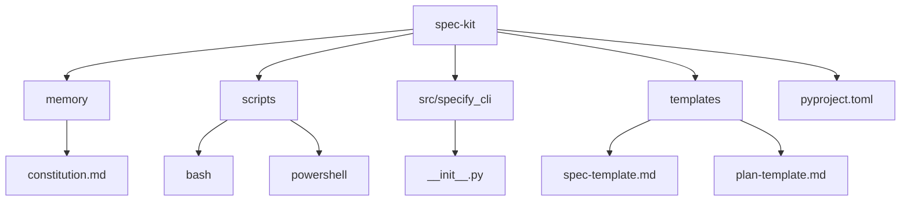
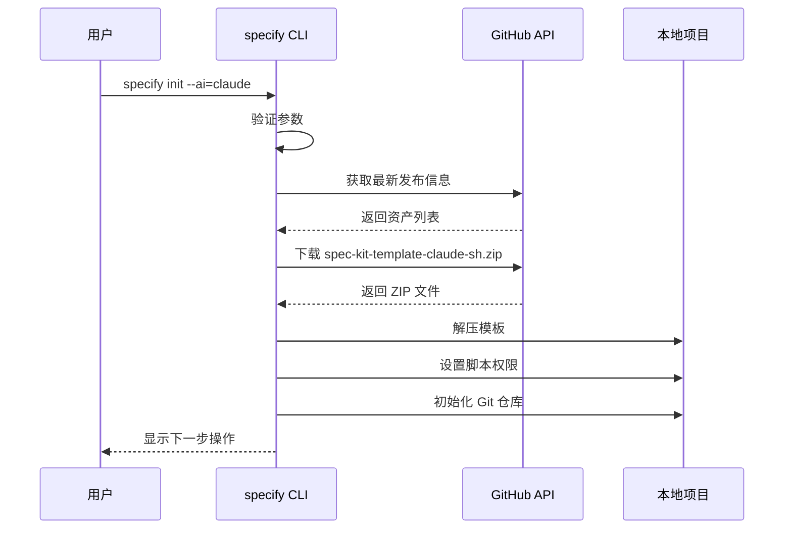
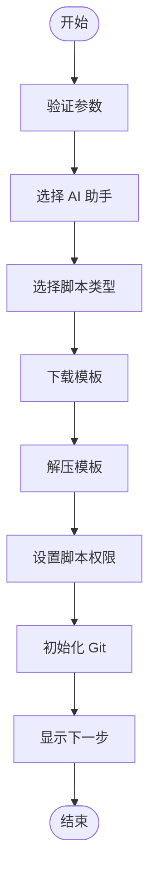
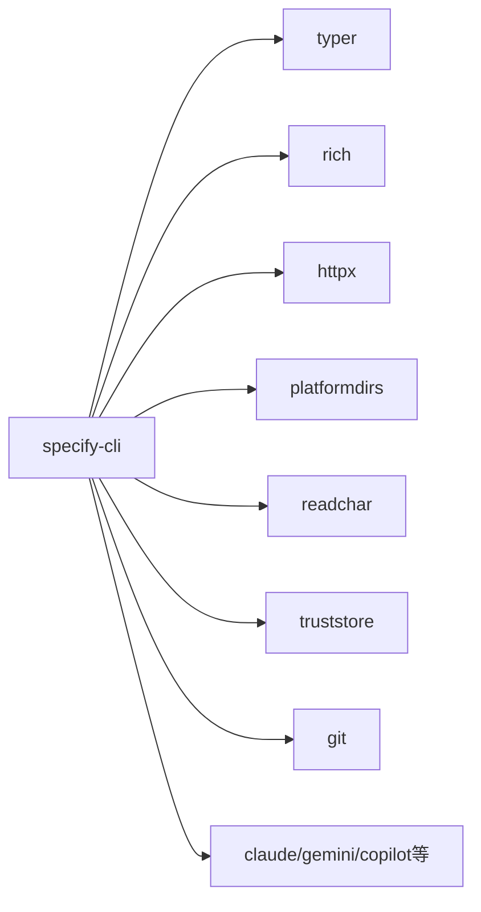

# 配置与自定义

<cite>
**本文档中引用的文件**  
- [pyproject.toml](file://pyproject.toml)
- [__init__.py](file://src/specify_cli/__init__.py)
- [constitution.md](file://memory/constitution.md)
- [spec-template.md](file://templates/spec-template.md)
- [common.sh](file://scripts/bash/common.sh)
- [setup-plan.sh](file://scripts/bash/setup-plan.sh)
- [create-new-feature.sh](file://scripts/bash/create-new-feature.sh)
- [check-task-prerequisites.sh](file://scripts/bash/check-task-prerequisites.sh)
- [get-feature-paths.sh](file://scripts/bash/get-feature-paths.sh)
- [update-agent-context.sh](file://scripts/bash/update-agent-context.sh)
</cite>

## 目录
1. [简介](#简介)
2. [项目结构](#项目结构)
3. [核心组件](#核心组件)
4. [架构概述](#架构概述)
5. [详细组件分析](#详细组件分析)
6. [依赖分析](#依赖分析)
7. [性能考虑](#性能考虑)
8. [故障排除指南](#故障排除指南)
9. [结论](#结论)

## 简介
`spec-kit` 是一个支持规范驱动开发（Spec-Driven Development）的工具包，旨在通过结构化流程提升软件开发质量。本指南详细说明如何通过 `pyproject.toml` 文件和相关脚本对项目进行深度配置与自定义，涵盖从基础设置到高级扩展的各个方面。用户可依据本指南调整 CLI 行为、扩展模板系统、创建自定义钩子脚本，并根据团队需求定制开发规范。

## 项目结构
项目采用模块化设计，主要包含以下目录：
- `memory/`：存放项目宪法文档（`constitution.md`），定义核心开发原则。
- `scripts/`：包含 Bash 和 PowerShell 脚本，用于自动化开发任务。
- `src/specify_cli/`：CLI 工具的核心实现。
- `templates/`：各类文档模板，如规范、计划和任务模板。
- 根目录下包含 `pyproject.toml` 配置文件及其他元数据文件。

**Diagram sources**
- [pyproject.toml](file://pyproject.toml)
- [__init__.py](file://src/specify_cli/__init__.py)

**Section sources**
- [pyproject.toml](file://pyproject.toml)
- [__init__.py](file://src/specify_cli/__init__.py)

## 核心组件
核心功能由 `src/specify_cli/__init__.py` 实现，主要包括 CLI 初始化、模板下载与提取、脚本权限设置等。`pyproject.toml` 定义了项目元数据和依赖项，是配置的起点。`memory/constitution.md` 作为项目宪法，指导开发行为。

**Section sources**
- [pyproject.toml](file://pyproject.toml#L1-L23)
- [__init__.py](file://src/specify_cli/__init__.py#L1-L799)
- [constitution.md](file://memory/constitution.md#L1-L49)

## 架构概述
系统采用 CLI 驱动的模板化架构。用户通过 `specify init` 命令触发初始化流程，CLI 从 GitHub 下载对应 AI 助手的模板包，解压并配置项目环境。脚本系统提供一系列钩子，支持与不同 AI 工具集成。

**Diagram sources**
- [__init__.py](file://src/specify_cli/__init__.py#L420-L675)
- [download_template_from_github](file://src/specify_cli/__init__.py#L420-L518)

## 详细组件分析

### CLI 初始化流程分析
`init` 命令是项目创建的入口，支持多种配置选项。

#### 初始化函数分析

**Diagram sources**
- [init](file://src/specify_cli/__init__.py#L724-L986)

**Section sources**
- [__init__.py](file://src/specify_cli/__init__.py#L724-L986)

### 模板系统扩展
`templates/` 目录下的 `.md` 文件定义了规范、计划等文档的结构。用户可通过修改 `spec-template.md` 来适应新的开发范式。

#### 模板变量说明
| 变量 | 说明 |
|------|------|
| `[FEATURE NAME]` | 功能名称 |
| `[DATE]` | 创建日期 |
| `$ARGUMENTS` | 用户输入参数 |

**Section sources**
- [spec-template.md](file://templates/spec-template.md#L1-L116)

### 自定义脚本与钩子
`scripts/` 目录提供了一系列 Bash 和 PowerShell 脚本，可作为钩子集成到工作流中。

#### 脚本功能映射
| 脚本文件 | 功能 |
|---------|------|
| `create-new-feature.sh` | 创建新功能分支和目录 |
| `setup-plan.sh` | 设置实现计划 |
| `check-task-prerequisites.sh` | 检查任务先决条件 |
| `update-agent-context.sh` | 更新 AI 助手上下文 |

**Section sources**
- [create-new-feature.sh](file://scripts/bash/create-new-feature.sh#L1-L58)
- [setup-plan.sh](file://scripts/bash/setup-plan.sh#L1-L17)
- [check-task-prerequisites.sh](file://scripts/bash/check-task-prerequisites.sh#L1-L15)
- [update-agent-context.sh](file://scripts/bash/update-agent-context.sh#L1-L66)

## 依赖分析
项目依赖通过 `pyproject.toml` 管理，主要依赖包括 `typer`（CLI 框架）、`rich`（富文本输出）、`httpx`（HTTP 客户端）等。运行时依赖 Git 和选定的 AI 助手 CLI 工具。

**Diagram sources**
- [pyproject.toml](file://pyproject.toml#L1-L23)

**Section sources**
- [pyproject.toml](file://pyproject.toml#L1-L23)

## 性能考虑
模板下载和解压是主要耗时操作，建议在稳定网络环境下执行。`httpx` 支持连接复用，`download_and_extract_template` 函数已优化文件流处理，减少内存占用。

## 故障排除指南
常见问题包括依赖缺失、网络连接失败和权限问题。

**Section sources**
- [__init__.py](file://src/specify_cli/__init__.py#L355-L372)
- [check_tool](file://src/specify_cli/__init__.py#L355-L372)

## 结论
`spec-kit` 提供了一套完整的配置与自定义机制，从 `pyproject.toml` 的基础设置到脚本系统的深度扩展，满足不同层次用户的需求。通过合理配置，团队可以高效地实施规范驱动开发，确保代码质量和架构一致性。