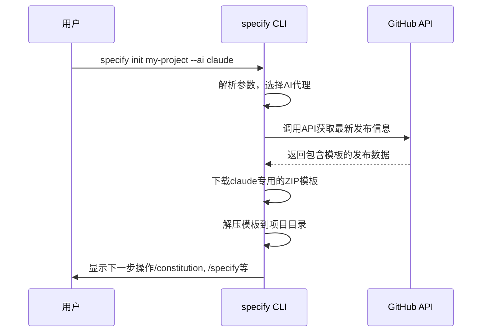

# 配置文件

<cite>
**本文档中引用的文件**  
- [pyproject.toml](file://pyproject.toml)
- [memory/constitution.md](file://memory/constitution.md)
- [src/specify_cli/__init__.py](file://src/specify_cli/__init__.py)
- [templates/commands/constitution.md](file://templates/commands/constitution.md)
- [README.md](file://README.md)
- [spec-driven.md](file://spec-driven.md)
</cite>

## 目录
1. [引言](#引言)
2. [pyproject.toml 配置机制](#pyprojecttoml-配置机制)
3. [memory/constitution.md 宪法文件](#memoryconstitutionmd-宪法文件)
4. [配置文件的协同作用](#配置文件的协同作用)
5. [结论](#结论)

## 引言

Spec-Kit 是一个支持规范驱动开发（Spec-Driven Development, SDD）的工具集，旨在通过结构化流程提升软件开发的效率与质量。其核心在于两个关键配置文件：`pyproject.toml` 和 `memory/constitution.md`。前者是项目的元数据和依赖管理中心，定义了命令行接口和工具链；后者则是项目的“宪法”，承载了核心开发原则和架构约束。这两个文件共同构建了一个可重复、一致的开发环境，确保AI代理在生成代码时遵循预设的高质量标准。本文档将深入解析这两个配置文件的作用、结构和使用方式。

## pyproject.toml 配置机制

`pyproject.toml` 是 Spec-Kit 项目的 Python 项目配置文件，遵循 PEP 518 标准，集中管理项目的元数据、依赖关系和命令行接口。

### 项目元数据与依赖管理

该文件的 `[project]` 部分定义了项目的基本信息，如名称、版本、描述和所需的 Python 版本。`dependencies` 列表声明了项目运行所必需的 Python 包，例如 `typer`（用于创建命令行界面）、`rich`（用于美化终端输出）和 `httpx`（用于网络请求）。这种集中式的依赖管理确保了所有开发者和CI/CD环境都能使用完全一致的库版本，避免了“在我机器上能运行”的问题。

```toml
[project]
name = "specify-cli"
version = "0.0.17"
description = "Specify CLI, part of GitHub Spec Kit. A tool to bootstrap your projects for Spec-Driven Development (SDD)."
requires-python = ">=3.11"
dependencies = [
    "typer",
    "rich",
    "httpx[socks]",
    "platformdirs",
    "readchar",
    "truststore>=0.10.4",
]
```

**Section sources**
- [pyproject.toml](file://pyproject.toml#L1-L15)

### CLI 入口点与 AI 代理支持

`[project.scripts]` 部分是 `pyproject.toml` 的核心功能之一，它定义了命令行入口点。`specify = "specify_cli:main"` 这行配置将 `specify` 命令映射到 `src/specify_cli/__init__.py` 文件中的 `main` 函数。当用户在终端运行 `specify init` 时，Python 包管理器（如 `uv`）会调用此函数，从而启动整个初始化流程。

为了支持多种AI代理，Spec-Kit 在 `src/specify_cli/__init__.py` 中定义了一个名为 `AI_CHOICES` 的字典，它将用户选择的代理名称（如 `claude`, `gemini`）映射到其全称。`specify init` 命令通过 `--ai` 参数接收用户的选择，并在初始化过程中下载和配置相应的模板。

```python
AI_CHOICES = {
    "copilot": "GitHub Copilot",
    "claude": "Claude Code",
    "gemini": "Gemini CLI",
    # ... 其他代理
}
```

通过修改 `AI_CHOICES` 字典并更新 `agent_folder_map`（用于安全提示），可以轻松地为 Spec-Kit 添加对新AI代理的支持。例如，要添加对 `mynewagent` 的支持，只需在 `AI_CHOICES` 中添加 `"mynewagent": "My New Agent"`，并在 `agent_folder_map` 中添加 `"mynewagent": ".mynewagent/"`。



**Diagram sources**
- [pyproject.toml](file://pyproject.toml#L16-L20)
- [src/specify_cli/__init__.py](file://src/specify_cli/__init__.py#L67-L79)

**Section sources**
- [pyproject.toml](file://pyproject.toml#L1-L23)
- [src/specify_cli/__init__.py](file://src/specify_cli/__init__.py#L866-L896)

## memory/constitution.md 宪法文件

`memory/constitution.md` 是 Spec-Kit 项目的核心，它被定义为项目的“宪法”，是所有开发决策的最高指导原则。这个文件确保了AI生成的代码不仅功能正确，而且在架构、质量和可维护性上符合预设标准。

### 核心原则与开发约束

该文件采用模板化结构，包含多个核心原则（Core Principles）和附加约束。这些原则是“不可协商的”（NON-NEGOTIABLE），例如：
*   **库优先原则 (Library-First)**：每个功能必须从一个独立的库开始，强制模块化设计。
*   **CLI接口原则 (CLI Interface)**：每个库必须通过命令行接口暴露功能，确保可观察性和可测试性。
*   **测试优先原则 (Test-First)**：必须遵循严格的测试驱动开发（TDD），先写测试，再实现代码。

这些原则直接嵌入到开发流程中。例如，`/plan` 命令在生成技术方案时，会检查是否符合“库优先”原则；`/implement` 命令在执行时，会强制先生成测试文件。

```markdown
# [PROJECT_NAME] Constitution

## Core Principles

### [PRINCIPLE_1_NAME]
[PRINCIPLE_1_DESCRIPTION]

### [PRINCIPLE_2_NAME]
[PRINCIPLE_2_DESCRIPTION]

### [PRINCIPLE_3_NAME]
[PRINCIPLE_3_DESCRIPTION]
```

**Section sources**
- [memory/constitution.md](file://memory/constitution.md#L0-L38)

### 在工作流中的使用方式

宪法文件在工作流中扮演着动态的“守门人”角色。AI代理在执行 `/constitution`、`/plan` 和 `/analyze` 等命令时，会主动读取并遵循 `memory/constitution.md` 中的规则。

1.  **初始化 (`/constitution`)**：用户首次运行 `/constitution` 命令时，AI会加载 `memory/constitution.md` 模板，并根据用户输入填充占位符（如 `[PRINCIPLE_1_NAME]`），生成一个具体的、项目专属的宪法文件。
2.  **计划生成 (`/plan`)**：在生成技术实现方案时，AI会参考宪法中的原则。例如，如果宪法规定了“集成优先测试”，AI会在计划中优先定义集成测试，而不是单元测试。
3.  **一致性分析 (`/analyze`)**：`/analyze` 命令会进行跨文档一致性检查，其权威依据就是 `memory/constitution.md`。任何与宪法冲突的规范、计划或任务都会被标记为“关键”问题。

```mermaid
flowchart TD
A[用户输入: /constitution 创建项目原则] --> B[AI代理]
B --> C{加载 /memory/constitution.md 模板}
C --> D[识别占位符<br/>[PROJECT_NAME], [PRINCIPLE_X_NAME]]
D --> E[根据用户输入或上下文<br/>推导具体值]
E --> F[生成具体宪法内容<br/>替换所有占位符]
F --> G[更新 /memory/constitution.md]
G --> H[同步更新相关模板<br/>如 /templates/plan-template.md]
H --> I[输出变更报告]
```

**Diagram sources**
- [memory/constitution.md](file://memory/constitution.md#L0-L49)
- [templates/commands/constitution.md](file://templates/commands/constitution.md#L0-L73)

**Section sources**
- [memory/constitution.md](file://memory/constitution.md#L0-L49)
- [templates/commands/constitution.md](file://templates/commands/constitution.md#L0-L73)
- [spec-driven.md](file://spec-driven.md#L268-L396)

## 配置文件的协同作用

`pyproject.toml` 和 `memory/constitution.md` 共同构建了 Spec-Kit 的可重复开发环境。前者提供了“硬件”支持，确保了工具链和依赖的一致性；后者提供了“软件”规则，确保了开发过程和产出质量的一致性。

这种协同作用体现在整个开发周期中。当用户运行 `specify init` 时，`pyproject.toml` 确保了正确的CLI和依赖被安装，而初始化流程会引导用户立即使用 `/constitution` 命令来建立项目原则。从此，所有后续的 `/specify`、`/plan` 和 `/implement` 命令都在这个由两个配置文件共同定义的框架内运行，从而实现了从项目创建到代码生成的端到端标准化。

## 结论

`pyproject.toml` 和 `memory/constitution.md` 是 Spec-Kit 实现规范驱动开发的两大基石。`pyproject.toml` 作为技术基础，通过标准化的依赖和CLI入口点，确保了开发环境的可重复性。`memory/constitution.md` 作为治理核心，通过明确、不可协商的开发原则，确保了AI生成代码的质量和架构一致性。理解并善用这两个配置文件，是充分发挥 Spec-Kit 潜力，实现高效、高质量软件开发的关键。