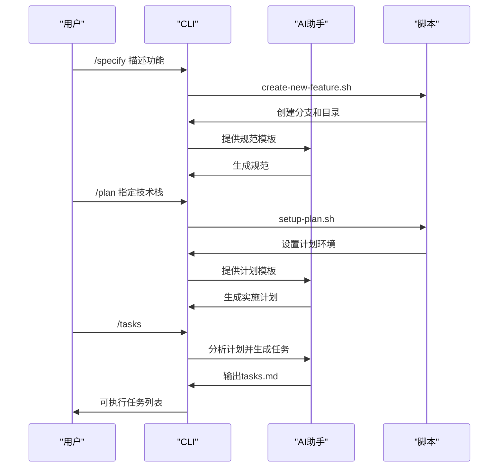
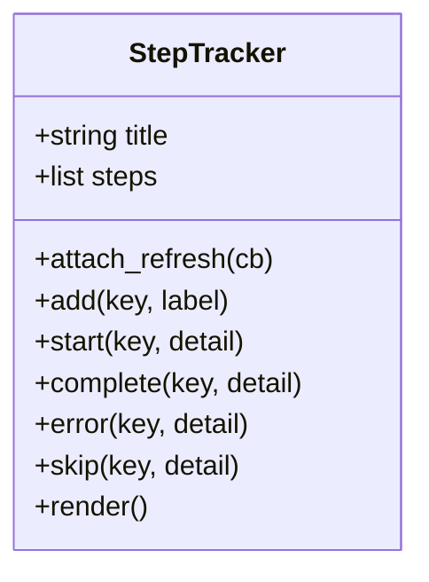

# 项目概述

<cite>
**本文档引用的文件**  
- [README.md](file://README.md)
- [spec-driven.md](file://spec-driven.md)
- [memory/constitution.md](file://memory/constitution.md)
- [templates/spec-template.md](file://templates/spec-template.md)
- [templates/plan-template.md](file://templates/plan-template.md)
- [templates/tasks-template.md](file://templates/tasks-template.md)
- [src/specify_cli/__init__.py](file://src/specify_cli/__init__.py)
- [scripts/bash/create-new-feature.sh](file://scripts/bash/create-new-feature.sh)
- [scripts/bash/setup-plan.sh](file://scripts/bash/setup-plan.sh)
- [scripts/bash/common.sh](file://scripts/bash/common.sh)
</cite>

## 目录
1. [简介](#简介)
2. [核心理念](#核心理念)
3. [系统架构](#系统架构)
4. [CLI命令详解](#cli命令详解)
5. [宪法式治理](#宪法式治理)
6. [模板系统](#模板系统)
7. [典型工作流](#典型工作流)
8. [高级功能](#高级功能)
9. [结论](#结论)

## 简介

spec-kit 是一个规范驱动开发（Spec-Driven Development, SDD）的工具包，旨在通过将规范作为可执行的源代码来重构软件开发流程。该项目颠覆了传统开发中"代码为王"的模式，使规范成为生成实现的源头，从而消除规范与实现之间的鸿沟。通过与AI助手（如Claude、Gemini）的深度集成，spec-kit 实现了从想法到可执行任务的自动化流程，显著提升了开发效率和质量。

**Section sources**
- [README.md](file://README.md#L1-L50)
- [spec-driven.md](file://spec-driven.md#L1-L50)

## 核心理念

spec-kit 的核心哲学是"意图驱动开发"，强调在确定"如何实现"之前先明确"需要什么"和"为什么需要"。该工具包通过多步骤细化过程，而非一次性从提示生成代码，充分利用先进AI模型的能力来解释和实现复杂规范。SDD范式将规范提升为主要工件，代码则成为其在特定语言和框架中的表达形式。

**Section sources**
- [README.md](file://README.md#L100-L150)
- [spec-driven.md](file://spec-driven.md#L100-L200)

## 系统架构

```mermaid
graph TB
subgraph "用户交互层"
CLI[CLI命令]
AI[AI助手]
end
subgraph "处理层"
Specify[/specify 命令]
Plan[/plan 命令]
Tasks[/tasks 命令]
end
subgraph "模板系统"
SpecTemplate[spec-template.md]
PlanTemplate[plan-template.md]
TasksTemplate[tasks-template.md]
end
subgraph "脚本支持"
Bash[scripts/bash]
PowerShell[scripts/powershell]
end
subgraph "治理层"
Constitution[constitution.md]
end
CLI --> Specify
CLI --> Plan
CLI --> Tasks
Specify --> SpecTemplate
Plan --> PlanTemplate
Tasks --> TasksTemplate
Bash --> Specify
Bash --> Plan
Bash --> Tasks
PowerShell --> Specify
PowerShell --> Plan
PowerShell --> Tasks
Constitution --> Plan
Constitution --> Tasks
```

**Diagram sources**
- [README.md](file://README.md#L200-L300)
- [spec-driven.md](file://spec-driven.md#L300-L400)

**Section sources**
- [README.md](file://README.md#L200-L300)
- [spec-driven.md](file://spec-driven.md#L300-L400)

## CLI命令详解

spec-kit 提供了三个核心CLI命令，实现了从想法到可执行任务的自动化流程：

### /specify 命令

该命令将功能描述转换为结构化的规范，自动管理仓库：

- **自动特征编号**：扫描现有规范以确定下一个特征编号
- **分支创建**：根据描述生成语义化分支名称并自动创建
- **模板化生成**：复制并定制特征规范模板
- **目录结构**：创建 `specs/[branch-name]/` 结构

**Section sources**
- [README.md](file://README.md#L300-L350)
- [spec-driven.md](file://spec-driven.md#L400-L450)

### /plan 命令

在特征规范存在后，该命令创建全面的实施计划：

- **规范分析**：读取和理解特征需求、用户故事和验收标准
- **宪法合规性**：确保与项目宪法和架构原则一致
- **技术转换**：将业务需求转化为技术架构和实施细节
- **详细文档**：生成数据模型、API合同和测试场景的支持文档

**Section sources**
- [README.md](file://README.md#L350-L400)
- [spec-driven.md](file://spec-driven.md#L450-L500)

### /tasks 命令

在计划创建后，该命令分析计划和相关设计文档以生成可执行任务列表：

- **输入**：读取 `plan.md`（必需）以及 `data-model.md`、`contracts/` 和 `research.md`（如果存在）
- **任务推导**：将合同、实体和场景转换为具体任务
- **并行化**：标记独立任务 `[P]` 并概述安全的并行组
- **输出**：在特征目录中写入 `tasks.md`，准备由任务代理执行

**Section sources**
- [README.md](file://README.md#L400-L450)
- [spec-driven.md](file://spec-driven.md#L500-L550)

## 宪法式治理

spec-kit 的核心是宪法——一组不可变的原则，规范了规范如何转化为代码。宪法 (`memory/constitution.md`) 作为系统的架构DNA，确保每个生成的实现保持一致性、简单性和质量。

### 九项开发原则

宪法定义了九项原则，塑造了开发过程的每个方面：

#### 第一条：库优先原则

每个特征必须从独立库开始——无例外。这从一开始就强制模块化设计。

#### 第二条：CLI接口强制

每个库必须通过命令行接口暴露其功能，确保可观察性和可测试性。

#### 第三条：测试优先强制

最变革性的原则——在测试之前不编写代码。这完全颠覆了传统的AI代码生成。

#### 第七条和第八条：简单性和反抽象

这些配对原则对抗过度工程化，强制LLM证明任何复杂性的合理性。

#### 第九条：集成优先测试

优先考虑真实环境测试而非孤立的单元测试，确保生成的代码在实践中有效。

**Section sources**
- [spec-driven.md](file://spec-driven.md#L600-L800)
- [memory/constitution.md](file://memory/constitution.md#L1-L50)

## 模板系统

spec-kit 的模板系统通过结构化约束LLM输出，确保高质量的规范生成。

### 规范模板 (spec-template.md)

该模板通过以下方式防止过早的实现细节：

- ✅ 专注于用户需要的"什么"和"为什么"
- ❌ 避免"如何"实现（无技术栈、API、代码结构）

**Section sources**
- [templates/spec-template.md](file://templates/spec-template.md#L1-L50)

### 实施计划模板 (plan-template.md)

该模板通过阶段门禁强制架构原则：

- **简单性门禁**：项目数量 ≤ 3？
- **反抽象门禁**：直接使用框架？
- **集成优先门禁**：合同已定义？

**Section sources**
- [templates/plan-template.md](file://templates/plan-template.md#L1-L50)

### 任务模板 (tasks-template.md)

该模板确保任务生成的完整性和正确顺序：

- 所有合同都有对应的测试？
- 所有实体都有模型任务？
- 所有测试都在实现之前？

**Section sources**
- [templates/tasks-template.md](file://templates/tasks-template.md#L1-L50)

## 典型工作流



**Diagram sources**
- [README.md](file://README.md#L450-L500)
- [spec-driven.md](file://spec-driven.md#L800-L850)

**Section sources**
- [README.md](file://README.md#L450-L500)
- [spec-driven.md](file://spec-driven.md#L800-L850)

## 高级功能

### StepTracker 进度跟踪机制

`src/specify_cli/__init__.py` 中的 `StepTracker` 类提供了一个层次化的步骤跟踪系统，类似于Claude Code的树形输出，支持实时自动刷新。



**Diagram sources**
- [src/specify_cli/__init__.py](file://src/specify_cli/__init__.py#L100-L200)

**Section sources**
- [src/specify_cli/__init__.py](file://src/specify_cli/__init__.py#L100-L200)

### select_with_arrows 交互式选择功能

`select_with_arrows` 函数提供了一个使用箭头键进行交互式选择的界面，增强了CLI的用户体验。

**Section sources**
- [src/specify_cli/__init__.py](file://src/specify_cli/__init__.py#L200-L300)

## 结论

spec-kit 通过规范驱动开发范式，从根本上重新思考了软件开发的驱动力。它不是要取代开发者，而是通过自动化规范到实现的机械性转换来增强人类能力。该项目通过CLI命令、模板系统、脚本支持和宪法文档的有机结合，创建了一个强大而一致的开发环境，使团队能够专注于创造性和批判性思维，而不是繁琐的实现细节。

**Section sources**
- [spec-driven.md](file://spec-driven.md#L900-L950)