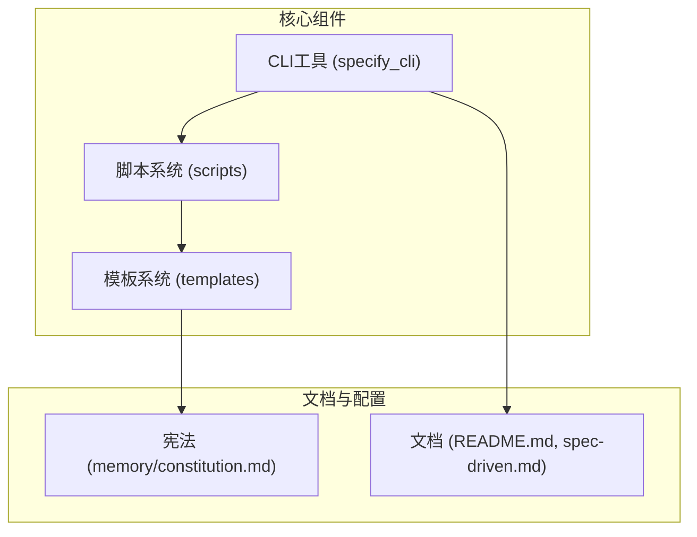
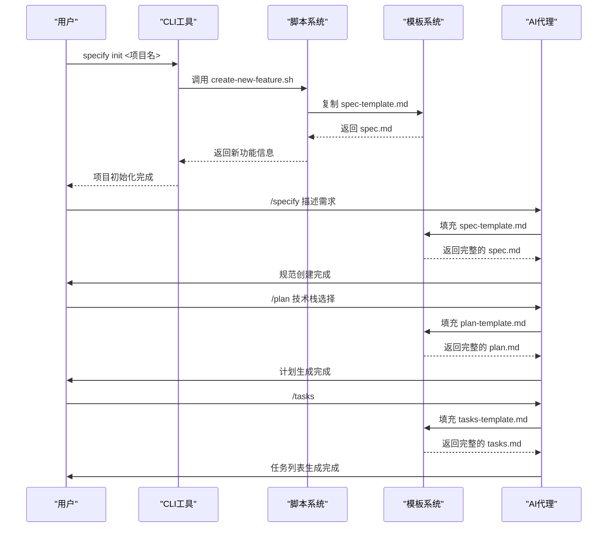
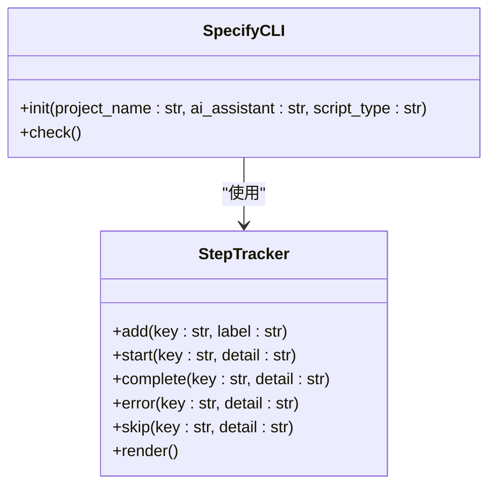
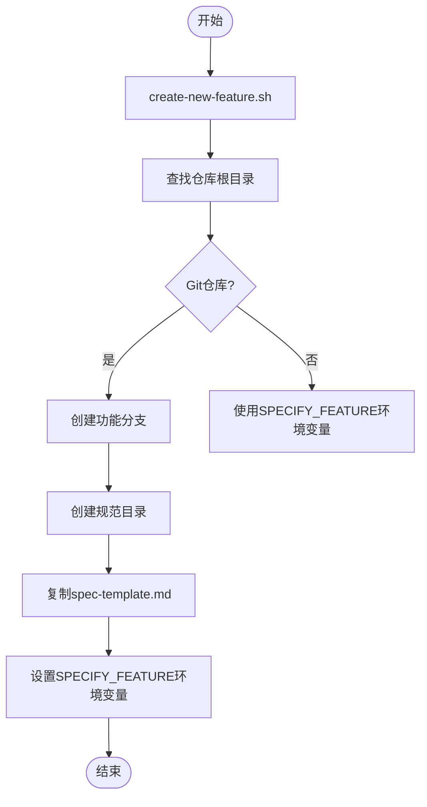
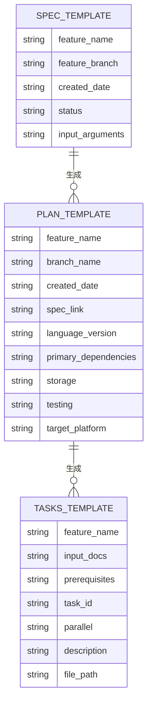
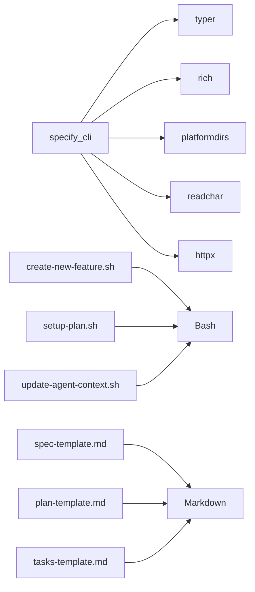

# 项目概述

<cite>
**本文档引用的文件**
- [README.md](file://README.md)
- [spec-driven.md](file://spec-driven.md)
- [src/specify_cli/__init__.py](file://src/specify_cli/__init__.py)
- [templates/spec-template.md](file://templates/spec-template.md)
- [templates/plan-template.md](file://templates/plan-template.md)
- [templates/tasks-template.md](file://templates/tasks-template.md)
- [templates/agent-file-template.md](file://templates/agent-file-template.md)
- [scripts/bash/create-new-feature.sh](file://scripts/bash/create-new-feature.sh)
- [scripts/bash/setup-plan.sh](file://scripts/bash/setup-plan.sh)
- [scripts/bash/update-agent-context.sh](file://scripts/bash/update-agent-context.sh)
- [scripts/bash/common.sh](file://scripts/bash/common.sh)
</cite>

## 目录
1. [简介](#简介)
2. [项目结构](#项目结构)
3. [核心组件](#核心组件)
4. [架构概述](#架构概述)
5. [详细组件分析](#详细组件分析)
6. [依赖分析](#依赖分析)
7. [性能考量](#性能考量)
8. [故障排除指南](#故障排除指南)
9. [结论](#结论)

## 简介

Spec-Kit 是一个旨在通过规范驱动开发（SDD）方法论来加速高质量软件构建的工具集。该项目颠覆了传统以代码为中心的开发模式，将规范提升为可执行的首要工件，使代码成为规范的具体实现。通过与AI代理协同工作，Spec-Kit实现了从自然语言需求到可执行代码的自动化流程，极大地提升了开发效率和团队协作的规范性。

**Section sources**
- [README.md](file://README.md#L1-L582)
- [spec-driven.md](file://spec-driven.md#L1-L403)

## 项目结构

Spec-Kit项目的结构清晰地划分了不同功能的组件，主要包括CLI工具、脚本系统、模板系统和文档。其核心目录结构如下：

```
.
├── memory
│   └── constitution.md          # 项目宪法，定义架构原则
├── scripts                      # 脚本系统，包含Bash和PowerShell脚本
│   ├── bash
│   │   ├── check-prerequisites.sh
│   │   ├── common.sh
│   │   ├── create-new-feature.sh
│   │   ├── setup-plan.sh
│   │   └── update-agent-context.sh
│   └── powershell
│       ├── check-prerequisites.ps1
│       ├── common.ps1
│       ├── create-new-feature.ps1
│       ├── setup-plan.ps1
│       └── update-agent-context.ps1
├── src/specify_cli
│   └── __init__.py              # CLI工具的主模块
├── templates                    # 模板系统，定义各种文档的结构
│   ├── commands
│   │   ├── analyze.md
│   │   ├── clarify.md
│   │   ├── constitution.md
│   │   ├── implement.md
│   │   ├── plan.md
│   │   ├── specify.md
│   │   └── tasks.md
│   ├── agent-file-template.md
│   ├── plan-template.md
│   ├── spec-template.md
│   └── tasks-template.md
├── AGENTS.md
├── CHANGELOG.md
├── CODE_OF_CONDUCT.md
├── CONTRIBUTING.md
├── README.md
├── SECURITY.md
├── SUPPORT.md
├── pyproject.toml
└── spec-driven.md
```

该结构体现了模块化设计，将CLI工具、自动化脚本和文档模板分离，便于维护和扩展。



**Diagram sources**
- [README.md](file://README.md#L1-L582)
- [project_structure](file://project_structure)

**Section sources**
- [README.md](file://README.md#L1-L582)
- [project_structure](file://project_structure)

## 核心组件

Spec-Kit的核心组件包括CLI工具、脚本系统和模板系统。CLI工具（`specify_cli`）是用户与项目交互的主要入口，负责初始化项目和检查环境。脚本系统提供了一系列Bash和PowerShell脚本，用于自动化创建新功能、设置计划和更新AI代理上下文等任务。模板系统则定义了规范、计划和任务等文档的结构，确保生成的文档具有一致性和完整性。

**Section sources**
- [src/specify_cli/__init__.py](file://src/specify_cli/__init__.py#L1-L799)
- [scripts/bash/create-new-feature.sh](file://scripts/bash/create-new-feature.sh#L1-L97)
- [scripts/bash/setup-plan.sh](file://scripts/bash/setup-plan.sh#L1-L60)
- [templates/spec-template.md](file://templates/spec-template.md#L1-L116)
- [templates/plan-template.md](file://templates/plan-template.md#L1-L225)
- [templates/tasks-template.md](file://templates/tasks-template.md#L1-L126)

## 架构概述

Spec-Kit的架构遵循规范驱动开发的核心理念，通过CLI命令与AI代理协同工作，实现从需求到代码的自动化流程。其架构模式包括模板方法模式、命令模式和配置即代码的实践。CLI工具作为前端，接收用户命令并调用相应的脚本和模板。脚本系统执行具体的自动化任务，而模板系统则确保生成的文档符合预定义的结构和质量标准。



**Diagram sources**
- [src/specify_cli/__init__.py](file://src/specify_cli/__init__.py#L1-L799)
- [scripts/bash/create-new-feature.sh](file://scripts/bash/create-new-feature.sh#L1-L97)
- [templates/spec-template.md](file://templates/spec-template.md#L1-L116)
- [templates/plan-template.md](file://templates/plan-template.md#L1-L225)
- [templates/tasks-template.md](file://templates/tasks-template.md#L1-L126)

## 详细组件分析

### CLI工具分析

CLI工具是Spec-Kit的入口点，使用typer框架构建，提供了`init`和`check`等命令。它负责初始化新项目，下载并解压模板，以及检查系统要求。



**Diagram sources**
- [src/specify_cli/__init__.py](file://src/specify_cli/__init__.py#L1-L799)

**Section sources**
- [src/specify_cli/__init__.py](file://src/specify_cli/__init__.py#L1-L799)

### 脚本系统分析

脚本系统包含一系列Bash和PowerShell脚本，用于自动化项目中的各种任务。`create-new-feature.sh`脚本负责创建新功能分支和规范文件，`setup-plan.sh`脚本用于设置实施计划，`update-agent-context.sh`脚本则更新AI代理的上下文文件。



**Diagram sources**
- [scripts/bash/create-new-feature.sh](file://scripts/bash/create-new-feature.sh#L1-L97)
- [scripts/bash/common.sh](file://scripts/bash/common.sh#L1-L113)

**Section sources**
- [scripts/bash/create-new-feature.sh](file://scripts/bash/create-new-feature.sh#L1-L97)
- [scripts/bash/common.sh](file://scripts/bash/common.sh#L1-L113)

### 模板系统分析

模板系统是Spec-Kit的核心，定义了规范、计划和任务等文档的结构。`spec-template.md`模板确保规范文档专注于用户需求和业务价值，避免技术实现细节。`plan-template.md`模板则将业务需求转化为技术架构和实施细节，`tasks-template.md`模板生成可执行的任务列表。



**Diagram sources**
- [templates/spec-template.md](file://templates/spec-template.md#L1-L116)
- [templates/plan-template.md](file://templates/plan-template.md#L1-L225)
- [templates/tasks-template.md](file://templates/tasks-template.md#L1-L126)

**Section sources**
- [templates/spec-template.md](file://templates/spec-template.md#L1-L116)
- [templates/plan-template.md](file://templates/plan-template.md#L1-L225)
- [templates/tasks-template.md](file://templates/tasks-template.md#L1-L126)

## 依赖分析

Spec-Kit的依赖关系清晰，CLI工具依赖于typer、rich等Python库，脚本系统依赖于系统的shell环境，模板系统则独立于具体技术栈。外部依赖包括AI代理（如Claude Code、GitHub Copilot等）、uv包管理器、Python 3.11+和Git。



**Diagram sources**
- [pyproject.toml](file://pyproject.toml)
- [src/specify_cli/__init__.py](file://src/specify_cli/__init__.py#L1-L799)

**Section sources**
- [pyproject.toml](file://pyproject.toml)
- [src/specify_cli/__init__.py](file://src/specify_cli/__init__.py#L1-L799)

## 性能考量

Spec-Kit的设计注重效率和可维护性。通过模板和脚本自动化重复性任务，减少了人为错误，提高了开发速度。CLI工具的初始化过程通过并行下载和解压模板来优化性能。脚本系统通过环境变量和函数复用避免了重复代码，提高了执行效率。

## 故障排除指南

当使用Spec-Kit时，可能会遇到一些常见问题。例如，在Linux上使用Git时，可能需要安装Git Credential Manager来解决认证问题。如果AI代理无法找到，可以使用`--ignore-agent-tools`选项跳过检查。对于CLI工具的详细调试信息，可以使用`--debug`选项。

**Section sources**
- [README.md](file://README.md#L1-L582)
- [scripts/bash/check-prerequisites.sh](file://scripts/bash/check-prerequisites.sh#L1-L165)

## 结论

Spec-Kit通过规范驱动开发的方法论，提供了一套完整的工具集，实现了从自然语言需求到可执行代码的自动化流程。其核心价值在于将规范提升为可执行的首要工件，通过CLI工具、脚本系统和模板系统的协同工作，确保了开发过程的规范性和一致性。这不仅提升了开发效率，还促进了团队协作的统一，为现代软件开发提供了一种创新的解决方案。