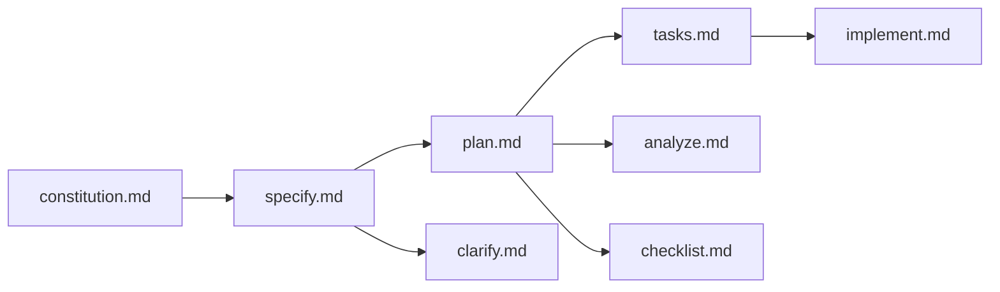

[根目录](../../CLAUDE.md) > **templates**

# Templates - 模板系统模块

## 变更记录 (Changelog)

**2025-11-17**: 初始化模板系统文档

## 模块职责

templates模块是Spec Kit的核心模板引擎，负责：
- 提供Spec-Driven Development流程的标准模板
- 支持AI代理的斜杠命令模板
- 定义项目文档和代码生成规范
- 维护一致的开发流程和文档结构

## 入口与启动

### 模板入口文件
- **规格模板**: `spec-template.md` - 功能规格说明模板
- **计划模板**: `plan-template.md` - 技术实现计划模板
- **任务模板**: `tasks-template.md` - 任务分解模板
- **检查清单模板**: `checklist-template.md` - 质量检查模板
- **代理文件模板**: `agent-file-template.md` - 开发指南模板

### 命令模板目录
- **路径**: `commands/`
- **内容**: 8个斜杠命令的实现模板

## 对外接口

### 核心模板接口

#### 功能规格模板 (spec-template.md)
**用途**: 定义功能需求和用户故事
**关键部分**:
- 用户场景和测试用例
- 功能需求 (FR-001, FR-002...)
- 关键实体定义
- 成功标准 (SC-001, SC-002...)

#### 技术计划模板 (plan-template.md)
**用途**: 定义技术实现方案
**关键部分**:
- 技术栈选择
- 架构设计
- 实现细节
- 风险评估

#### 任务分解模板 (tasks-template.md)
**用途**: 将计划分解为可执行任务
**关键部分**:
- 按用户故事分组的任务
- 依赖关系管理
- 并行执行标记
- 文件路径规范

### 斜杠命令接口

#### 核心命令模板
1. **`constitution.md`** - 项目治理原则
2. **`specify.md`** - 功能规格说明
3. **`plan.md`** - 技术实现计划
4. **`tasks.md`** - 任务分解
5. **`implement.md`** - 实现执行

#### 增强命令模板
6. **`clarify.md`** - 需求澄清
7. **`analyze.md`** - 一致性分析
8. **`checklist.md`** - 质量检查

## 关键依赖与配置

### 模板依赖关系


### 配置项
- **占位符语法**: `[UPPER_CASE_IDENTIFIER]`
- **Markdown规范**: 标准Markdown + HTML注释
- **模板变量**: 项目名称、日期、功能描述等

### VS Code集成
- **配置文件**: `vscode-settings.json`
- **功能**: 提供开发环境的默认设置

## 数据模型

### 模板变量系统
- `[PROJECT_NAME]`: 项目名称
- `[FEATURE_NAME]`: 功能名称
- `[DATE]`: 当前日期
- `[ARGUMENTS]`: 用户输入参数
- `[PRINCIPLE_*_NAME]`: 原则名称占位符
- `[PRINCIPLE_*_DESCRIPTION]`: 原则描述占位符

### 规格模板数据模型
```markdown
- **FR-001**: 系统必须 [具体能力]
- **SC-001**: [可衡量指标]
- 用户故事: [用户旅程描述]
```

### 计划模板数据模型
```markdown
- 技术栈: [语言、框架、工具]
- 架构: [系统设计图]
- 实现步骤: [详细步骤列表]
```

## 测试与质量

### 模板质量检查
1. **占位符完整性**: 确保所有变量都有占位符
2. **Markdown语法**: 验证文档格式正确性
3. **模板一致性**: 确保模板间引用关系正确
4. **中文支持**: 验证中文字符显示正常

### 建议测试策略
- **模板解析测试**: 验证占位符替换正确
- **命令生成测试**: 确保AI能正确理解模板
- **文档渲染测试**: 验证最终文档格式

## 常见问题 (FAQ)

### Q: 如何自定义模板占位符？
A: 使用`[UPPER_CASE_IDENTIFIER]`格式，保持描述性命名。

### Q: 模板如何支持多语言？
A: 当前主要支持中文，可通过创建多语言版本模板扩展。

### Q: 如何添加新的斜杠命令？
A: 在`commands/`目录创建新的`.md`文件，遵循现有模板结构。

### Q: 模板版本如何管理？
A: 通过Git分支管理模板版本，支持向后兼容。

## 相关文件清单

### 核心模板文件
- `spec-template.md` - 功能规格说明模板
- `plan-template.md` - 技术实现计划模板
- `tasks-template.md` - 任务分解模板
- `checklist-template.md` - 质量检查清单模板
- `agent-file-template.md` - 开发指南生成模板

### 命令模板文件
- `commands/constitution.md` - 项目治理命令
- `commands/specify.md` - 规格说明命令
- `commands/plan.md` - 技术计划命令
- `commands/tasks.md` - 任务分解命令
- `commands/implement.md` - 实现执行命令
- `commands/clarify.md` - 需求澄清命令
- `commands/analyze.md` - 一致性分析命令
- `commands/checklist.md` - 质量检查命令

### 配置文件
- `vscode-settings.json` - VS Code开发环境配置

## 子模块文档

### commands子模块
详见: [commands/CLAUDE.md](./commands/CLAUDE.md)

## 变更记录 (Changelog)

**2025-11-17**:
- 初始化模板系统文档
- 分析模板结构和依赖关系
- 识别模板变量系统
- 建立质量检查标准

---

*最后更新: 2025-11-17*
*模块版本: 1.0.0*