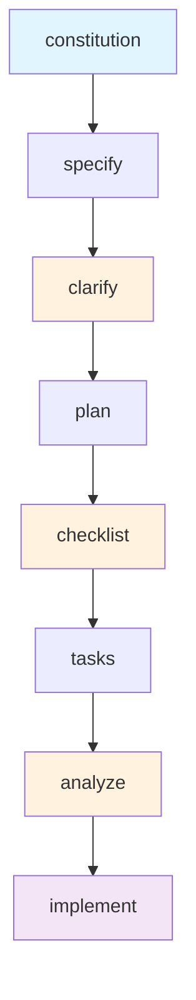

[根目录](../../../CLAUDE.md) > [templates](../) > **commands**

# Commands - 斜杠命令模板模块

## 变更记录 (Changelog)

**2025-11-17**: 初始化斜杠命令模板文档

## 模块职责

commands模块包含AI代理的斜杠命令实现模板，负责：
- 定义标准化的SDD工作流程命令
- 提供AI代理的执行指导
- 维护命令间的一致性和依赖关系
- 确保开发流程的质量和可重复性

## 入口与启动

### 命令模板入口
每个`.md`文件都是一个独立的斜杠命令实现模板：

#### 核心工作流命令
1. **`constitution.md`** - 建立项目治理原则
2. **`specify.md`** - 创建功能规格说明
3. **`plan.md`** - 制定技术实现计划
4. **`tasks.md`** - 分解为可执行任务
5. **`implement.md`** - 执行实现

#### 质量增强命令
6. **`clarify.md`** - 澄清模糊需求
7. **`analyze.md`** - 一致性和覆盖率分析
8. **`checklist.md`** - 生成质量检查清单

## 对外接口

### 命令执行接口

#### constitution命令
**功能**: 创建或更新项目治理原则
**输入**: 用户提供的原则描述
**输出**: `/memory/constitution.md`文件
**关键特性**:
- 占位符替换系统
- 版本控制管理
- 依赖模板同步更新

#### specify命令
**功能**: 将用户需求转化为结构化规格说明
**输入**: 用户功能描述
**输出**: `/specs/[BRANCH]/spec.md`文件
**关键特性**:
- 用户故事优先级排序
- 独立可测试性验证
- 功能需求自动编号

#### plan命令
**功能**: 基于规格创建技术实现计划
**输入**: 技术栈选择和架构决策
**输出**: `/specs/[BRANCH]/plan.md`等文件
**关键特性**:
- 技术栈对比分析
- 实现步骤详细规划
- 风险评估和缓解策略

#### tasks命令
**功能**: 将计划分解为可执行任务列表
**输入**: 无（读取现有计划文件）
**输出**: `/specs/[BRANCH]/tasks.md`文件
**关键特性**:
- 按用户故事分组
- 依赖关系管理
- 并行执行标记 `[P]`

#### implement命令
**功能**: 执行所有任务并构建功能
**输入**: 无（读取任务文件）
**输出**: 完整的功能实现
**关键特性**:
- 任务执行顺序验证
- TDD流程支持
- 进度跟踪和错误处理

### 增强命令接口

#### clarify命令
**功能**: 系统性地澄清规格中的模糊区域
**时机**: 在plan命令之前执行
**输出**: 规格文件的澄清部分

#### analyze命令
**功能**: 跨工件一致性和覆盖率分析
**时机**: 在tasks之后、implement之前执行
**输出**: 分析报告和改进建议

#### checklist命令
**功能**: 生成自定义质量检查清单
**时机**: 在plan之后执行
**输出**: 需求完整性、清晰性检查清单

## 关键依赖与配置

### 命令执行顺序


### 模板变量系统
- `$ARGUMENTS`: 用户输入参数
- `[FEATURE_NAME]`: 功能名称
- `[BRANCH]`: Git分支名称
- `[PROJECT_NAME]`: 项目名称
- `[DATE]`: 当前日期

### 文件路径约定
- `/memory/constitution.md` - 项目原则
- `/specs/[BRANCH]/spec.md` - 功能规格
- `/specs/[BRANCH]/plan.md` - 技术计划
- `/specs/[BRANCH]/tasks.md` - 任务列表
- `/specs/[BRANCH]/quickstart.md` - 快速开始指南

## 数据模型

### 用户故事模型
```markdown
### User Story N - [标题] (Priority: PX)
[用户旅程描述]

**Why this priority**: [优先级理由]
**Independent Test**: [独立测试方法]
**Acceptance Scenarios**:
1. Given [状态], When [操作], Then [结果]
```

### 功能需求模型
```markdown
- **FR-001**: 系统 MUST [具体能力]
- **FR-002**: 用户 MUST be able to [交互]
- **FR-003**: 系统 MUST [数据要求]
```

### 成功标准模型
```markdown
- **SC-001**: [可衡量指标]
- **SC-002**: [用户满意度指标]
- **SC-003**: [业务影响指标]
```

### 任务分解模型
```markdown
### User Story N: [标题]
#### 任务 1.1: [任务描述]
- 文件: `[路径/文件名]`
- 依赖: 前置任务
- 并行: `[P]` (如适用)
```

## 测试与质量

### 命令质量标准
1. **输入验证**: 检查必需的前置条件
2. **输出格式**: 确保生成的文档格式一致
3. **错误处理**: 提供清晰的错误信息和恢复建议
4. **进度跟踪**: 显示执行进度和状态

### 一致性检查
- 命令间术语一致性
- 文档结构标准化
- 占位符命名规范
- 引用关系正确性

## 常见问题 (FAQ)

### Q: 命令执行失败如何恢复？
A: 检查前置命令是否完成，查看错误日志，重新运行失败的命令。

### Q: 如何自定义命令行为？
A: 修改对应的模板文件，保持占位符和基本结构不变。

### Q: 命令间数据如何传递？
A: 通过文件系统读取，按照标准化的文件路径和格式。

### Q: 如何添加新命令？
A: 创建新的.md模板文件，更新依赖关系和执行顺序文档。

## 相关文件清单

### 核心命令模板
- `constitution.md` - 项目治理原则模板
- `specify.md` - 功能规格说明模板
- `plan.md` - 技术实现计划模板
- `tasks.md` - 任务分解模板
- `implement.md` - 实现执行模板

### 增强命令模板
- `clarify.md` - 需求澄清模板
- `analyze.md` - 一致性分析模板
- `checklist.md` - 质量检查清单模板

## 最佳实践

### 命令使用建议
1. **按顺序执行**: 遵循推荐的工作流程顺序
2. **前置检查**: 每个命令执行前检查前置条件
3. **增量迭代**: 可以多次运行clarify和analyze命令
4. **质量优先**: 不要跳过质量增强命令

### 模板维护建议
1. **向后兼容**: 修改模板时保持现有功能
2. **文档同步**: 更新模板时同步更新相关文档
3. **测试覆盖**: 为模板变更提供测试用例
4. **版本控制**: 使用Git管理模板版本历史

## 变更记录 (Changelog)

**2025-11-17**:
- 初始化斜杠命令文档
- 分析命令执行流程和依赖关系
- 定义数据模型和质量标准
- 建立最佳实践指导

---

*最后更新: 2025-11-17*
*模块版本: 1.0.0*